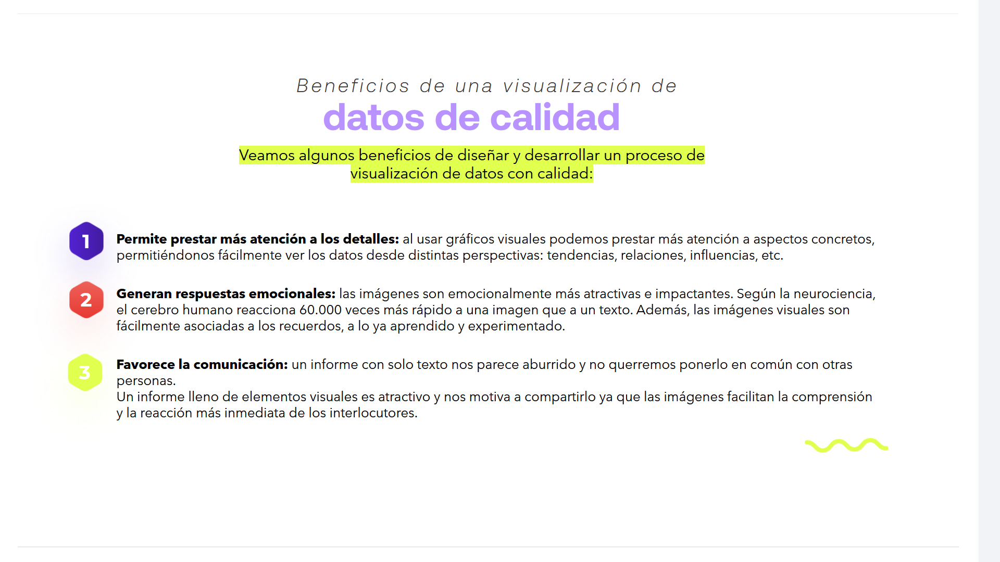
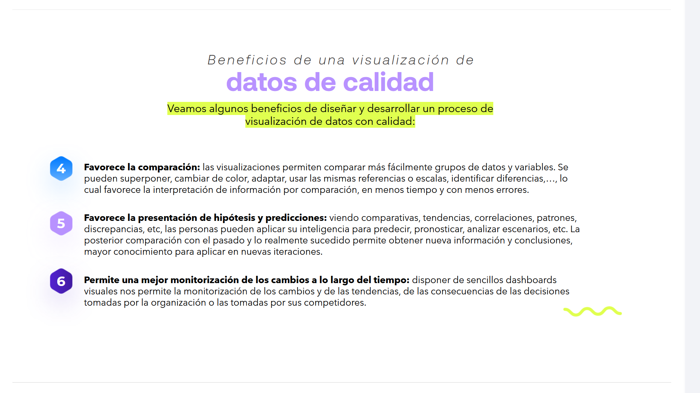
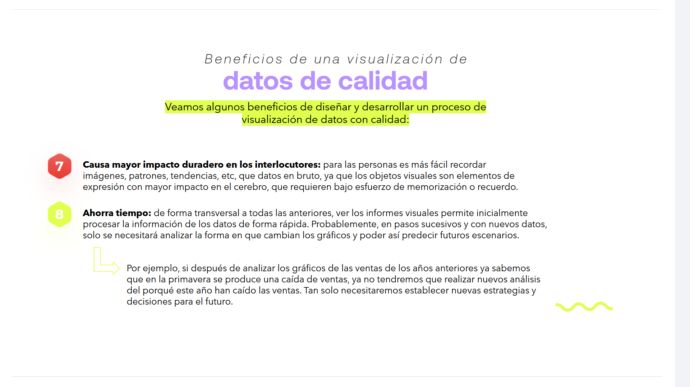
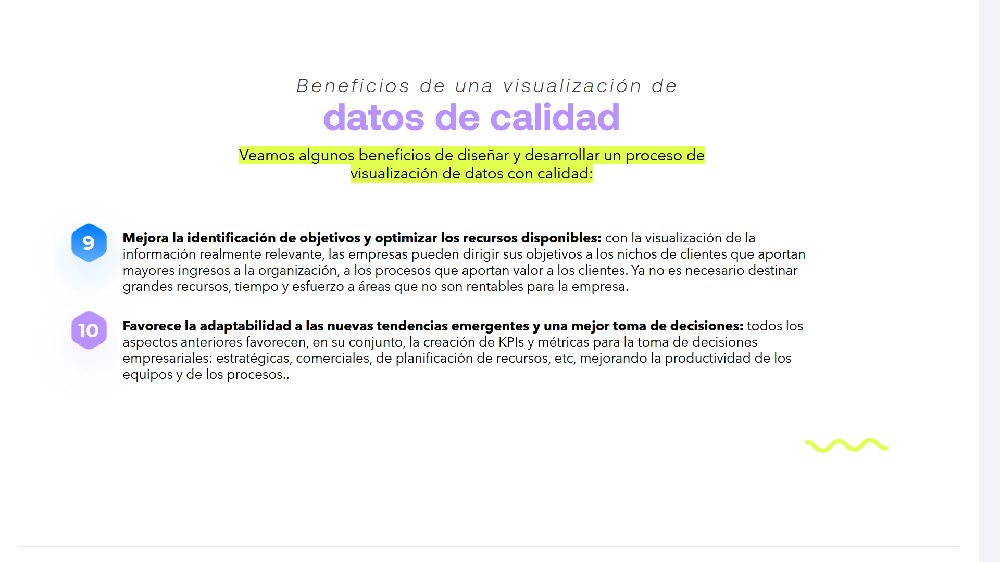
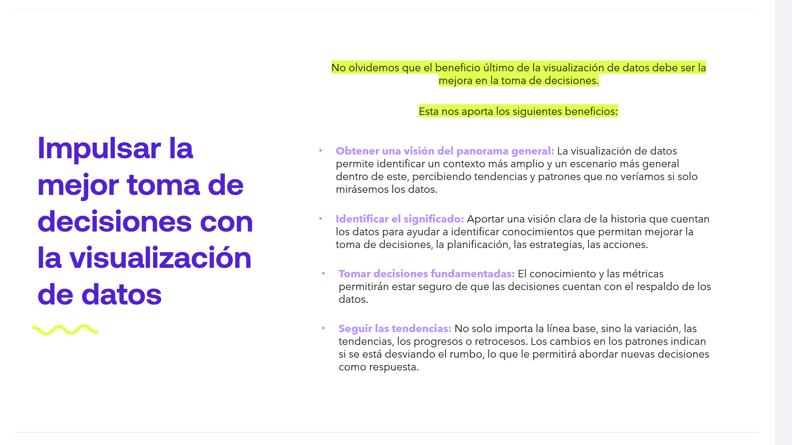

# 05-003:	Beneficios de las metáforas visuales

## OBJETIVOS DE LA VISUALIZACIÓN DE DATOS

La **visualización de datos** no consiste únicamente en representar información de forma gráfica

> Su objetivo es **transformar datos en información comprensible**, facilitando su análisis y apoyando la toma de decisiones.

## BENEFICIOS DE LA VISUALIZACIÓN DE DATOS

La visualización de datos aporta numerosas ventajas tanto para el análisis como para la comunicación de la información. Gracias al uso de elementos visuales, los datos dejan de ser simples números para convertirse en conocimiento útil para la toma de decisiones.

| Objetivo | Beneficio |
|:---------|:----------|
| 📈 Identificar tendencias | Detectar patrones y anomalías |
| 🧠 Facilitar la comprensión | Interpretar datos complejos |
| ⚡ Agilizar decisiones | Actuar con mayor rapidez |
| 🎯 Dar significado | Convertir datos en información |
| 💡 Mejorar la retención | Recordar mejor la información |
| 🤝 Favorecer la comunicación | Compartir una visión común |
| ✅ Garantizar la precisión | Representar fielmente los datos |
| 🧹 Mantener la claridad | Evitar el *chartjunk* |
| 🏷️ Ofrecer contextualización | Facilitar la interpretación |
| 🌐 Democratizar el acceso | Acercar los datos a toda la organización |

---

## 1. Permite prestar más atención a los detalles

Al usar **gráficos visuales** podemos prestar más atención a aspectos concretos, permitiéndonos fácilmente ver los datos desde distintas perspectivas:

- Tendencias.
- Relaciones.
- Influencias.
- Etc.

> Una misma información puede analizarse desde distintos puntos de vista simplemente cambiando la forma de visualizarla.

---

## 2. Generan respuestas emocionales

Las **imágenes** son emocionalmente más atractivas e impactantes.

> Según la neurociencia, el cerebro humano reacciona **60.000 veces más rápido a una imagen que a un texto.**

Además, las imágenes visuales son fácilmente asociadas a los recuerdos, a lo ya aprendido y experimentado.

---

## 3. Favorece la comunicación

* Un informe con solo texto nos parece aburrido y no querremos ponerlo en común con otras personas.

* Un informe lleno de elementos visuales es atractivo y nos motiva a compartirlo ya que las imágenes facilitan la comprensión y la reacción más inmediata de los interlocutores  

---

## 4. Favorece la comparación

Las visualizaciones permiten comparar más fácilmente **grupos de datos y variables**.

Se pueden:

- Superponer
- Cambiar de color
- Adaptar
- Usar las mismas referencias o escalas
- Identificar diferencias

Todo ello favorece la interpretación de información por comparación, en menos tiempo y con menos errores.

---

## 5. Favorece la presentación de hipótesis y predicciones

Viendo comparativas, tendencias, correlaciones, patrones, discrepancias, etc, las personas pueden aplicar su inteligencia para:

- Predecir.
- Pronosticar.
- Analizar escenarios.
- Etc.

La posterior comparación con el pasado y lo realmente sucedido permite obtener nueva información y conclusiones, mayor conocimiento para aplicar en nuevas iteraciones.

---

## 6. Permite una mejor monitorización de los cambios a lo largo del tiempo

Disponer de sencillos **dashboards visuales** nos permite la monitorización de los cambios y de las tendencias, de las consecuencias de las decisiones tomadas por la organización o las tomadas por sus competidores.

---

## 7. Causa mayor impacto duradero en los interlocutores

Para las personas es más fácil recordar **imágenes, patrones, tendencias, etc**, que datos en bruto, ya que los objetos visuales son elementos de expresión con mayor impacto en el cerebro, que requieren bajo esfuerzo de memorización o recuerdo.

---

## 8. Ahorra tiempo

De forma transversal a todas las anteriores, ver los informes visuales permite inicialmente procesar la información de los datos de forma rápida.

Probablemente, en pasos sucesivos y con nuevos datos, solo se necesitará analizar la forma en que cambian los gráficos y poder así predecir futuros escenarios.

> **Por ejemplo:**
>
> Si después de analizar los gráficos de las ventas de los años anteriores ya sabemos que en la primavera se produce una caída de ventas, ya no tendremos que realizar nuevos análisis del porqué este año han caído las ventas.
>
> Tan solo necesitaremos establecer nuevas estrategias y decisiones para el futuro.

---

## 9. Mejora la identificación de objetivos y optimizar los recursos disponibles

Con la visualización de la información realmente relevante, las empresas pueden dirigir sus objetivos a:

- Los nichos de clientes que aportan mayores ingresos a la organización.
- Los procesos que aportan valor a los clientes.

Ya no es necesario destinar grandes recursos, tiempo y esfuerzo a áreas que no son rentables para la empresa.

---

## 10. Favorece la adaptabilidad a las nuevas tendencias emergentes y una mejor toma de decisiones

Todos los aspectos anteriores favorecen, en su conjunto, la creación de **KPIs** y métricas para la toma de decisiones empresariales:

- Estratégicas.
- Comerciales.
- De planificación de recursos.
- Etc.

Todo ello mejora la productividad de los equipos y de los procesos.

---

> **La visualización de datos transforma la información en conocimiento útil para analizar, comprender y decidir con mayor rapidez y precisión.**

---

## TOMA DE DECISIONES BASADA EN DATOS

> **No olvidemos que el beneficio último de la visualización de datos debe ser la mejora en la toma de decisiones.**

# EL PAPEL DE POWER BI Y LOS CUADROS DE MANDO

En la **era de la digitalización**, herramientas como **Power BI** se han convertido en **estándares de la industria** para crear **cuadros de mando (dashboards)** e **informes interactivos**.

Estas plataformas permiten conectar **múltiples fuentes de datos** dispersas en una organización y unificarlas en un **único espacio visual**.

> El resultado es un flujo de información **dinámico** que se actualiza **en tiempo real**, facilitando que perfiles tanto **técnicos** como **de negocio** compartan una misma visión de la realidad empresarial.

---

## BENEFICIOS DE LA TOMA DE DECISIONES BASADA EN DATOS

Esta nos aporta los siguientes beneficios:

- Conectar múltiples fuentes de datos.
- Unificar la información en un único espacio visual.
- Actualización de la información en tiempo real.
- Compartir una visión común entre perfiles técnicos y de negocio.

1.	Otener una visión del panorama general

La visualización de datos permite identificar un contexto más amplio y un escenario más general dentro de este, percibiendo **tendencias** y **patrones** que no veríamos si solo mirásemos los datos.

2.	Identificar el significado

Aportar una visión clara de la historia que cuentan los datos para ayudar a identificar conocimientos que permitan mejorar:

- La toma de decisiones.
- La planificación.
- Las estrategias.
- Las acciones.

3.	Tomar decisiones fundamentadas

El conocimiento y las métricas permitirán estar seguro de que las decisiones cuentan con el respaldo de los datos.

4.	Seguir las tendencias

No solo importa la línea base, sino la variación, las tendencias, los progresos o retrocesos.

Los cambios en los patrones indican si se está desviando el rumbo, lo que le permitirá abordar nuevas decisiones como respuesta.

---

## La importancia de las metáforas visuales

Comprender los **mecanismos cognitivos** y las **metáforas visuales** adecuadas garantiza que la comunicación entre:

- **Emisor:** el analista de datos.
- **Receptor:** los tomadores de decisiones.

sea **fluida**, **eficiente** y **orientada a resultados**.

---

> **Datos → Información → Visualización → Conocimiento → Toma de decisiones**

