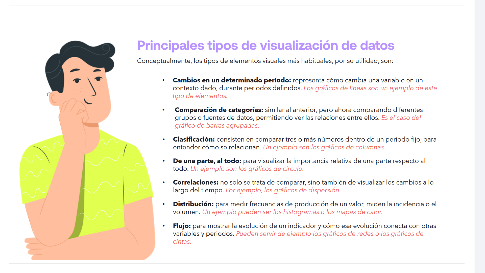

# 05-004:	Tipos de Visualización de Datos

# Principales tipos de visualización de datos

Conceptualmente, los tipos de elementos virtuales más habituales, por su utilidad, son:

*   **Cambios en un determinado período:** representa cómo cambia una variable en un contexto dado, durante periodos definidos. *Los gráficos de líneas son un ejemplo de este tipo de elementos.*

*   **Comparación de categorías:** similar al anterior, pero ahora comparando diferentes grupos o fuentes de datos, permitiendo ver las relaciones entre ellos. *Es el caso del gráfico de barras agrupadas.*

*   **Clasificación:** consisten en comparar tres o más números dentro de un período fijo, para entender cómo se relacionan. *Un ejemplo son los gráficos de columnas.*

*   **De una parte, al todo:** para visualizar la importancia relativa de una parte respecto al todo. *Un ejemplo son los gráficos de círculo.*

*   **Correlaciones:** no solo se trata de comparar, sino también de visualizar los cambios a lo largo del tiempo. *Por ejemplo, los gráficos de dispersión.*

*   **Distribución:** para medir frecuencias de producción de un valor, miden la incidencia o el volumen. *Un ejemplo pueden ser los histogramas o los mapas de calor.*

*   **Flujo:** para mostrar la evolución de un indicador y cómo esa evolución conecta con otras variables y periodos. *Pueden servir de ejemplo los gráficos de redes o los gráficos de cintas.*

---

