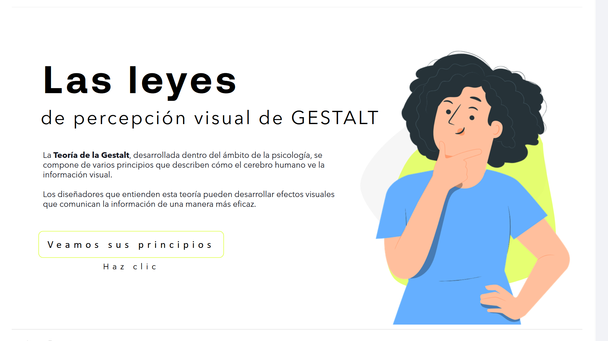
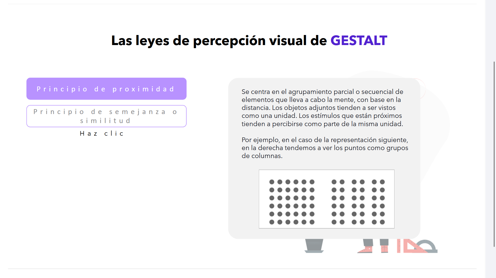
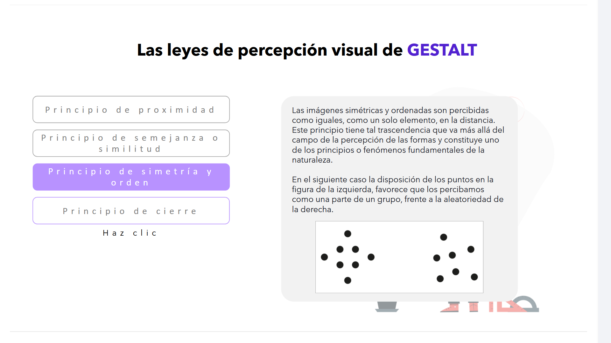
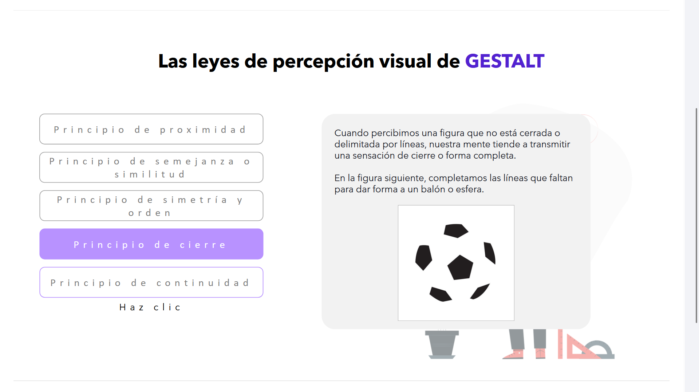
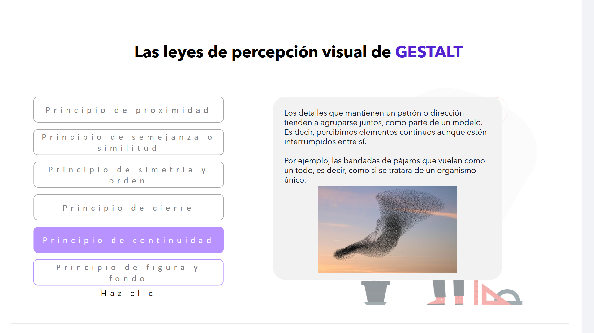
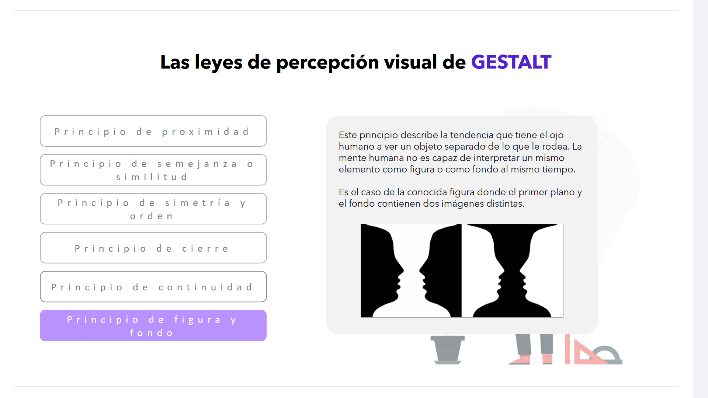
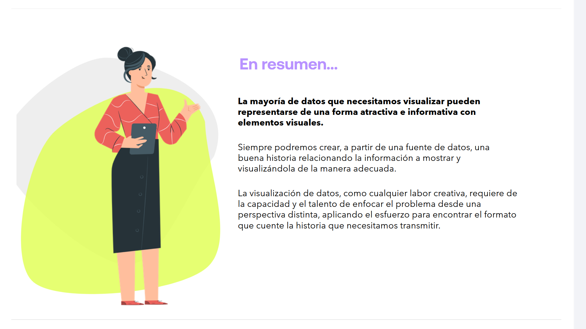

# 05-005:	Leyes de la Percepción Visual de la GESTALT

La **Teoría de la Gestalt**, desarrollada dentro del ámbito de la psicología, se compone de varios principios que describen cómo el cerebro humano ve la información visual.

> 💡 **Nota para el diseñador:** Los profesionales que entienden esta teoría pueden desarrollar efectos visuales que comunican la información de una manera mucho más eficaz.

## Leyes de la Gestalt aplicadas al diseño de interfaces (UI)

La psicología de la Gestalt es una corriente de la psicología moderna, surgida en Alemania a principios del siglo XX. El término "Gestalt" proviene del alemán y se traduce comúnmente como "forma", "figura" o "estructura".

Esta escuela psicológica plantea que la mente humana tiende a organizar los estímulos visuales que recibe en formas o estructuras completas, en lugar de percibir elementos aislados. Es decir, bajo la famosa premisa de que **"el todo es mayor que la suma de sus partes"**, nuestro cerebro simplifica, agrupa y dota de significado a lo que vemos de manera automática.

En el diseño de interfaces de usuario (UI), las Leyes de la Gestalt son fundamentales, ya que nos permiten predecir cómo van a interpretar los usuarios la disposición visual de los elementos en la pantalla. Al aplicar estos principios conceptuales, logramos crear interfaces más intuitivas, ordenadas y eficientes, mejorando significativamente la experiencia del usuario.

---
## ─── Principios Fundamentales ───

### 1. Principio de Proximidad

Se centra en el **agrupamiento parcial o secuencial** de elementos que lleva a cabo la mente, con base en la distancia. 

* 🔹 **Efecto visual:** Los objetos adjuntos tienden a ser vistos como una unidad.
* 🔹 **Percepción:** Los estímulos que están próximos tienden a percibirse como parte de la misma unidad.

> 📊 *Por ejemplo, en el caso de la representación siguiente, en la derecha tendemos a ver los puntos como grupos de columnas*

Los elementos que están más cercanos entre sí tienden a percibirse como un grupo o como parte de un mismo bloque funcional, en lugar de como unidades independientes.

* **En diseño de UI:** Este principio se utiliza constantemente para agrupar información relacionada, como tarjetas de producto (*cards*), formularios o menús de navegación. Los elementos que tienen una relación conceptual directa deben estar físicamente más próximos en el espacio visual, mientras que los bloques con distintas funciones deben estar claramente separados mediante el uso del espacio en blanco.
* **Utilidad:** Ayuda a que el usuario escanee la pantalla rápidamente y comprenda la jerarquía y estructura del contenido sin necesidad de leer detalladamente cada elemento.

---

### 2. Principio de Semejanza o Similitud

Los elementos visuales que **comparten características físicas comunes** —como el color, la forma, el tamaño, la tipografía o la orientación— son percibidos automáticamente por el cerebro como parte de un mismo grupo o como elementos que comparten una misma función o nivel de importancia.

* 🔹 **Aplicación en interfaces (UI):** Es el principio que da sentido a la consistencia y a los sistemas de diseño. Si todos los enlaces de un sitio web o los botones de acción principal (CTA) comparten el mismo estilo, el usuario asume de forma instantánea que implican el mismo tipo de interactividad.
* 🔹 **Ventaja clave:** Reducirá drásticamente la carga cognitiva del usuario al permitirle identificar patrones de interacción de manera totalmente intuitiva. Romper esta regla a propósito ayuda a crear un punto focal instantáneo.

* 🔹 **Utilidad:** Aporta consistencia visual y reduce drásticamente la carga cognitiva del usuario, permitiéndole identificar patrones de interacción de manera intuitiva a lo largo de toda la aplicación.

---

### 3. Principio de Simetria y Orden (Región Común / Destino Común)

Las imágenes simétricas y ordenadas son **percibidas como iguales**, como un solo elemento, en la distancia. 

* 🔹 **Trascendencia:** Este principio tiene tal relevancia que va más allá del campo de la percepción de las formas y constituye uno de los principios o fenómenos fundamentales de la naturaleza.

> 📊 *En el siguiente caso la disposición de los puntos en la figura de la izquierda, favorece que los percibamos como una parte de un grupo, frente a la aleatoriedad de la derecha.*

Los elementos que se mueven juntos o en la misma dirección se perciben como más relacionados que los que están estacionarios o se mueven en direcciones diferentes.

* **Destino común:** los elementos que parecen moverse o apuntar hacia una misma dirección se perciben como parte de un grupo con un propósito común.
* **Región común:** cuando varios elementos se encuentran situados dentro de una misma región cerrada o delimitada por un borde o un fondo de color diferente, nuestra mente los agrupa de forma automática, independientemente de que dentro de esa región los elementos sean distintos o estén más separados.

---

### 4. Principio de Cierre

Cuando percibimos una figura que **no está cerrada o delimitada** por líneas, nuestra mente tiende a transmitir una sensación de cierre o forma completa.

* 🔹 **Funcionamiento:** El cerebro rellena de forma automática la información visual que falta para dotar de sentido al objeto.

> 📊 *En la figura siguiente, completamos las líneas que faltan para dar forma a un balón o esfera.*

Nuestra mente tiende a completar las formas que están incompletas o abiertas. Cuando percibimos una figura que no está cerrada del todo, el cerebro rellena de manera automática los huecos vacíos con la información que ya conoce para crear una forma geométrica o un contorno reconocible.

* **En diseño de UI:** Este principio es muy explotado en el diseño de logotipos, barras de carga o progreso, y de manera masiva en el diseño de iconos (donde se omiten líneas intencionadamente para que el icono se perciba más ligero y moderno).
* **Utilidad:** Permite simplificar las interfaces reduciendo el ruido visual innecesario, logrando que los elementos de control resulten limpios y elegantes sin perder su significado o reconocibilidad.

---

### 5. Principio de Continuidad

Los detalles que **mantienen un patrón o dirección** tienden a agruparse juntos, como parte de un modelo. 

* 🔹 **Percepción:** Percibimos elementos continuos aunque estén interrumpidos entre sí.

> 📊 *Por ejemplo, las bandadas de pájaros que vuelan como un todo, es decir, como si se tratara de un organismo único.*

Nuestra mente tiende a seguir patrones continuos y fluidos en lugar de cambios bruscos o interrupciones. Los elementos que están alineados en una línea recta o curva se perciben como relacionados o como una única secuencia, guiando la mirada del usuario de forma natural a lo largo de un camino visual.

* **En diseño de UI:** Este principio es clave en la creación de menús de navegación horizontales o verticales, flujos de pasos (*steppers*), líneas de tiempo (*timelines*) y en los carruseles de imágenes o *scrolls* infinitos.
* **Utilidad:** Permite dirigir la atención del usuario hacia zonas específicas de la interfaz o incitarlo a seguir explorando el contenido (por ejemplo, mostrando el borde recortado de una tarjeta para denotar que hay más elementos si desliza la pantalla).

---

### 6. Principio de Figura y Fondo

Este principio describe la tendencia que tiene el ojo humano a **ver un objeto separado de lo que le rodea**. 

* 🔹 **Limitación mental:** La mente humana no es capaz de interpretar un mismo elemento como figura o como fondo al mismo tiempo.

> 📊 *Es el caso de la conocida figura donde el primer plano y el fondo contienen dos imágenes distintas.*

Nuestra mente tiende a separar el campo visual en dos componentes principales: la "figura" (el elemento u objeto central en el que se enfoca la atención) y el "fondo" (el espacio o entorno sobre el cual destaca dicha figura). El cerebro no es capaz de interpretar un mismo objeto como figura y fondo al mismo tiempo.

* **En diseño de UI:** Este principio es de vital importancia a la hora de superponer capas en la interfaz. Cuando se abre una ventana emergente (*pop-up* o modal), se suele aplicar una capa de oscurecimiento o desenfoque (*backdrop blur*) sobre todo el fondo de la aplicación.
* **Utilidad:** Al desvanecer el fondo de la aplicación, obligamos a la mente del usuario a interpretar la ventana modal de manera inequívoca como la "figura" principal sobre la que debe interactuar, evitando distracciones con el resto del contenido.

---

## En Resumen...

* 🔥 **Visualización atractiva:** La mayoría de datos que necesitamos visualizar pueden representarse de una forma atractiva e informativa con elementos visuales.
* 🔥 **Narrativa de datos:** Siempre podremos crear, a partir de una fuente de datos, una buena historia relacionando la información a mostrar y visualizándola de la manera adecuada.
* 🔥 **Enfoque creativo:** La visualización de datos, como cualquier labor creativa, requi