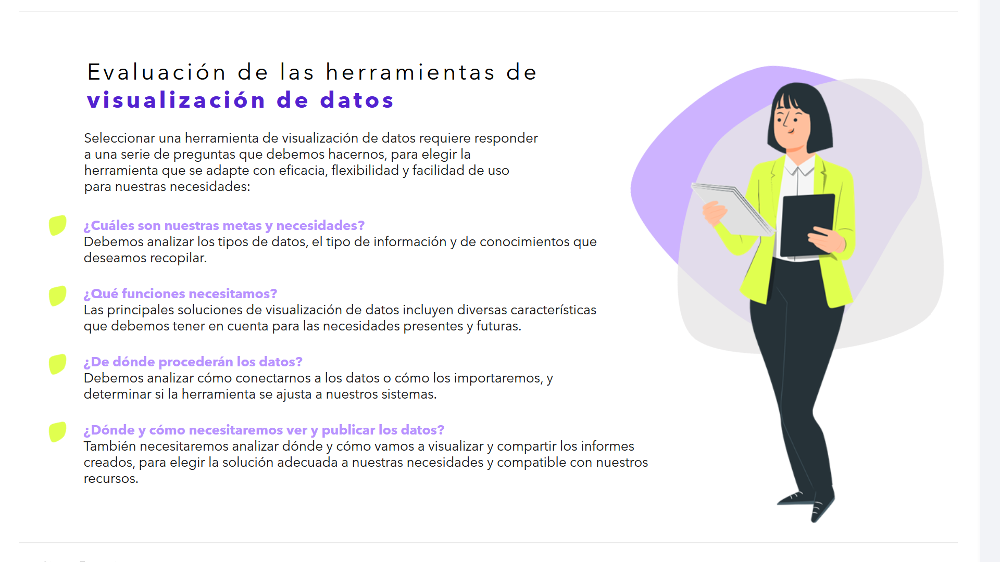
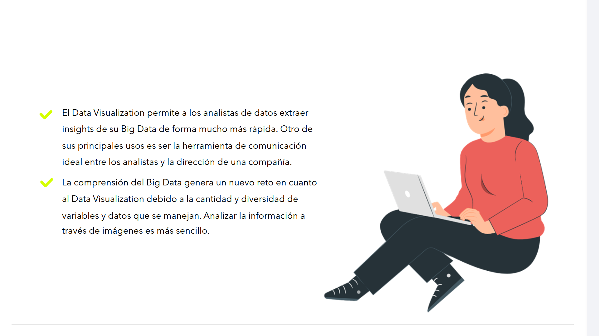
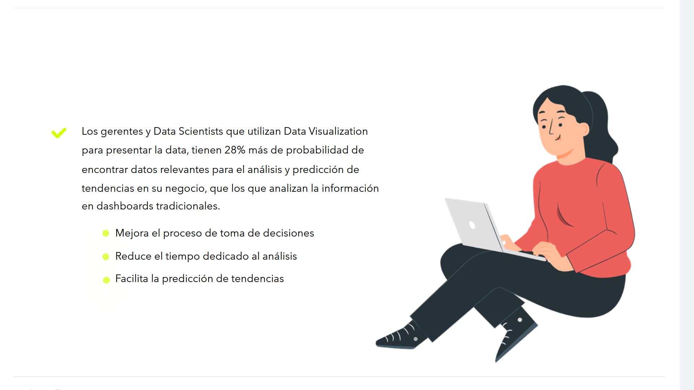
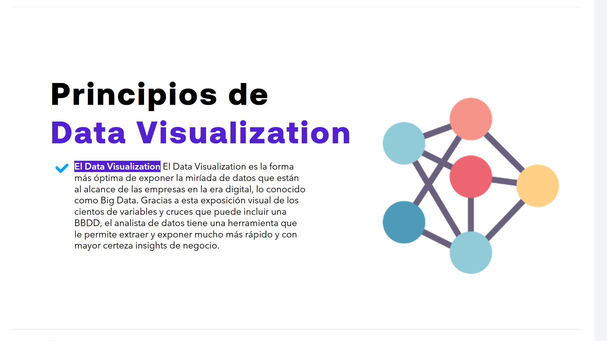
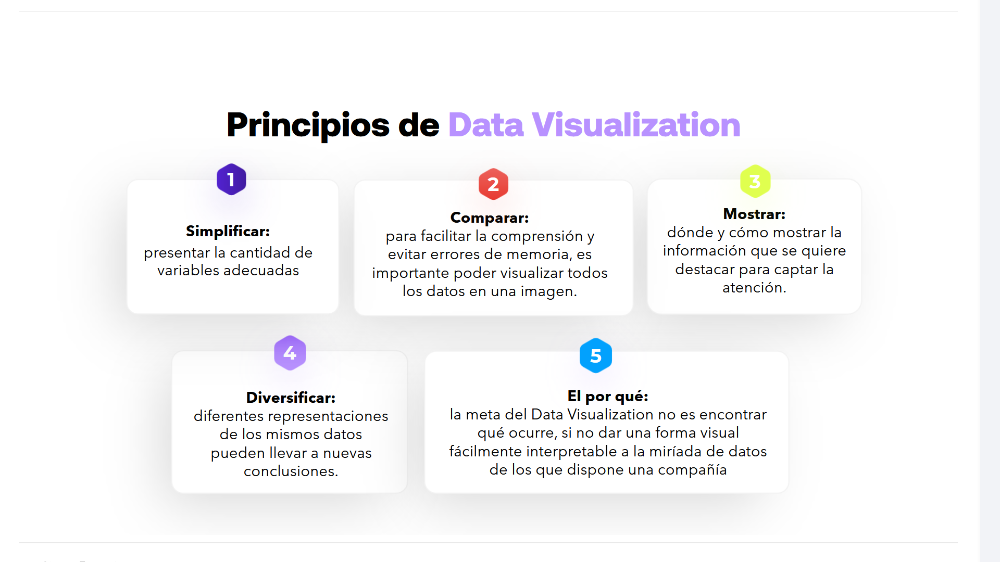

# 05-006:	Visualización de Datos

---

## Evaluación de las herramientas de visualización de datos

Seleccionar una herramienta de visualización de datos requiere responder a una serie de preguntas que debemos hacernos, para elegir la herramienta que se adapte con eficacia, flexibilidad y facilidad de uso para nuestras necesidades:

### 🎯 ¿Cuáles son nuestras metas y necesidades?
Debemos analizar los tipos de datos, el tipo de información y de conocimientos que deseamos recopilar.

### 🛠️ ¿Qué funciones necesitamos?
Las principales soluciones de visualización de datos incluyen diversas características que debemos tener en cuenta para las necesidades presentes y futuras.

### 🔌 ¿De dónde procederán los datos?
Debemos analizar cómo conectarnos a los datos o cómo los importaremos, y determinar si la herramienta se ajusta a nuestros sistemas.

### 🌐 ¿Dónde y cómo necesitaremos ver y publicar los datos?
También necesitaremos analizar dónde y cómo vamos a visualizar y compartir los informes creados, para elegir la solución adecuada a nuestras necesidades y compatible con nuestros recursos.

---

## El Impacto del Data Visualization en Big Data y Negocio

*   **Extracción rápida de insights:** El Data Visualization permite a los analistas de datos extraer insights de su Big Data de forma mucho más rápida. Otro de sus principales usos es ser la herramienta de comunicación ideal entre los analistas y la dirección de una compañía.

*   **El reto de la complejidad:** La comprensión del Big Data genera un nuevo reto en cuanto al Data Visualization debido a la cantidad y diversidad de variables y datos que se manejan. Analizar la información a través de imágenes es más sencillo.

---

## 📈 Ventajas Competitivas para Gerentes y Data Scientists

Los gerentes y Data Scientists que utilizan Data Visualization para presentar la data, tienen un **28% más de probabilidad** de encontrar datos relevantes para el análisis y predicción de tendencias en su negocio, que los que analizan la información en dashboards tradicionales.

#### Beneficios Clave
*   ✨ Mejora el proceso de toma de decisiones
*   ⏱️ Reduce el tiempo dedicado al análisis
*   🔮 Facilita la predicción de tendencias

---

## Principios de Data Visualization

El Data Visualization es la forma más óptima de exponer la miríada de datos que están al alcance de las empresas en la era digital, lo conocido como **Big Data**. 

> 💡 Gracias a esta exposición visual de los cientos de variables y cruces que puede incluir una BBDD, el analista de datos tiene una herramienta que le permite extraer y exponer mucho más rápido y con mayor certeza **insights de negocio**.

---

### 🔥 Simplificar
Presentar la cantidad de variables adecuadas.

### 🔥 Comparar
Para facilitar la comprensión y evitar errores de memoria, es importante poder visualizar todos los datos en una imagen.

### 🔥 Mostrar
Dónde y cómo mostrar la información que se quiere destacar para captar la atención.

### 🔥 Diversificar
Diferentes representaciones de los mismos datos pueden llevar a nuevas conclusiones.

### 🔥 El por qué
La meta del Data Visualization no es encontrar qué ocurre, sino dar una forma visual fácilmente interpretable a la miríada de datos de los que dispone una compañía.