# 06-001: **PowerBI Desktop**

## Análisis y visualización de datos con Power BI
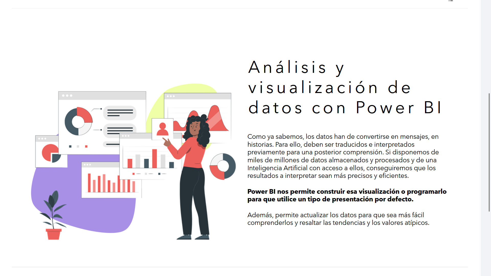

Como ya sabemos, los datos han de convertirse en **mensajes**, en **historias**. Para ello, deben ser traducidos e interpretados previamente para una posterior comprensión. Si disponemos de **miles de millones de datos** almacenados y procesados y de una **Inteligencia Artificial** con acceso a ellos, conseguiremos que los resultados a interpretar sean más precisos y eficientes.

**Power BI** nos permite construir esa visualización o programarlo para que utilice un tipo de presentación por defecto.

Además, permite actualizar los datos para que sea más fácil comprenderlos y resaltar las **tendencias** y los **valores atípicos**.

---

## Power BI Desktop
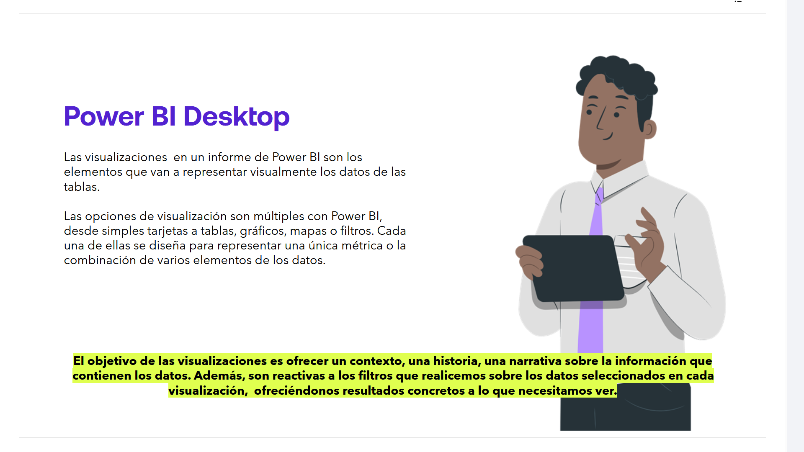

Las **visualizaciones** en un informe de **Power BI** son los elementos que van a representar visualmente los datos de las tablas.

Las opciones de visualización son múltiples con **Power BI**, desde simples **tarjetas** a **tablas**, **gráficos**, **mapas** o **filtros**. Cada una de ellas se diseña para representar una única métrica o la combinación de varios elementos de los datos.

> El objetivo de las visualizaciones es ofrecer un **contexto**, una **historia**, una **narrativa** sobre la información que contienen los datos. Además, son **reactivas a los filtros** que realicemos sobre los datos seleccionados en cada visualización, ofreciéndonos resultados concretos a lo que necesitamos ver.

Las visualizaciones que desarrollemos dispondrán de un conjunto de acciones asociadas, que podemos manejar desde el menú situado en cada visualización. Son, por tanto, fácilmente adaptables y personalizables.

> Aunque se pueden aplicar las acciones y cambios en las visualizaciones desde **Power BI Desktop** o desde **Power BI Service**, lo más habitual es hacerlo desde el **Desktop**, que será el que realicemos aquí.

### Informes de PowerBI Desktop
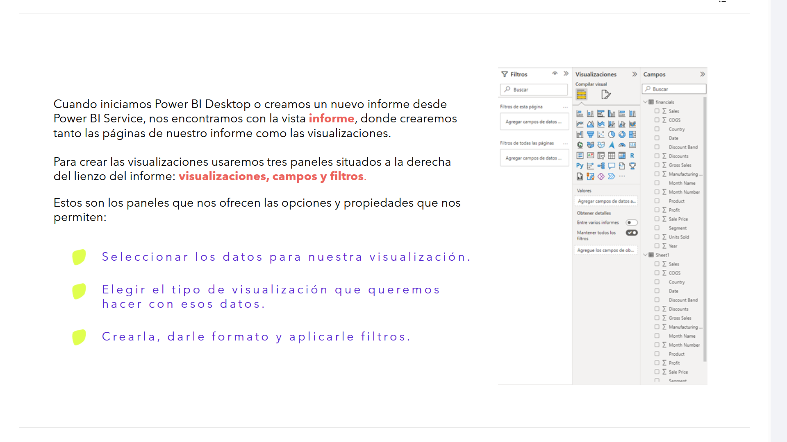

Cuando iniciamos **Power BI Desktop** o creamos un nuevo informe desde **Power BI Service**, nos encontramos con la **vista informe**, donde crearemos tanto las páginas de nuestro informe como las visualizaciones.

Para crear las visualizaciones usaremos **tres paneles** situados a la derecha del lienzo del informe:

- **Visualizaciones**
- **Campos**
- **Filtros**

Estos son los paneles que nos ofrecen las opciones y propiedades que nos permiten:

- Seleccionar los datos para nuestra visualización.
- Elegir el tipo de visualización que queremos hacer con esos datos.
- Crearla, darle formato y aplicarle filtros.

---

## Páginas de los informes
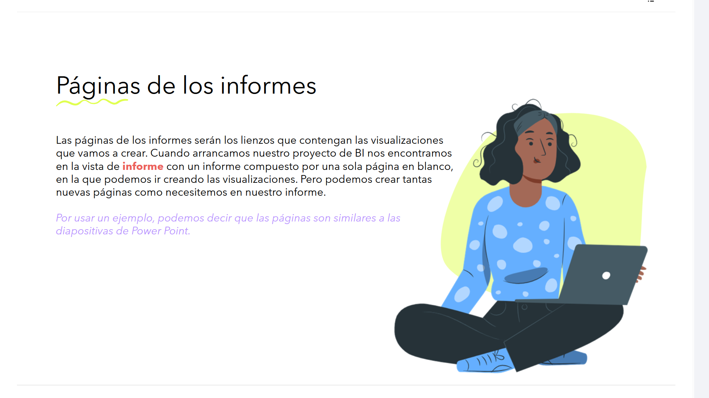

Las páginas de los informes serán los **lienzos** que contengan las visualizaciones que vamos a crear.

Cuando arrancamos nuestro proyecto de **BI** nos encontramos en la **vista de informe** con un informe compuesto por una sola página en blanco, en la que podemos ir creando las visualizaciones. Pero podemos crear tantas nuevas páginas como necesitemos en nuestro informe.

> Por usar un ejemplo, podemos decir que las páginas son similares a las diapositivas de **Power Point**.

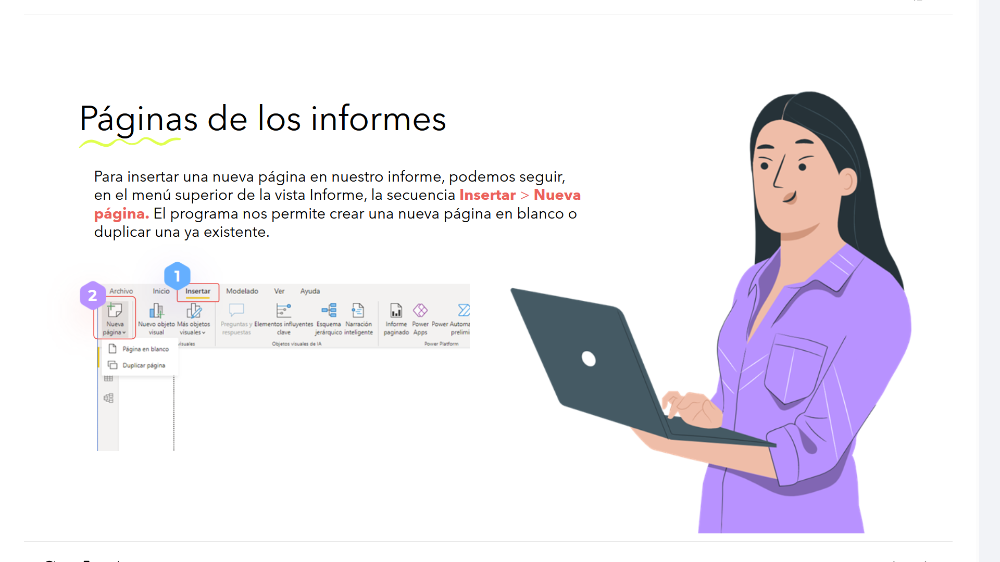

Podemoas cambiar entre las vistas `Informe`,  `Datos` y `Modos`sin seleccionar los iconos de la barra de navegación de la izquierda.

Para insertar una nueva página en nuestro informe, podemos seguir, en el menú superior de la **vista Informe**, la secuencia:

**Insertar → Nueva página**
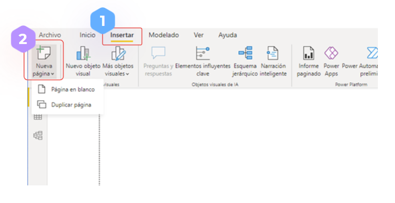

> Las páginas creadas aparecen en el área de navegación, en la parte inferior de la vista informe:

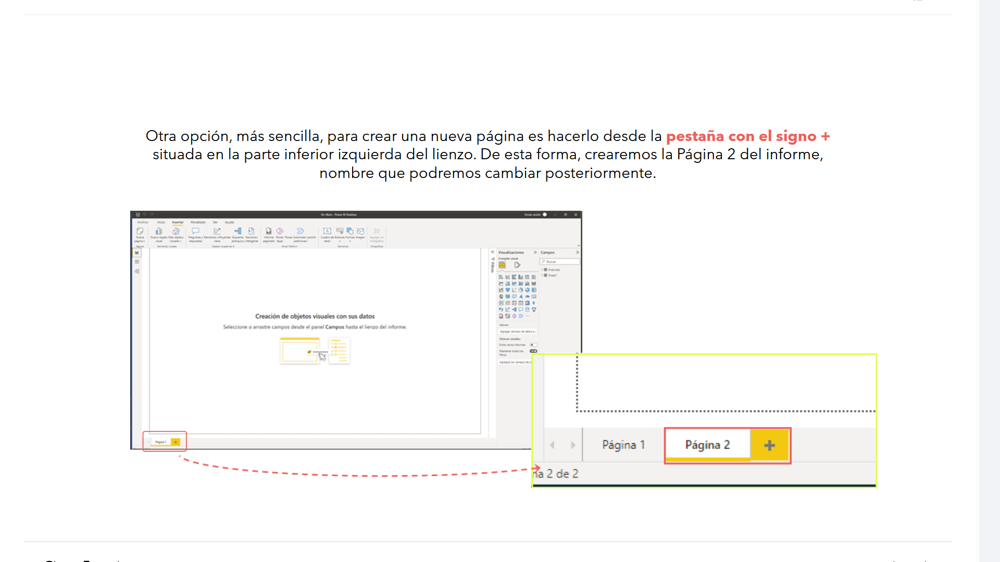

El programa nos permite crear una nueva página en blanco o duplicar una ya existente.

Otra opción, más sencilla, para crear una nueva página es hacerlo desde la pestaña con el signo **+** situada en la parte inferior izquierda del lienzo. De esta forma, crearemos la **Página 2** del informe, nombre que podremos cambiar posteriormente.

### Cambiar el nombre de una página
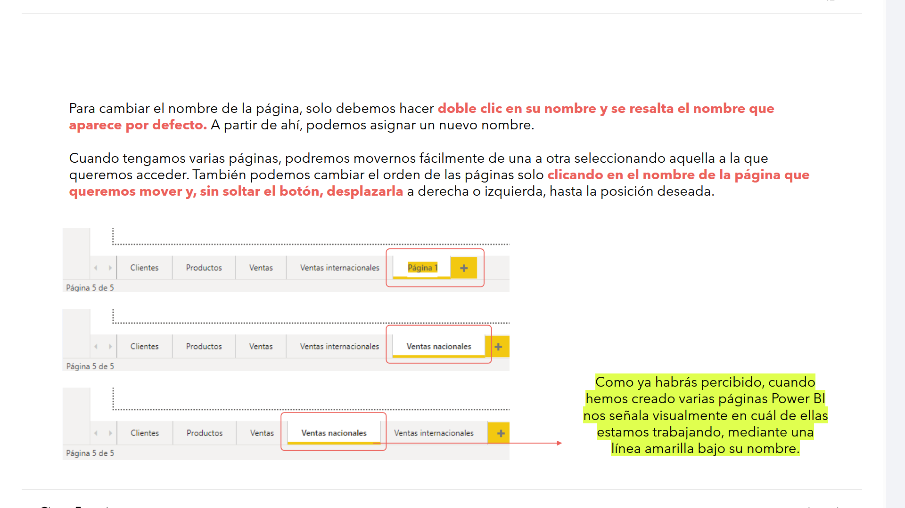

Igual que en los libros de Excel, para cambiar el nombre de la página, solo debemos hacer doble clic en su nombre y se resalta el nombre que aparece por defecto. A partir de ahí, podemos asignar un nuevo nombre.

### Cambiar entre páginas

Cuando tengamos varias páginas, podremos movernos fácilmente de una a otra seleccionando aquella a la que queremos acceder.

También podemos cambiar el orden de las páginas solo clicando en el nombre de la página que queremos mover y, sin soltar el botón, desplazarla a derecha o izquierda, hasta la posición deseada.

> Como ya habrás percibido, cuando hemos creado varias páginas **Power BI** nos señala visualmente en cuál de ellas estamos trabajando, mediante una **línea amarilla** bajo su nombre.

### Lienzo
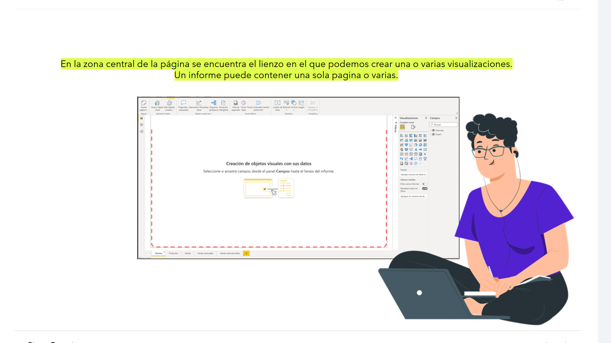

En la zona central de la página se encuentra el **lienzo** en el que podemos crear una o varias visualizaciones.
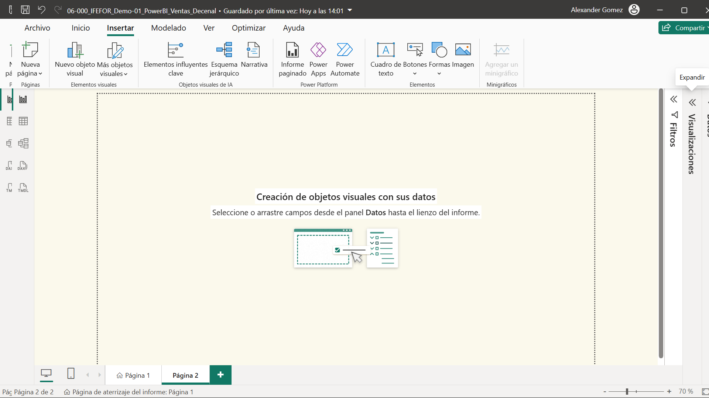

Un informe puede contener **una sola página o varias**.

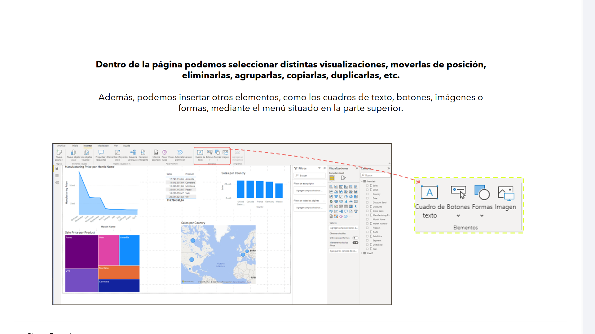

Dentro de la página podemos seleccionar distintas visualizaciones, moverlas de posición, eliminarlas, agruparlas, copiarlas, duplicarlas, etc, al igual que en otros programas de MS.

Además, podemos insertar otros elementos, como los **cuadros de texto**, **botones**, **imágenes** o **formas**, mediante el menú situado en la parte superior.

---

## Propiedades de la página
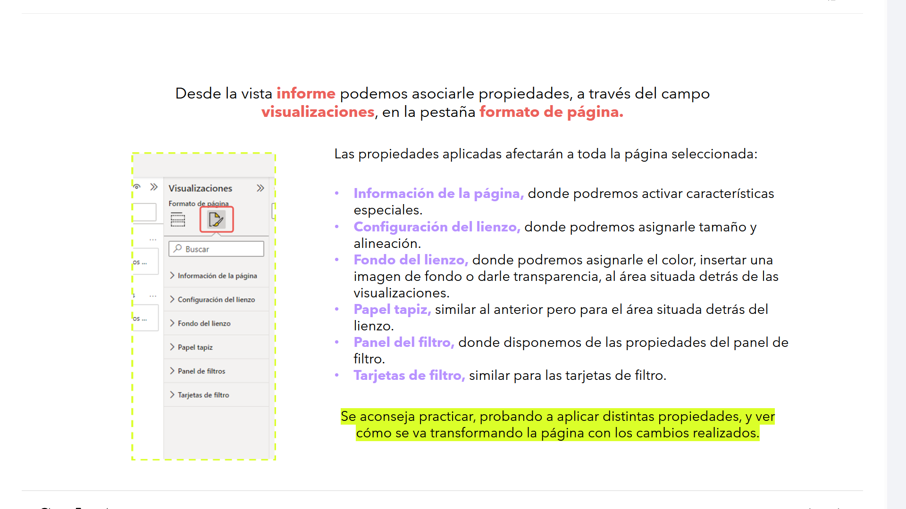

Desde la **vista informe** podemos asociarle propiedades, a través del campo **Visualizaciones**, en la pestaña **Formato de página**.

Las propiedades aplicadas afectarán a **toda la página seleccionada**:

- **Información de la página**, donde podremos activar características especiales.
- **Configuración del lienzo**, donde podremos asignarle tamaño y alineación.
- **Fondo del lienzo**, donde podremos asignarle el color, insertar una imagen de fondo o darle transparencia, al área situada detrás de las visualizaciones.
- **Papel tapiz**, similar al anterior pero para el área situada detrás del lienzo.
- **Panel del filtro**, donde disponemos de las propiedades del panel de filtro.
- **Tarjetas de filtro**, similar para las tarjetas de filtro.

> **Se aconseja practicar**, probando a aplicar distintas propiedades, y ver cómo se va transformando la página con los cambios realizados.

---

## Tipos de visualización en Power BI
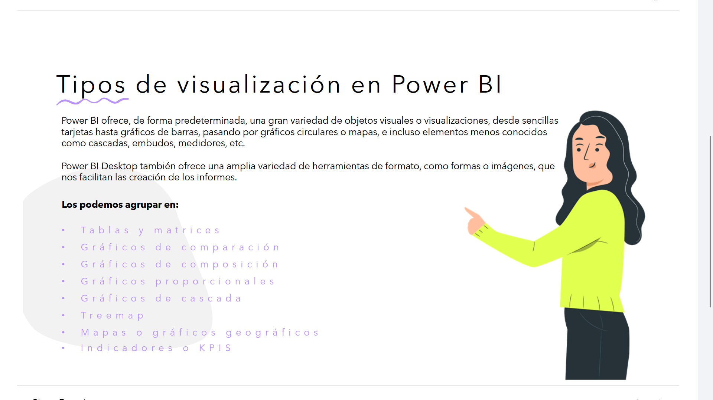

**Power BI** ofrece, de forma predeterminada, una gran variedad de **objetos visuales** o **visualizaciones**, desde sencillas **tarjetas** hasta **gráficos de barras**, pasando por **gráficos circulares** o **mapas**, e incluso elementos menos conocidos como **cascadas**, **embudos**, **medidores**, etc.

**Power BI Desktop** también ofrece una amplia variedad de **herramientas de formato**, como **formas** o **imágenes**, que nos facilitan las creación de los informes.

Los podemos agrupar en:

- **Tablas y matrices**
- **Gráficos de comparación**
- **Gráficos de composición**
- **Gráficos proporcionales**
- **Gráficos de cascada**
- **Treemap**
- **Mapas o gráficos geográficos**
- **Indicadores o KPI's**

---

## Categorías principales de objetos visuales
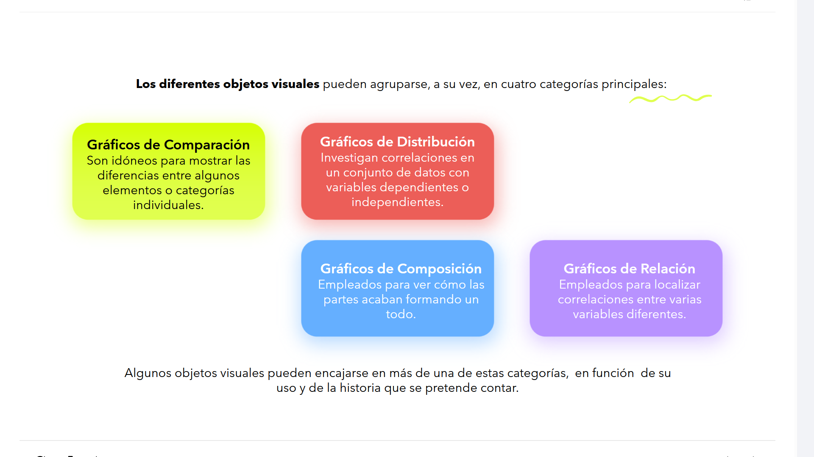

> Es importante entender las distintas categorías de elementos visuales, ya que permitirán acelerar el proceso de selección para la información que queremos visualizar.

Los diferentes objetos visuales pueden agruparse, a su vez, en **cuatro categorías principales**:

* 	Gráficos de Comparación
	Son idóneos para mostrar las diferencias entre algunos elementos o categorías individuales.

*	Gráficos de Distribución
	Investigan correlaciones en un conjunto de datos con variables dependientes o independientes.

*	Gráficos de Composición
	Empleados para ver cómo las partes acaban formando un todo.

*	Gráficos de Relación
	Empleados para localizar correlaciones entre varias variables diferentes.

> Algunos objetos visuales pueden encajarse en más de una de estas categorías, en función de su uso y de la historia que se pretende contar.

---

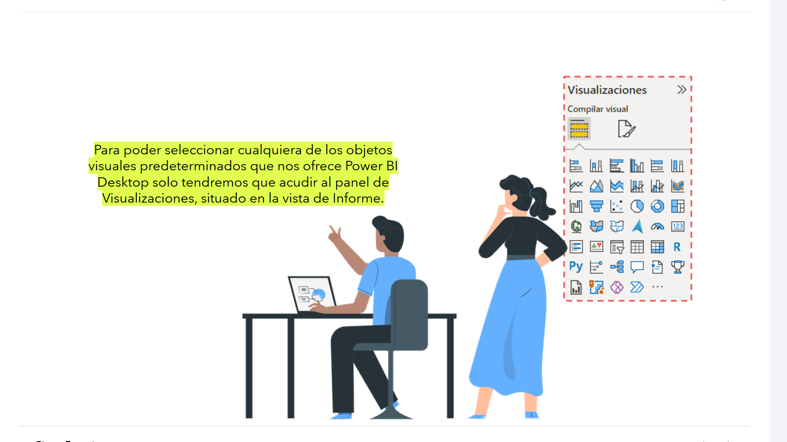

Las alternativas predeterminadas, sin contar con los objetos visuales disponibles en el market place de MS,  son varias.

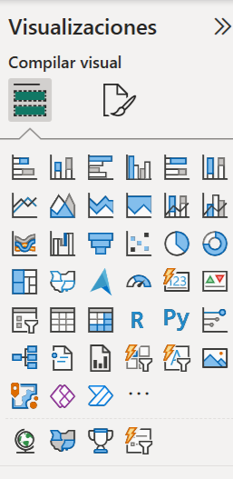
Para poder seleccionar cualquiera de los **objetos visuales predeterminados** que nos ofrece **Power BI Desktop** solo tendremos que acudir al **panel de Visualizaciones**, situado en la **vista de Informe**.
