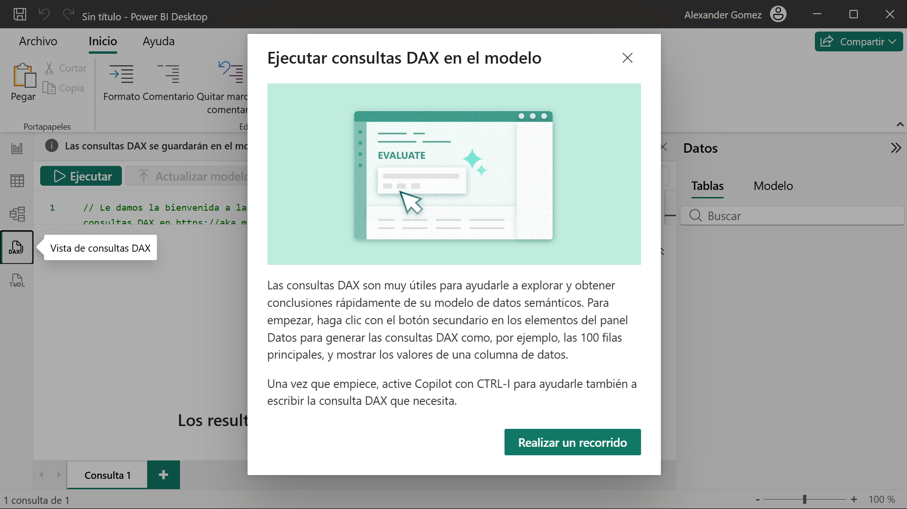
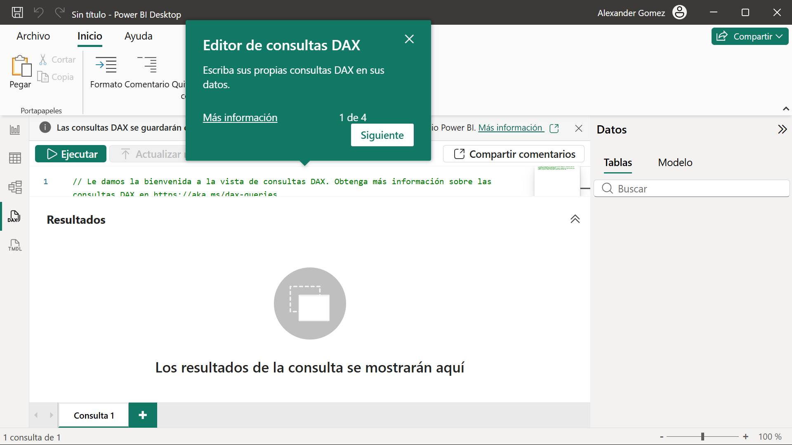
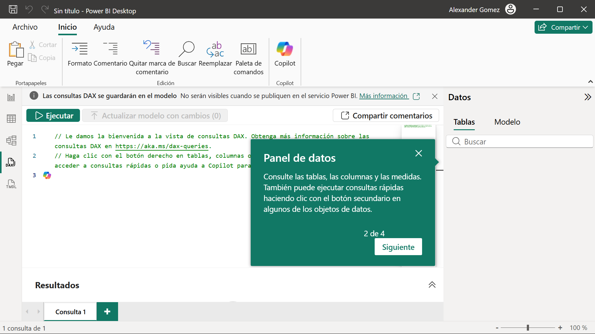
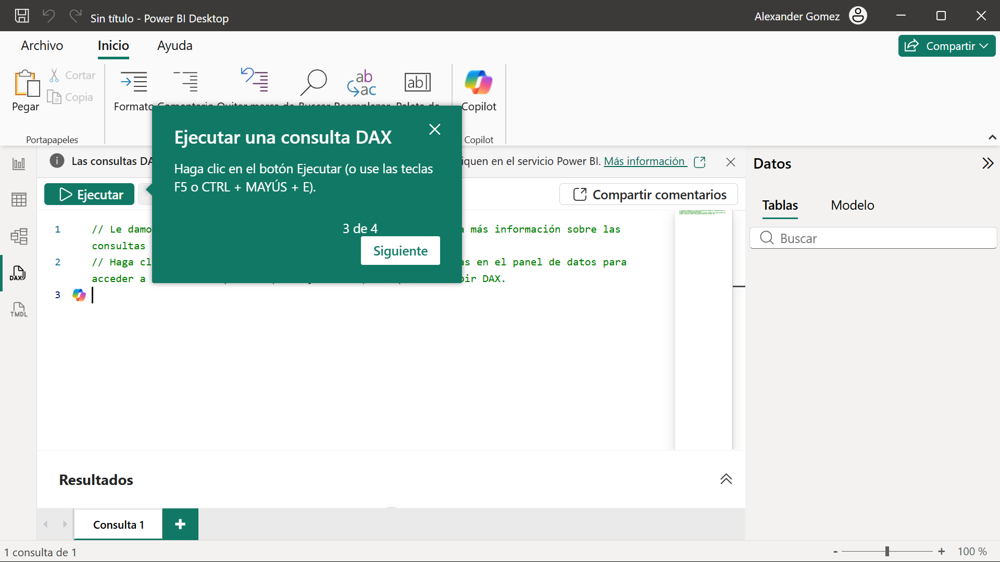
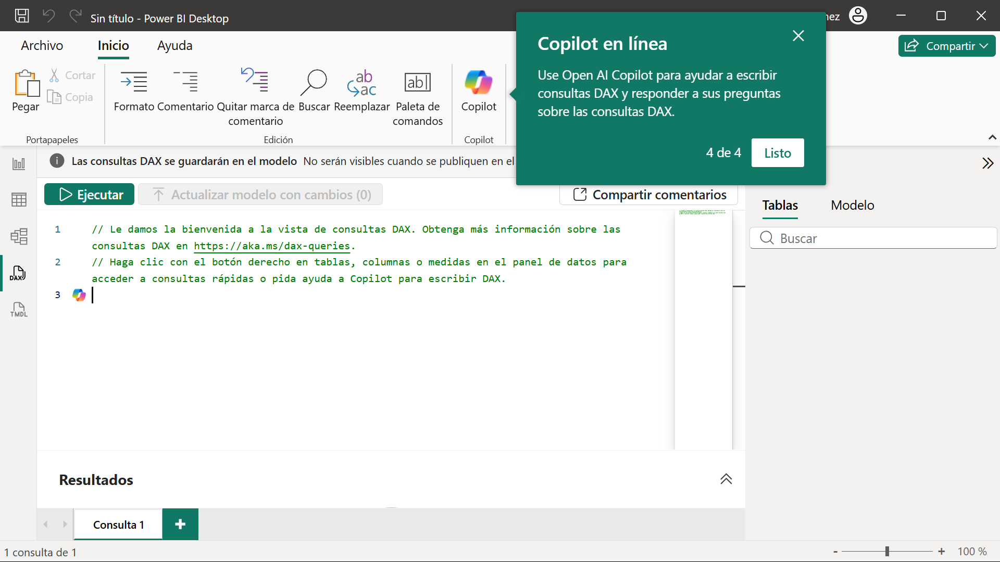

# 06-001b:	 **Vista de Consultas DAX**

> 📖 **Objetivo:** aprender a utilizar la **Vista de consultas DAX (DAX Query View)** para explorar, consultar y analizar un modelo de datos de forma rápida mediante el lenguaje **DAX**.

---

# 📌 ¿Qué es la Vista de Consultas DAX?

La **Vista de consultas DAX (DAX Query View)** es un entorno de trabajo integrado en **Power BI Desktop** diseñado para **explorar**, **probar** y **analizar** modelos de datos semánticos ejecutando expresiones de consulta **DAX** de forma directa.

> La **Vista de Consultas DAX** permite trabajar directamente sobre el modelo de datos semántico, ejecutar consultas de prueba, inspeccionar resultados y apoyarse en **Copilot** para escribir expresiones DAX de forma mucho más rápida y sencilla.

> 💡 Es el lugar ideal para experimentar con el modelo sin modificar los datos.


La Vista de Consultas DAX proporciona cuatro elementos fundamentales:

- 📝 **Editor de consultas DAX**, donde se escriben las consultas.
- 📁 **Panel de Datos**, para explorar tablas, columnas y medidas.
- ▶️ **Ejecución de consultas**, mediante botón o atajos de teclado.
- 🤖 **Copilot**, para generar y explicar consultas DAX automáticamente.

Todo ello convierte esta vista en una de las herramientas más útiles para comprender y analizar un modelo de datos dentro de **Power BI Desktop**.

---

## 1. 	Introducción: Ejecutar consultas DAX en el modelo


Al acceder por primera vez a esta vista desde el panel lateral izquierdo, el sistema presenta un asistente de bienvenida.

### Pantalla de bienvenida


> **Ejecutar consultas DAX en el modelo**

Las consultas DAX son muy útiles para ayudarle a explorar y obtener conclusiones rápidamente de su modelo de datos semánticos.

Para empezar, haga clic con el botón secundario en los elementos del panel **Datos** para generar las consultas DAX como, por ejemplo, las **100 filas principales**, y mostrar los valores de una columna de datos.

Una vez que empiece, active **Copilot** con **CTRL + I** para ayudarle también a escribir la consulta DAX que necesita.  


➡️ **Icono de Vista de consultas DAX (DAX)** situado en el menú lateral de navegación izquierdo de **Power BI Desktop**.  

---

# 🧭 2. El Recorrido Interactivo (Paso a Paso)

---

# 🟦 Paso 1 de 4 - Editor de consultas DAX

Es el **panel central** y constituye la zona principal donde se escriben y modifican las consultas DAX.

Normalmente las consultas utilizan la instrucción básica:

```DAX
EVALUATE
```



Escriba sus propias consultas DAX en sus datos.  

---

## 📊 Panel de Resultados

Justo debajo del editor se sitúa el visor donde se imprimen los datos obtenidos tras la ejecución.

Su mensaje inicial será:

> **Los resultados de la consulta se mostrarán aquí.**

---

# 🟦 Paso 2 de 4 - Panel de Datos


Se encuentra situado **a la derecha del editor**.

Desde aquí podemos interactuar visualmente con toda la estructura del modelo de datos.  


Consulte las tablas, las columnas y las medidas.  

También puede ejecutar consultas rápidas haciendo clic con el botón secundario en algunos de los objetos de datos.


---

# 🟦 Paso 3 de 4 - Ejecutar una consulta DAX


Las consultas se ejecutan manualmente mediante un botón o utilizando atajos de teclado.


Haga clic en el botón **Ejecutar** (o use las teclas **F5** o **CTRL + MAYÚS + E**).  


🟢 **Botón verde "Ejecutar"** situado en la barra superior de herramientas del área de trabajo.

---

# 🟦 Paso 4 de 4 - Copilot en línea


La Vista de Consultas incorpora integración con **Open AI Copilot** para facilitar la creación y depuración de consultas DAX.  

Use **Open AI Copilot** para ayudar a escribir consultas DAX y responder a sus preguntas sobre las consultas DAX.  

Puede abrirse mediante:

- 🤖 Botón **Copilot** de la cinta de opciones superior.
- ⌨️ Atajo de teclado **CTRL + I** directamente desde el editor.

---

# 📚 Resumen de Atajos Clave y Funciones

| 🎯 Acción | 🚀 Método de acceso |
|:---------|:--------------------|
| ▶️ Ejecutar consulta | **Botón Ejecutar** · **F5** · **CTRL + MAYÚS + E** |
| 🤖 Invocar a Copilot | **Botón Copilot** · **CTRL + I** |
| ⚡ Consultas rápidas | **Clic derecho** sobre una tabla o columna del panel **Datos** (ej. *Mostrar las 100 filas principales*) |


---
