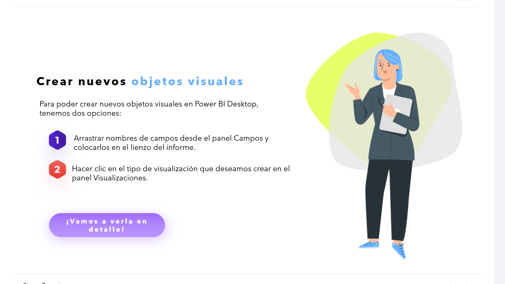
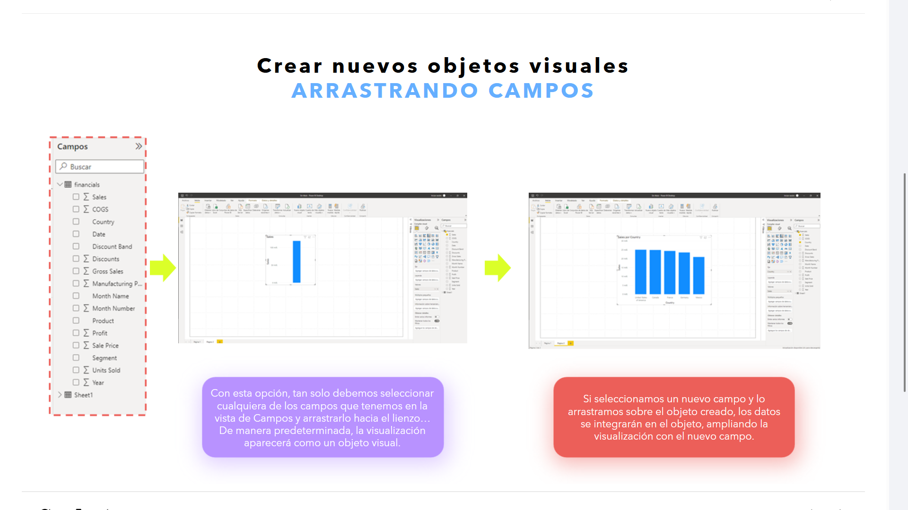
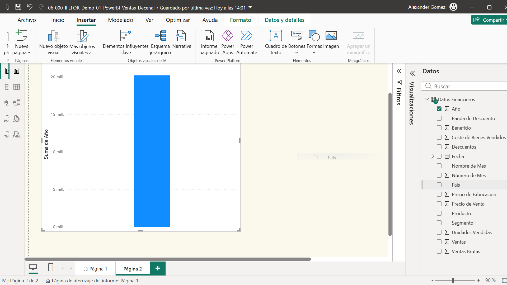
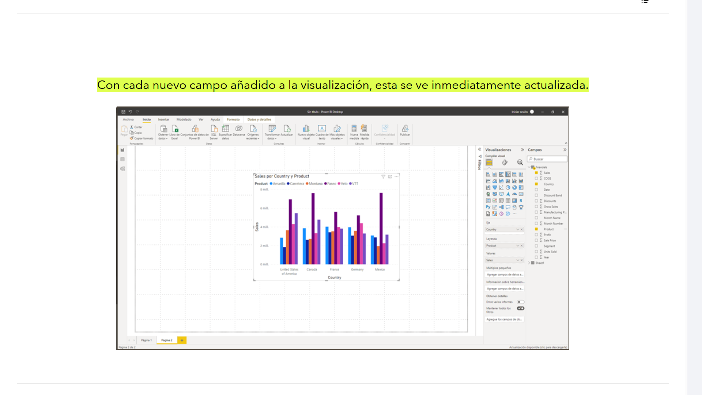
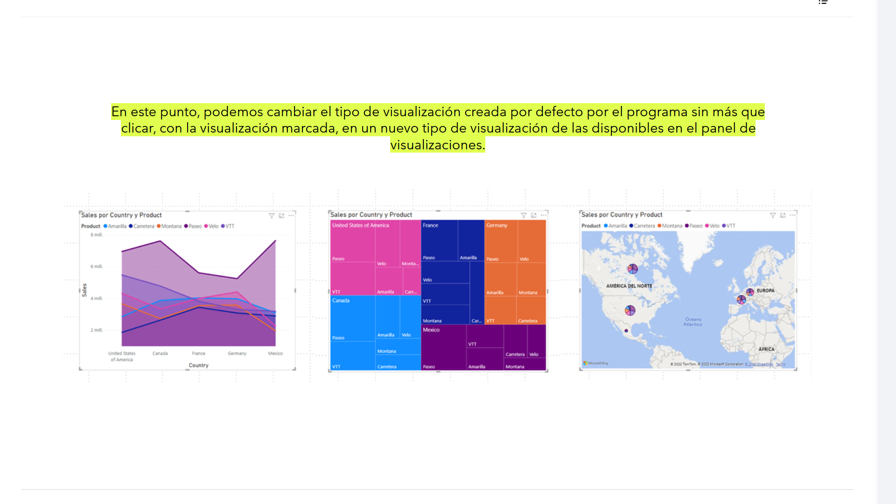
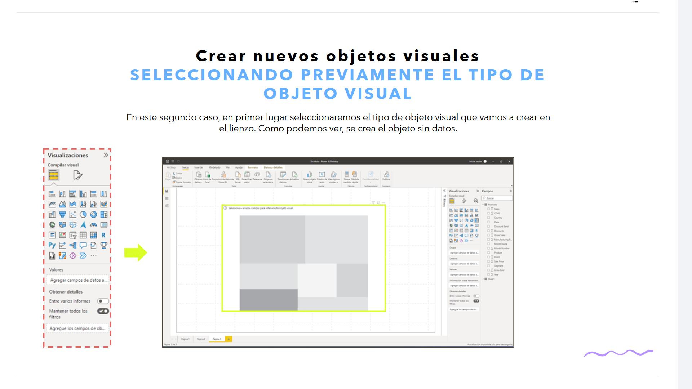
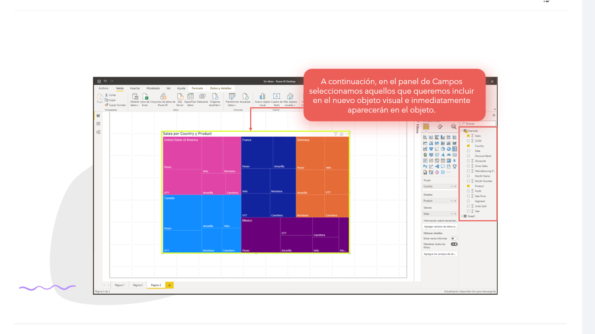
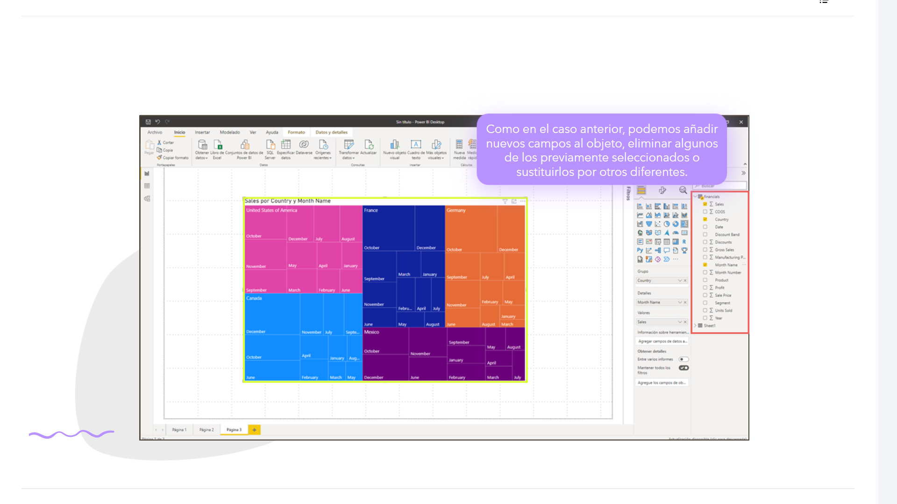
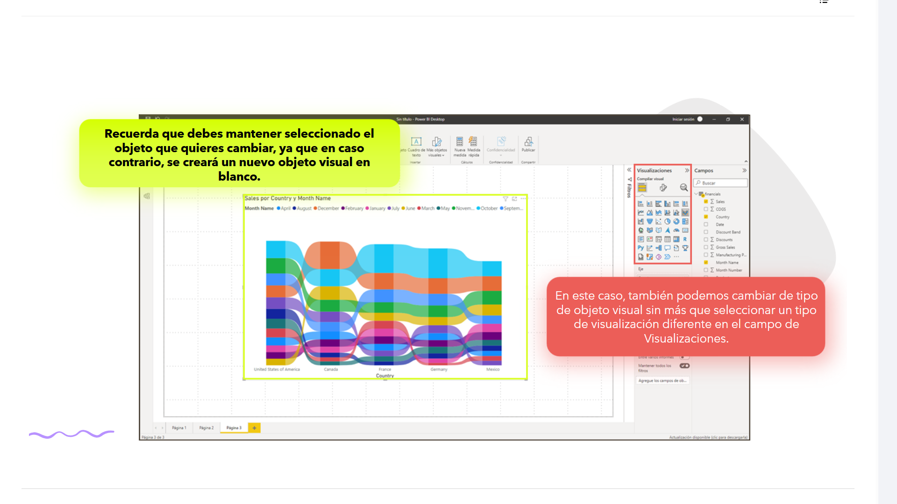
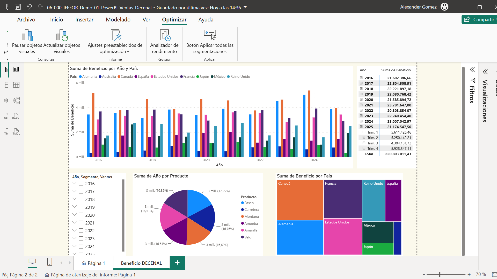

# 06-002: **Objetos Visuales**

## Crear nuevos objetos visuales

Para poder crear nuevos objetos visuales en **Power BI Desktop**, tenemos **dos opciones**:

1. Arrastrar nombres de campos desde el panel **Campos** y colocarlos en el lienzo del informe.
2. Hacer clic en el tipo de visualización que deseamos crear en el panel **Visualizaciones**.

---

## ARRASTRAR CAMPOS

- Con esta opción, tan solo debemos seleccionar cualquiera de los campos que tenemos en la vista de **Campos** y arrastrarlo hacia el lienzo... De manera predeterminada, la visualización aparecerá como un objeto visual.

- Si seleccionamos un nuevo campo y lo arrastramos sobre el objeto creado, los datos se integrarán en el objeto, ampliando la visualización con el nuevo campo.

> PowerBI facilita el trabajo de creación de objetos visuales. Para mejorarlos, se debe usar la intuición y creatividad pero, sobre todo, experimentar

Con cada nuevo campo añadido a la visualización, esta se ve inmediatamente actualizada.

> **Recuerda:** debes mantener seleccionado el objeto que quieres cambiar, ya que en caso contrario, se creará un nuevo objeto visual en blanco.

En este punto, podemos cambiar el tipo de visualización creada por defecto por el programa sin más que clicar, con la visualización marcada, en un nuevo tipo de visualización de las disponibles en el panel de **Visualizaciones**.

---

## SELECCIONAR PREVIAMENTE EL TIPO DE OBJETO VISUAL

En este segundo caso, en primer lugar seleccionaremos el **tipo de objeto visual** que vamos a crear en el lienzo. Como podemos ver, se crea el objeto **sin datos**.  

A continuación, en el panel de **Campos** seleccionamos aquellos que queremos incluir en el nuevo objeto visual e inmediatamente aparecerán en el objeto.  

> **Ten en cuenta que los campos que añadas modifican el objeto visual, por lo que es importante experimentar y ver si los cambios mejoran al anterior.**

Como en el caso anterior, podemos añadir nuevos campos al objeto, eliminar algunos de los previamente seleccionados o sustituirlos por otros diferentes.  

> En este caso, también podemos cambiar de tipo de objeto visual sin más que seleccionar un tipo de visualización diferente en el campo de **Visualizaciones**.

> **Recuerda:** debes mantener seleccionado el objeto que quieres cambiar, ya que en caso contrario, se creará un nuevo objeto visual en blanco.  

---
  
  

