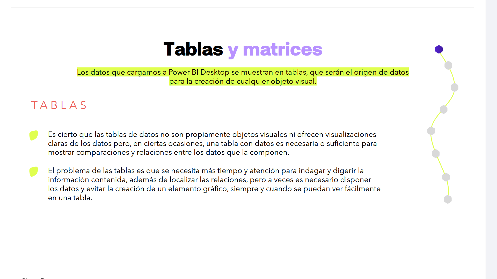
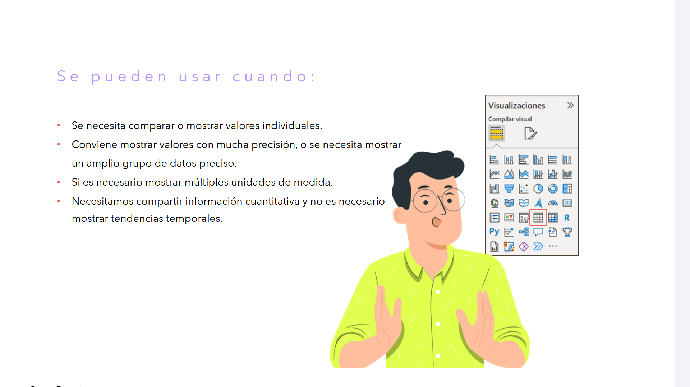
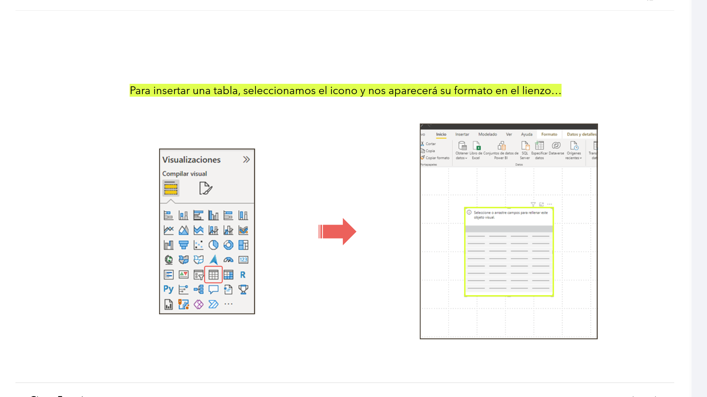
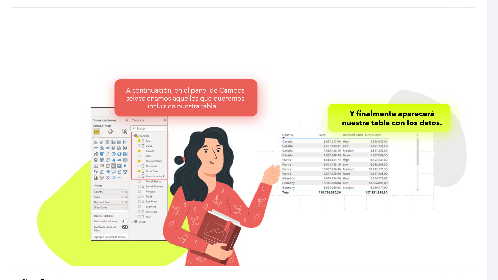
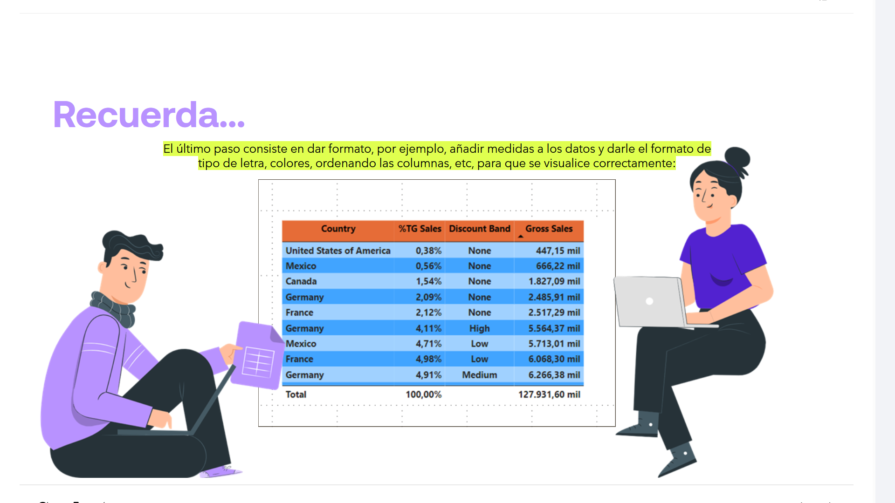
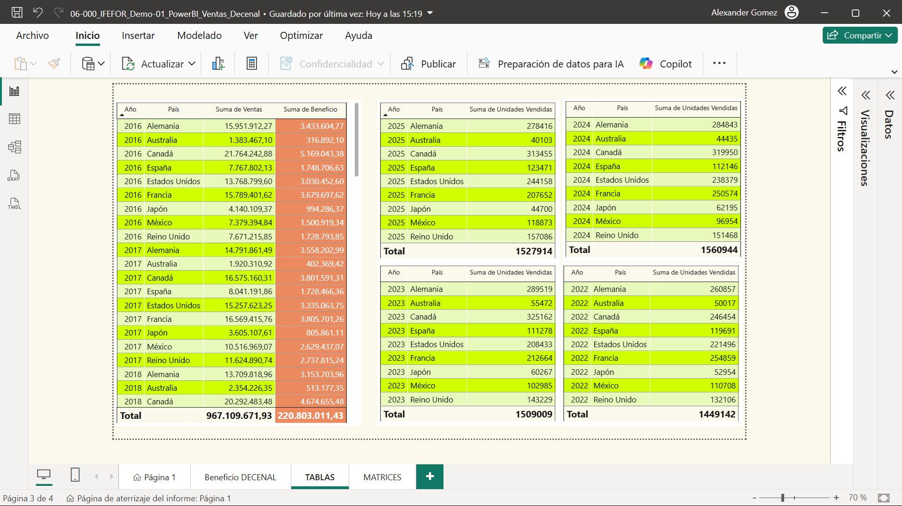
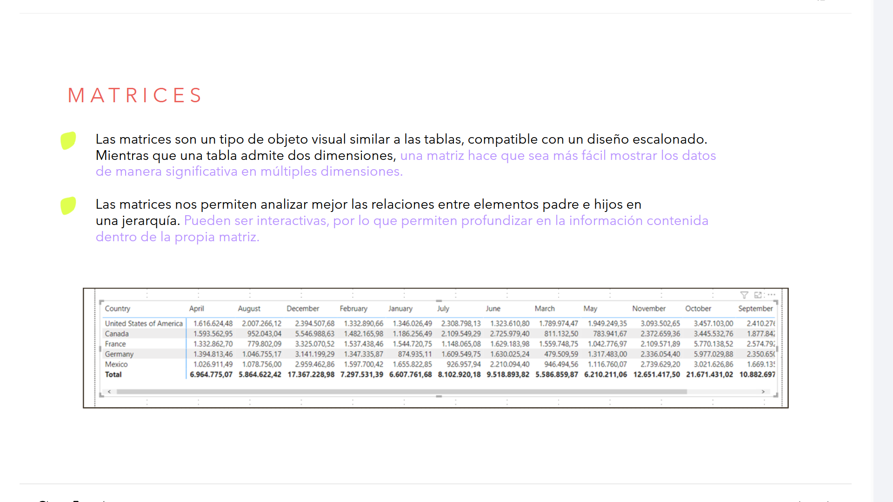
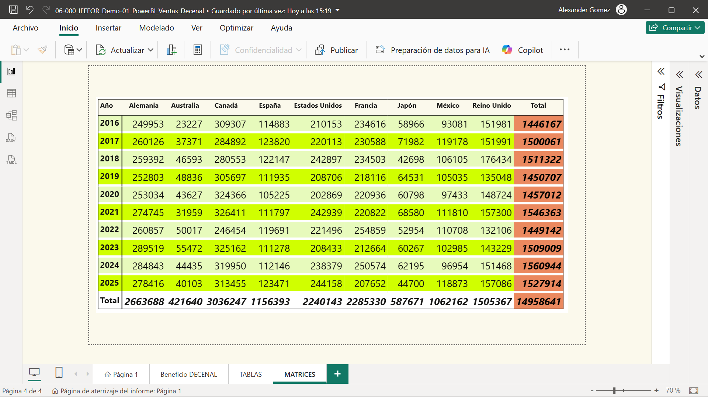
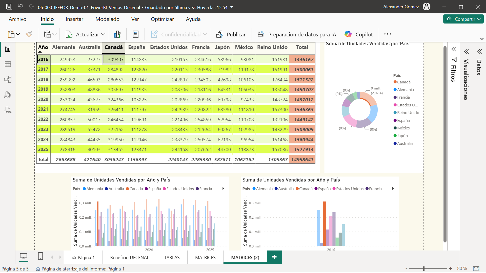

# 06-003: Tablas y Matrices

> Ahora que ya sabemos cómo crear un objeto visual, se repasarán todos los objetos que PowerBI permite crear de forma predeterminada.

---

## TABLAS

Los datos que cargamos a Power BI Desktop se muestran en tablas, que serán el origen de datos para la creación de cualquier objeto visual.

Es cierto que las tablas de datos no son propiamente objetos visuales ni ofrecen visualizaciones claras de los datos pero, en ciertas ocasiones, una tabla con datos es necesaria o suficiente para mostrar comparaciones y relaciones entre los datos que la componen.

El problema de las tablas es que se necesita más tiempo y atención para indagar y digerir la información contenida, además de localizar las relaciones, pero a veces es necesario disponer los datos y evitar la creación de un elemento gráfico, siempre y cuando se puedan ver fácilmente en una tabla.

---

> Las tablas son lo más parecido a lo que nos encontramos en Excel, por lo que es fácil entender cuándo son interesantes.

**Se pueden usar cuando:**

- Se necesita comparar o mostrar valores individuales.
- Conviene mostrar valores con mucha precisión, o se necesita mostrar un amplio grupo de datos preciso.
- Si es necesario mostrar múltiples unidades de medida.
- Necesitamos compartir información cuantitativa y no es necesario mostrar tendencias temporales.

---

Para insertar una tabla, seleccionamos el icono `Tabla` y nos aparecerá su formato en el lienzo...

A continuación, en el panel `Campos` seleccionamos aquellos que queremos incluir en nuestra tabla...

Y finalmente aparecerá nuestra tabla con los datos.

---

> **Recuerda...**
> Una vez creado un objeto visual debemos darle un formato agradable; a veces es mejor esperar al final, con todos los objetos creados en el informe, para homogeneizar y hacer más agradable el formato de estos.

El último paso consiste en dar formato, por ejemplo, añadir medidas a los datos y darle el formato de tipo de letra, colores, ordenando las columnas, etc, para que se visualice correctamente desde el panel `Formato del objeto visual`:

---

## MATRICES

Para insertar una matriz, seleccionamos el icono `Matriz` en el panel `Objetos visuales`.

> Útiles para mostrar resúmenes de datos agregados, agrupados en filas y en columnas, similar a una tabla dinámica o tabla de referencias cruzadas.

Las matrices son un tipo de objeto visual similar a las tablas, compatible con un diseño escalonado. Mientras que una tabla admite dos dimensiones, una matriz hace que sea más fácil mostrar los datos de manera significativa en múltiples dimensiones.

Las matrices nos permiten analizar mejor las relaciones entre elementos padre e hijos en una jerarquía. Pueden ser interactivas, por lo que permiten profundizar en la información contenida dentro de la propia matriz.

**¿Cuándo es idóneo usarlas?**

- Cuando las personas necesitan ver los detalles de los datos, así como el resumen de los datos para obtener una visión completa de la historia.

- Suelen incluirse las matrices en un informe o panel para permitir a sus usuarios seleccionar uno o varios elementos, filas, columnas, celdas, etc., de la matriz para realizar el resaltado cruzado de otros objetos visuales de una página del informe.

