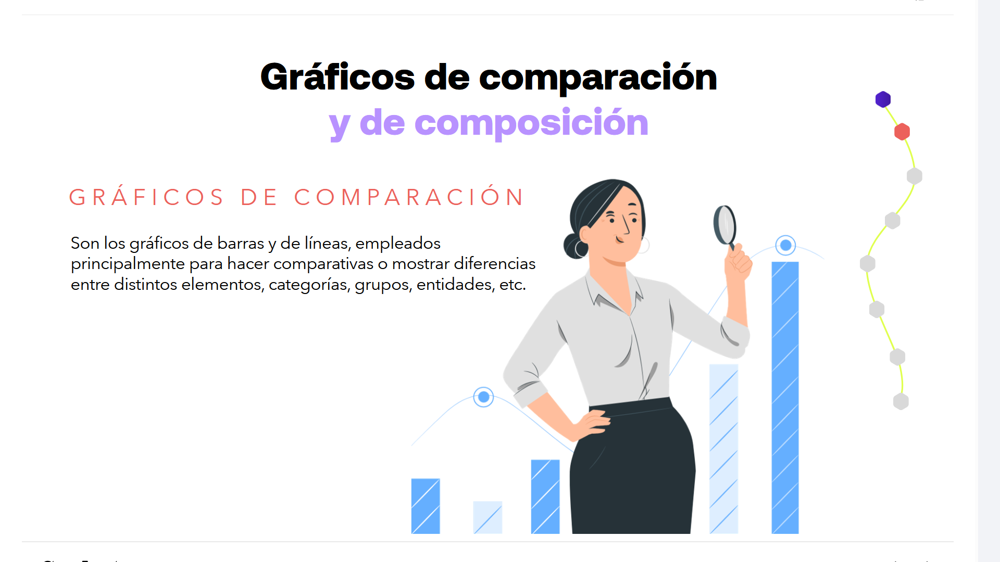
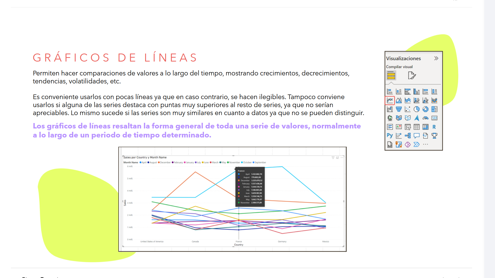
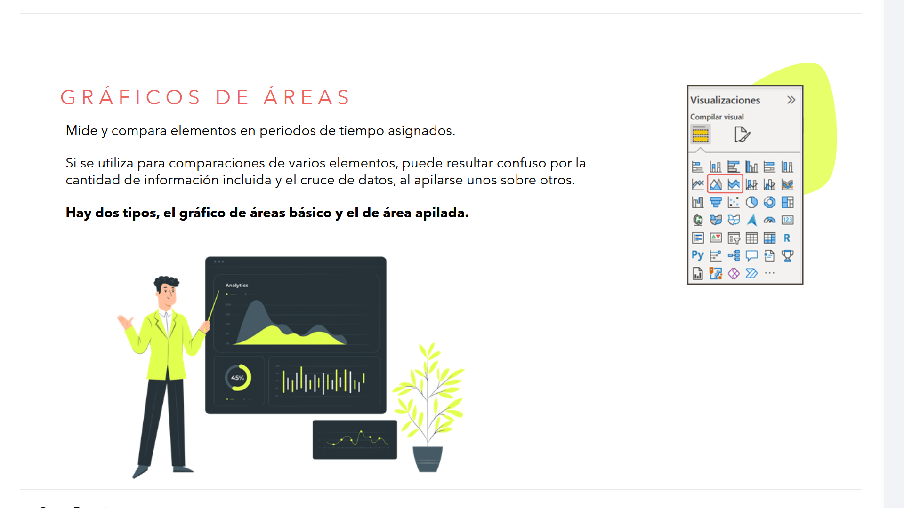
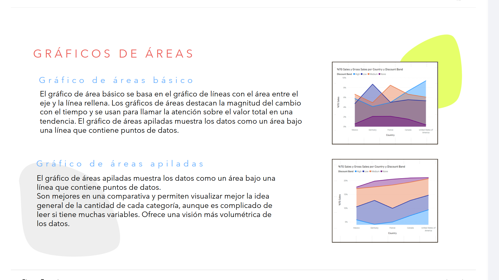
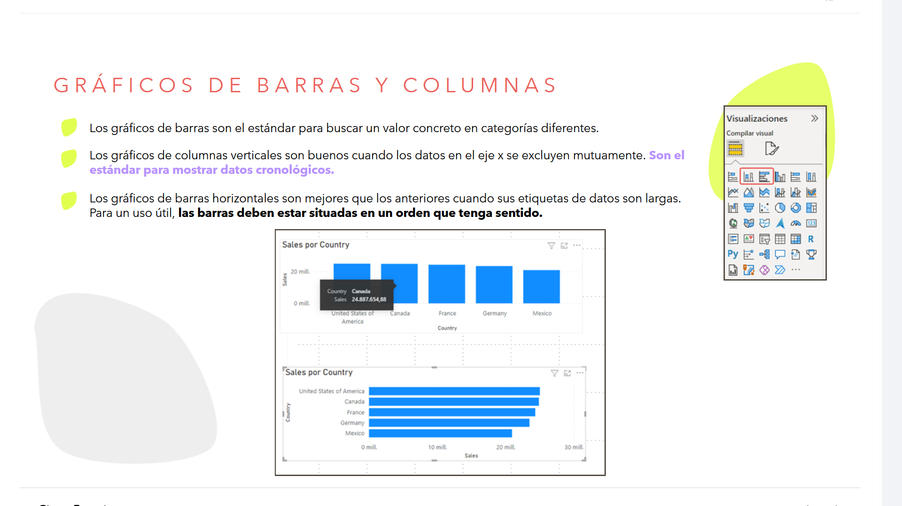
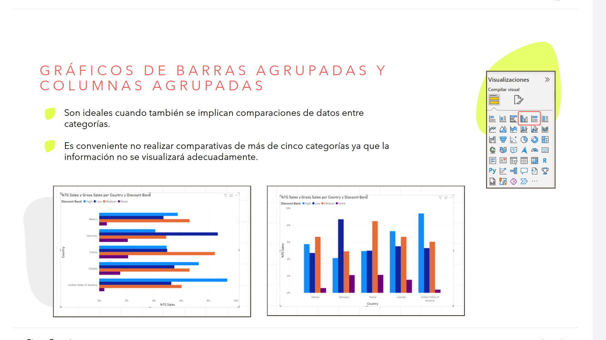
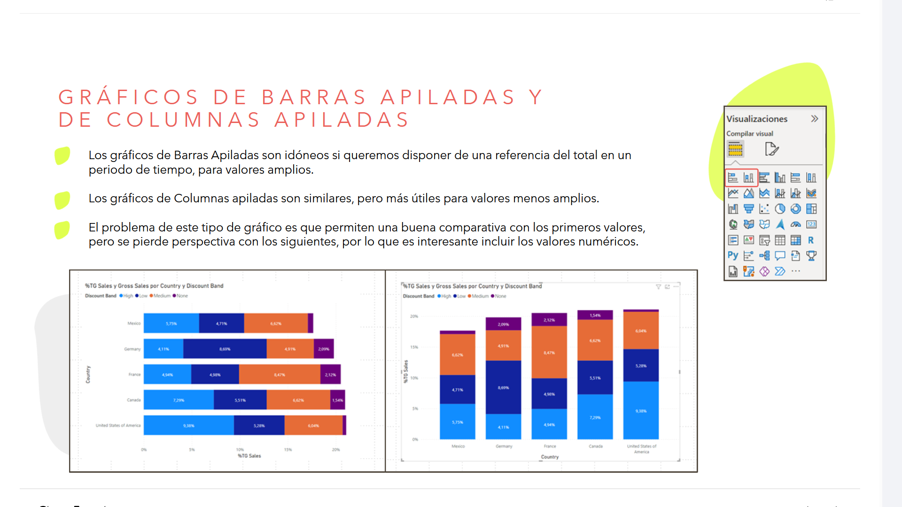
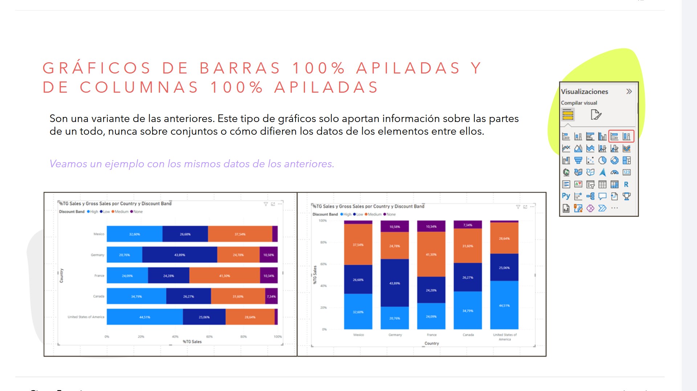
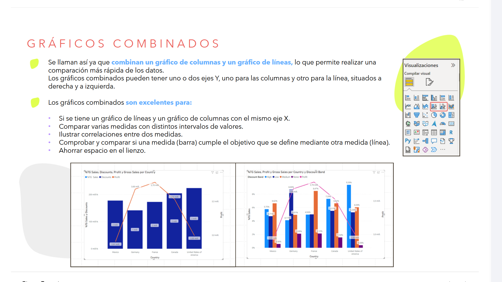

# 06-004: Gráficos de Comparación y Composición

> Permiten comparar datos de forma individual, categorías, series.

---

## GRÁFICOS DE COMPARACIÓN

Son los gráficos de **barras** y de **líneas**, empleados principalmente para hacer comparativas o mostrar diferencias entre distintos elementos, categorías, grupos, entidades, etc.

---

### Gráficos de Líneas

> Se emplean para representar datos **continuos**.
> Dado que los puntos están conectados físicamente a través de una línea, debe haber una conexión entre los puntos que puede no tener sentido para grupos ordenados o divididos entre diferentes categorías.

Permiten hacer comparaciones de valores a lo largo del tiempo, mostrando:

- Crecimientos
- Decrecimientos
- Tendencias
- Volatilidades

Es conveniente usarlos con **pocas líneas**, ya que en caso contrario se hacen ilegibles. Tampoco conviene usarlos si alguna de las series destaca con puntas muy superiores al resto de series, ya que no serían apreciables. Lo mismo sucede si las series son muy similares en cuanto a datos, ya que no se pueden distinguir.

> **Los gráficos de líneas resaltan la forma general de toda una serie de valores**, normalmente a lo largo de un periodo de tiempo determinado.

---

### Gráficos de Áreas

Mide y compara elementos en periodos de tiempo asignados.

> El ojo humano no está capacitado para asignar un valor cuantitativo a un espacio bidimensional.

Si se utiliza para comparaciones de varios elementos, puede resultar confuso por la cantidad de información incluida y el cruce de datos, al apilarse unos sobre otros.

Hay dos tipos:

- **Gráfico de Áreas Básico**
- **Gráfico de Área Apilada**

#### Gráfico de Áreas Básico

El gráfico de área básico se basa en el gráfico de líneas con el área entre el eje y la línea rellena. Los gráficos de áreas destacan la **magnitud del cambio con el tiempo** y se usan para llamar la atención sobre el valor total en una tendencia.

#### Gráfico de Áreas Apiladas

El gráfico de áreas apiladas muestra los datos como un área bajo una línea que contiene puntos de datos.

Son mejores en una comparativa y permiten visualizar mejor la idea general de la cantidad de cada categoría, aunque es complicado de leer si tiene muchas variables. Ofrece una visión más volumétrica de los datos.

---

### Gráficos de Barras y Columnas

> Son los más comunes, a veces omitidos por su habitualidad, lo cual es un error.

> Fáciles de leer y de comparar extremos, permitiendo identificar rápidamente las categorías más grandes y pequeñas, y sus diferencias incrementales.

- Los **gráficos de barras** son el estándar para buscar un valor concreto en categorías diferentes.
- Los **gráficos de columnas verticales** son buenos cuando los datos en el eje `X` se excluyen mutuamente. Son el estándar para mostrar datos cronológicos.
- Los **gráficos de barras horizontales** son mejores que los anteriores cuando sus etiquetas de datos son largas. Para un uso útil, las barras deben estar situadas en un orden que tenga sentido.

---

### Gráficos de Barras Agrupadas y Columnas Agrupadas

> Similares a los anteriores en su forma, permiten **comparar distintas categorías**.

> Pueden ser algo engorrosos cuando se apilan muchas partes en una sola categoría.

- Son ideales cuando también se implican comparaciones de datos entre categorías.
- Es conveniente **no realizar comparativas de más de cinco categorías**, ya que la información no se visualizará adecuadamente.

---

## GRÁFICOS DE COMPOSICIÓN

Son los gráficos que incluyen áreas, en todas sus vertientes, incluidos:

- Gráficos circulares
- Columnas
- Áreas apiladas
- Anillos

---

### Gráficos de Barras Apiladas y de Columnas Apiladas

> Permiten **comparar totales x categoría** y **ver las partes dentro de cada una**.

- Los **gráficos de Barras Apiladas** son idóneos si queremos disponer de una referencia del total en un periodo de tiempo, para valores amplios.
- Los **gráficos de Columnas Apiladas** son similares, pero más útiles para valores menos amplios.

El problema de este tipo de gráfico es que permiten una buena comparativa con los primeros valores, pero se pierde perspectiva con los siguientes, por lo que es interesante incluir los valores numéricos.

---

### Gráficos de Barras 100% Apiladas y de Columnas 100% Apiladas

> Útiles para **representar las partes de un todo en una escala de negativo a positivo**, partiendo de una escala coherente tanto del lado derecho como izquierdo o inferior e superior.

> Muy útiles para **representar partes de encuestas**.

Son una variante de las anteriores. Este tipo de gráficos solo aportan información sobre las partes de un todo, nunca sobre conjuntos o cómo difieren los datos de los elementos entre ellos.

> **Nota:** en la gráfica se muestran los mismos datos que en la anterior, aplicados a este tipo de gráficos.

---

### Gráficos Combinados

Se llaman así ya que combinan un **gráfico de columnas** y un **gráfico de líneas**, lo que permite realizar una comparación más rápida de los datos.

Los gráficos combinados pueden tener uno o dos ejes `Y`, uno para las columnas y otro para la línea, situados a derecha y a izquierda.

**Los gráficos combinados son excelentes para:**

- Si se tiene un gráfico de líneas y un gráfico de columnas con el mismo eje `X`.
- Comparar varias medidas con distintos intervalos de valores.
- Ilustrar correlaciones entre dos medidas.
- Comprobar y comparar si una medida (barra) cumple el objetivo que se define mediante otra medida (línea).
- Ahorrar espacio en el lienzo.

---

> **Recuerda...**
> El informe podrá contener varias páginas con objetos visuales, pero debemos conseguir que todas ellas narren un relato gráfico común, una historia sobre los datos. El orden o desorden, la claridad o la confusión, pueden atraer o distraer de la lectura de los datos.
>
> En este sentido, debemos mantener las alineaciones y la proximidad adecuada entre los distintos elementos, sin agruparlos demasiado juntos, usando gráficas claras, con colores que refuercen el mensaje a transmitir.
