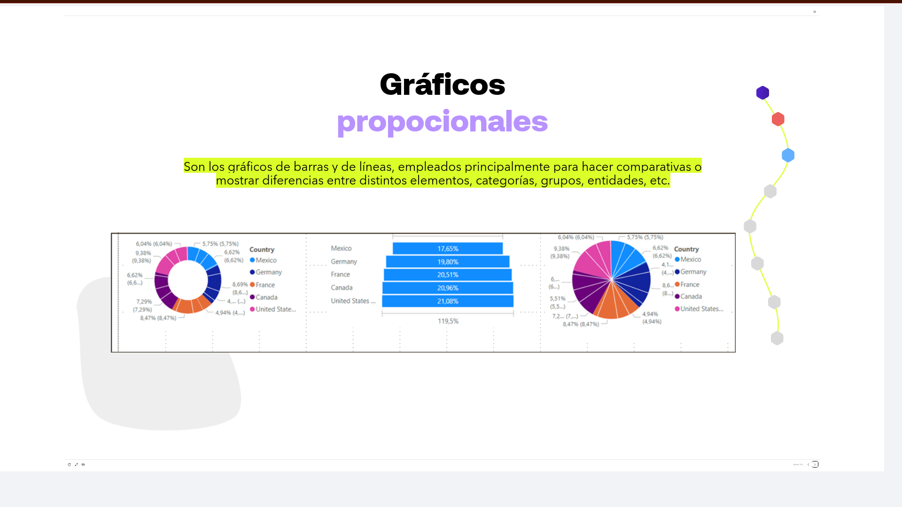
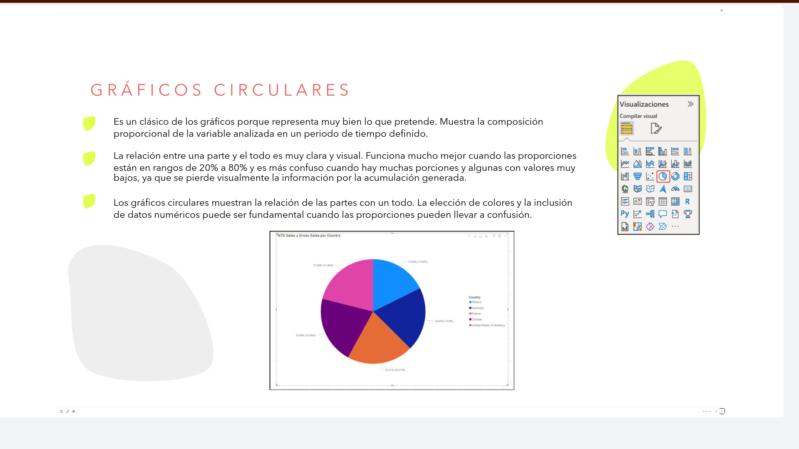
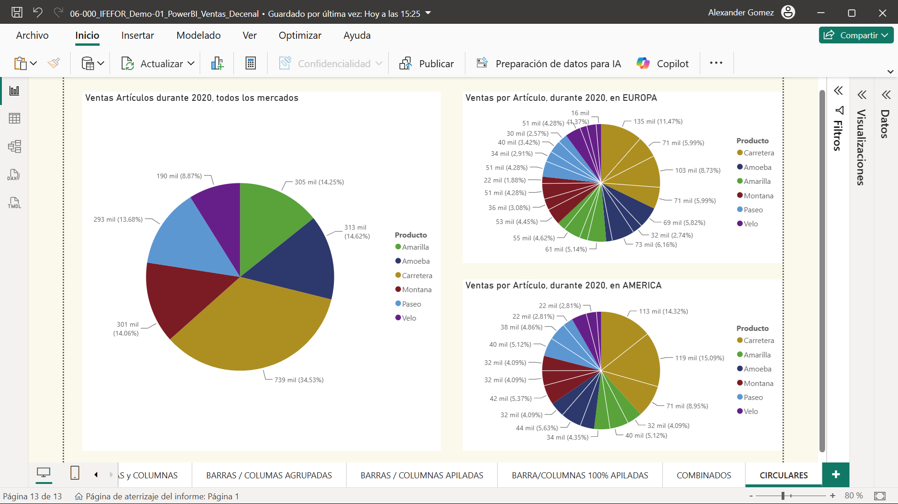
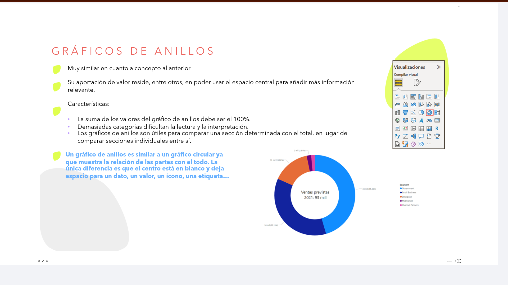
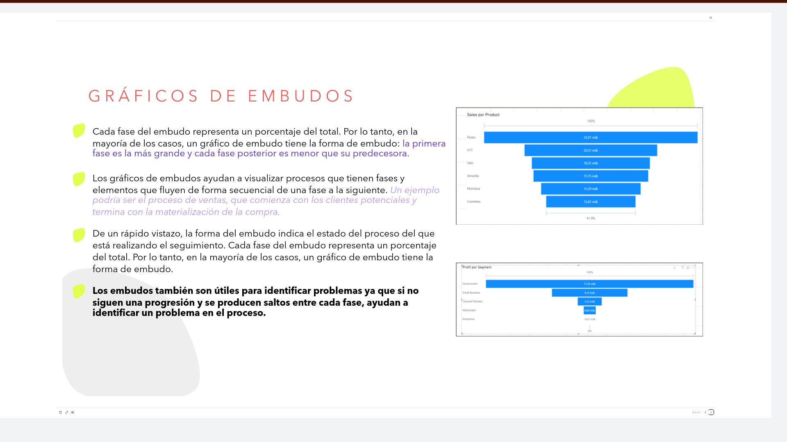
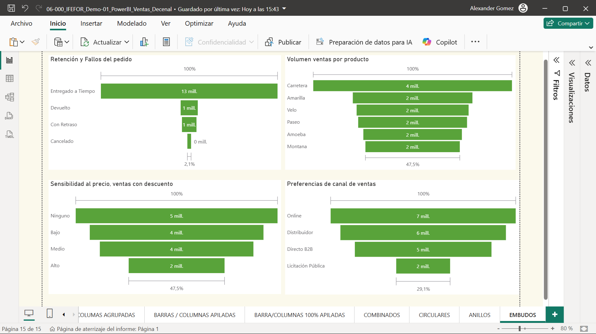

# 06-005: Gráficos Proporcionales

> Muestran **información gráfica de las partes respecto a un todo**.

---

## Gráficos Proporcionales

Son los gráficos de barras y de líneas, empleados principalmente para hacer comparativas o mostrar diferencias entre distintos elementos, categorías, grupos, entidades, etc.

---

### Gráficos Circulares ("De Pizza")

Es un clásico de los gráficos porque representa muy bien lo que pretende. Muestra la composición proporcional de la variable analizada en un periodo de tiempo definido.

La relación entre una parte y el todo es muy clara y visual. Funciona mucho mejor cuando las proporciones están en rangos de **20% a 80%** y es más confuso cuando hay muchas porciones y algunas con valores muy bajos, ya que se pierde visualmente la información por la acumulación generada.

Los gráficos circulares muestran la relación de las partes con un todo. La elección de colores y la inclusión de datos numéricos puede ser fundamental cuando las proporciones pueden llevar a confusión.

---

### Gráficos de Anillos

> Para comparar **una sección determinada con el total**, en vez de comparar secciones individuales entre sí.

Muy similar en cuanto a concepto al anterior. Su aportación de valor reside, entre otros, en poder usar el espacio central para añadir más información relevante.

**Características:**

- La suma de los valores del gráfico de anillos debe ser el **100%**.
- Demasiadas categorías dificultan la lectura y la interpretación.
- Los gráficos de anillos son útiles para comparar una sección determinada con el total, en lugar de comparar secciones individuales entre sí.

Un gráfico de anillos es **similar a un gráfico circular**, ya que muestra la relación de las partes con el todo.

> **La única diferencia es que el centro está en blanco** y deja espacio para un dato, un valor, un icono, una etiqueta.

---

### Gráficos de Embudos

> Ayudan a **visualizar un proceso lineal con fases secuenciales conectadas**.

- Se utilizan para mostrar la reducción progresiva de los datos a medida que pasan de una etapa a otra.
- Los datos se representan como una porción diferente del 100% o de la totalidad.
- Son útiles si los datos son secuenciales y se recogen a través de, al menos, tres o cuatro etapas, para comprobar las tendencias.
- Solo tienen sentido si los elementos se reducen gradualmente a medida que nos movemos en las etapas temporales.

**Cada fase del embudo representa un porcentaje del total.**  
 Por lo tanto, en la mayoría de los casos, un gráfico de embudo tiene la forma de embudo: la primera fase es la más grande y cada fase posterior es menor que su predecesora.

Los gráficos de embudos **ayudan a visualizar procesos que tienen fases y elementos que fluyen de forma secuencial de una fase a la siguiente**.   
Un ejemplo podría ser el proceso de ventas, que comienza con los clientes potenciales y termina con la materialización de la compra.

De un rápido vistazo, la forma del embudo indica el estado del proceso del que se está realizando el seguimiento. Cada fase del embudo representa un porcentaje del total. Por lo tanto, en la mayoría de los casos, un gráfico de embudo tiene la forma de embudo.

> **Los embudos también son útiles para identificar problemas**, ya que **si no siguen una progresión y se producen saltos entre cada fase, ayudan a identificar un problema en el proceso**.

