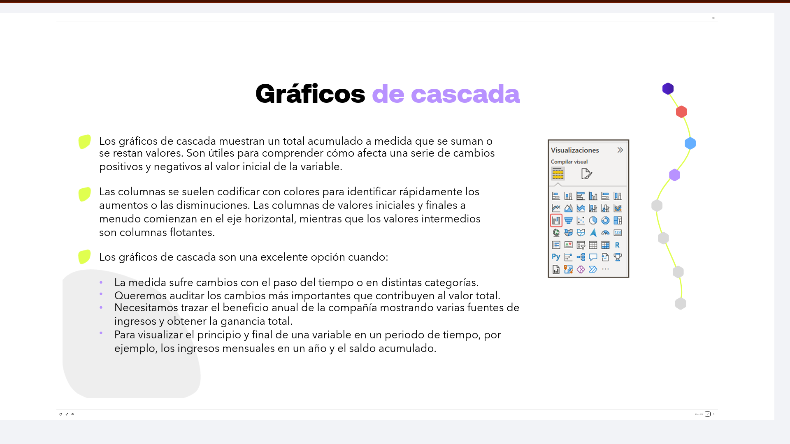
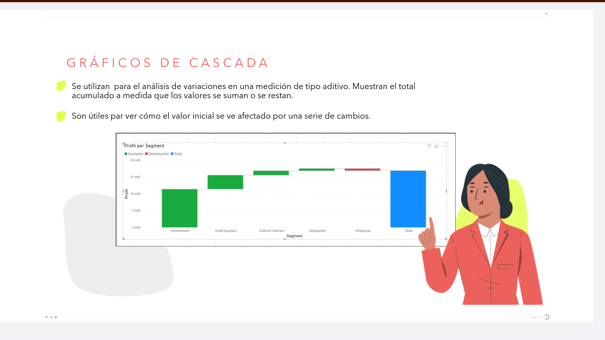
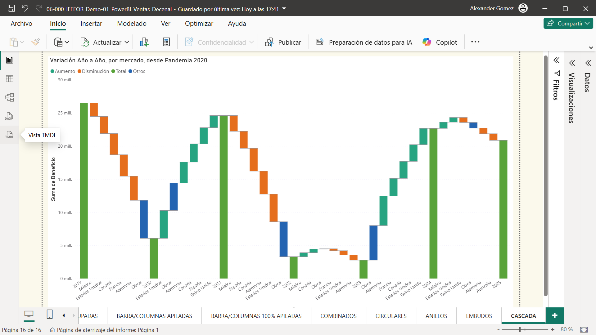

# 06-006: Gráficos de Cascada

> Sirven para **separar las piezas de un gráfico de columnas apiladas** y centrarse en una sola.

---

* Los gráficos de cascada muestran un total acumulado a medida que se suman o se restan valores. Son útiles para comprender cómo afecta una serie de cambios positivos y negativos al valor inicial de la variable.

* Las columnas se suelen codificar con colores para identificar rápidamente los aumentos o las disminuciones. Las columnas de valores iniciales y finales a menudo comienzan en el eje horizontal, mientras que los valores intermedios son columnas flotantes.

**Los gráficos de cascada son una excelente opción cuando:**

- La medida sufre cambios con el paso del tiempo o en distintas categorías.
- Queremos auditar los cambios más importantes que contribuyen al valor total.
- Necesitamos trazar el beneficio anual de la compañía mostrando varias fuentes de ingresos y obtener la ganancia total.
- Para visualizar el principio y final de una variable en un periodo de tiempo, por ejemplo, los ingresos mensuales en un año y el saldo acumulado.

---

> Muy útiles para mostrar **un punto de partida, los aumentos y descensos, y el punto resultante**.

* Se utilizan para el análisis de variaciones en una medición de tipo aditivo. Muestran el total acumulado a medida que los valores se suman o se restan.

* Son útiles para ver cómo el valor inicial se ve afectado por una serie de cambios.

