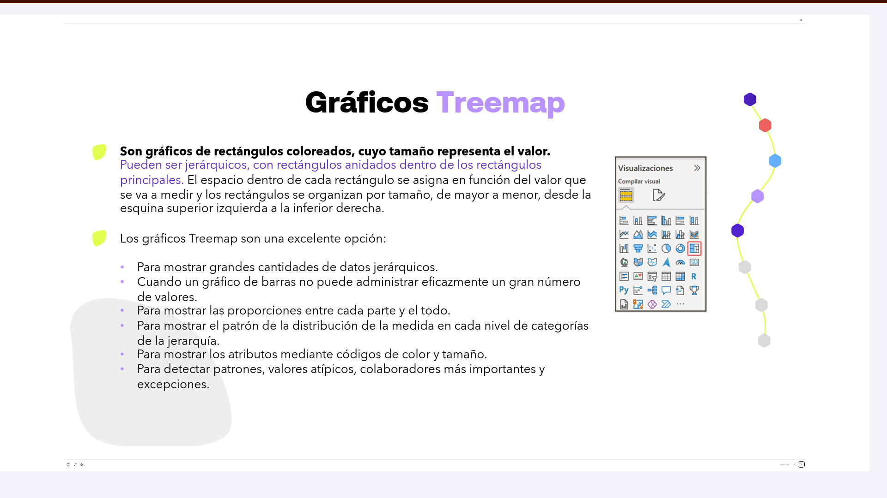
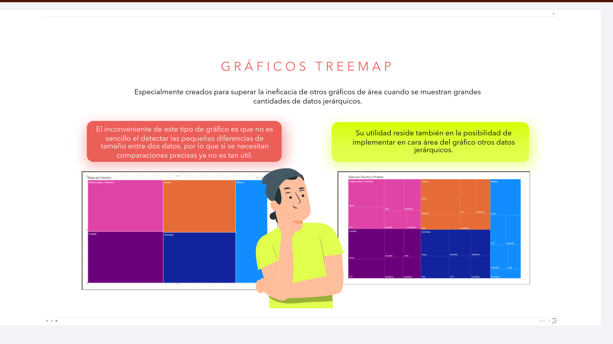
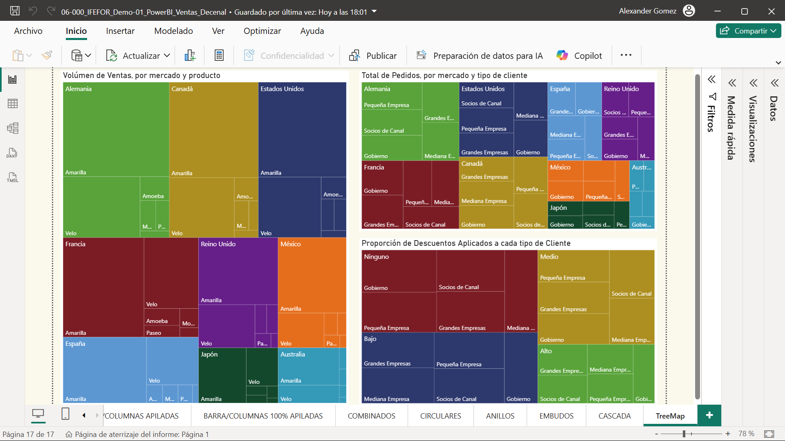

# 06-007: Gráficos TREEMAP

> Muy atractivos visualmente, sobre todo, cuando hay gráficos jerárquicos.

---

Son **gráficos de rectángulos coloreados, cuyo tamaño representa el valor**.

- Pueden ser jerárquicos, con rectángulos anidados dentro de los rectángulos principales. El espacio dentro de cada rectángulo se asigna en función del valor que se va a medir y los rectángulos se organizan por tamaño, de mayor a menor, desde la esquina superior izquierda a la inferior derecha.

**Los gráficos Treemap son una excelente opción:**

- Para mostrar grandes cantidades de datos jerárquicos.
- Cuando un gráfico de barras no puede administrar eficazmente un gran número de valores.
- Para mostrar las proporciones entre cada parte y el todo.
- Para mostrar el patrón de la distribución de la medida en cada nivel de categorías de la jerarquía.
- Para mostrar los atributos mediante códigos de color y tamaño.
- Para detectar patrones, valores atípicos, colaboradores más importantes y excepciones.

---

> Cuando los datos son muy similares, al ojo humano le cuesta percibir las diferencias.
> Su gran ventaja es facilitar el análisis de las jerarquías escondidas dentro de los grupos de datos.

Especialmente creados para superar la ineficacia de otros gráficos de área cuando se muestran grandes cantidades de datos jerárquicos.

> **El inconveniente** de este tipo de gráfico es que no es sencillo detectar las pequeñas diferencias de tamaño entre dos datos, por lo que si se necesitan comparaciones precisas ya no es tan útil.

> **Su utilidad** reside también en la posibilidad de implementar en cada área del gráfico otros datos jerárquicos.

---

> Es **MUY importante discernir bien entre Sumas, Promedios y Recuentos,** ya que estos **pueden falsear resultados reales, su proporcionalidad, respecto al total**.

