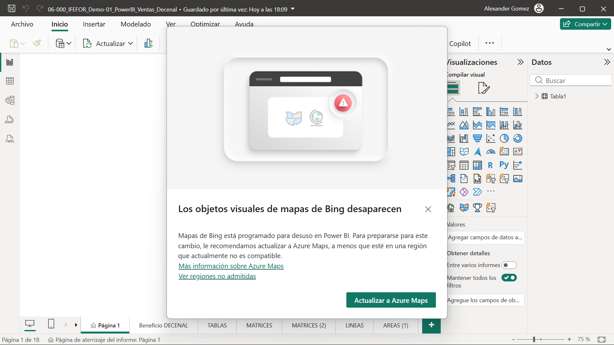
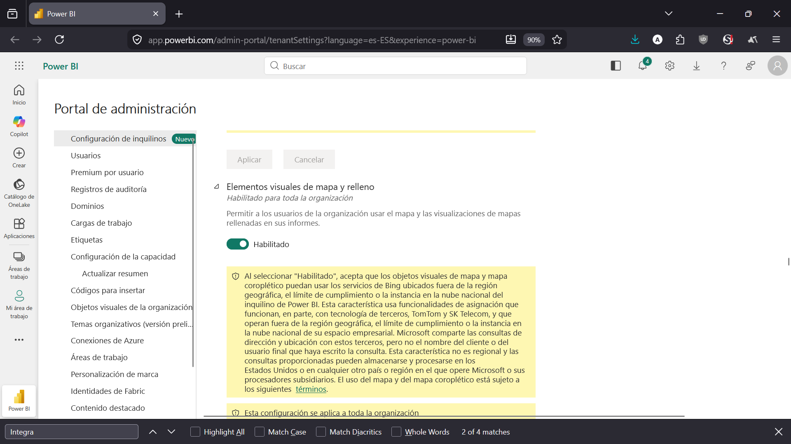
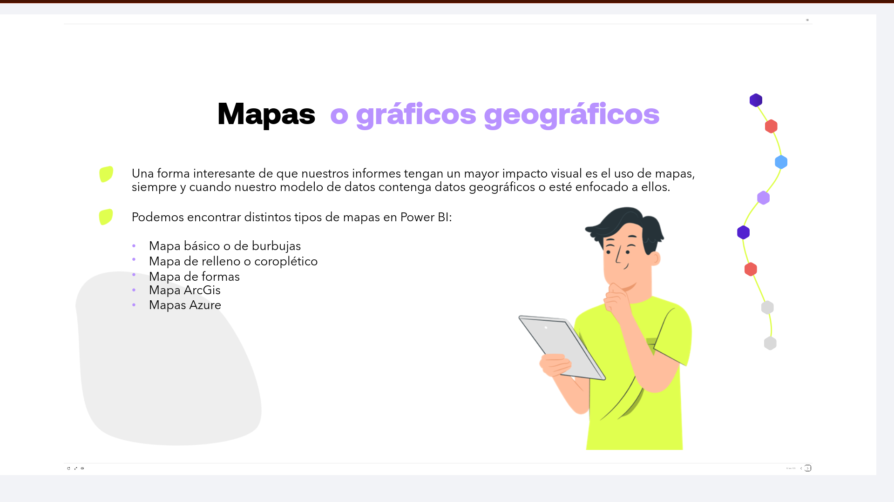
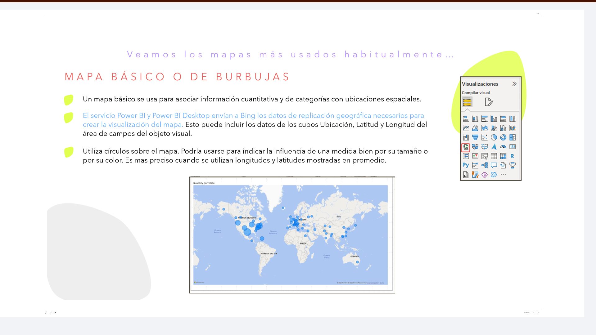
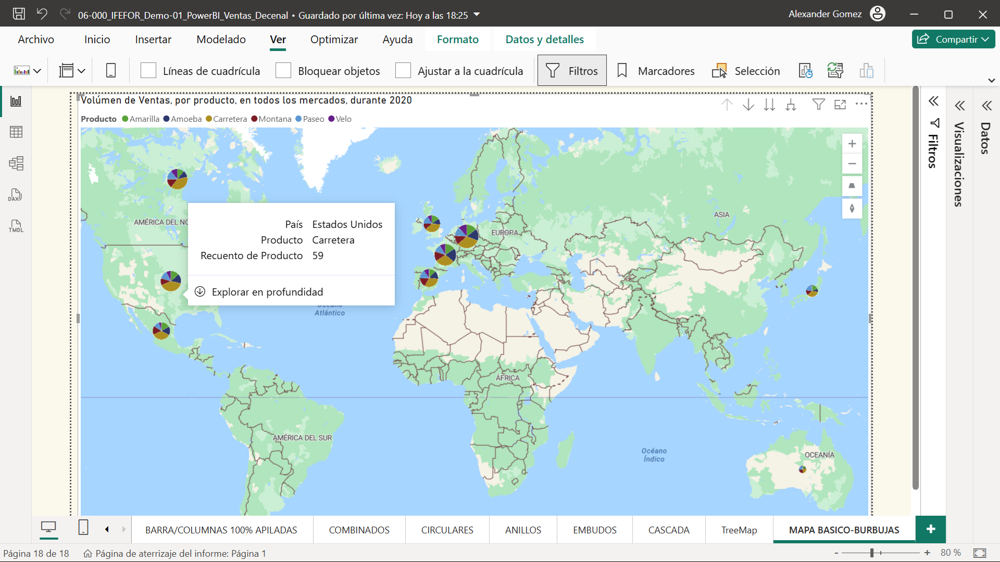
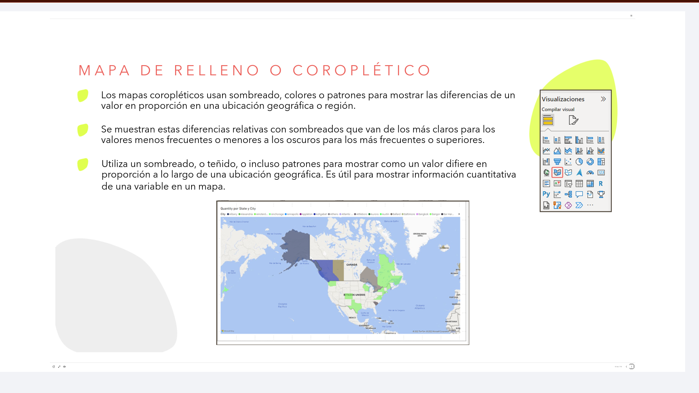
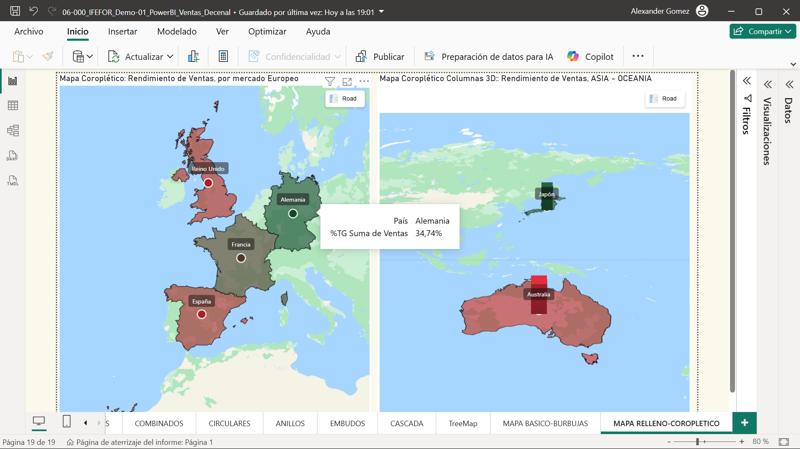
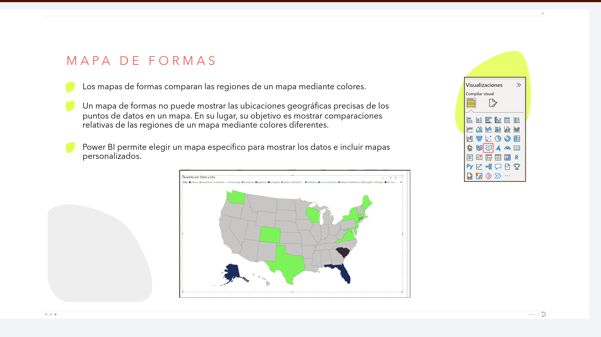

# 06-008: Mapas / Datos Geográficos

**IMPORTANTE**:  
- Microsoft está migrando el uso de Bing Maps, predeterminado para todo tipo de mapas, por Azure Maps, por lo que es posible encontrar restricciones a la hora de migrar a las nuevas opciones.

- También, es posible tener que habilitar las opciones para mapas desde el panel de Admin de PowerBI, '"Elementos visuales de Mapa y Relleno", ya que viene deshabilitado por defecto en Europa:

## Mapas o Gráficos Geográficos

Una forma interesante de que nuestros informes tengan un mayor impacto visual es el uso de mapas, siempre y cuando nuestro modelo de datos contenga datos geográficos o esté enfocado a ellos.

Podemos encontrar distintos tipos de mapas en Power BI:

- **Mapa básico** o de burbujas
- **Mapa de relleno** o coroplético
- **Mapa de formas**
- **Mapa ArcGIS**
- **Mapas Azure**

Veamos los mapas más usados habitualmente...

---

### Mapa Básico o de Burbujas

Un mapa básico se usa para asociar información cuantitativa y de categorías con ubicaciones espaciales.

El servicio `Power BI` y `Power BI Desktop` envían a **Bing** los datos de replicación geográfica necesarios para crear la visualización del mapa. Esto puede incluir los datos de los campos `Ubicación`, `Latitud` y `Longitud` del área de campos del objeto visual.

Utiliza círculos sobre el mapa. Podría usarse para indicar la influencia de una medida, bien por su **tamaño** o por su **color**. Es más preciso cuando se utilizan longitudes y latitudes mostradas en promedio.

---

### Mapa de Relleno o Coroplético

Los mapas coropléticos usan **sombreado, colores o patrones** para mostrar las diferencias de un valor en proporción en una ubicación geográfica o región.

Se muestran estas diferencias relativas con sombreados que van de los más claros (para los valores menos frecuentes o menores) a los oscuros (para los más frecuentes o superiores).

Utiliza un sombreado, o teñido, o incluso patrones, para mostrar cómo un valor difiere en proporción a lo largo de una ubicación geográfica. Es útil para mostrar información cuantitativa de una variable en un mapa.

---

### Mapa de Formas

Los mapas de formas comparan las regiones de un mapa mediante colores.

> Un mapa de formas **no puede mostrar las ubicaciones geográficas precisas** de los puntos de datos en un mapa. En su lugar, su objetivo es mostrar comparaciones relativas de las regiones de un mapa mediante colores diferentes.

Power BI permite elegir un mapa específico para mostrar los datos e incluir mapas personalizados.