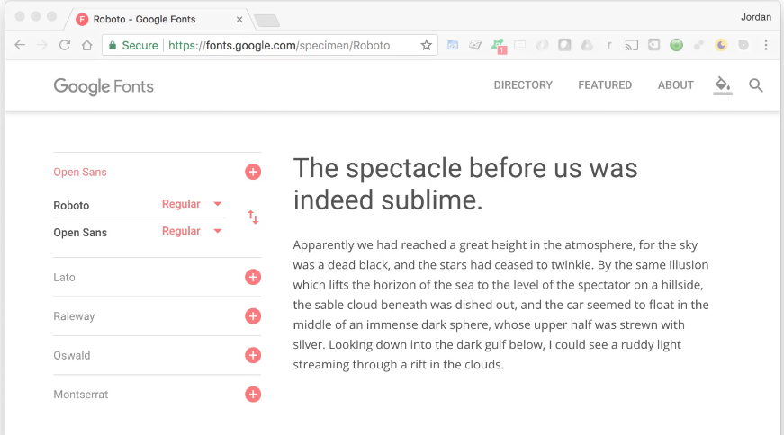

# MODULE 01 - 077: Typographs for software components.

---

**Jordan Hudgens:** I remember on the daily smarty 
project I implemented the full initial design and I had picked out the 
right fonts.   

Everything on the page was exactly where it should be.   

But there were some subtle changes such as I didn't match in the first draft
 the correct weight on some of the fonts and I would look at your design
 and then I'd look back at the screen and the screen was not good.  

 It did not feel professional and even though it had 98% of the design 
matched. So this is something critical it's something I've seen that 
really separates an average design from something that truly looks 
perfect.  

**Jesse Cooke:** Absolutely! This is really fun stuff.   
These are going to be some exciting guides typography is awesome.   

I love  typography and sometimes I hate typography.  

 But good type theory makes a  huge difference and that's why I wanted to start with this thing  specifically.   

Typography can be extremely finicky, you can be one point away from fantastic looking pages or just garbage looking pages.   

The reason why it's not just one isolated piece of text is that type plays 
off of each other so much.   

By different font families or different 
weights or different sizes.   

Everything on that page needs to be talking 
to each other because if one thing doesn't belong if one thing is not 
doing what it's supposed to you know you might make that body text just 
one point bigger and it might not seem like a big deal but now all of a 
sudden all my headers don't properly take control of the situation.   

They've kind of like lost control of the body copy and they're not as 
bold as they need to be.

It just unbalances everything and honestly, if you're not thinking 
about typography you can be looking at a page and you're like I don't 
know what's wrong with it but something's wrong with it.  

 There's a good 
chance it's the typography. It's something I run into with developers 
all the time where they think that close enough is good enough. It's 
not, it's got to be dead on.

If a design is ever delivered to you by a competent designer you need
 to match that pixel-perfect especially the typography.   

If you're missing a weight or if the designer used a font that has a desktop 
license but there is no web version of it, don't just ignore it. 

And  think "*Agh, 700 will work"*.   You've got to make sure that you are matching
 the weight and you might think it's just one-pixel different it's just 
one pixel of thickness, it can make a huge difference.

**JH:** It really can, there's a very interesting story we keep on pointing to Apple because they've been a design leader in the  industry for so long.   

But a lot of people don't realize that one of Steve Jobs's greatest passions was calligraphy. He went to only a few classes in school because he wasn't a huge fan of the university and  calligraphy was one of them and that was one of his big passions.   

And interestingly enough that is one of the first things he said he wanted 
in the operating system was the ability to have different types of 
fonts.

**JC:** When they came out with the Apple Watch they found that Helvetica which they tend to use all the time didn't work well on it because everything was so small and so they made a whole new font San Francisco which they then implemented across everything it's like they're new Helvetica.  

 But it was originally made to satisfy the needs of the watch because it was so small, and even though it's still really close to what they were using.   

There's just a teeny bit more space between the different characters. The wait is just a little bit more balance around each character.  

 But they made an entirely new font just to satisfy a smaller screen size.   

And it was if they had just tried. I guarantee if you hack your watch and just implemented Helvetica  in it then it would not look great.  

**JH:** Absolutely. We talked about the importance of it  what are some steps that you take for being able to pick out the right types of fonts for applications you're designing.

**JC:** Right, so you kind of have to start at understanding some basic typography principles.  

 Understanding the difference between both Serif and Sans Serif fonts.   

Sans Serif is like when fonts have little things poking out from him.  

 And then you're sanding those off right, let's think of it like that. You sand those off
 and you have a font like Roboto

Where every all the characters just stop they just end.  

 Different fonts are going to work better in different instances.   

Now while there's  a lot of rules with typography every rule can be broken with typography  but there are some key things.   

For example, take dailysmarty. When we were designing that, all the headers, labels, things like.   

Those are all  Sans Serif fonts.   

But the body copy, on a large post that's a Serif font because our eyes have a lot easier time reading Serif fonts especially in large paragraphs.  

It's fine when you have a header or something like that.  

That's not to say that you can't have a body that's sometimes Sans Serif, I do it.  

 I also have headers that are Serif fonts.  

**JH:** Devcamp uses Sans Serif fonts for the body.  

**JC:** Yeah.  

**JH:** But Dailysmarty does the Serif and both of them look good just in different ways.  

**JC:** Right. And obviously and when we when did it with Devcamp like I said you can break those rules you can make them work but you have to be aware of it.   

And it's like OK but I've got to make sure that I'm at least using a Sans Serif font that isn't too close  together that you know has really easily identifiable characters so 
that it's still going to be legible.  

**JH:** Absolutely. What are some tools that you use to be able to go through that and to see you know what they look like? like  "what heading looks like versus you know the paragraph and how well they're going to complement each other?"

**JC:** A great place to start is [Google fonts](https://fonts.google.com/).  
 Not only are they really easy to implement and there's a lot of them   
and they're high quality and you don't have to pay for them. What's   
really nice is that they also show nice fonts that pair with each other.  

**JH:** Right.  

**JC:** So you can see how to take Open Sans and how well Open Sans is going to pair with other fonts.   

It might give you some  ideas. Now that's not to say a lot of Websites or a lot of apps will use the same font for everything and you can do that.   

You've got to use your weights accordingly.   

You've got to use your sizes accordingly. 
There's no reason why you can't use the same font for your headers and 
the same font for your body for subheaders or labels or things like that
 but Google fonts is a great place to start and there are lots of 
Websites that'll show nice font pairings but it's really nice because 
Google puts them right next to each other.   

You can implement both of them really quickly. It's a really helpful tool to use.

**JH:** From a development perspective as well Google fonts was very nice because they also give you a download link if you're  wanting to use it internally in your app.  

 And they even give you a CDN option so you can just import it directly and then instantly have access  right in all of your stylesheet so it's a nice all in one big solution.

**JC:** Yeah.

As far as when you start laying out your page, that's something  that's definitely critical. It's all nice when you can see, that fonts supposed to work with that one and then you just go. But there are so many variables between font sizes and weights it can get a little bit unwieldy pretty quickly right.   

So what you want to make sure you're doing is that when you're looking at your page when you're putting this page together with this screen you want to say, OK labels, they need to draw the eye.   

Then I need to pull the reader into some other area. 
Sometimes you might have some metadata like say tags on a post for daily
 smarty.  

**JH:** Right.  

**JC:** Those need to be there, they need to be smaller they don't need to command the situation.  

It's something that the user isn't going to be looking for immediately if it is you need to plan accordingly make them easier to find.   

You are implementing these ideas of what am I wanting the user to be looking at and what does the user want to find?

That's what kind of starts to drive. "*OK, he needs to know where 
these tags are. But I don't want everyone seeing them*".  

So it's taking over a more important thing like the description or whatever.

Maybe what you'll do is make the font smaller but you'll also gray it  out just a little bit. 

Play with that. How's that balance? How's it looking? "OK, those are a little bit too out there".  

So I'm going to make them bolder but I am going to leave them grayed out.   

It's no hard and fast rule because you're going to be designing lots of different 
types of apps.   

But knowing the different variables you have to work with  and knowing that it's important those are the biggest things you could take away from this is that typography is very important so don't just make it an afterthought.   

Really think about it and know that between the  colors of your fonts the thickness is the size and the font families you can really control how prominent or how subtle a font is going to be  on that screen.

**JH:** That's a great point. For your homework I want you to take either an application that you've built before this or just spin up a couple of just plain HTML pages, go to Google fonts or one of these online font tools and bring down different combinations so bring down a font combination for a heading and a paragraph.  

 Experiment with different weights and create a few different pages like this and then 
see how much of a difference it really makes.  

 Explore both Serif and Sans Serif fonts and see how they can complement each other.   

Just so you  can get into that habit of exploring those seeing what weights can do 
when you add that to a page and how you can emphasize different parts.   

And after you've done that then you can move on to the next guide.
