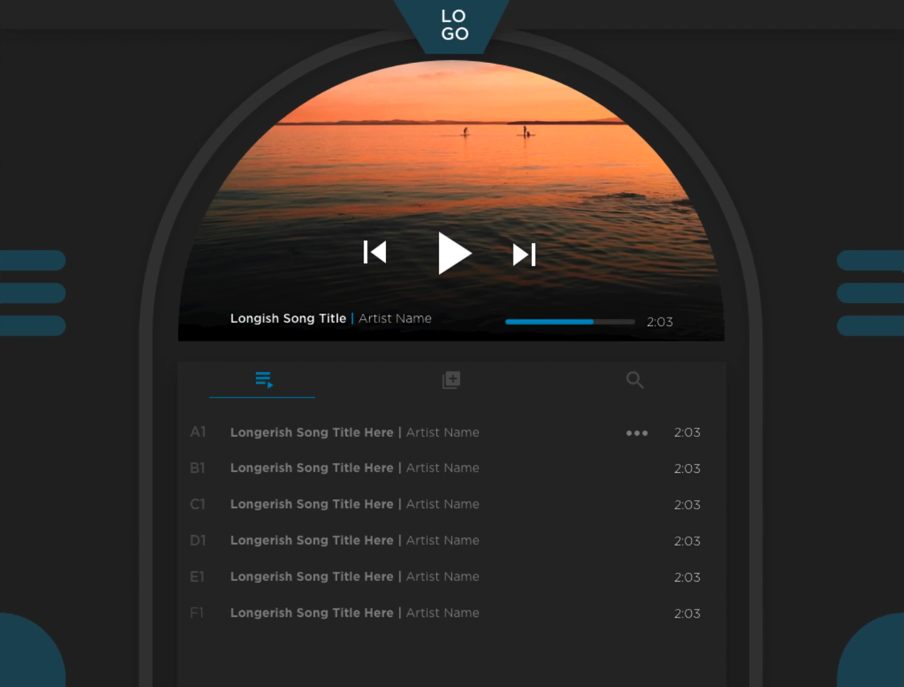

# MODULE 01 - 080: Mobile vs Desktop designing

***

**Jordan Hudgens:** In this first guide what I want to 
talk about is the concepts of planning with desktop versus mobile 
because there are completely different considerations.

**Jesse Cook:** Right, absolutely. This is something that definitely is becoming more and more important, as more things are being built for mobile.   

Almost every software application that we build is almost always required to have a mobile version of it, if not an exact clone.  

 So there's definitely some very important considerations you're going to have when designing for both desktop and mobile, or just  one independently, but definitely the interplay between the two.  

So what's come out of this is the idea of mobile-first design. So  when you hear that, the idea behind it is that you should start with the  most constrained objects.  

 So we should design for mobile first because if we go to a desktop we have all this nice real estate to work with. 

We  put in all these features and we put 10 features on one page which is *no way* is going to work on mobile. We have to completely re-imagine it. 

So if you start with mobile-optimized first it's a lot easier to go from there
 to desktop than to go from desktop to mobile.  

**JH:** Absolutely. And we saw this with the Jukebox design where the designer on that built one of the coolest kinds of things I think I've seen in an application I was building, which was an actual jukebox for the desktop version.  

 It looks like a jukebox.  

But that wouldn't translate directly to mobile and be too difficult to capture those gestures.  

 And so being able to translate that properly is something you always have to take into account.  

**JC:** Yeah absolutely yeah. And on a desktop, it's fine because you almost *want* to take up the space because there's not necessarily a lot of objects on there.   

But on mobile, you're going be giving up a huge percentage of your screen with those kinds of design elements. If you only give yourself this jukebox arch to work inside, it's like "*OK, that's fun, the desktop has this view, but for mobile, we need to just make that a pure square and be able to just see it up at the top*."

**JH:** Absolutely. Now how do you also take into consideration the difference between designing a true mobile app versus just a responsive web application?   

Because with a true mobile app you have access to other key APIs and those kinds of things, wherewith responsive web apps you're really just rearranging different content on the page.

**JC:** Right. Big things that you're dealing with there  are menus: 

* Sometimes on desktop, you're able to nest things inside of different pages...

* ... w here on mobile that might be kind of difficult
- Hover states: you don't have a hover state on a mobile device, right? So you 
  know on a desktop you're like "*oh yeah. Well, we'll show you this 
  metadata*"--say you're doing an e-commerce app and you're wanting to hover
   over products, which flips a card and it shows some more information. 
  Great now let's make that mobile.  

- Now, what do you do? You can't hover with your finger, so it's got to be something completely different. So you need to consider, well, maybe we need to have that metadata show on the desktop and then it'll stack underneath when it goes to mobile.

If I'm designing for desktop and I know that it's just going to be a responsive mobile page, it absolutely affects how I create cards, where I  put data, how much metadata I even put on there. 

 If I have five  different pieces of metadata, I that know when it stacks it's going to 
be really confusing.    

Or it's going to be a situation where you're stacking picture on data on a picture on data. How am I going to make that work?  

That's one of the reasons why mobile-first is so great because if you can make it work on mobile, it can be a lot easier to make it work on desktop.  

**JH:** Absolutely. And it seems like taking that mobile-first kind of approach would also help because your more complex types of gestures are on mobile.   

So being able to differentiate between someone swiping right versus someone scrolling versus someone clicking and pressing.   

There are all kinds of different options you can have.  

 If it's a native mobile application, you even have gestures like shaking the phone to do something.  

 There are all kinds of different things that you have to take into account. Whereas, it's much easier to translate those into something on the desktop because then you have a lower number of items.  

**JC:** Right. And like I was saying earlier, say, on a desktop, drop-down nav works really well, but maybe it's not going to work so well on mobile because the text might be too small.  

 Maybe there are so many things in that dropdown that it's going to drop below your 
scroll, and then you're in a really weird situation.   

So that's why a lot  of mobile applications use a hamburger menu. You're constantly 
thinking, "*How exactly am I going to make this work?*".  

And then there are development considerations, right?   

Like how you structure the menu on desktop and now when you put that into mobile it 
might make page load times higher or there's a lot of different things you're probably thinking about there.  

**JH:** Absolutely. And another thing, not to throw a wrench into all of it, but what about tablets?  

 That's something between desktop and mobile. When you're designing an application, you have the much smaller mobile app with gestures and a very small screen, and then 
you have your desktop version which doesn't have gestures, has a large screen and you can perform all of your main hover actions, but a tablet is a cross between the two.   

You have more space--maybe a little constrained--but then you have those gestures. What type of approach do you take with tablets to optimize for that?  

**JC:** I mean, honestly, you also don't even know how big of a monitor someone is working with on the desktop.   

That used to be our biggest problem. We were just like "*Oh man, we've got all these 
desktop sizes*" and then we had to go and add a bunch of very very small 
and mid-size displays as well, right?   

So that's definitely where you see  a lot of design principles that make it more ubiquitous.   

It doesn't matter what size screen it's going to be on, it's going to adapt accordingly.   

So instead of designing out 10 different desktop sizes, 3 different iPad sizes, 10 different mobile phone sizes, **it's better to just have a methodology**.   

Like, whether you use cards that are going to stack really nicely or dividers, it's about using things that are just going to be able to adapt all the way across that gamut.   

It's more about  finding the principles as opposed to designing out every single screen.  

**JH:** Absolutely.  

For your homework for this guide what I want you to do is to pick out  a number of popular applications, such as Facebook, Twitter, Wall Street Journal, and watch how they change between these different environments.   

Go to the desktop version, see what it looks like there, then try it on your tablet if you have one.  

Then access it on your smartphone and see the way they adjust.   

Look at both their responsive web sites and also the mobile applications themselves, because you'll see **a lot of changes and some very strategic changes** for, not only user interface, but also just for the user experience itself and how they 
access different parts and different features.   

For example, Facebook makes a very big focus on how you can post, and they make it very easy to post when you are on your phone.   

They give you much quicker access to  working with images and your camera because it has it right there.   

Whereas, typically, you don't upload as many images straight from your 
computer so it doesn't get emphasized as much.  

So go through, look at all of those kinds of examples.   

That should also start giving you some inspiration for how you will build the user 
interface for your own desktop and mobile apps.
