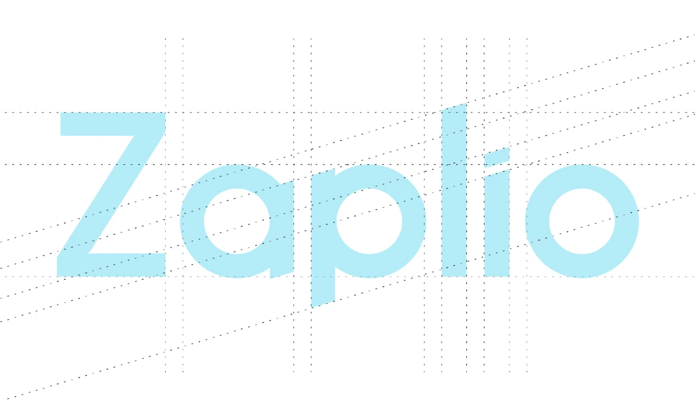
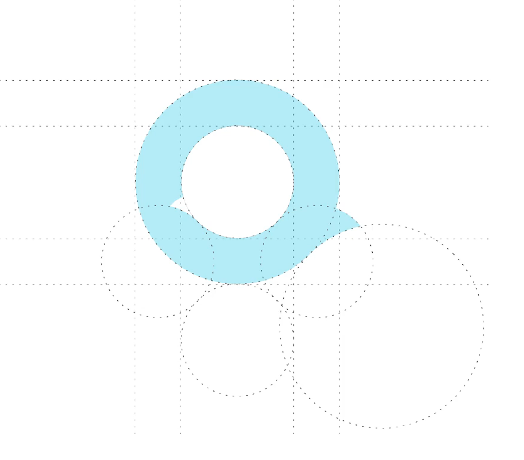
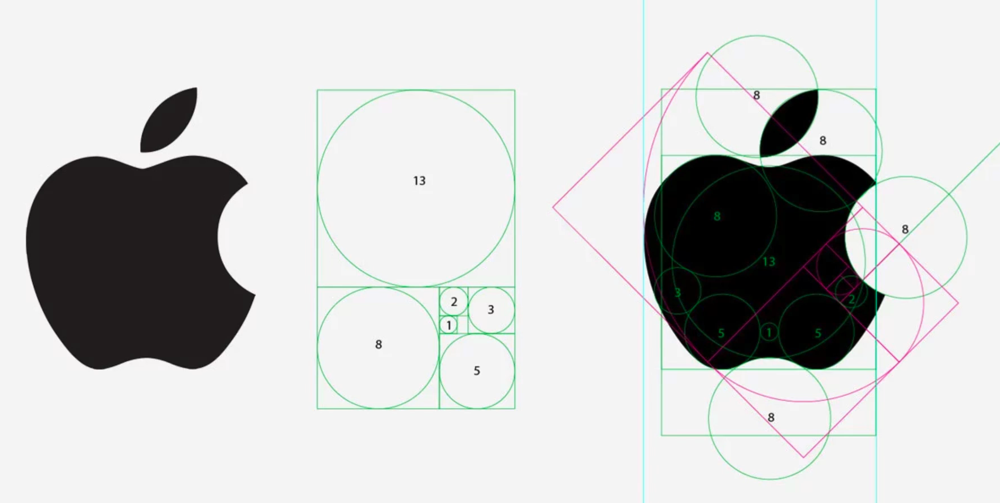

# MODULE 02 - 002:    Logo Design (ii)

***

When it comes to actually designing the logos, how big of a priority do 
you put on tasks such as the size that the logos are going to be.  

**Jordan Hudgens:** So if it goes on a billboard it can be one size or you could have a much larger sized logo with more detail.  

 But then if it also needs to be a smartphone application icon then you can't have very much detail at all or else it looks weird.   

So how do you kind of draw the line on detail?  

[Dialogue comes from previous guide, Part 1]  

**Jesse Cook:** You definitely need to be designing with  the idea that this thing might be put on a blimp one day, or it might be a tiny embroidered emblem.   

And so keeping in mind how easy this is going to be to use across all these different mediums is important.  

What else is important is knowing what it's going to look like in different 
colorways.   

If a critical point of the logo relies on having a dark shade  and a light shade of red and then that person is incapable of embroidering it and embossing it on things because that has to be a single shade, and now it's like, well, you had it as this really cool 
circle that looked like it was going into itself with drop shadow and 
two different shades of red, but now all of a sudden it just looks like a
 circle.   

When it's in black and white, it's just a circle.  

 So thinking about the different colorways that it is going to be used is also 
important.  

I usually design in black and white because I want to make sure that 
it can work inside of that constraint first.   

And I don't like getting very skeuomorphic, I don't like using a lot of gradients, and things like that for those reasons, again, because if you put a skeuomorphic 
logo on a shirt you're going have to do a full-color print.   

You can't just do a single color or a dual color.  

So I like designing in black and white.   

And I also like distinctive logos more. They're easier.   

I don't have to illustrate a coffee cup or anything that, I can do something a little bit simpler.   

The problem is getting it to accurately convey the mood and message and tell a story.   

That is more difficult.  

 So this is the science behind it might be a little bit more difficult, but the actual manual design of it would maybe be a little bit easier.  

A good example of a logo and brand that we recently did was for Zaplio.   

Zaplio is a product where it's using a Twilio number and giving it a text message interface because Twilio by default doesn't have a text message interface.   

We wanted to create something like iMessages using Twilio numbers, which was pretty cool.  

For the logo, we wanted to communicate that interaction.  

 So, a little bit of descriptive, but also where the logo is simple enough that it can
 be pretty distinctive as well.   

And it's important to know that you can have both of those things.   

So this is where you kind of see some of the science behind what goes into a logo.  

If you actually look at the guides that I've set around the logo mark, you can see I've got a Fibonacci sequence of circles that are setting all of my different angles and lines and they're not just arbitrarily placed.   

They all work off of each other.   

I don't do this with every single logo, but when I can make it work it comes out looking
 really good.  

It might seem like a lot of fuss when you could easily just skip that  and still accomplish the same thing, but there are a lot of logos that you probably don't know use this type of grid system.   

Apple, again, for example:  

If you look at the Apple logo with those same grids and the Fibonacci  sequence you can see like, look at the leaf and how one circle indicates one side and the other circle indicates the other side.   

It wasn't just an arbitrary angle that they picked for those curves.  

**JH:** When you originally showed this to me and then also pointed out how this was done with Apple--and also the new Google logo does the same--that made me as happy as anything in a while because all of a sudden, it was like the curtain got pulled away and I understood why my logos have always been really ugly.  

**JC:** Hahaha.  

**JH:** Because I didn't apply any of those kinds of practices!   

And it made a lot more sense because there ***is*** a science behind how our eyes see things.  

 They see things that, even if  they don't know they're looking for them--such as the Fibonacci sequence--we are, as humans very heavy in pattern matching.   

And that's just the way our brains work.   

So when we see things certain types of elements, it's going to make our minds happy.   We're going to see something, we're automatically going to like it, even if we don't know why. And it's because that type of work went into it.  

That's a huge thing I want you to take from this guide specifically.   

You may think, if you were like me, you may have just thought that logo 
design was something that could be done by artists.   

There definitely is an art component to it, you do have to have that creativity and work on it, but there is much more that goes into that.   

There is a science, so there are ways when you look at some of the best logos that have ever been made they do match those kinds of patterns.  

 So if you're like me and you are not naturally great at creating logos, it might just be 
because you haven't dug into the science enough yet.   

That's a personal thing that I'm going to be working on is being able to experiment with 
that and see if I can finally kind of get past that point a little bit.   

So I'm excited about that.   

For homework on this one, I definitely recommend that you look through some of the more popular logos out there.   

See if you can recognize some of these patterns, and then later on in the actual 
project for this entire course, one of the elements that you're going to  be asked to build is your own logo.   

So that is something to look forward to and I will see you in the next guide.  
