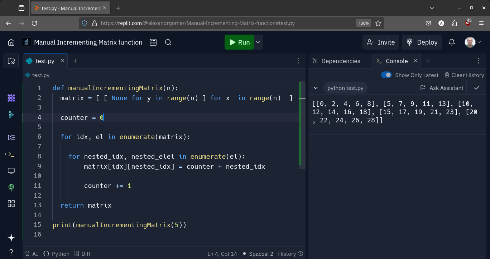
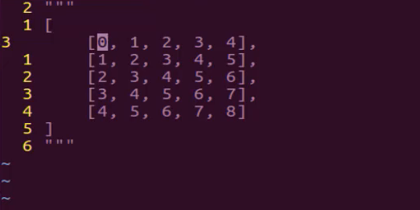
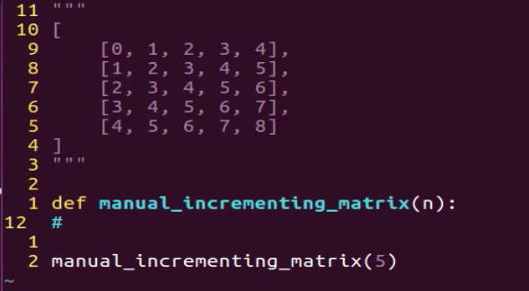
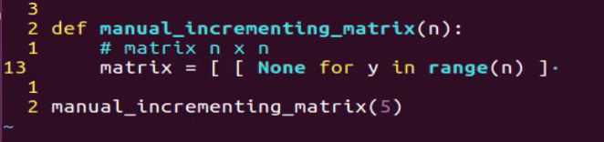
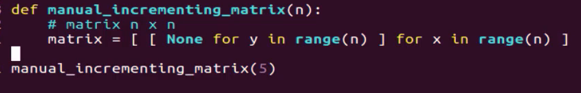
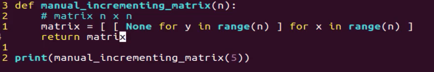
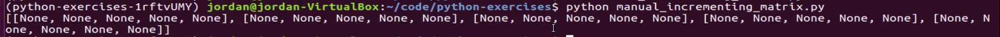
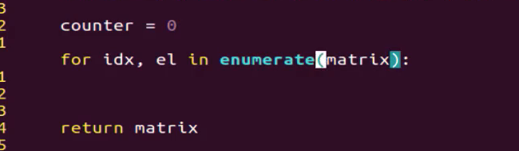
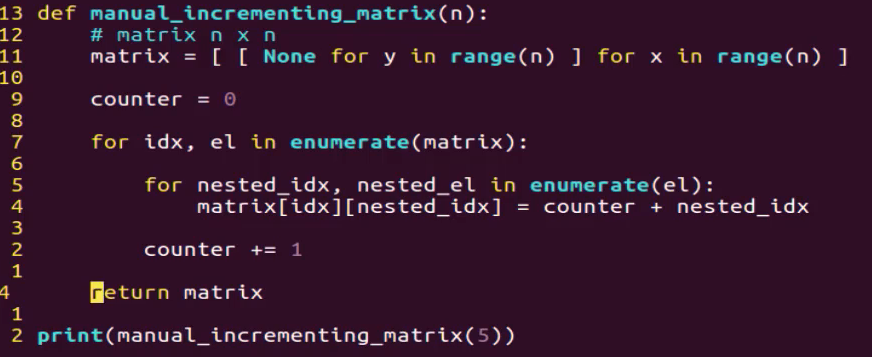
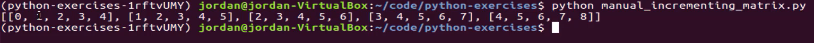

# MODULE 02 - 013:    Python - Incremental Matrix Function

### Objective

Create a function that generates a matrix (list of lists) of any size, with values that auto-increment sequentially.

### Key Steps

1. **Create an empty matrix**
   
   - Use nested list comprehensions to generate a matrix of the desired size, initially filled with `None` values.
     
     ```python
     matrix = [[None for x in range(n)] for y in range(n)]
     ```

2. **Populate the matrix with auto-incrementing values**
   
   - Use nested loops and the `enumerate` function to iterate over the matrix and assign values.  
- The `enumerate` function provides both the index and value of each element, allowing us to track the position and increment values accordingly.
  
  ```python
  counter = 0
  for idx, el in enumerate(matrix):
      for nested_idx, nested_el in enumerate(el):
          matrix[idx][nested_idx] = counter + nested_idx
      counter += 1
  ```
3. **Return the completed matrix**
- After populating the matrix, return it as the result of the function.
  
  ```python
  return matrix
  ```

### Visual representation

Here's a visual representation of the matrix generation process:

```
+---+---+---+---+---+
| 0 | 1 | 2 | 3 | 4 |
+---+---+---+---+---+
| 1 | 2 | 3 | 4 | 5 |
+---+---+---+---+---+
| 2 | 3 | 4 | 5 | 6 |
+---+---+---+---+---+
| 3 | 4 | 5 | 6 | 7 |
+---+---+---+---+---+
| 4 | 5 | 6 | 7 | 8 |
+---+---+---+---+---+
```

- The outer loop iterates over each row of the matrix, while the inner loop iterates over each element within that row.
- The `counter` variable keeps track of the starting value for each row, ensuring that the values increment sequentially across the entire matrix.
- The `nested_idx` variable represents the index of the element within the current row, allowing us to calculate the correct incremented value.

### Code

```python
def manual_incrementing_matrix(n):
    matrix = [[None for x in range(n)] for y in range(n)]

    counter = 0

    for idx, el in enumerate(matrix):
        for nested_idx, nested_el in enumerate(el):
            matrix[idx][nested_idx] = counter + nested_idx

        counter += 1

    return matrix


print(manual_incrementing_matrix(5))
```




***

In this coding exercise, we're going to walk through how we can build a 
matrix manually and we're also going to see how we can build a matrix 
that is prefilled with auto-incrementing values.  

If that sounds a little confusing right here in this comment I have an 
example of what we're looking for our function to be able to do.  



I have a list that contains lists inside of it and this is a 
traditional matrix so I have a list and inside of it there are five list
 items and then inside of each one of those lists are five elements so 
we have here 1 2 3 and 4 starting with the zeroth index and that by 
itself would not be the most challenging thing to do if we were to not 
care about how we are pre-filling this but where it gets tricky is being
 able to auto-fill it and increment it.    

 So we're not simply trying to create values that go from 0 to 4.   

We want the next element to automatically increment.   

So the very first element in the second list is  going to be one and the third one it's going to be two so on and so forth and we also can't hard code so the function that we're going to build out has to be able to perform this if we wanted a matrix that's 5 
by 5 but if we wanted a matrix it was 10 by 10 our system would also 
have to do that as well.   

And so if you're following along and you're   
going through the exercise I want you to pause the video right now and   
then go and attempt to build out a function that will output these exact  
 values and just so you have an idea of what that will look like. 

You should be able to call a function like this where you can name it   
whatever you want.  

 I'm going to be descriptive with my name so I'll say `manual_incrementing_matrix`.  

 And if I pass in the value 5 right here it should output this exact  matrix and so it's going to include the first element that's going to start with the integer 0 and then count all the way up through whatever the last element is and then so on and so forth for each one of these items.   

So if you're following along and you're wanting to actually build  
 this out and work on your skills then pause the video now and work on   
building this out.  

Now I'm going to walk through my own solution for this so I'm going  
to create a function here and I'm going to as you saw and name it     `manual_incrementing_matrix` and I'm going to pass in an argument of `n` so this allows us to be very dynamic with the type of matrix that we're
 going to build.  

 So if I pass in 5 it will give us what we have up here   
in the comment if I pass in 100 it will create this gigantic matrix so   
that is the way that I'm going to define it.  



Now the very first step and let's actually outline in some comments what we want to do.

The very first step is that I want to be able to build a matrix and it's going to start off with empty values so this should have a matrix of `n x n` in size and so that's going to allow me to build essentially what we have just right up here.

Now there are a few ways that you could do this in Python but I really like the syntax 
of being able to use a list comprehension and so what I can do is create a variable here called matrix and then I'm going to use a nested list comprehension.

If you've never used them before or if you've used them in limited types of situations where this is going to allow me to do is to pass in a few different processes inside of here and it's going to build the list for us and in this case, it's going to build a list that 
contains multiple lists inside of it.

So here I'm going to say matrix equals and then go with two brackets and then I want to prefilled this first just with empty values so I'll say none for y in range and then 
I'm going to pass in the range which is going to be `n` so this is going 
to allow us to build a set of empty values and it's going to define 
exactly how many it's going to create for us.

Let's close off that first list comprehension and then we're going to have a second one because as you can see from above we are going for a nested matrix.



I'm going to say now for ` x in range n` because this is going to be the end and then I can close this off.  



If that looks a little bit weird for you let's just take a quick break   
here and let's see exactly what this will give us.  

 I'm going to come right here and let's just print it out and I'm going to save this file.   

Now if I run this and I don't have any kinds of spelling errors or  anything like that we have none.   

And that's my fault because I'm  actually not returning that ends. That's a little mistake.   

So right down  here I need to say return matrix.  

 Now if I save it and run it there we go. That's perfect.  



So as you can see right here what we have is our basic empty matrix it   
starts with a list that wraps the entire system up and then we have one   
element which contains five empty values.   

Then we have another one that  contains five more and so on and so forth.   

And if you see we have `1` `2` `3` `4` and `5`. 

So we've already created our matrix and so that is one part.  



Now we need to go and we actually need to populate it.   

This is going to be a little bit trickier.  

I know that if you're watching and you've never used a list comprehension, you may think that was the tricky part.  

We created this empty matrix and used a list comprehension.  

Where we were able to take this first nested item and said, "Okay, I want you to add the value of `None`," and `Y` was just our block variable.  

He said `for y in range(n)`, which just means, "I want you to loop over this range."  

When we pass `5 n`, that just means, "I want you to loop over from 1 to 5."  

I want you to go through this five times, and then for each time, I want you to assign the value of `None`.  

Then, I want you to do that again for the parent structure.  

That's how we were able to create five elements just like this, or `n` elements, and then go inside and create 5 elements or `n` elements inside each one of those items.  

From there, we created a counter and set it equal to zero because this was kind of the trick we were able to use.  

The counter is the way we can increment our values.  

We used the `enumerate` function or cast the matrix so that we could use this cool little trick where we grab the index and loop over to access the element.  

We created a nested loop inside that, where we also used `enumerate`.  

We said, "Okay, I want to have the index."  

In this case, that nested `IDX` in, say, the third or fourth item here would have been `0` here, then `1` here, then `2`, and it would keep going like that.  

That way, we had access to know what index we were on and also knew the item.  

This would not start off at zero for this item.  

In fact, this one would just give us access and say, "Okay, in that case, that one was `3`, then `4`, then `5`."  

That's how we're able to go in and assign those values.  

We're looping over that, and this is where the assignment happens.  

We say, "Okay, we're grabbing the matrix `IDX` value."  

This is what we're getting `IDX` from.  

I'm looping over, grabbing that index, and then using the double bracket syntax so we have access to the nested index as well.  

All we're doing is taking our counter and adding it to whatever the nested index is.  

That's how we implemented the trick where we increment it with each new item we go through.  

To make sure each new one started with a higher element, or a value greater than the previous one, we handled that right here.  

At the very end, we simply return the matrix, and that is it.  

I hope you enjoyed that.  

That was not an easy function to build.  

If there are elements here that are confusing to you, or you were not sure exactly how it worked, or you couldn't get it working the first time—don't worry.  

That was definitely a more challenging system to build.  

I recommend going through it a few times and becoming familiar with each of the implemented components.  

I think you'll find that these skills will really help as you build your own Python programs.  

If you've worked with this and practiced it for a while, this is actually the easier part.  

Once we get down here, this is where the tricky part comes in.  

The first thing I'm going to do—if you notice the type of behavior we're looking for—is increment the count here.  

We're starting with zero, and there's a little trend that I noticed.  

When I was asked to build this out for a student exercise, I noticed a pattern right away.  

Not just a numerical incrementing pattern, but also that the first element in each of these rows, in each of these lists, is also the index.  

Since this is the first list in our parent list, its first element is `0`.  

The first element of the next list is `1`, and so on.  

If we had a hundred lists, the very last one would be `99`.  

That gives me a hint about how this should be built.  

We're going to need to keep track of a number.  

I'm going to create a counter variable here and start by setting it to zero.  

Let's give ourselves a little more room so we can see what's going on.  

I know I'm going to use a nested `for` loop.  

I can say `for`, and I need to keep track of the index.  

We can do that by saying:  

`for idx` (which is short for index).  

`For index L` (where `L` is short for element).  

You might think we can just say `matrix` and start our loop.  

However, I need to keep track of this index value.  

The way to do that in Python is to first cast this matrix to the `enumerate` function.  

So I am gonna say `in enumerate` just like that.    



What that's going to allow me to do is, normally with a `for` loop, it would say `for L in Matrix`, and that would allow me to have access to this element, then to the second one, and so on.  

However, I don’t want just the element.  

I also want to know what index I'm on because, remember, that is how I know what to start our system off with.  

That is very important.  

I come down here and start a second loop.  

There's going to be a nested loop, and I'll say `for`, and this is also going to use `enumerate`:  

`for nested_idx, nested_el in enumerate(el)`.  

That simply means that, because we have this nested loop inside this nested set of lists, the first time I jump into the matrix, I’m grabbing the first element.  

Now, we need to iterate through the nested elements.  

In this case, `nested_idx` is going to refer to this zero the first time it goes through, and the nested element is going to be the actual value.  

That keeps track of our index and the value.  

I say `nested_el in enumerate(el)`, and this is not actually in the matrix—I almost made a mistake there.  

We are looping over the element itself.  

Instead of just going through and saying, "Okay, I'm going to throw the first one, then the second one," now we're going to go through `0, 1, 2, 3`, iterating through each one of those.  

Now that we have that, we need to assign the value.  

I'm going to take the matrix and then grab the index.  

This is the tricky part.  

If you tried to go through this yourself and couldn't get it working, what I've seen is that this is the most confusing part.  

This is where you actually need to dive into multiple sets of these collections.  

It's not enough to just say `matrix` and then grab the index.  

What that's going to do is grab the first item, but it’s going to grab the entire first item.  

We also need to grab the index of the nested items, so I’m going to say `nested_idx`.  

Now, we can assign the counter, which starts at zero, and then we're going to add `nested_idx` on top of that.  

From there, we need to make sure to break out of this `for` loop.  

Then I can say `counter` increment by `1`.  

At the very end, it is going to just return that matrix value.  



So let's save this and see if it's working and I believe I have 
everything there that's needed. So as a python manual incrementing 
matrix. And that is working perfectly as you can see we have 5 elements 0
 1 2 3 and 4 and the first one 1 2 3 4 and the second one and it goes 
all the way through.



This perfectly matches up with what we had up here in the comments so
 we've effectively built out a full functioning matrix and we did it all
 without numpy or any tools like that.   

.If I change this to ten come and run it again you can see that it does the exact same thing.  

 Gives us a matrix that contains 10 elements and then each one of those items inside
 has 10 elements as well and it all auto increments.   

Now let's just kind of take one last review in case any of that was confusing.  

So the very first thing we did was we created a function and the 
function takes in how many items that you want the matrix to be.  

So it will generate a set of items.   

Then each one of those nested lists will contain the same number of items and that's doing exactly what we're asked to do right up here.   

The first step we took was to generate an empty matrix and the reason why I went with that approach was because it was a lot easier to have a working data structure and to be able to simply iterate over it and then slide the values in that we needed.   

And so here we created this empty matrix and we used a list comprehension.  

Where we were able to take this first nested item and we said okay I want you to add the value of none for and Y was just our block variable.  

And so he said for y in range n which just means I want you to loop over this range.  

And so when we pass 5 n that just means I want you to loop over from 1 to 5.  

I want you to go through this five times and then for each time I want you to assign the value of none and then I want you to go and do that again for the parent structure and that's how we were able to create five elements just like this or n elements and then go inside and create 5 elements or n elements inside each one of those items.  

From there we created a counter set it equal to zero because this was kind of the trick we were able to use because the counter is the way we are able to increment our values.  

So from there we use the enumerate function or we cast the matrix so that we could use this cool little trick where we can grab the index and we could loop over and have access to the element.  

From there we created a nested loop inside of that where we also used enumerate.  

We said okay I want to have the index so in this case that that nested IDX in say third or fourth item here this would have been 0 here and then it would be one here and then 2 and it would keep on going like that.  

So we had access to know what index we were on and then we also knew the item.  

So this would not start off at zero for this item, in fact, this one would just give us access and say okay that in that case that one was 3 then that one is 4 then that is 5.  

That's how we're able to go in and then assign those so we're looping over that and then this is where the assignment happens so we say okay we're grabbing the matrix the IDX value.  

This is what we're getting IDX from.  

So I'm looping over grabbing that index and then we're using the double bracket syntax so we have access to the nested index as well.  

And then all we're doing is we're taking our counter and then we're adding to whatever the nested index is and that's how we were able to implement that trick where we were able to increment it with each new item that we were going through.  

Then in order to make sure that each new one started with one higher element or an element that had a value greater than one then we were able to do that right here.  

So at the very end, we simply return the matrix and that is it.  

So I hope that you enjoyed that.  

That was not an easy function to build out.  

So if there are some elements here there are confusing to you or you were not sure exactly how it worked or you weren't able to get it working the first time.  

Don't worry.  

That was definitely a more challenging system to build out.  

So I recommend going through it a few times becoming familiar with each one of the components that was implemented and I think that you'll find that these are some skills that are really going to help you as you're building out your own Python programs.  
