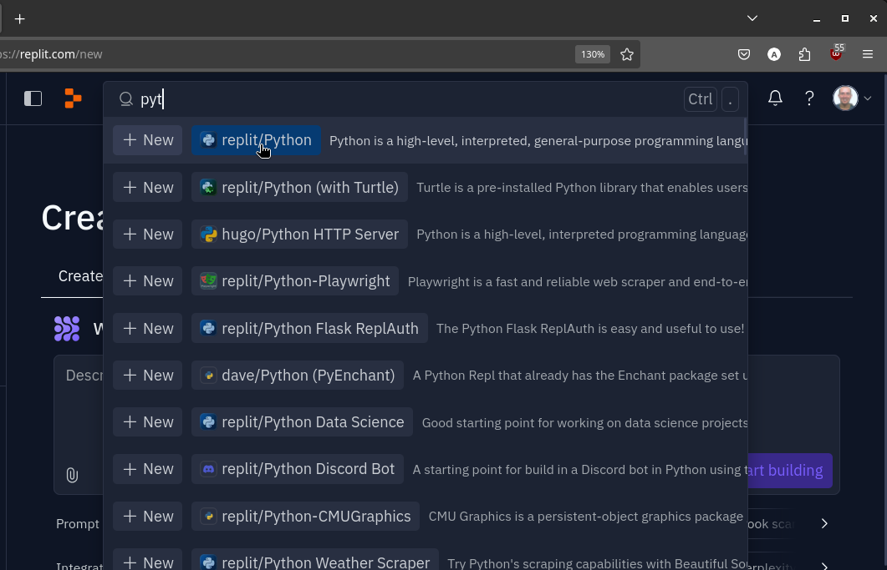
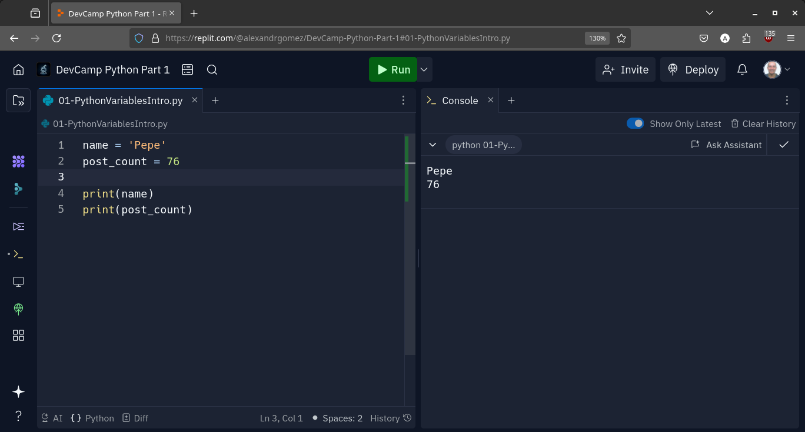
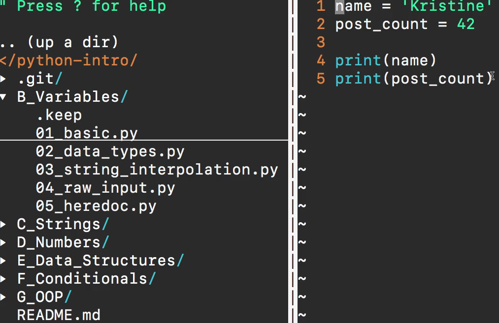
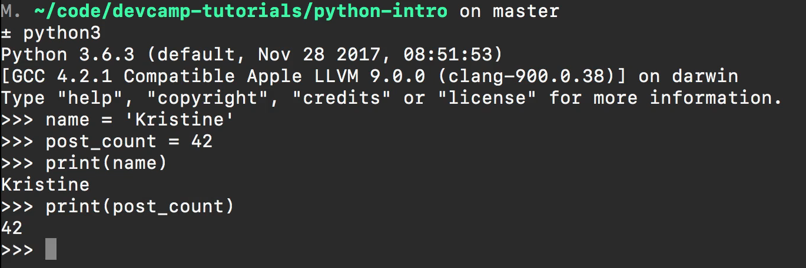

# MODULE 02 - 015:    Python - Variables

Python is not a strong type language. Although it can be as an advantage, the weak type languages may introduce a lot of errors if one data type is parsed to another data type due to function malfunctions. Be careful with this.

Python can be coded&interpreted in many different ways:

* The Ide setup of your choices.

* Using terminal tools (vim, vi, nano, ...) and the python binary interpreter.

* Using online IDE environmets as Repl.

Use what you feel more comfortable with.

***

In this guide, we're going to walk through how we can utilize variables 
inside a python.   

Now if you're brand new to Python and even brand new to programming then the concept of variables may be a little bit foreign.  

In this guide, two different types of variables and four different ways to run this program will be demonstrated (which will not be showcased in  every guide).   

For example, [Rep.it](https://repl.it/) is utilized for the more basic programs and provides the ability to see the code and its effect side-by-side.  

If you've already gone through the system configuration guide, go to [repl.it](https://repl.it/) to sign in (I'm using my GitHub login) or create a new Repl, then select Python 3.  



If it's not appearing in the popular section (the auto fill), you could start typing in "Python 3" and select it that way.  

Now, creating a `variable` in Python is simple. 

It contains three components: 

1. The name of your variable

2. the "=" sign

3. What the variable should store. 

For example, I've made a variable titled "name", the equal sign, followed by "Kristine"

```python
name = 'Kristine'
```

A variable at its highest level is a programming construct that allows you and your program to store different types of data.  

 Here, our variable called "name" is set equal to what's called a "string" (in this
 case, it's "Kristine"). This could also be a full sentence or paragraph, but this will be expanded upon in an entire section dedicated to the string data type.  

However, for this section, the focus is `variables`.   

`name` is a variable that holds a very specific type of value.  

Now, let's add another.   

For example, imagine you're building a social media site, and you want to see how many posts each user has.   

We can enter `post_count` then, set the sequel to a numerical value like so:   

`post_count = 42`  

Both of these, name and post count, are Python variables that are both valid and will run as expected.   

Because Python uses a `type system`, other languages such as Java, C, or C++, may look very different.

Even though these variables are being instantiated the same way as creating variables name and post count, these are storing different kinds of values.   

If you're coming from, say Java, we would have to state that this post count is going to store a integer value so the computer and programming language are warned ahead of time.  

 Same with the string value within Java, C, or C++, we need to state "name", say 
it's a string, then set it equal to its value.

**Since Python is dynamic**, you don't have to include this kind of type checking.   

Both the name and post count variables can be coded with straightforward simplicity.   

Now, in order to print these out we will utilize the print command, pass in name, and then do another print command that says post count.

```python
print(name)
print(post_count)
```

This will save automatically. If I hit "run", you can see on the right that each variable and its print has ran properly.



At a high level, a variable is a container; giving you the ability to store elements to reuse later on.  

This is how you build a variable base program inside of Python and use a [repl.it](https://repl.it/) type of development environment.   

But if you prefer one of the other development environments such as using the terminal, I will demonstrate those here as well.   

Inside of a directory called Python Intro, I have a file called `01_basic.py`.   

You can see it's an identical program.   

In Vim, **do not become distracted of the dotted lines, tildas, etc.** Details of this will be shown later on.  



All that truly matters is that we have the exact same program that we had in [repl.it](https://repl.it/).   

One of the most important characteristics of **Python** is that it **can be run a number of different ways**.  

By opening Python 3, I can look up my variables.   

To open up your terminal with the same output as on [repl.it](https://repl.it/), type "Python 3" (or the analogue command for your setup) and follow the path to the Python file.

```bash
python3 B_Variables/01_basic.py
Kristine
42
```

The third way to doing this would be to use a text editor such as sublime text, one of the most popular of its kind (editors such as Adam are similar).   

The file is located on the desktop, but make sure you have  the correct file name.  

 This is called High Python, so on the desktop I'm going to say hi python.py 

```bash
python3 ~/Desktop/hipython.py
```

If I return, you can see the output is the same.

One more example includes opening a repl here on in the terminal 
itself. Here, I am able to say name is equal to Kristine and post count 
is equal to 42. I will also receive the identical output if I say print 
name and print post count.

One more example includes opening a repl here on in the terminal itself.  

 Here, I am able to say name is equal to Kristine and post count is equal to 42.  

I will also receive the identical output if I say print name and print post count.



Since we didn't really go through a real program when we discussed each type of development environment, I will demonstrate a side by side  comparison while going through the variable guide.  

 It is important to use the development environment that you are most comfortable with because you're going to be able to run the programs exactly the same way
 with each.   

As long as you have access to the programming language and have a way of running that code then you will be successful.

A recommendation I usually give to students is to have your development environment match your experience level.   .

For example, if you're incredibly experienced in setting up development environments and are simply adding Python as a new programming language to your skillset, then you may want to use a tool like Vim.  

 This is a fully integrated environment with access to all of the different files and is 
my personal choice.

If you do not want to set anything up, then I recommend using a tool like [repl.it](https://repl.it/).

 This is for simply understanding the basic concepts behind how to build Python programs. As you become more comfortable, you can adjust and build your local development environment to start constructing the programs out there.
