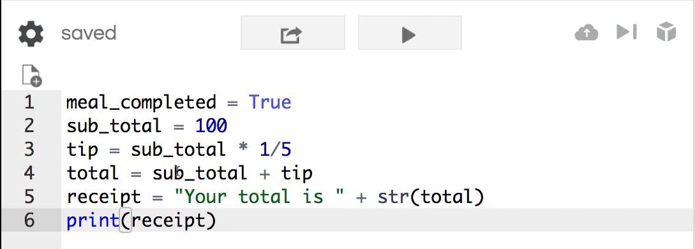
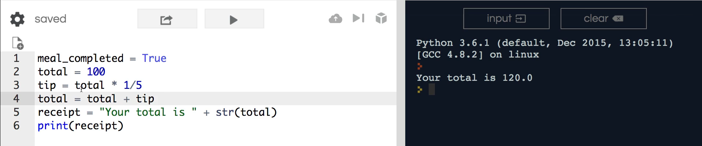
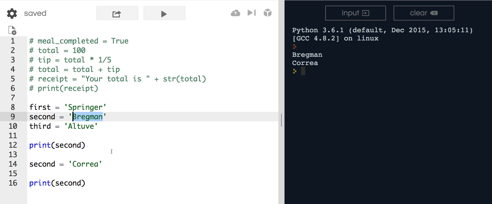
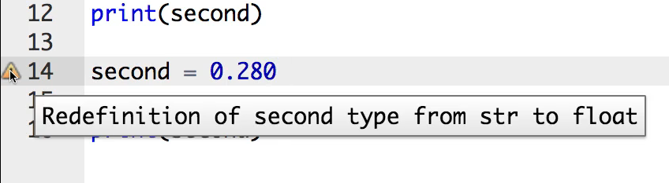

# MODULE 02 - 018: Python - Refactoring Variables

***

In this guide we're going to walk through how we can change variable 
values.   

Up until this point in the section we've seen how we can set variable values but now we're going to see how we can actually change those.  



In this guide, we are going to refactor the sample tip calculator that we used in the previous guide to use a single variable for the total.   

Instead of having the subtotal preceding, we will begin with the total.   

In each one of the subtotal placements, I will replace it with the total variables.   

This will start with the total equaling 100, then have it multiplied by 20 percent, and lastly, set the total to equal the previous total plus the tip.   

We will print this and then run it to see the total still at 120.



The main location of this switching was line 4 where the total was originally set to 100.   

Now, we are resetting it to the total with the addition of the tip.  

 Let's continue onto another example to solidify this concept in a different avenue.

Start by creating a set of names that could be utilized in a scoreboard application.

These variables will be set in order of baseball players.   

First up, Springer, next is Bregman, and third is Altuve.  

```python
first = 'Springer'
second = 'Bregman'
third = 'Altuve'
```

Everything here is standard, however, if Bregman needed to be replaced by a different player, we could search for “second”.   

After doing so, the second value can be replaced with any value including Correa. Now, if I print each one of these out, you will see both before and after the swap.  



This element of switching out values and overriding preexisting values is extremely important in Python development.   

Now, I'm going to show you a few elements that are bad practice and will lead to bugs if not avoided.

Because of the dynamically typed nature of the Python language, I could swap “second” with his batting average instead. If I want to run this, it will run, but you may receive the warning below:  



( *Depending on what tool you're using to write your Python code you may or may not get this warning.* )

But the warning states is that we've redefined the second type from a  string into a float.   

In a real-world application, you could have called a method on second by making sure the format is correctly set up with a  capital letter in the first name, etc.   

Had you done this and accidentally set it as a float (the batting average), your program would  run into an error because the expected type is not what has been received.

This is possible, however, it is considered poor practice.  

 When overwriting a value, keep the same variable data type. If not, your program is most likely going to run into a bug at some point.  

Next, is changing a value with the value of another variable. For example, 

we want to put the value of Altuve where Springer is.   

If I insert print first, instead of second, into the print command then set first equal to
 third, swapping out the values. Lastly, set print to first as well.  

```python
first = 'Springer'
second = 'Bregman'
third = 'Altuve'

print(first)

first = third

print(first)
```

If I run this, it prints out Springer first, then Altuve.  

Here, we have the ability to override the values dynamically.  

 Instead of hardcoding, we can simply pass in a variable by setting it equal to 
the variable value.  

That is how you can change, in multiple ways, the variable values inside of Python.
