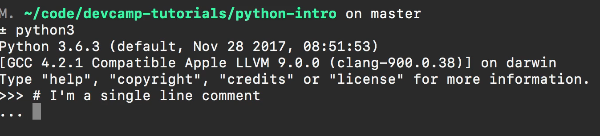
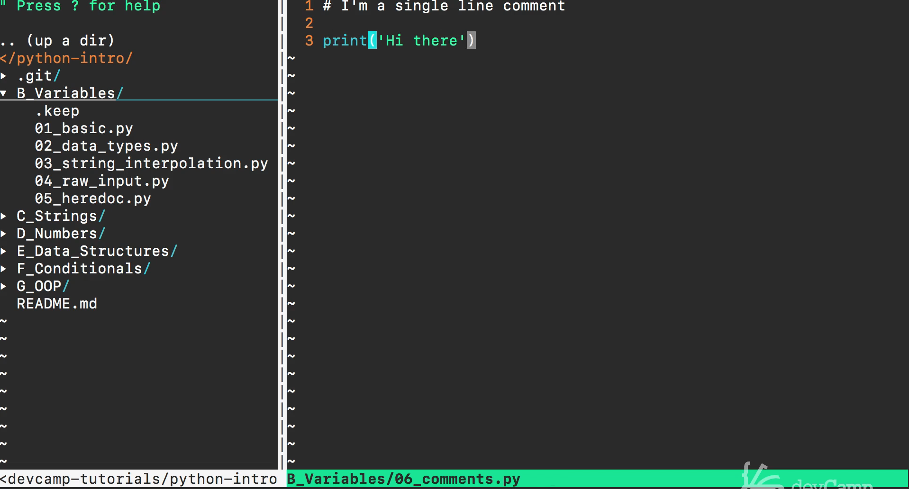
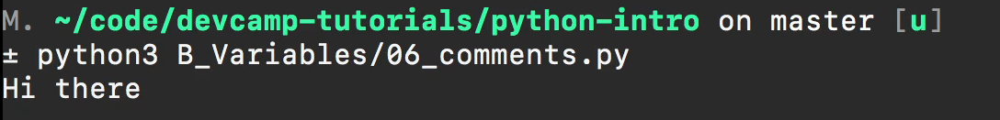
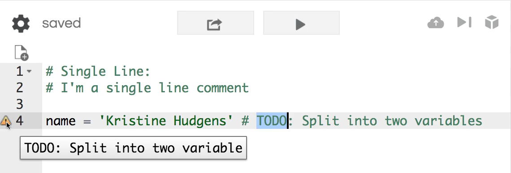
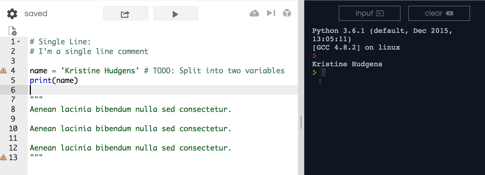
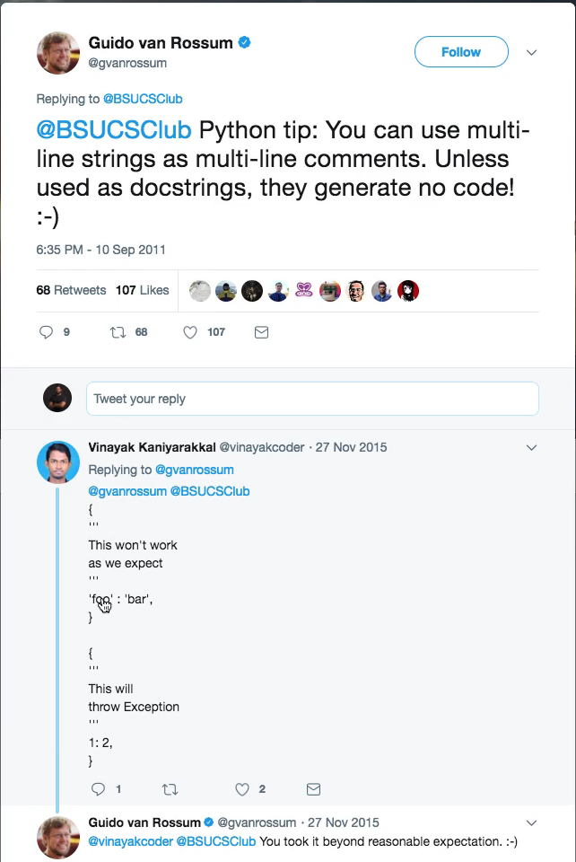

# MODULE 02 - 019: Python - Adding Comments ways

*** 

In some of the previous guides, you may have noticed how I had comments 
that were listed inside of the code file.   

And so in this guide, I wanted to dedicate an entire lesson to walk through the **three popular ways of adding comments** into a python program.

1. Single line comments.

2. Inline comments

3. Multiline comments.

Before doing so, let’s discuss comments—a way to add additional context and documentation into your programs.   

Many brand-new students assume comments are needed in every part of their application, but this is not true. I  

f you look through the most popular codebases or programming languages out there, you will discover that only the important components of a program are commented on.   

Also, there are many developers and computer scientists who believe that programs should have limited comments and that comments are to fix the mistake of an 
allusive variable name.  

Details will be brought when you understand how to call functions and  classes to know when it is best to add comments or not.   

However, comments will be mentioned throughout both this course and the advanced 
course where there will be an entire section dedicated to adding a professional set of comments.   

This will improve your program's ability to be self-documenting.

This is going to be a base for you to add your own comments and experience the different variations.   

### Single-line comments

First, we will use single-line comments by stating “single-line comment” and then giving one more line.

 This is specific to using [repl.it](https://repl.it/), if you fail to give a new line and instead hit return, you are going to receive an error.   

This is not a Python error, but rather an issue with [repl.it](https://repl.it/).  

 The error message states “unexpected EOF” which stands for End Of File while parsing because there is no need for a program that has a single line comment and no code.

If you add a new line, it will work.   

If I hit enter, you can see that no code is processed.  

With comments, you shouldn't have any code that gets run. I'm also going to open the Repl environment in our terminal and say Python 3, so you can see the way single-line comments work.   

If I  hit run, three little dots should open up.

You could add other lines or just hit return again.   

Now, you're back at the Repl where you can say “two plus two is four”.   

If you’re using this in a code file, you don’t have to worry about matching the syntaxes to the text editor.   

Here, I can say 6 comments and present “hi there” underneath.  

 By doing so, it will only print “hi there”.   

The comments will be ignored. You can also test this by printing it in Python 3. 

## In-line comments

Now, another way to comment is by using an inline comment.   

Although this is multiple lines, it is also considered a single line comment.  

Performing true multiline comments is more of the standard convention for Python developers and will be shown later.  

For example, we have a name variable, "*Kristine Hudgens*", where I can put a hash mark to split it into two variables.   

This is a widespread practice, and whenever I’m building out a program, I use omething like this for the current implementation.  

 If it will need to be expanded upon  or fixed later, I will add a to-do.   

Depending on the editor, it may even suggest you split the variable with a “help” button.  

This does not state there is an issue, but rather serves as a reminder for when you use the syntax “to do” in all capital letters.   

This, universal symbol for “not done yet”, is across all programming languages and all frameworks.   

It is also good to keep in mind when it appears while you are working on your own programs.  

So far, we have single line and inline comments. 

## Multiline comments

Next, is a multiline  comment, which may look strange if it is unfamiliar to you.  

Here, are a few sentences with *“lorem ipsum”*.  

 We designate a multiline comment, like this one, is by using double quotes—3 above and 3 below.  

 Now, there are no errors. If you run this and print it out, it should work properly.  

Our comments are being ignored, which they should.   

***

These comments, single line, multiline, and inline, are only reference points for documentation within programs.

***

## Triple """ quotation fact

Next, we will discuss a bit of Python controversy and how it deals with multiline strings and multiline comments.

Here, I have the Twitter page for `Guido van Rossum`, the creator of the Python programming language.   

Back in 2011, he said that multiline strings can be used as multiline comments with the triple quotation marks, such as in the previous image.  

There was a lot of controversy for several years because many claimed  that hash marks are the only way to add comments.   

However, I tend to side with the person who created the programming language since he should know more about it than the average person.   

I bring this up simply to state that there are a handful of potential ways to type a 
comment—some of which can throw a bug in the program.  

 Most that do so are not practical, such as the one below from 2015.

Depending on who you're working on your Python code with, someone may code comments differently than you.   

For example, they may say that you should include a hash mark before multiline comments instead of the framing sets of quotation marks, so the syntax matches other languages, such as Ruby.

However, in all my years of industry, this standard is yet to change.  

 When you go through the advanced Python course, you’ll see how multiline comments can be automatically converted into documentation.   

In this course, we have explored a holistic view of all three variations, so you can shift perspectives within this programming dispute.

