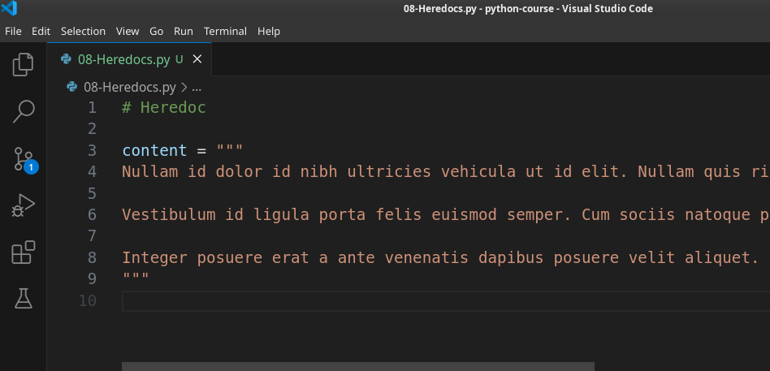
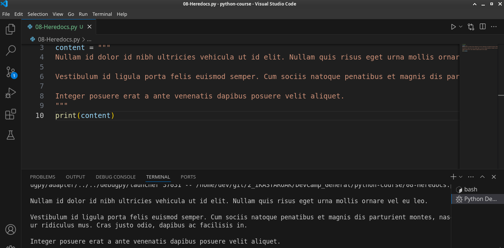
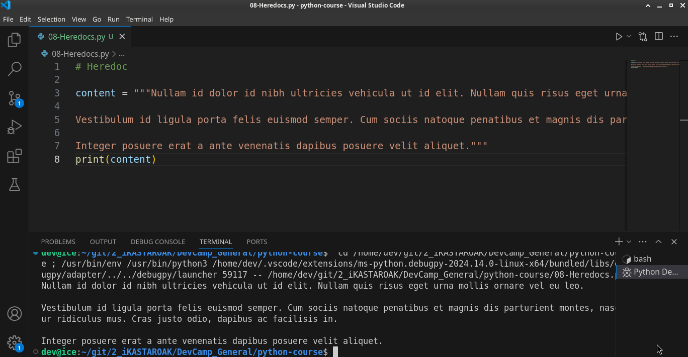
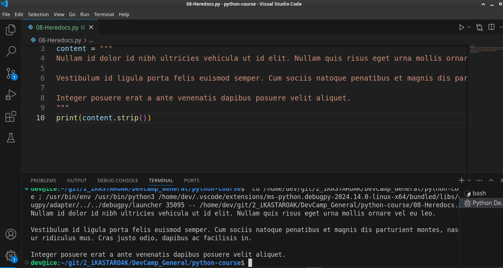

# Module 02 - 026: Python Heredocs

***

So far in this section about string's we've focused on strings such as words and single line sentences.  

 However, there are also times when you're going to have to work with multi-line strings and that's what we're going to discuss in this guide and multi-line strings in 
programming typically are called `Heredocs` and just so you can see exactly how that's spelled and how you'd use it.   

It's usually called a Heredoc every language is a little bit different but if you call a 
multi-line String a hear talk.  

 Most other developers are going to know what you're saying.   

So it's one of the most common terms for that.

***

Now let's see what we can do in order to build a heredoc and we can start by taking a standard approach so let's try to treat this like a regular variable.   

So I have three little paragraphs here:

```python
Nullam id dolor id nibh ultricies vehicula ut id elit. Nullam quis risus eget urna mollis ornare vel eu leo.

Vestibulum id ligula porta felis euismod semper. Cum sociis natoque penatibus et magnis dis parturient montes, nascetur ridiculus mus. Cras justo odio, dapibus ac facilisis in.

Integer posuere erat a ante venenatis dapibus posuere velit aliquet.
```

And they are on different lines.  

And so if I say a content, and then I try to wrap this entire set of paragraphs in double-quotes let's see what happens.   

Well, we can't even run it because we have an error:


The error says EOL (which stands for End of line.) while scanning string literal.  

What that means is the parser for Python went through this line it saw content it saw the equals sign then it saw the quotes.   

And so it said this is going to be a string. It continued on until right here where it found that the string ended with a period and not quotes and a new line began.  

But with how the parser works that throws an error.  

So what occurred is the parser came to this and it expected to find the end of a string 
so it expected to find an end of quote, but instead it just found a new line and so that's a reason why we have this error and so we need to be able to build our heredoc with a little bit different syntax.   

If you remember back to our section on comments it's actually a similar structure to building multi-line strings and multi-line comments.   

So if I come right here and add two more quotes and these can be single or double remember that Python treats them exactly the same.   

So if I did that would be the same thing.   

I personally for my own heredoc's I like using three double quotes just because I like keeping my structure exactly the same and then I can also put this on a new line and if I come down here at the very end I'm going to put this on a new line as well.



Now you may notice that our error went away and if I grab content and come down here I can say print content.   

And now if I run this everything works.



**This is the correct way to build a heredoc in Python.**

Now even though this worked, there still are a few potential issues.   

It's not that it's a problem or that we even did it wrong but there are simply issues that you may want to watch out for.  

 Because of the way heredocs work what a heredoc essentially is it's a multi-line string 
that counts all of the new line characters.

If you come here to our output you may notice and it's a little bit harder to see but we have a carriage return here at the top so we actually have a new line at the very top and we have one at the very bottom so there's a few ways to fix that.   

If I come up here I can bring this all the way up to the top and then right here I can bring this all the way up so it's butting up against the content and if I hit return.   

Now you can see that those new lines are gone.



Now that works but I don't really like the syntax.   

I think that this looks kind of messy.   

## .strip()

I like the way that it looked before. And so let's get this back to how it was and I'll show you a different way by leveraging a function called strip.  

 So what I can do with the strip function is at the very end of the string I can say `.strip` and because this is a function call.  Remember we always put parens at the end of a function call.   

And now if I clear this and run it again you may notice we get the exact same output.



So it has taken out the newline characters from the beginning and the end and that is what the s**trip function does it's a very helpful little function for pulling out any excess newline characters inside of a multi-line string** like this and it makes it just a really **nice way of cleaning up** not just this type of content because you may be wondering and thinking that this looks kind of pointless to clean up this content.  

### .strip() use case:

 However, imagine that this is a web application and you're pulling in content for say a blog post description and **you want to clean out the beginning and ending characters**.   

This is a great way of performing a task like that.

## Summary

In review what we've discussed in this guide is:

* How to build a heredoc in Python. 

* The reasons why a regular string literal will not work for multiline strings.

* Then also how to clean up the beginning and ending characters by leveraging the strip function.

# Resource

[Built-in Types &#8212; Python 3.13.2 documentation](https://docs.python.org/3/library/stdtypes.html?highlight=strip#str.strip)

>   Return a copy of the string with the leading and trailing characters 
> removed. The chars argument is a string > specifying > the set of 
> characters to be removed. If omitted or None, the chars argument 
> defaults to removing >whitespace. The chars argument is not a prefix 
> or suffix; rather, all combinations of its values are stripped:
