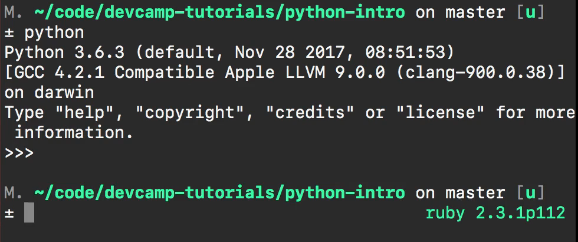
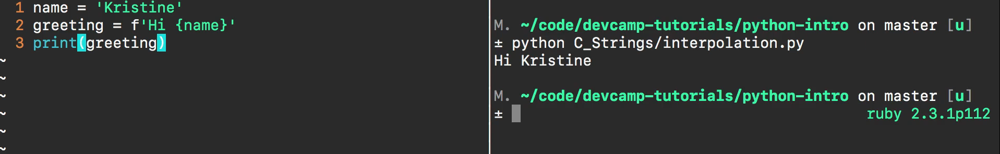
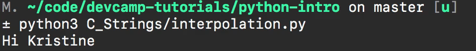
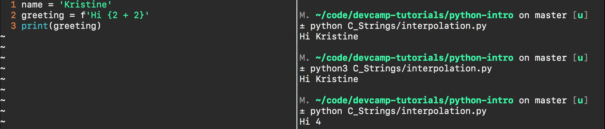
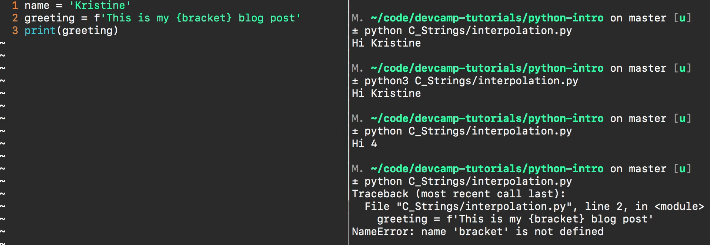
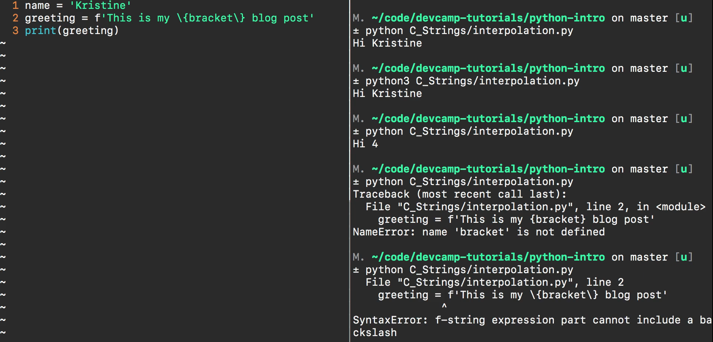
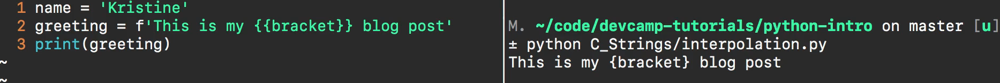

# MODULE 02 - 029: String interpolation in Python <=3

***

I'm very excited about the next few guides because these next few guides 
are going to go over string interpolation in Python.   

Now string interpolation is very big if you've never heard of it, it's a very scary
 word but it has a pretty basic goal and that is to give you the ability** to run python code inside of strings**.


The reason why I'm so excited about these guides is because I think you're going to see a very practical pathway for this feature and how it can be used in real-world applications because it's pretty rare that the applications you're going to build are going to be static which means it's going to be rare that you're simply going to have hardcoded strings in your applications that don't change.   

Instead, you may have some string contacts so you may have some elements that are hard coded and then you have other elements that are going to be dynamic they're going to change based on the user behavior and that's what string interpolation allows us to do.

***

#### Interpreter preambles

Now I am using vim and the terminal in this guide and there are a few reasons for that.   

One I want to illustrate that you can run this type of code in any kind of environment that can run Python 3 code you can still run all of these scripts inside of [repl.it](https://repl.it/).  


 You could do this simply in the regular Repl environment right in the terminal.  

 You could create the scripts inside of atom or sublime text and then run them on the terminal.

There are all kinds of ways that you can do that and I want to show you a number of them so that no matter what your development environment looks like you're going to be comfortable following along. 

Now one other reason is because what we're going to be discussing is very modern.   

So at the time of recording this, the way I'm going to implement string interpolation doesn't even work properly on some types of environments.  

 It'll still run, as long as it can run python 3.6 code or above it's going to work, but some of the environments such as [repl.it](https://repl.it/) give little warnings, and the warnings are not  because you're writing the code wrong, it's simply because they haven't updated their system and so it might get a warning, they'll still run because it's valid Python 3.6 code but because it's so modern not all of the tooling that is out there is up to date, and so that's one of the other reasons I want to show you it right here.

Lastly, another reason is because I get a number of questions from students that ask me how I like to work and so this is the identical environment that I build when I'm developing for my own projects.   

I like using tools like vim and having the terminal open right there so I can test all my code out. And this is the interface I personally like.   

It doesn't mean you have to copy it.  

 You should find what works best for you and go with that.  

 This is what my personal preference is. So with all of that being said now let's get into actually writing our first string interpolation code.

String interpolation at a very high level simply allows us to process  python code inside of strings and so let's start with a basic example such as providing a variable and assigning a name to it.   

I'm gonna say a name equals the string "Kristine".

```python
name = 'Kristine'
```

Now I'm going to say "greeting" and the way that you are going to do this and the right syntax is you're going to start off with the letter F and then start your string.  

 So I'm gonna say F and then a quotation mark followed by Hi and then the way that you can implement string interpolation is with a single curly bracket and then you can process any kind of Python code you want right inside of this.  

 So all together it will look like this and we probably want to print it out just so you 
can see what it looks like.  

```python
name = 'Kristine'
greeting = f'Hi {name}'
print(greeting)
```

So I'm a save and switch over now if you are following along for the first time at the terminal instead of [repl.it](https://repl.it/).

Then, if you remember back to the configuration guides the way you can process your python code is by typing in python and depending on how many versions you have and what your default version is on your system you may have to type Python 3 the way you can tell your version is just type the word python and hit return and it's going to show you right at the top what version of Python you're using:   





If your version says Python 2.7 or lower version than anything that is 3.6 then this code that we're building will not work and you may have to type in Python 3 and then you'll see that you have the correct version set up if you do not.   

Then I recommend that you go through the guides and show you how to setup your system or you use a tool like [repl.it](https://repl.it/) which will run this code for you because Python 3.6 setup is my default.   

Then I can run python and then I simply pass in the path to this file.

Now I have this path inside of a directory so I have a directory called C_Strings and then I have a file called interpolation.   

Now all I have to do is run that and it prints out: `Hi Kristine` 



It's all working properly.  

 Once again if you do not have Python 3 as your default then simply type Python3 just like this. Run it and it runs exactly the same way.



That is how you can use a very basic form of string interpolation in Python.   

Now there are a couple of things to note right here.

One is that that name is simply calling the python variable name that we have right here.   

Technically I can run any python code I want inside of these curly brackets so if I want to say `hi two + two` and so I'm running an actual equation I'm running a mathematical equation right here.   

If I run this then you can see it says `hi 4`.




So that's just an example of showing that anything inside of those curly brackets is going to be parsed and treated like a python script which is a very helpful little tool.   

Now if I come back here I want to show you a few other examples and so one is you may have noticed that we have curly brackets right here.  

This is the this is exactly what the Python interpreter looks for to know whenever you throw the F flag which is the format flag whenever you're throwing that pythons automatically going to look for brackets because it knows that you want to perform string interpolation.  

However what happens if you actually want to print out curly brackets?   

You may think that you'd do something like this so say I have a blog post and I say this is my bracket's blog post and inside of brackets.   

I want to wrap them just like this just because that's the way I want it to show up when I'm printing it out and that you may think that that would work in it print out the brackets.  

 But we're going to be in for a little bit of a bug if we try this.  

 So if I run this you can see we have an error



and it says the name bracket is not defined.

The problem that we have here is that the brackets actually are in the word bracket is being treated by Python as a variable or function it's looking for a Python object so it's not going to know that we actually want to print brackets out.   

Now if you remember back to how we typically escape elements in strings.   

Your next thought maybe okay I'm going to use the backslash characters and when I was originally learning this new syntax and this is relatively new.   

This is the first thing I did when I wanted to test out how I could escape the curly brackets.   


his was the very first thing I did.  





I was wrong and I needed to look up the documentation because if you run this you'll see you get an error and it says there's a syntax err F String expression part cannot include a backslash which I thought was weird but there is I'm sure some reasons behind why the python developers decided to do that.   

And so once I looked up the documentation I saw the correct way of doing it is not with the backslash but actually if you ever want to show bracket's then you simply surround 
those brackets with double brackets just like this.   

So now if I come over here and I run it you can see that it prints out.   

This is my bracket blog post and it actually prints out the brackets



That is if you ever find yourself in a situation where you need to escape them.  

 That's how you can do that. Now I'm going to clear that and I want to show you one more example that I think is probably one of the most important ones here which is how this type of string interpolation can be used when working with heredocs because this is one of my favorite parts because I think you're going to be able to see a very 
clear pathway between what we're going to implement right here and a 
real-world application.  

 So I'm going to get rid of greeting.   

I'm going to keep name add another variable here called product and will say Python e-learning course and now I'm going to create a variable and will just say this is email content and we're going to set this equal to a heredoc.   

So I'll say hi and the way that we can set this up is inside of it go inside brackets and we'll say Hi name.   

And thank you for purchasing product and then regards sales team.

```python
name = 'Kristine'
product = 'Python elearning course'

email_content = f"""
Hi {name}
Thank you for purchasing {product}
Regards,
Sales Team
"""
```

It's a very boring message if you're ever in marketing or anything like that I would definitely clean this up a little bit.   

But this is a good example of how you can use string interpolation.   

Now you need to put the F right in front of this.   

If you don't then it's not going to work it's simply going to print out Hi name with the brackets around it.  

 And so that is going to format it.  

 And so that way Python is going to be looking for python code inside of it.  

 Now let's print this out. So if I say print email content. Let's try to run it and see if this works. 

So I'm going to run python interpolation and look at that.


We have an e-mail that is now dynamically typed.

Imagine this is a web application and it's for an e-commerce site it is going to take in elements such as a product name and a user's name whoever purchase and it's able to surround all of those dynamic elements with any other type of content.   

This is such a common practice that you're going to be implementing these kinds of features throughout all of the different applications that you build.   

I do not personally remember the last time I used an application or I built an application that didn't use string interpolation throughout the entire system 
because in all reality the reason why you're learning how to program is to be able to build dynamically built systems.

If everything could be hardcoded you wouldn't have to be taking this course you could simply take a basic HTML course hardcode all your values and you'd be done.   

But instead, everything when it comes to these dynamic general-purpose languages like Python and Ruby and these type of languages they're built so that you can build dynamic systems so that you can take things such as email content like we have over here and so you can take it and you can wrap all the different elements such as a 
name or a product name or anything like that.   

And then you can customize it and then build your system and then it will simply run and It'll look custom it will look like each one of these was generated just for this customer and just for that product and if you've ever wondered whenever you purchase something.

Imagine that you've purchased a product on Amazon and you're sent a confirmation e-mail saying Hi thank you for purchasing these products.   


They implemented this exact type of feature that is how these kinds of 
systems are built. So I think that's really exciting.

This is one of the very first times throughout that we've got to in this course so far where we've been able to implement pretty much what would be the final version of a feature when we get into working with web frameworks and those kinds of things.   

This is pretty much the exact syntax you're going be using for that.   

So I think that's really exciting!

Nice job if you went through that! Good luck as you go through the rest of the string interpolation guides.

## Code

```python
name = 'Kristine'
product = 'Python elearning course'

email_content = f"""
Hi {name}
Thank you for purchasing {product}
Regards,
Sales Team
"""

print(email_content)
```

## [Python Documentation](https://docs.python.org/3/whatsnew/3.6.html)

> [f-strings](https://docs.python.org/3/whatsnew/3.6.html#pep-498-formatted-string-literals)  
> Formatted string literals are prefixed with 'f' and are similar to the format strings accepted by str.format()


