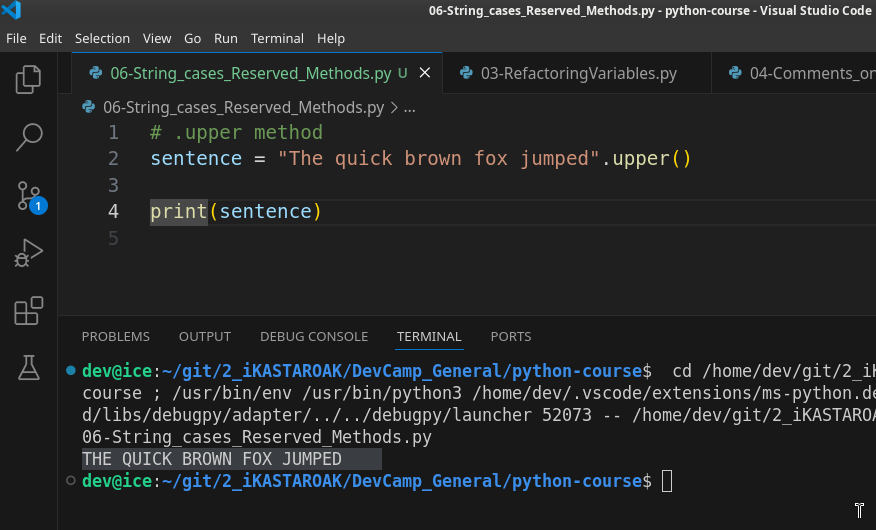
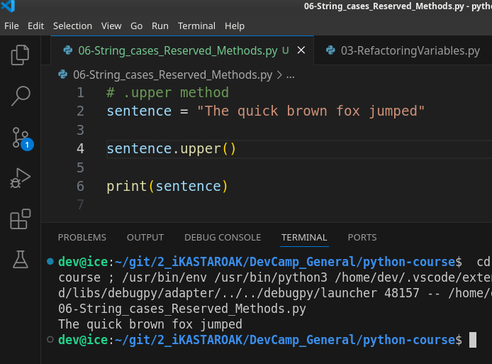
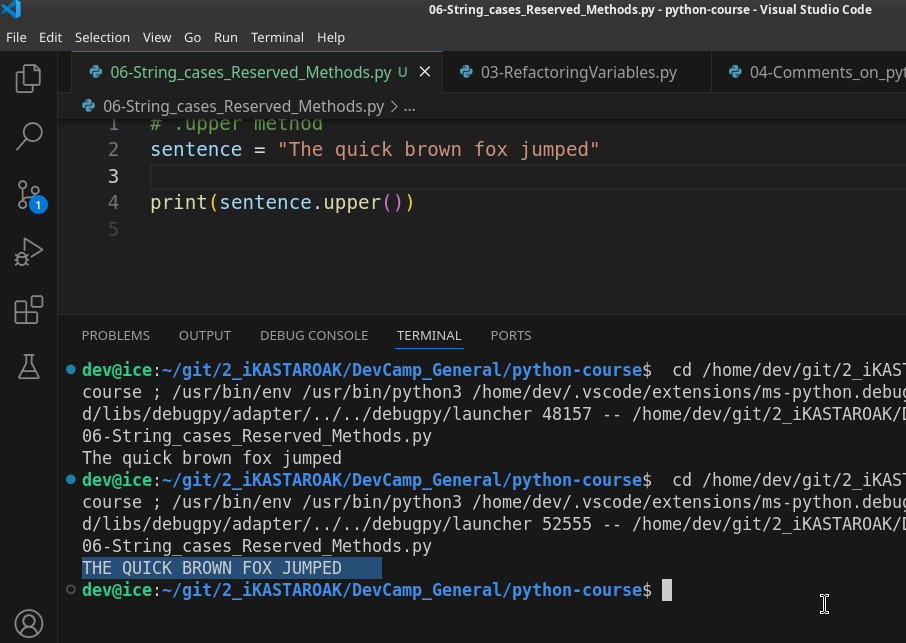
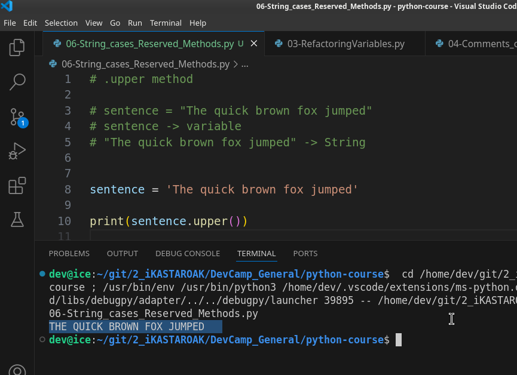
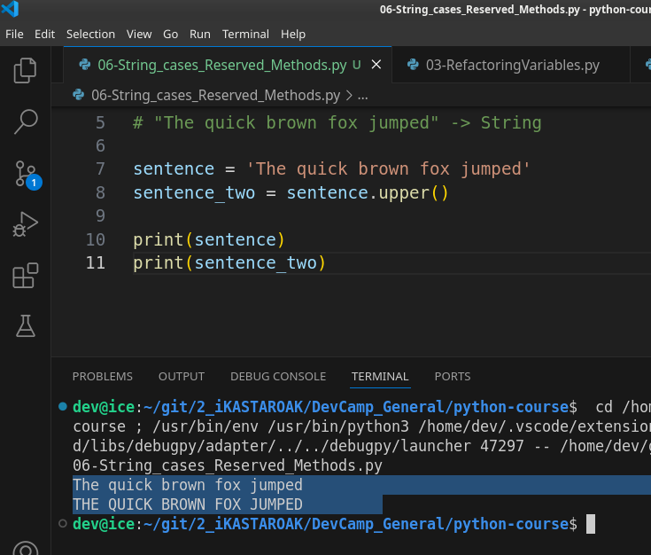
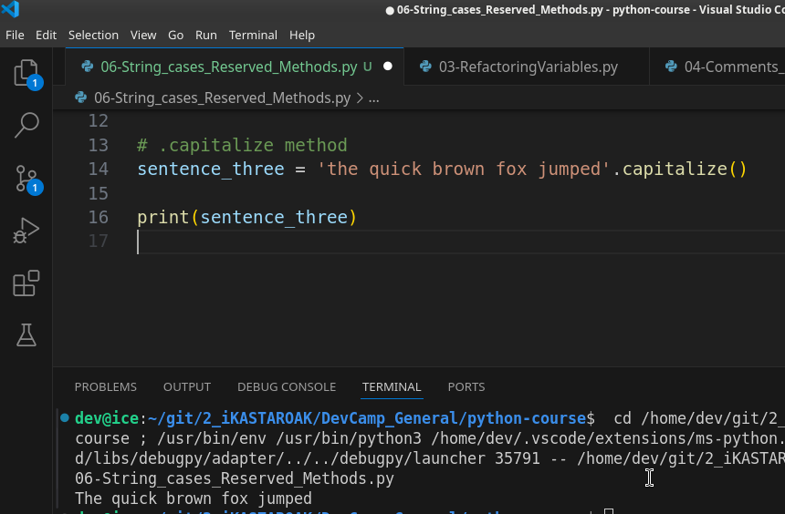
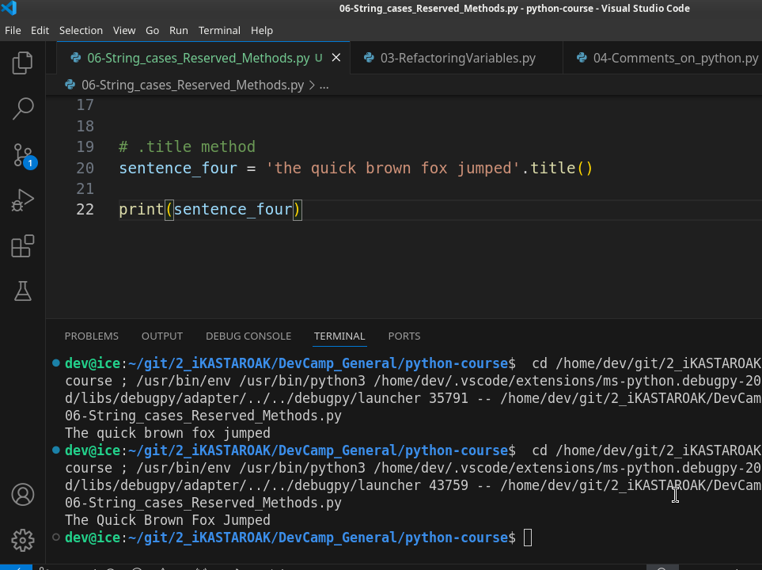
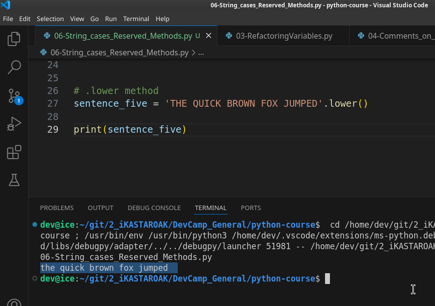
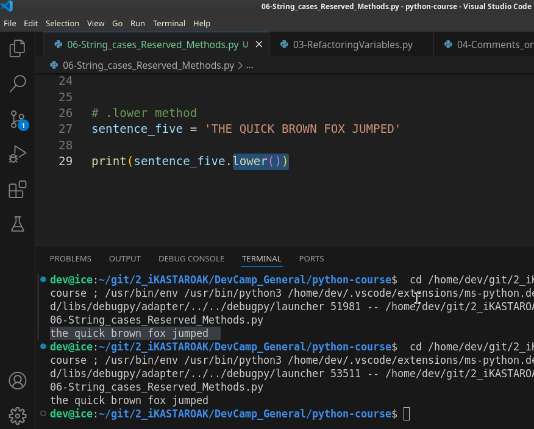

# MODULE 02 - 024: Python: String case functions

***

In this guide on Python strings we're going to learn how we can start changing and manipulating the case of a string.   

And this is going to introduce us to one of the most important concepts inside of programming which is the ability to call functions and methods on objects.

If that entire sentence didn't make any sense to you don't worry. In this guide and throughout this entire course we're going to be following this principle quite a bit.   

And we're going to be seeing more examples than you'll be able to remember in it.  

***

## .uppercase()

So don't worry if some of these concepts are a little bit fuzzy we will continue to reinforce these and they will become clear the more that you do them.

So let's see what we want to do right here.   

We have our sentence which is *the quick brown fox jumped* and I shortened our example sentence just so it can all be on one line.   

And so we can also call functions on it.  

So if I want to do something such as convert this entire string so that it will be in upper case then what I can do is at the very end of the string I can say dot and then upper and then parens and so upper is a** reserve method**.   

It's in the Python core library.   

And so this is something that you can call on a string. 

And what this is going to give you the ability to do is to convert it to be uppercase.  

Now if I hit enter you can see that now our entire string is in upper case.



Before we go on to some of the other types of case manipulators in Python. 

###### I want to show you the way that this function call works...

##### ... because this is incredibly important as you learn programming and especially as you learn how python works ...

#### ... because there are some nuances that if you don't understand the way they work it's going to get very tricky later on you're going to run into bugs ...

### ... and it's going to be harder for you to figure them out.

So let's see what happens if I come down here and create a new line and call sentence and pull this out so I'm gonna take this entire method call paste it in here.   

Now if I hit clear and then run. What do you think's going to happen? Well if I hit this you can see that there was no change made. 



Everything here is exactly what's being printed out which means that what's happening on line 3 when we call `.upper` on the sentence is not actually altering the sentence. 

It is only when we call this when the sentence is created.  

So when this variable is storing the value if we call up Upper on this string object then it's going to be stored inside of sentence.



Now technically we can also do this if I cut this out and pasted in and I run it.  

Now this process has occurred. So let's take a little bit of a step back and understand why this is happening and I'm going to build some comments up here at the top just so you can kind of get an idea for the workflow when we have this sentence and this string here.   

This may look because it's on one line and we know that we're storing this string inside of the sentence.   

It may look like there is one process but it's technically a few different processes.

So let's create a comment up here and we only need one hash character for the comment and so we have. Let me copy and paste this entire sentence instead.

```python
# sentence = 'The quick brown fox jumped'
```

So this is our sentence object but what actually is happening here is:

1. First, we have a sentence.  
   If I can spell it correctly and what this is is a variable.

2. After that, we have our string and what this is is an actual string by itself.



So what we have going on is this is not just one process.   

This is actually multiple we have a string object here.   

And then we have a variable.   

And with the equal sign and we can add this is one more line just so you can see everything that's going on.   

So with within equals what this is doing is this is performing the variable assignment. And so  what that means is we actually have three processes occurring here.   

We have a string then we have assignment and then we have the variable that's going to be storing the string.  

The reason why when we performed this call where I said sentence.upper() it does not actually change the string itself or the variable it changes it when it's called right here but it doesn't permanently make that change it's simply being called on the sentence 
variable.  

 And so if you print this value out you print out what's occurring right here then it will show all upper case.  

 But when you simply perform this process it doesn't make that permanent change and 
you may kind of wonder why I'm spending so much time talking about this 
but it's for a very important reason.   

* One of the key issues that I see when students are learning programming is some confusion around data flow and being able to see when processes occur.

So this may seem pretty simple right here because we only have three lines of code but imagine that you're building out some large web or mobile application and you call a process halfway through some large code file and you wonder why it's not changing what you're seeing on the screen.  

 And it may have something to do with this issue right here where you're calling a process but you're not storing the process in a variable you're not calling it on the object that is actually being created and that can lead to some confusing bugs.   

So a very common pattern is to do something like this where whenever you want to change the values you create a new variable and now you can say `sentence.upper` 
and place it inside of sentence two and now if I come in here now let's print both of these out.



And now you can see we have not changed the initial string value but we have with the other one and that's a process that you'll see quite a bit because **you need to be careful with how you change an original value** because **if you change it permanently then other methods that are calling it may run into some bugs** because they may expect it to look like this but we may have accidentally converted it to be in all upper case or performed all other kinds of different processes on it.   

So I'm going to leave all these different notes inside of the show notes for this guide just so you can see all of the different processes that are happening.

I know it can be very challenging at this stage when you're learning a new programming language to want to skip ahead and to get to the fun part of you doing things such as building applications.   

However, **these core fundamental types of processes are very important to understand** because **if you don't get these right and you don't understand the way 
processes such as data flow works or assignment works then when you get 
to those more advanced topics it's going to be very difficult to know 
what's going on.**

So I highly recommend for you to take the time to see exactly what's going on with each one of these processes so that you'll be able to understand them later on.   

So that's enough on all of these different techniques in regards to calling these methods and everything like that.  

 I'm going to comment all of this out so that we can have it for the 
show notes.

***

## .capitalize()

We talked about upper. Now let's talk about **a few other methods**.  

 Now let's see what we want to do if we wanted to say **just capitalize the 
first ladder.**   

So if I'm going to say sentence and we have something we have a string where everything is in lowercase and we simply are going to capitalize the very first letter here what we can do and I'm going to perform this task right on the assignment is I can say capitalize call parens if you do not call ends no process will occur and then let's just
 print this out to the screen.

Now if I run this you can see it has taken the very first letter and it has capitalized it.



I'm going to copy that commented out.

***

## .title()

Now let's go with another one. So say that we have some blog post title and we want to have the first letter of every word capitalized capitalize only takes the first letter of the entire sentence or the entire string.   

But if we call title what is going to happen if I run. 

You can see that it goes through and it converts each one of these so that the first letter is title-ized:  



This is a very popular task to do I probably implement the title method and pretty much every application that I work on in some form or another because it can become quite handy. 

I'm going to comment this out so we can have it in the show notes.

***

## .lower()

The last one that we're going to do is lower and in order to get our lower I'm going to first print out upper so that we have this to work with.

I'm going to make this all uppercase and then call lower on it and if I run this you'll see that it converts it so that it's all in lower case values.



You do not have to start with uppercase values if you have an example where everything is lowercase and you run this.   

It's not going to make any changes whatsoever or if it's mixed where you have a few of these.   

That are in capitals then you run this and you can see it takes all of 
them and puts them all in lower case.

***

### Summary

So in review in this guide, we talked about a number of different topics.  

* We started very high level and talked about how you can call functions on objects which are a string as a type of object in python.  
  So you saw how you could call a function on an object and you also saw 
  when that process occurred you saw that just calling an object just by 
  itself does not perform any tasks whatsoever in regards to what gets 
  printed out on the screen.   
  So you saw that you had to call that function at the right time.  
   It might be like we did right here at the time of assignment.   
  It might be when you're printing it out.   
  So if you place in other words if I take this out and call lower in the print statement 
  right here and run it you'll see that it works.  
  

* So you can call it when it's being printed out and you may wonder why  that is important or why we even care about printing anything out.    
  
  The reason is because if you're building a web application or a mobile app this is the closest that you can get.  
  
   Using the console to see what the output is going to be so you can use the same exact process in an HTML file when you're wanting to render it out on the screen this is simply a way where we can quickly test it inside of the terminal just like we're doing right here to see what the output gives us.   
  
  And so those are the different ways that you can call it.

* Then we went through a number of string manipulation methods upper capitalize title and then lower.
