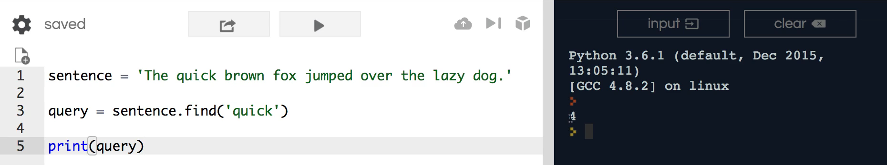
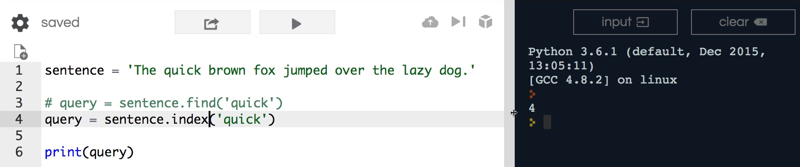
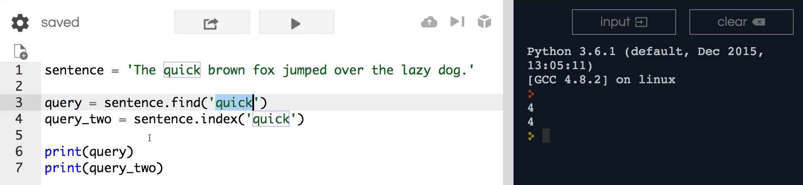
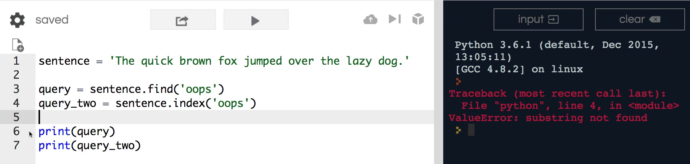
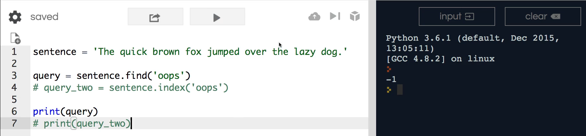
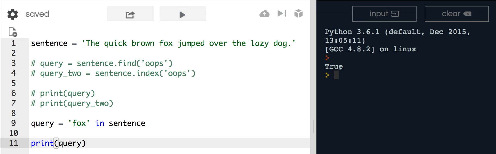
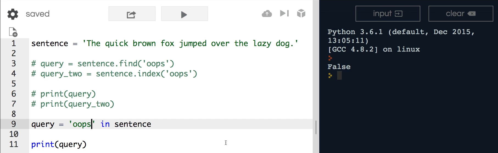

# # MODULE 02 - 031: Python: Finding a Substring using `.find()` - `.index()` - `in`

---

## Finding a Substring in Python with: `.find()`, `.index()`, and `in`

A common process when working with strings is searching within them.

In this guide, I'll show you **three different ways** to perform this in Python.

Later, when we dive into more advanced topics like **regular expressions**, we'll revisit this concept and explore alternative methods for searching and filtering content.

Don't worry if you're unfamiliar with those yet—this section will introduce fundamental ways to find substrings, while future sections will cover more advanced techniques.

---

## **Example Sentence**

Let's use the following sentence for demonstration:

```python
sentence = 'The quick brown fox jumped over the lazy dog.'
```

We will explore **three different methods** to search within this string:

1. **The `.find()` method**
2. **The `.index()` method**
3. **The `in` operator**

I'll also explain when to prefer one method over another.

---

## **1️⃣ The `.find()` Method**

Using `.find()`, we can search for a substring within a string:

```python
query = sentence.find('quick')
print(query)  # Output: 4
```

### **How does it work?**

- The `.find()` method **returns the index** where the substring starts.
- In this example, `'quick'` starts at index `4`.
- If the substring is **not found**, `.find()` returns `-1`.

#### **Understanding Indexing**

The index follows **zero-based numbering**:

```
T  h  e     q  u  i  c  k  ...
0  1  2  3  4  5  6  7  8  ...
```

Since `q` in `'quick'` is at position `4`, `.find()` correctly returns `4`.

✅ **Best Practice:** `.find()` is useful when you need the position of a substring but don't want to raise an error if it's missing.

---

## **2️⃣ The `.index()` Method**

The `.index()` method works similarly to `.find()`:

```python
query_two = sentence.index('quick')
print(query_two)  # Output: 4
```

It returns the **same index** as `.find()`, but there is a **critical difference**:

> **⚠️ `.index()` raises an error if the substring is not found!**

Let's see what happens when we search for a non-existent substring:

```python
query = sentence.index('oops')
print(query)  # Raises ValueError!
```

🚨 **Error:** If the substring is missing, `.index()` throws a `ValueError`, stopping your program.

✅ **Best Practice:** Use `.index()` only when you're sure the substring exists or if you want an error to be raised when it's missing.

---

## **3️⃣ The `in` Operator (Preferred Method)**

This is the **most common and recommended** method for checking substring existence in Python:

```python
print('fox' in sentence)  # Output: True
print('oops' in sentence)  # Output: False
```

### **Why is `in` Preferred?**

- ✅ It **does not** return an index, just a **Boolean (True/False)**.
- ✅ No risk of `ValueError` like `.index()`.
- ✅ Much cleaner and more readable in conditionals.

Compare these two approaches:

### **Using `.find()` (Less Readable)**

```python
if sentence.find('oops') != -1:
    print('Substring found!')
```

### **Using `in` (Much Cleaner!)**

```python
if 'oops' in sentence:
    print('Substring found!')
```

✅ **Best Practice:** In most cases, you only need to check for substring existence, making `in` the preferred method.

---

## **🔍 Summary: When to Use Each Method?**

| Method     | Returns         | Behavior if Not Found | Best Use Case                                                      |
| ---------- | --------------- | --------------------- | ------------------------------------------------------------------ |
| `.find()`  | Index (or `-1`) | Returns `-1`          | When you need the index but want to avoid errors.                  |
| `.index()` | Index           | Raises `ValueError`   | When missing data is an actual error case.                         |
| `in`       | `True`/`False`  | Returns `False`       | When you just need to check if a substring exists (best practice). |

---

## **📌 Python Documentation References**

🔗 **[str.find(sub[, start[, end]])](https://docs.python.org/3/library/stdtypes.html#str.find)**

> Returns the lowest index where `sub` is found within the string (or `-1` if not found).

🔗 **[str.index(sub[, start[, end]])](https://docs.python.org/3/library/stdtypes.html#str.index)**

> Works like `.find()`, but raises a `ValueError` if `sub` is not found.


***

## Video lesson Speech

Finding a Substring in Python with: Find, Index, and In

A common process that you're going to need to perform when working with strings is being able to search inside of them.   

And I'm going to show you three different ways that we can perform this inside a python.  

 And later on when we get to more advanced topics such as regular expressions
 we're going to come back and see how we can utilize regular expressions.

***

If you're not familiar with them don't worry what we're going to have an entire section dedicated to them.   

However, that's just to give you a little bit of foreshadowing that I'm going to 
show you some of the introductory ways that you can sort through and 
filter through content and strings in Python right now and later on I'm 
going to show you some alternative ways as well.   

So we have our sentence right here:

`sentence = 'The quick brown fox jumped over the lazy dog.'`   

I'm going to show you **three different ways to sort through it**.

1. The first way is going to be with the `.find()` method. 

2. The second is going to be with `.index()`.  

3. The third is going to be with the `.in()` method.   

I'm going to explain why you'd want to use one over another one.  

 And so here we have a query. And in this query, you first called the 
sentence.   

So this is the variable or the string.   

Now, remember with the way that these work technically I could just copy this and paste it down  here and then call find on it call or function.   

However, it is a lot cleaner and more professional to call the variable here.   

So you say sentence find and let's type quick.

```python
sentence = 'The quick brown fox jumped over the lazy dog.'

query = sentence.find('quick')
```

And so now if I run it run print query let's see what this tells us.



If I hit enter you can see this returns a 4.   

So that's kind of interesting because I told it to find quick and what it found was four 
what does this four right here represent.   

Well the four is the index that it found quick.   

So right here we have the and the T starts with a zero index so we have zero then the h is one all the way down to where quick is the fourth index inside of the string.   

And so this is saying that yes I found the word you're looking for I found the string you're looking for doenst have to be a word.   

If I typed in qui and ran this, you'd see this returns exactly the same value. So it is simply looking for a matched string.  

* And if you're interested in the formal computer science terminology This is called a sub string it is a string inside of another string that we're looking for.   *

So this is going to return the index value.

Now we have another one so I'm going to fill that out.  

 I'll copy it and comment it out.  

 And so we also have the index function here and if I run this you'll see that it returns exactly the same value.  



**So index is finding exactly the same way that our find function worked**.   

However there is one very important difference between the two and index.  

 You have to be very careful when you're going to use this:

There are times to use this and will get into those later on when we 
talk more about algorithms.

**But index we'll throw an error if it can't find the value where find just returns a negative one.**  

So let's come here and I'm going to make the second one called `query_two` and then I'm going to print out query_two.   

So right here as you can tell I'm going to clear both of these work exactly the same way because they found quick inside of the sentence.  



However, if I change this to oops which is not contained anywhere here and I try to run this we get an error



and if I comment out the index method here, hit clear you'll see that this worked.



So find when it is looking for value that it does not find inside of a string.   

It simply returns a negative one and if index comes across the same situation where you pass it a value that's not contained inside of the string it throws an error and so that is the very important difference between using the two.   

## .index()

And like I said later on we'll talk about when you would want to use index.

Now that you have both of those down let's go into the third option and t**his is technically the preferred option for Python developers**.   

So I wanted to show you all the different variations.   

However this last one is the one you're going to come across the most inside of a python program and it is called the `in` operator.   

So I have query and here I can pass in value so I could pass in quick. I could pass in fox anything like that.

So im going to pass in 'fox' in sentence. And now if I print this out so now I can run it and it prints true



If I passed in something like oops it's return value is false



and so you have three different versions.   

If this one finds evaluates going to return the index of where that string is first discovered.   

The index will do it as well but it runs into and actually causes your entire program to stop if you try to run it and that would mean your entire website would break for whatever user went to that page, **you have to be very careful when you use index.**  

But in is very helpful and this is a reason why it's considered the preferred method is that it doesn't care about an index it only cares about true or false value and typically and this is my experience but it is also the common best practice in the industry.

Typically when you're checking to see if a value is in side of a string you don't care about the index value and so there are times where you will want to know that when you want to replace it or you want to start at a range or something like that.  

 However usually you just want to know if a string contains this substring which is exactly what in does right here and so a very common pattern and we haven't got into 
conditionals yet but one thing that you'll see a lot is code that is 
written like this where we say something like.  

 And I can actually pull this entire code right here so I can say if oops is in the sentence then I want you to perform this task right here.   

Do you notice how nice and clean that is?  

 Once we get into conditionals, we're going to be using them quite a bit, and this is a pattern you're going to see quite a bit in Python development.

But notice how much different this would have to be if we were using find or index.   

You'd have to write your code something like this where I would copy this and get rid of everything here.   

Wrap it in parentheses and don't worry about this guy get into a conditionals in its own 
dedicated section.   

I just want to show you how much cleaner the in syntax is compared with this so here I'm saying if sentence find oops is not equal to negative 1.  

 Now I want you to perform any magic that you have right inside of your conditional.   

Now that is nowhere near as easy to read as simply saying OK is this string.  

 Can this string be found inside of the sentence?  

 Because if it is I want you to perform all these tasks.   

If not I don't want you to do them.

That is a very clean way and you're gonna see that a lot in modern 
Python development.   

You still will see these other options there are still Python programs I run into that utilize find and index and they check for negative one and those kind of tasks so you will run into that and that's part of the reason why I wanted you to be introduced to them now.

However all of this course is really focused on not just learning how to program and learning how to build Python programs but also how to follow the industry best practices and so utilizing code that looks like this.   

If you are trying to find a substring utilizing the in syntax is really going to be your best option.

So in review we have three different ways that we can find a string inside of Python. We can use the `find` method and use `index` or we could use `in`.

# 

## Python Documentaion

> ## [str.find(sub[, start[, end]])](https://docs.python.org/3/library/stdtypes.html#str.find)
> 
> Return the lowest index in the string where substring sub is found 
> within the slice s[start:end]. Optional arguments >start and end are 
> interpreted as in slice notation. Return -1 if sub is not found
> 
> # Note
> 
> The find() method should be used only if you need to know the 
> position of sub. To check if sub is a substring or >not, use the in 
> operator
> 
> ## [str.index(sub[, start[, end]])](https://docs.python.org/3/library/stdtypes.html#str.index)
> 
> Like find(), but raise ValueError when the substring is not found.
