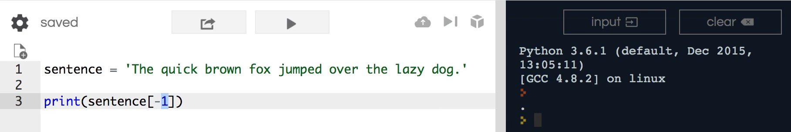
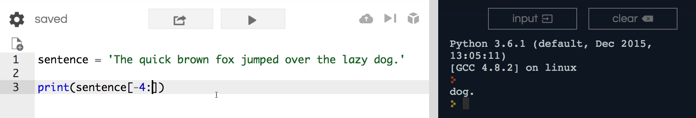

# MODULE 02 - 033: Python - Negative Indexes

---

## **Understanding Indexing in Python**

So far, when discussing string indexing, we've primarily worked with **positive index values**.

- The **first character** of a string is at index `0`.
- The **next character** is at index `1`, and so on.

However, Python also allows **negative indexing**, which lets us count **backwards** from the end of the string. This guide will cover how to use negative indexes effectively.

---

## **1️⃣ Accessing the Last Character Using Negative Indexing**

If we want to retrieve the **last character** in a string, we can use `-1`:

```python
sentence = 'The quick brown fox jumped over the lazy dog.'

print(sentence[-1])  # Output: '.'
```

### **How does it work?**

- `-1` refers to the **last character** in the string.
- `-2` refers to the **second-to-last character**, and so on.

For example, to retrieve the third-to-last character:

```python
print(sentence[-3])  # Output: 'o'
```

✅ **Best Practice:** Negative indexing is useful when you need to access characters from the end without knowing the exact length of the string.

---

## **2️⃣ Using Negative Indexing to Slice Strings**

Negative indexing also works with **slicing**. For instance, if we want to retrieve the last word in a sentence and we know it has **four characters**, we can use:

```python
print(sentence[-4:])  # Output: 'dog.'
```

### **How does this slicing work?**

- `-4:` means **start at index `-4`** (the `'d'` in `'dog'`).
- The **colon (`:`) with no ending index** tells Python to go all the way to the end.

✅ **Best Practice:** Slicing with negative indexes is helpful when you need to extract elements relative to the end of a string.

---

## **3️⃣ Why Learn Negative Indexing?**

Understanding negative indexing is **important** because:

- It allows you to access elements **without calculating the string length**.
- It is useful in **data processing**, especially in **machine learning** and **text analysis**.
- It improves **code readability** when working with **string manipulations**.

---

## **🔍 Summary: Key Takeaways**

| Feature                            | Behavior                                                    |
| ---------------------------------- | ----------------------------------------------------------- |
| **Positive Indexing**              | Starts from `0` (first character) and increments forward.   |
| **Negative Indexing**              | Starts from `-1` (last character) and moves backward.       |
| **Slicing with Negative Indexing** | Allows extracting portions of a string relative to the end. |

---

## **📌 Python Documentation Reference**

🔗 **[String Indexing & Slicing](https://docs.python.org/3/library/stdtypes.html#text-sequence-type-str)**

> Strings support indexing, both positive and negative, as well as slicing operations.

***

## Video lesson Speech

So far in the section on string's when we've talked about an index for a string we are talking about positive index values.  

***

In review, the first value here is zero. The 
next one is one and it counts all the way up in successive values. 
However, if you want to get to the very back and you actually want to 
work backwards then we can work with negative index values and so that's
 what our guide is going to be about here. So say that we want to grab 
simply the very last character from the string. What I can do is if I 
come down to sentence here I can grab a slice of the sentence by simply 
passing in a negative one.

So now if I print this out you can see it has the period there



If I want to go back even further I can say -3 and it's going to 
print out the "o" from "dog" and we could just keep going and grab our 
values in this negative index kind of manner that is helpful. But that 
will only allow us to grab a single value. So what if we want to be able
 to grab the last word here? And we now say that we're in a situation 
where we know that every last word in this sentence or what we have here
 and what we have to work with is going to contain four characters.

What we can do is still work with our range. So I can say -4: and then just leave the rest blank.

```python

```

Part of the reason why I wanted to include this guide in the course 
was to give a little bit more of a refresher on how to work with ranges 
because this is going to be a very important topic when we get into 
machine learning and concepts like that.

If you remember whenever we pass in a colon and we leave the rest of 
the argument blank then it's going to go to the very end of the string. 
So if this works this should print out "dog" with the period at the very
 end. After running this you can see that is exactly what we get.



So in review, this is how you can work with negative indices inside of a python string.

## Code

```python
sentence = 'The quick brown fox jumped over the lazy dog.'

print(sentence[-4:])
```
