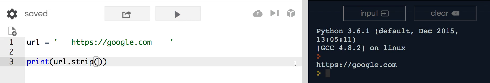
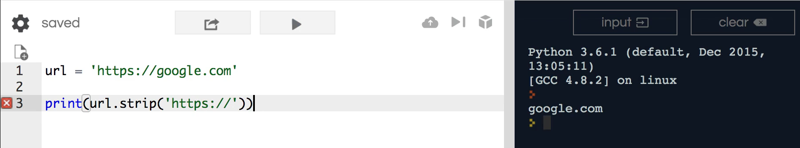
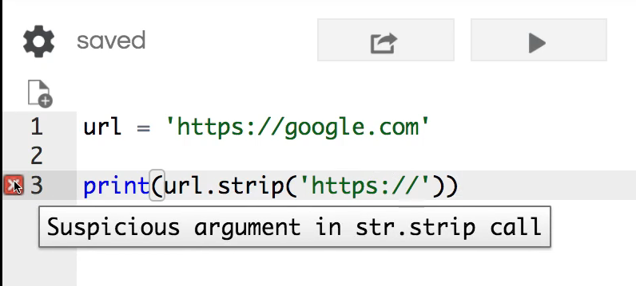
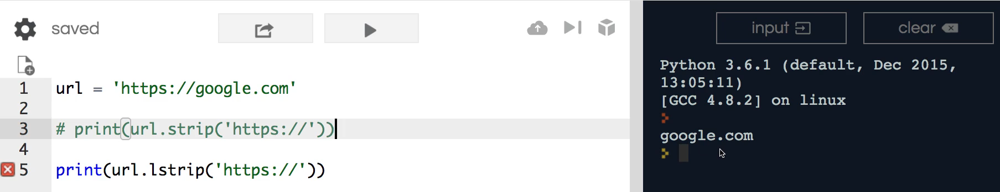
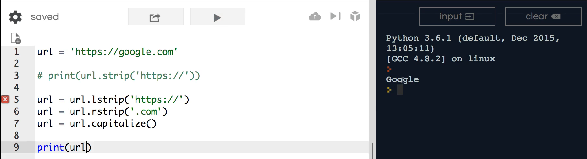

# MODULE 02 - 034: Python - Using `.strip()`, `.lstrip()`, and `.rstrip()`

---

## **Understanding `.strip()` and Its Variants**

Previously, we explored how to use the `.strip()` function in Python to remove excess spaces and clear **leading and trailing whitespace**. In this guide, we'll take a deeper dive into `.strip()` and its related methods, `.lstrip()` and `.rstrip()`.

Python strings are **immutable**, meaning they cannot be changed in place. Instead, string methods like `.strip()` return **new strings** with modifications applied.

---

## **1️⃣ Using `.strip()` to Remove Leading and Trailing Characters**

The `.strip()` method removes **all** leading and trailing whitespace (spaces, tabs, newlines) from a string.

### **Example: Removing Spaces**

```python
url = '   https://google.com   '
print(url.strip())  # Output: 'https://google.com'
```

### **Example: Removing Specific Characters**

`.strip()` can also remove specific characters from both ends:

```python
url = 'https://google.com'
print(url.strip('https://'))  # Output: 'google.com'
```

🚨 **Warning:** `.strip('https://')` does **not** work as expected because `.strip()` removes **any** of the specified characters, **not just the exact substring**. For a more precise approach, use `.removeprefix()` and `.removesuffix()` in Python 3.9+.

✅ **Best Practice:** Use `.strip()` when you need to remove unwanted leading/trailing **whitespace** or **individual characters**, but be cautious when dealing with structured text.

---

## **2️⃣ Using `.lstrip()` to Remove Leading Characters**

The `.lstrip()` method (left strip) removes characters **only from the beginning** of the string.

### **Example: Removing a Prefix**

```python
url = 'https://google.com'
print(url.lstrip('https://'))  # Output: 'google.com'
```

✅ **Use `.lstrip()` when you need to remove a known prefix from a string.**

---

## **3️⃣ Using `.rstrip()` to Remove Trailing Characters**

The `.rstrip()` method (right strip) removes characters **only from the end** of the string.

### **Example: Removing a Suffix**

```python
url = 'https://google.com'
print(url.rstrip('.com'))  # Output: 'https://google'
```

✅ **Use `.rstrip()` when you need to remove a known suffix from a string.**

---

## **4️⃣ Combining `.lstrip()` and `.rstrip()` for Advanced Cleaning**

By chaining `.lstrip()` and `.rstrip()`, we can fully clean a URL:

```python
url = 'https://google.com'
url = url.lstrip('https://').rstrip('.com')
print(url.capitalize())  # Output: 'Google'
```

This removes the **protocol (`https://`)** and the **domain suffix (`.com`)**, formatting the result as a proper title.

✅ **Best Practice:** Chain `.lstrip()` and `.rstrip()` when cleaning structured strings like URLs, filenames, or paths.

---

## **🔍 Summary: Key Takeaways**

| Method          | Removes                                  | Best Use Case                     |
| --------------- | ---------------------------------------- | --------------------------------- |
| **`.strip()`**  | Leading & trailing whitespace/characters | Cleaning general input strings    |
| **`.lstrip()`** | Leading (left-side) characters           | Removing prefixes like `https://` |
| **`.rstrip()`** | Trailing (right-side) characters         | Removing suffixes like `.com`     |

---

## **📌 Python Documentation Reference**

🔗 **[str.strip()](https://docs.python.org/3/library/stdtypes.html#str.strip)**

> Returns a copy of the string with leading and trailing whitespace removed.

🔗 **[str.lstrip()](https://docs.python.org/3/library/stdtypes.html#str.lstrip)**

> Returns a copy of the string with leading characters removed.

🔗 **[str.rstrip()](https://docs.python.org/3/library/stdtypes.html#str.rstrip)**

> Returns a copy of the string with trailing characters removed.

***

## Video Lesson Speech

In previous guides, I showed how you could leverage the strip function 
in python to be able to get rid of excess spaces and specifically how to
 clear out beginning and end carriage returns.

***

For example, right here if I have this URL 
string and adds some space to it and come down to print it out I could 
say URL and then simply say strip and then because it's a function call 
it with parens. Now if I hit enter here this is going to return back the
 URL



Notice how even though I added these spaces before and after strip 
got rid of them and that is the standard behavior with strip.

However, in this guide I wanna give you a more advanced look into how
 you can leverage strip and some of the functions that are similar to 
it. So I started with this example of a URL because this is a pretty 
common reason why you would use strip and a few of the functions that 
are similar to it

Let's say that we want to be able to take off this https:// Say we 
just wanted to print out Google and we knew that we were going to have 
https:// right here in front of each one of the URL strings. What I can 
do is I can say URL strip and then pass in as a string this https:// and
 now if I run this you're gonna see that it prints out Google.



Now there is if you're following along on [repl.it](https://repl.it/) then you'll see there is a little error here



It's not technically an error it's a warning but it says suspicious 
argument in string strip call and that is because you really do need to 
know when you're calling this type of function you want to make sure 
that you're not allowing your users to perform these types of strip 
calls because what would happen is you could potentially have someone 
inject something that would conflict with other data components or cause
 an issue. So from a security perspective Python is saying be careful 
here but in our case, we know that we are the ones that are providing 
the data so it's fine for us right here.

That is one option, now this is great but we can actually get even 
more specific than this so say that we want it to convert our string and
 actually have it so it printed out just the word I'll do it as a 
comment in Python. Just the word google just like this Google in 
uppercase like a title like a company name and then without the .com 
without https:// without all of that.

Well, we can do that and we're going to get a little bit more 
advanced so I'm going to keep what we have here and the next thing I'm 
going to do is use a sister method to strip which is going to be `lstrip`(Lstrip)
 and so 'lstrip' is short for left strip. So this is going to do is it's
 more specific. It's only going to look at the strings value from the 
left all the way to where it finds its match. I'm going to comment this 
right here and so now if I print out url.lstrip and print that you can 
see it gives us the exact same behavior.



Now if you guessed that 'lstrip' might have a cousin. Then you would be right and it is `rstrip` and let's create a new string and were going to perform reassignment 
here so I'm gonna say 'lstrip'. Let's pull out the https:// let's remove
 that and let's reassign it to URL and we're going to do the same thing 
here. But now I'm going to pull out the .com and so here I say `rstrip` which stands for right strip. So this is going to go to our string. 
It's going to start at the very end and it's going to move to the left 
so in this case, it's going to try to find .com and then we are 
reassigning that URL and just to make everything look nice. I'm going to
 say URL and said this equal to url.capitalize. And that is a function 
so we'll end it with parens. And now we can simply pass in URL to our 
print statement and see if this works. So if I run this you can see that
 it does.



It prints out Google and it looks more like the company name even 
though we started with simply grabbing the url. So there's is something 
very handy.

I use r and 'lstrip' quite a bit especially in machine learning 
algorithm data cleanup because there is going to be so many times where 
you'll get data and one of the first things you need to do with that is 
to make sure that it is formatted properly because if you get data from 
some source that had some kind of weird formatting such as starting a 
sentence off with the comma or something like that which you will get 
that it may sound weird you will get that kind of data quite a bit in 
machine learning because you're dealing with raw data. So you're getting
 data that may have just been scraped from millions of websites or 
something like that and you need to make sure that you have all of the 
data formatted properly so your algorithm can actually run across the 
data. And so 'lstrip' in 'rstrip' are ways that you can do that. So you 
can quickly go through pull off any data you know is going to be there 
check to see if it's there and pull it out if you don't want it. and so 
that is a very helpful tool. One if your web application or mobile 
developers but also if you're in machine learning.

## Code

```python
url = 'https://google.com'

print(url.strip('https://'))
url = url.lstrip('https://')
url = url.rstrip('.com')
print(url.capitalize())
```
