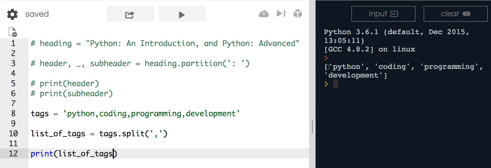
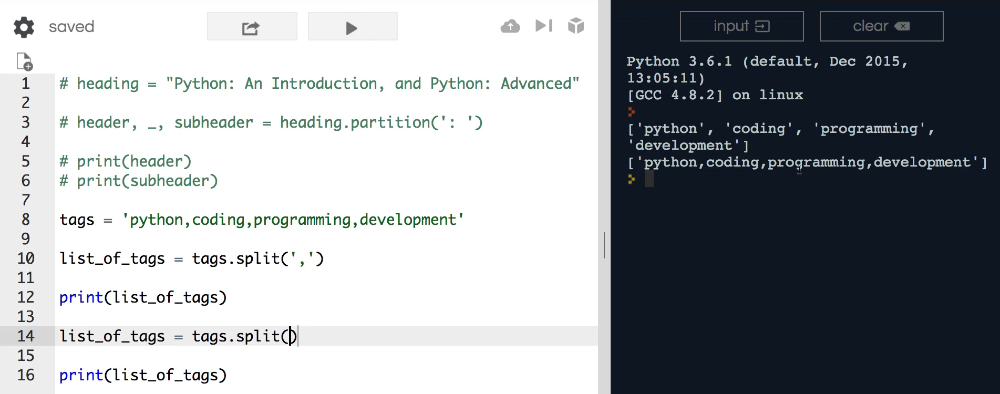
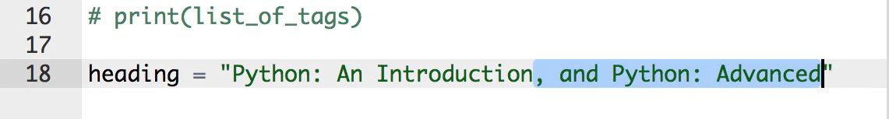
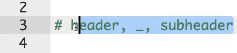

# MODULE 02 - 036: Python -  `.split()`

---

## **Understanding `.split()` in Python**

The `.split()` method in Python allows us to break a string into **multiple elements** based on a specified delimiter. This makes it a powerful tool for handling structured text, such as CSV data, user input, and more.

Unlike `.partition()`, which only splits a string into **three parts**, `.split()` can divide a string into **as many parts as needed**.

---

## **1️⃣ Using `.split()` to Convert a String into a List**

Consider the following example:

```python
tags = 'python,coding,programming,development'
list_of_tags = tags.split(',')
print(list_of_tags)
```

### **How does `.split()` work?**

- The `','` delimiter **separates** each item in the string.
- `.split(',')` **returns a list**: `['python', 'coding', 'programming', 'development']`.

✅ **Best Practice:** Use `.split()` when you need to break a string into multiple elements for further processing.

---

## **2️⃣ Using `.split()` Without Arguments**

If `.split()` is called **without any arguments**, it splits the string at **whitespace**:

```python
tags = 'python coding programming development'
list_of_tags = tags.split()
print(list_of_tags)
```

This returns:

```
['python', 'coding', 'programming', 'development']
```

✅ **Best Practice:** Use `.split()` without arguments to break a sentence into words.

---

## **3️⃣ Using `.split()` for Structured Data**

We can use `.split()` to break structured text into meaningful sections:

```python
heading = "Python: An Introduction"
heading, subheading = heading.split(': ')
print(heading)     # Output: 'Python'
print(subheading)  # Output: 'An Introduction'
```

### **How does this work?**

- The delimiter `': '` separates the **main heading** from the **subheading**.
- The two parts are **assigned to separate variables**.

✅ **Best Practice:** When working with structured text, ensure the delimiter is consistent to avoid errors.

---

## **4️⃣ Key Differences Between `.split()` and `.partition()`**

| Method             | Returns                  | Behavior                                                  |
| ------------------ | ------------------------ | --------------------------------------------------------- |
| **`.split()`**     | List (multiple elements) | Splits at **every** occurrence of the delimiter.          |
| **`.partition()`** | Tuple (three elements)   | Splits **only at the first** occurrence of the delimiter. |

### **Example of When `.split()` is Preferred**

If we used `.partition()` on a string with multiple commas:

```python
tags = 'python,coding,programming,development'
print(tags.partition(','))
```

This would return:

```python
('python', ',', 'coding,programming,development')
```

🚨 **Limitation:** `.partition()` only splits into three elements.

✅ **Best Practice:** Use `.split()` when you need to extract **all** parts of a string, rather than just three.

---

## **🔍 Summary: Key Takeaways**

| Feature                 | Behavior                                                   |
| ----------------------- | ---------------------------------------------------------- |
| **Multiple Elements**   | `.split()` can return more than three elements.            |
| **Whitespace Handling** | `.split()` without arguments separates based on spaces.    |
| **Best for CSV & Tags** | `.split(',')` is ideal for structured lists like CSV data. |

---

## **📌 Python Documentation Reference**

🔗 **[str.split(sep=None, maxsplit=-1)](https://docs.python.org/3/library/stdtypes.html#str.split)**

> Splits a string using `sep` as a delimiter. If `sep` is not specified, whitespace is used as the default separator.

***

## Video lesson Speech

In the last guide, we walked through how to use the partition function 
in python to be able to split a string into three elements and that can 
be very helpful whenever you want a single partition. But now we're 
going to extend this and we're going to talk about the split function in
 python and how we can use split to break our string into as many 
different elements as we want.

***

I'm going to keep all of this code here. I'm 
going to comment it out. And the reason for that is because I want you 
to be able to see both of these processes side by side because they are 
similar but they have some very key differences. You're most likely 
going to be using split in your day to day Python development. However, 
it is nice whenever you want to have a single spot a single delimiter 
that separates a single string into two different parts. Three parts of 
you count the delimiter itself but that's when you should use partition 
but was split.

Let's give a practical example of when you would use this. So I'm 
going to create a variable here called tags so you can imagine this 
being the tags for a youtube video or a blog post or anything like that.
 It's going to be a single string so I could say Python comma coding 
comma programming comma development

```python
tags = 'python,coding,programming,development'
```

and so that is a string but it has a number of commas that separate 
each one of these tags and so what I'm gonna do here is I'm going to use
 our ability to simply redefine and reassign this variable I'm going to 
say tags is equal to tags.split and in fact, I think I'm going to change
 my mind on this and the reason is because it's considered bad practice 
to reassign a variable of one type to a different type so we're split is
 going to do is it is actually going to return a list so it's good to 
start with the string right here and then it's going to convert that 
into a list of elements and so if you are a developer working on some 
application and at one point the tags variable is a string but at a 
different point it turns into a list that might. You would definitely 
run into some bugs because if you called say the uppercase or you called
 some kind of method that you can only use on a string. You called it. 
When it was a list you'd get an error.

So let's just do it right, right from the beginning. I'm going to say
 "list of tags" and this is going to call tags.split and very much like 
the partition function. What split does is it takes in an argument of 
where you want to split your string. So in this case I want to split it 
at each spot where it finds a comma and so that is going to give us 4 
different elements in our list. So now I can simply say "print list of 
tags" and it should give us our list. So I run that you can see that now
 we have a list



which if you're coming from a different type of programming language 
such as Javascript or Ruby. This is called an array but it is a list in 
python and we'll get into that in our collection section. But we have 
our full set of elements here we have Python coding programming and 
development.

This is a completely different type of data structure so now it's a 
collection and we can use it however we want. We could go and we could 
add each one of these elements into a database we could show them on the
 website with a very specific kind of look and feel. Once we've 
converted it into a collection it makes it much easier to be able to 
work with that. So this is a great example and a very practical example 
of when you would want to use split.

Now split also can be run without any arguments at all. So if I were 
to take this and call tag split here and pass in no arguments. You'll 
see if I run this you'll see that we get some different behavior



the way that split works by default. If you don't pass in any 
arguments is it simply converts your string into an array or into a list
 and it will be a list with a single element. Notice that it did not 
break each one of these down into its own element instead. Now you have 
this list with one single one that's filled with the string and the part
 of the reason why I wanted to do that was because if you look at this 
code right here on line 8 if you see this string it does look kind of 
similar to what we have right here so I wanted to show you that they are
 very different what split does is it converts this into a list so that 
each one of these is now its own element is its own standalone string 
whereas what we had here on line 8. And then also what happens if you 
call split without any arguments. It is a single string object and so 
that is where the difference is. So that's the difference between split 
and split with no arguments and then hopefully you can also see the 
difference on partition.

I picked out these examples very intentionally. And the reason is 
because I wanted to show you a great example of when you would use 
partition vs split. So I'm going to continue our example. And let's 
imagine that we wanted to use split with this heading.

Now technically it would work if we had started out with only this 
example or I should say. Yeah so I'm just going to do everything from 
the comma I'm just going to take out just like this



and so if I wanted to call heading and just perform some type of 
reassignment so I could say heading list and then heading split and pass
 this in. Just like this. I can print this out and let's give us some 
more room just so you can see it. So you say print now the heading list 
and then I will print it and you can see we have python and introduction
 so we get back this list of elements. And that is nice. However, one 
thing that is very helpful when it comes to using partition is what it 
returns versus what split returns.

Partition returns a tuple and a split returns a list. Now if you are 
not familiar with Python data structures then that probably doesn't mean
 very much to you. We will get into the key differences between the two.
 The key difference right now is that it is very easy to perform things 
like variable deconstruction like what we did right here with a 
partition or with a tuple which is what a partition return so whenever 
you're performing a task like this where you have some values you're 
pretty confident about the structure on those values such as I'm coming 
in from an API or some type of source like that and so you know that 
you're always going to have this type of structure, then using partition
 makes a lot of sense and it's easy to use and you can split that tuple 
up into as many pieces as you need and then you can use those.

So right here



in this case, you want 3 different elements whereas what it does is 
it's much more flexible it works on a much wider array of types of 
strings such as what we have here with tags.

If we were to call partition on tags all we would end up getting is 
the first element we would then get the comma and then we would get all 
the rest of these as a single string and so in that case partition would
 not be a very good choice at all but split allows us to break this 
entire string into as many elements as the string contains and then we 
can work with all of those independently.

And so that's really what I wanted you to see was to be able to see 
the difference on when you would want to use partition when you'd want 
to use split. In regards to my own practical experience I would say 
probably when I need to perform a task like this I probably use split 
about 95 percent of the time partition about 5 percent of the time 
because typically when I want to split a string up it's pretty rare that
 I need to only have three elements. I usually try to get or I usually 
am trying to get all of the elements inside of it so that's one of the 
key differences by definitely recommend for you to take this code. Play 
around with that play around with some examples that you may see in 
applications that you work with to be able to see when you'd want to use
 one versus the other.

***

## Code

```python
tags = 'python,coding,programming,development'

list_of_tags = tags.split(',')
list_of_tags = tags.split()
print(list_of_tags)
heading = "Python: An Introduction"

heading, subheading = heading.split(': ')
print(heading)
print(subheading)
```
