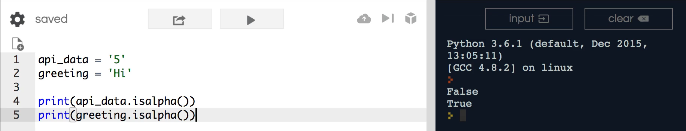
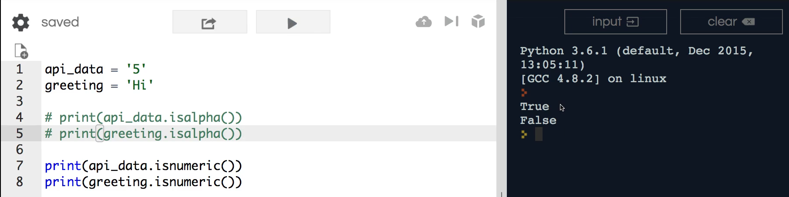
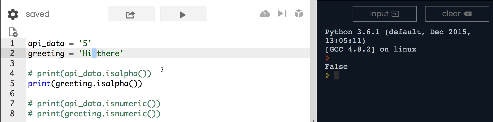

# MODULE 02 - 037: Python - Cheking string value types - .isalpha() - .isnumeric()

***

## Video lesson Speech

You may have noticed that many of the examples that I give throughout 
this course have really revolve around working with API's a huge reason 
for that is because one of the most modern ways of using python in 
development is to build and manage API requests.

***

That's why quite a few of the examples really 
focus in on that. This guide is specifically going to focus on how you 
can work with API data to check for in inner data with API responses and
 that may sound very confusing if you have never work with API's before 
and so you can walk through a few examples.

One thing that may surprise you if you've never worked with an API is
 most API data comes in a string format. That's part of the reason why 
the section on strings was pretty long because I wanted to give you all 
of the tools needed to be able to manipulate search through and work 
with string data because you'll be doing that quite a bit if you're 
working with API's in python. And so what I have here

```python
api_data = '5'
greeting = 'Hi'
```

are two different elements I have an API data variable that stores 5.
 It's a string that is storing 5 inside and then I have a greeting 
variable that simply stores the word Hi.

Now a very common pattern that you'll see when working with API's is 
you'll be sent some type of request and then you need to go and run a 
database query on that. Now if you're sent a request that contains what 
you need to be and all of that sounds pretty straightforward, however, 
it's not.

Because many times what you need is some ID for a database record and
 the database expects to be passed an integer. And what we have here on 
line 1 looks like an integer but technically it's a string that contains
 the number five in it and so there are many times where you want to be 
able to run a database query but you need to make sure you need to make 
100 percent sure that your string does represent an integer and not just
 a traditional alphanumeric set of characters like we have right here 
and that is what this guide is going to be about.

So I'm going to print out a few different elements here so I'm going 
to call api_data and then I'm going to call a function called `isalpha` and then it has a functional and it parens and I'm going to do the same
 thing for greeting. So I'll say greeting is alpha and so now if I run 
this you can see the first element prints out false and the second one 
is true



and so what this is doing is it's checking to see is this variable 
values so is this 5 a set of alphanumeric characters or not. This one is
 a 5 inside the string so it is not alpha and therefore it is false. Now
 the greeting Hi contains two characters and they are both alphanumeric 
so yes those are true. So this is a way of checking to see what the 
value is.

Now I'm going to show you in a second why this as helpful as it is is
 still not probably the most straightforward to use when working with 
API's and I'm going to show you the one that I use the most and that is `isnumeric` so I'm going to say isnumeric and so I'm going to comment these out 
just so you don't get confused on what the output is clear and run 
again. And now you can see that it swapped.



So now we're checking to see is the value numeric and in this case, 5
 is numeric it may be a string but inside that string is a number and 
the same thing with "hi" is a set of alphanumeric characters so it is 
not numeric and so, therefore, it is false.

Now typically whenever I'm performing some type of I'm working with 
an API and I'm passing in integers to a database query I typically check
 to see if they are numeric versus using the is Alpha. The main reason 
is that I can get some false positives with "isalpha" and I will comment
 that out and let's come back here. And I'm just going to actually 
uncomment this one because we know that this works so this works to 
check to see is a value inside numeric or not. But one little tricky 
thing is you may think that if I typed Hi there you may think that this 
would work in that this would be true. But if I run this you'll see that
 this is false.



And the reason is because it may be alphanumeric for H, I and then 
the, e, r, e. However, this space in the middle is not alphanumeric and 
so what happens is it goes through the string and "isalpha' will return 
true only if 100 percent of the values in that string are alphanumeric.

So if I remove that space and ran it again. Now it's true. And so 
that's part of the reason why I personally do not use "isalpha" quite a 
bit. I'm sure there are plenty of times where it can be helpful but I 
wanted to show you both options and what we have here with "isnumeric" 
is incredibly helpful because there are so many times where you might be
 getting data from API. If you're working on machine learning algorithms
 you might be getting data where you think you're going to get some type
 of integer but it turns out that instead, they put a sentence there and
 if you put the full set of your other methods on top of it then you're 
going to run into bugs and so it's nice to check to make sure that the 
data that is contained inside that string is something that you can 
treat like a number and that is what "isnumeric" process gives us.

***

## Code

```python
api_data = '5'
greeting = 'Hi there'

print(api_data.isalpha())
print(greeting.isalpha())
print(api_data.isnumeric())
print(greeting.isnumeric())
```
