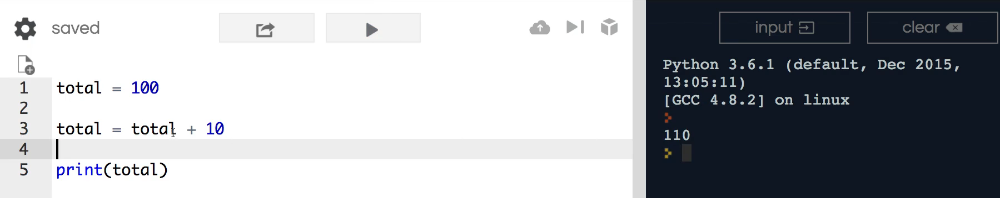
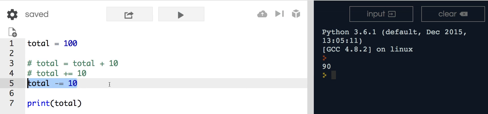
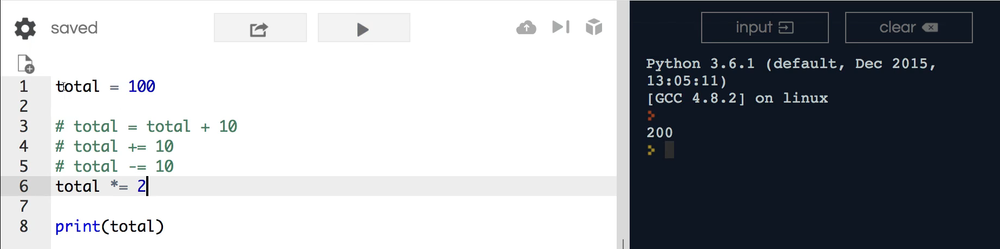
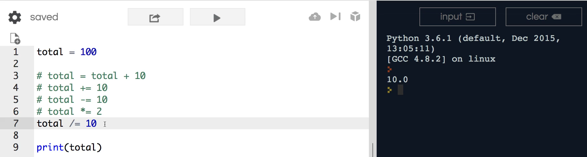
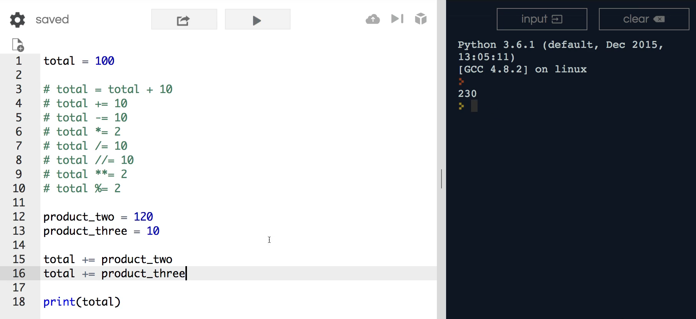

# MODULE 02 - 043: Python - Assignment Operators

---

## **Understanding Assignment Operators in Python**

Assignment operators allow us to **perform calculations while assigning values**. These operators provide a **concise way** to update variables without rewriting full expressions.

### **Example: Standard Assignment vs. Assignment Operator**

```python
total = 100

# Standard assignment
total = total + 10
print(total)  # Output: 110

# Using assignment operator
total += 10
print(total)  # Output: 120
```

✅ **Best Practice:** Use assignment operators to simplify operations and make your code more readable.

---

## **1️⃣ Common Assignment Operators**

| Operator | Meaning        | Example        | Equivalent To         | Output (if `total = 100`) |
| -------- | -------------- | -------------- | --------------------- | ------------------------- |
| `+=`     | Addition       | `total += 10`  | `total = total + 10`  | `110`                     |
| `-=`     | Subtraction    | `total -= 10`  | `total = total - 10`  | `90`                      |
| `*=`     | Multiplication | `total *= 2`   | `total = total * 2`   | `200`                     |
| `/=`     | Division       | `total /= 10`  | `total = total / 10`  | `10.0`                    |
| `//=`    | Floor Division | `total //= 10` | `total = total // 10` | `10`                      |
| `**=`    | Exponentiation | `total **= 2`  | `total = total ** 2`  | `10000`                   |
| `%=`     | Modulus        | `total %= 2`   | `total = total % 2`   | `0` or `1`                |

---

## **2️⃣ Practical Usage of Assignment Operators**

### **Incrementing and Decrementing Values**

A common use case is **incrementing/decrementing** values efficiently.

```python
total = 100
total += 10  # Equivalent to total = total + 10
total -= 5   # Equivalent to total = total - 5
print(total)  # Output: 105
```

### **Using Assignment Operators in a Shopping Cart Calculation**

```python
total = 100
product_two = 120
product_three = 10

total += product_two  # Add product 2 price
total += product_three  # Add product 3 price

print(total)  # Output: 230
```

✅ **Best Practice:** Assignment operators are commonly used in loops, financial calculations, and aggregations.

---

## **3️⃣ Understanding Division Behavior**

Python treats `/` (division) and `//` (floor division) differently:

```python
total = 100
total /= 10  # Returns float
print(total)  # Output: 10.0

total = 100
total //= 10  # Returns integer
print(total)  # Output: 10
```

🚨 **Warning:** `/=` always returns a float, while `//=` ensures an integer result.

---

## **🔍 Summary: Key Takeaways**

| Feature               | Behavior                                                          |
| --------------------- | ----------------------------------------------------------------- |
| **Concise Syntax**    | Assignment operators provide a shorter way to perform operations. |
| **Common Usage**      | Used for increments, decrements, and aggregations.                |
| **Avoids Repetition** | No need to rewrite variable names multiple times.                 |

---

## **📌 Python Documentation Reference**

🔗 **[Assignment Operators](https://docs.python.org/3/reference/simple_stmts.html#assignment-statements)**

> Python supports multiple assignment operators for different mathematical operations.

***

# Video lesson Speech

Earlier on in this section we talked about how we could use mathematical operators to work with numbers in python and in this guide.   

I'm going to talk about the assignment operator and this is going to give us the ability to perform a calculation while we're performing assignment.

***

If that is about as clear as mud don't worry we're going to walk through a number of examples.   

And one very nice thing about **the syntax for assignment operators is that it is nearly identical to a standard type of operator**.   

So if you memorize the list of all the python operators then you're going to be able to use each one of these assignment operators quite easily.

The very first thing I'm going to do is let's first make sure that we can print out the total.   

So right here we have a total and it's an integer that equals 100.   

Now if we wanted to add say 10 to 100, how would we go about doing that?   

We could reassign the value total and we could say total and then just add 10.   

So let's see if this works right here.   

I'm going to run it and you can see we have a hundred and ten. So that works.



However, whenever you find yourself performing this type of calculation what you can do is use an assignment operator.  

 And so the syntax for that is going to get rid of everything here in the middle and
 say plus equals and then whatever value.  

 In this case I want to add onto it.

So you can see we have our operator and then right afterward you have an equal sign.   

And this is going to do is exactly like what we had before.  

 So if I run this again you can see total is a hundred and ten


I'm going to just so you have a reference in the show notes.  

I'm going to say that total equals total plus 10.  

 This is exactly the same as what we're doing right here we're simply using assignment in order to do it.

I'm going to quickly go through each one of the other elements that you can use assignment for.  

 And if you go back and you reference the show notes or your own notes for whenever you kept track of all of the different operators you're going to notice a trend.  

 And that is because they're all exactly the same.   

So here if I want to subtract 10 from the total I can simply use the subtraction operator here run it again.   

And now you can see we have 90.  

 Now don't be confused because we only temporarily change the value to 1 10.  

 So when I commented this out and I ran it from scratch it took the total and it subtracted 10 from that total and that's what got printed out.



I'm going to copy this and the next one down the line is going to be multiplication.   

So in this case I'm going to say multiply with the asterisk the total and I'm just going to say times two just so we can 
see exactly what the value is going to be. And now we can see that's 200
 which makes sense.



So we've taken total we have multiplied it by two and we have piped 
the entire thing into the total variable. So far so good. As you may 
have guessed next when we're going to do is division. So now I'm going 
to say total and then we're going to perform this division assignment 
and we're going to say divide this by 10 run it and you can see it gives
 us the value and it converts it to a float of ten point zero.



Now if this is starting to get a little bit much. Let's take a quick 
pause and see exactly what this is doing. Remember that all we're doing 
here is it's a shortcut. You could still perform it the same way we have
 in number 3 I could say total is equal to the total divided by 10. And 
if I run this you'll see we get ten point zero. And let's see what this 
warning is it says redefinition of total type from int to float. So we 
don't have to worry about this and this for if you're building Python 
programs you're very rarely ever going to see the syntax and it's 
because we have this assignment operator right here. So that is for 
division. And we also have the ability to use floor division as well. So
 if I run this you're going to see it's 10. But one thing you may notice
 is it's 10 it's not ten point zero. So remember that our floor division
 returns an integer it doesn't return a floating-point number. So if 
that is what you want then you can perform that task just like we did 
there.

Next one on the list is our exponents. I'm going to say the total and
 we're going to say we're going to assign that to the total squared. So 
going to run this and we get ten thousand. Just like you'd expect. And 
we have one more which is the modulus operator. So here remember it is 
the percent equals 2. And this is going to return zero because 100 is 
even if we changed 100 to be 101. This is going to return one because 
remember the typical purpose of the modulus operator is to let you know 
if you're working with an event or an odd value.


Now with all this being said, I wanted to show you every different 
option that you could use the assignment operator on. But I want to say 
that the most common way that you're going to use this or the most 
common one is going to be this one right here where we're adding or 
subtracting. So those are going to be the two most common. And what 
usually you're going to use that for is when you're incrementing or 
decrementing values so a very common way to do this would actually be 
like we have our total right here. So we have a total of 100 and you 
could imagine it being a shopping cart and it's 100 dollars and you 
could say product 2 and set this equal to 120. And then if I say product
 3 and set this equal to 10. And so what I could do here is I could say 
total plus equals product to and then we could take the value and say 
product 3 and now if I run this you can see the value is 230.



So that's a very common way whenever you want to generate a sum you 
can use this type of syntax which is much faster and it's also going to 
be a more pythonic way it's going to be the way you're going to see in 
standard Python programs whenever you're wanting to generate a sum and 
then reset and reassign the value.

So in review, that is how you can use assignment operators in Python.

***

## Code

```python
total = 100

total = total + 10
total += 10
total -= 10
total *= 2
total /= 10
total //= 10
total **= 2
total %= 2

product_two = 120
product_three = 10

total += product_two
total += product_three
print(total)
```
