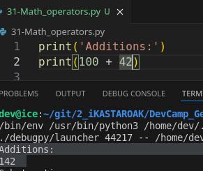
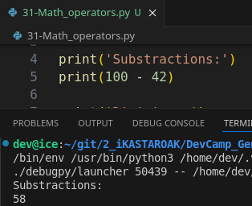
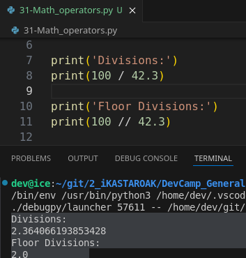
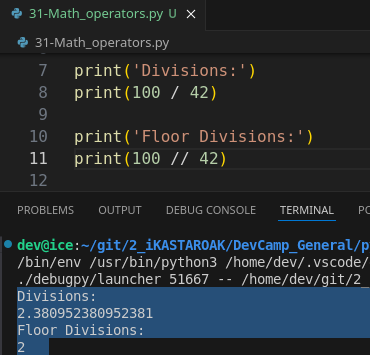
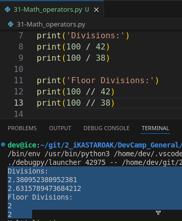
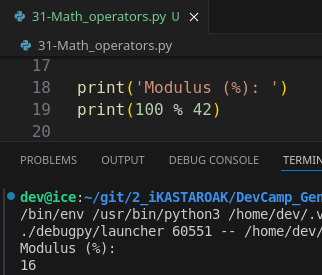
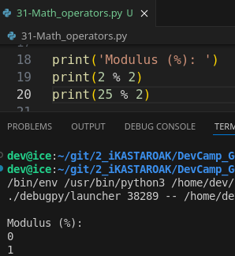
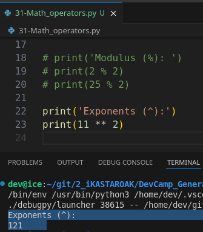

# Module 02 - 041: Python - Mathematical operators

***

## Video lesson Speech

Now that you're familiar with the main data types available to numbers 
in python.   

In this guide, we're going to walk through the mathematical operators that we can use to perform calculations and on the left-hand side here and in your show notes you're going to see that I've separated each one of the types of behaviors that you can implement with these type of operator.

We have everything from a**ddition, subtraction, division, floor division, multiplication, modulus (%), and exponents( ^ )**.   

AndI've placed each one of these here and I've added in some print line statements simply so we can organize all of these and this way you can use this guide and the notes as a reference later on.  

But after you've implemented a number of these types of calculations and use these operators for a while I think you're going to see that **they become second nature and you don't even have to look it up anymore**.  

 But in the meantime as you're learning this is going to be here for you now I'm going to place each one of these operators inside of a print statement.   

However, that is not necessary.  

 And typically when you're going to be building programs you're going to be **putting these in functions and classes and all different kinds of things like that** but, 
simply, so we can see it on the screen.   

I'm going to place it in a print  statement but you could assign this to a variable or any kind of process like that that you want.  

## Sums (Addition)

Now starting with the very basic one I'm going to go and I'm simply going to say that I want to print a `100 + 42`.  

 In order to do that it's pretty straightforward.   

I'm going to use the Energizer value of 100.   

Then, I'm going to use the operator of plus and then follow that up with a 
different value.  

 So now if I print this out you can see that addition is now equal to 142.



And like I mentioned you could put this in some type of Addition value variable something like that and put the same process in and then print that out just so you can see that there is nothing special about putting it in the print statement.   

I'm simply doing that so it will appear here on the right-hand side and I'm going to reverse this just to make it easy to reference in your show notes. So that is Addition.

## Substraction

Now subtraction is going to be very similar to this.   

We're going to have two different values but instead of a plus sign we're going to have
 the dash or the subtraction sign right here and now if I print this out you can see the 100 minus 42 is equal to 58



which is correct.  

 And you can also combine this with `floating-point` number.  

 So if I did 100 - 42.3 I could subtract this and we'd get 57.7 so that happens automatically which is very nice.  

## Divisions

Now the next one is going to be division.  

Now with the division, this one is going to use the slash character. So I'm gonna say `100/42.3` and then if I run this it's going to give us the value of 2.364 and it keeps
 going.



And that is how you can use division.  

 And obviously, if I wanted to do this with a `non-floating point` number just like this I can end return and this will work exactly the same way just giving a slightly 
different value.   

Now if you have worked with other programming languages
 in the past so far this should be pretty familiar in prematch every 
language I've ever worked with. The plus sign is always the addition 
operator the minus sign is always for a subtraction division uses the 
slash and even multiplication which we'll get to in a little bit uses 
the same asterisks.

## Floor Division (!)

Now, floor division, this is one that's a little bit different.   

Not a lot of languages have floor division and I'm going to show you what it 
can be used for.   

So here I'm going to come and I'm going to say 100 instead of Slash I'm gonna say **two slashes** and let's see what this value gets us.   

So right here with divison we have 2.38 in this long floating-point number.



What floor division gives us is:

>    ** It rounds automatically for us.   **

So , with floor division, we're getting the approximate value of 2.   

So how does this work? Does it round it up to the nearest point five?

 So the nearest value let's test it out and see let's take division I'm going to
 create another value right here.  

 So instead of 100 by 42 let me say 100 by 38 and let's do the same thing with floor division right here and now if I return this let's see what we get.



So the first value of 100 divided by 42 we already saw is 2.38 and then a string of numbers and then the next one 100 divided by 38 is 2.63.  

 So this theoretically if the floor division rounded to the nearest whole number then what should have happened is we should have gotten a 3 here but if you come down to floor division you can see that's not the case.   

**!!!!!  -> It rounds to the very lowest hole number**.   

So the very lowest value that it can.

 So in this case since the value is 2.63 and then a bunch of numbers it's going to simply cut off all of those decimals so all of the decimal values and it's simply going to say 2.

Now this is something that is very important to keep in mind when you're performing calculations.   

So floor division can be nice if you simply want a quick and easy way to get an approximate value.   

That is an integer.   

However, it is not going to be accurate in the sense that you're not going to get all of these numbers so if you're performing complex calculations you wouldn't want to use floor division on a regular basis.   

So that's I really want to show you the difference because if you ever see this // in some other program it may look a little bit weird if you've never seen that before.  

 So I wanted to point that out and give a couple of examples.

## Multiplications

Now moving down the line I'm just going to copy this for multiplication.   

The way this one works is it uses an asterix so `100*38=3800`.

And this next one might look a little bit tricky.   

## Modulus (Odd or  Even)

> How many times the Energizer can be entirely divided by the exponent?
> 
> `4 % 2`  -> How many times '4' can be divided by '2'?
> 
> Is this number even or odd?

It's called Modulus and if you've never heard of a modulus before.   

I'm going to show you what it does.   

You use the percent sign and then any number you want after that.   

So if I hit return right here you can see that it's modulus is 16.



Now that may not make the most sense so let's give even a more basic example of what modulus does.

Say `2 % 2`  and see what this gives us.   

This gives us a zero and using modulus I will say that in my experience I typically use it to **simply find if a value is even or odd**.   

And so if we look at a different example.   

So if I say instead of 2 let's say 5 right here and hit enter you can see that it returns a 1 and if I say 25 which is another odd number you can see the value is 1.



And so what this is doing is it is **dividing 2 into this number as many times as possible and then it's returning the remainder**.  

 And so if you ever use some number modules 2 it if it is an even number you're 
always going to get zero because two will go into any even number and there's not going to be any left over.  

 However, if it's **an odd number it's always going to return 1** (unless you're using 1 of course).

But if you are checking to see if an item is even or odd using this modulus operator is a very helpful way to do that.  

 That's the typical use case for using modulus.   

Now obviously you can use any other time you want a remainder but that is a very common practice.

## Exponents ( ^ )

I'm gonna go with the very last one which is exponents.  

 Now exponents look very similar to multiplication.   

So the syntax is to have** two asterisks**.   

And now if I run this you're going to see that 25 squared is equal to 625 which is accurate.  

 I said 11 it's going to print out 121 and so on and so forth.



***

So in review we've covered all of the key operators to run calculations in Python including addition, subtraction, division, floor division, multiplication, modulus, and exponents.

***

## Code

```python
print('Addition')
print(100 + 42)

print('Subtraction')
print(100 - 42)

print('Division')
print(100 / 42)
print(100 / 38)

print('Floor Division')
print(100 // 42)
print(100 // 38)

print('Multiplication')
print(100 * 42)

print('Modulus')
print(100 % 42)

print('Exponents')
print(100 ** 42)
```
