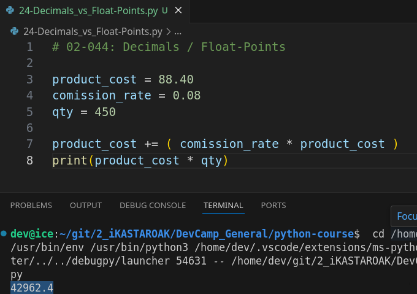
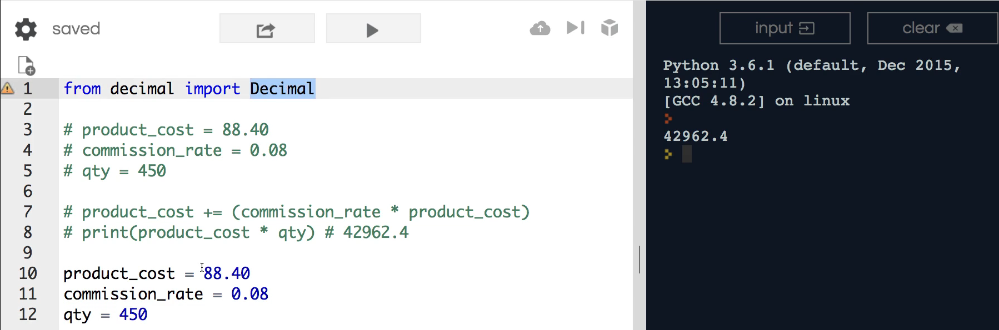
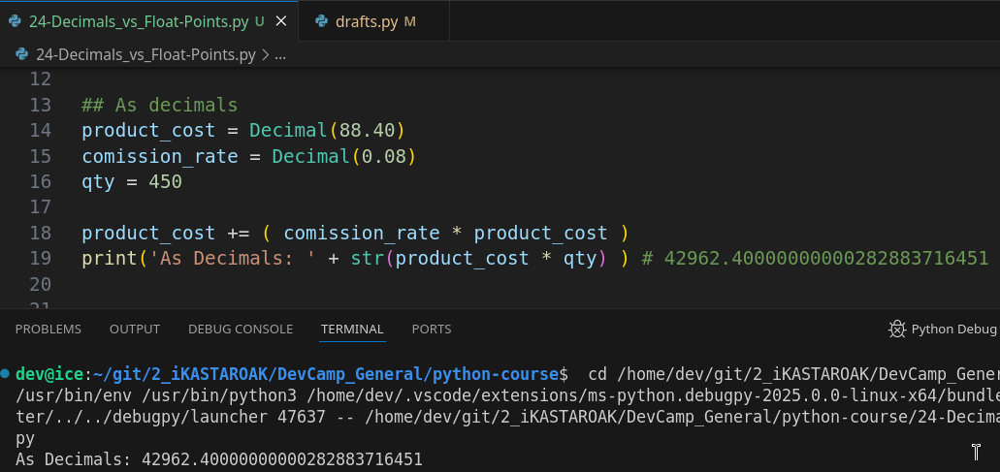

# MODULE 02 - 044: Python - Decimals vs. Floats

---

## **Understanding Decimals and Floats in Python**

Python provides two primary numeric types for handling decimal values: 

 >    **floats** and **decimals** 

 While **floats** are widely used, they **can lead to precision errors**, making **decimals** the preferred choice for high-precision calculations.

### **1️⃣ Why Does Precision Matter?**

Precision issues arise because **floating-point numbers** are stored in a way that may introduce small rounding errors. This is especially problematic in **financial** or **scientific** applications where exact calculations are required.

✅ **Best Practice:** Use **floats** for general-purpose calculations and **decimals** when high precision is required.

---

## **2️⃣ Example: Using Floats vs. Decimals**

### **Using Floats (Default Numeric Type in Python)**

```python
product_cost = 88.40
commission_rate = 0.08
qty = 450

product_cost += (commission_rate * product_cost)
print(product_cost * qty)  # Output: 42962.4
```

🚨 **Issue:** The result appears correct, but floating-point calculations may introduce **hidden inaccuracies**.

---

### **Using the Decimal Module for High Precision**

```python
from decimal import Decimal

product_cost = Decimal(88.40)
commission_rate = Decimal(0.08)
qty = 450

product_cost += (commission_rate * product_cost)
print(product_cost * qty)  # Output: 42962.40000000000282883716451
```

✅ **Key Differences:**

- `Decimal` preserves full precision.
- Floats introduce minor rounding errors over multiple calculations.
- Financial applications should **always** use `Decimal`.

### 💡Passing numbers as **strings** (`Decimal('88.40')`)

If decimals are passed as STRINGS, can avoid floating-point inaccuracies creeping into decimal calculations:

```python
from decimal import Decimal

product_cost = Decimal('88.40') 
commission_rate = Decimal('0.08')
# Both passed as string
qty = 450

product_cost += (commission_rate * product_cost)
print(product_cost * qty)  # Output: 42962.4000 !!!
```

```python
## Decimals passed as Strings

a = 10 / 3
b = Decimal(10) / Decimal(3)
c = Decimal('10') / Decimal('3')
d = Decimal(10) / Decimal('3')
e = Decimal('10') / Decimal(3)
print(a) # 3.3333333333333335
print(b) # 3.333333333333333333333333333
print(c) # 3.333333333333333333333333333
print(d) # 3.333333333333333333333333333
print(e) # 3.333333333333333333333333333
```

---

## **3️⃣ When to Use Floats vs. Decimals**

| Use Case                | Recommended Type    |
| ----------------------- | ------------------- |
| General calculations    | Float (`float`)     |
| Scientific computations | Decimal (`Decimal`) |
| Financial calculations  | Decimal (`Decimal`) |
| Machine learning / AI   | Float (`float`)     |

---

## **4️⃣ Real-World Implications**

### **🚀 Financial Transactions**

Imagine calculating sales commissions at scale. If small precision errors accumulate, **millions of dollars** can be lost over time.

### **🚀 NASA and Scientific Errors**

Precision errors have historically led to **mission failures**. NASA once lost a spacecraft due to incorrect precision handling in calculations.

✅ **Best Practice:** If precision **matters**, **always use `Decimal`**.

---

## **🔍 Summary: Key Takeaways**

| Feature   | Floats (`float`)           | Decimals (`Decimal`)      |
| --------- | -------------------------- | ------------------------- |
| Precision | May introduce errors       | High accuracy             |
| Speed     | Faster                     | Slightly slower           |
| Use case  | General math, AI, graphics | Finance, science, banking |

---

## **📌 Python Documentation Reference**

🔗 **[decimal — Decimal fixed-point and floating-point arithmetic](https://docs.python.org/3/library/decimal.html)**

> The `decimal` module provides precise decimal arithmetic.

***

## Video lesson Speech

If you remember back to when we talked about the numeric data types in 
python I told you that there is a very important caveat when working 
with decimals and that is if you want to perform advanced calculations 
that need to be very precise than using the floating point number is not
 going to be your best option.  

***

Instead, we have another library that we can 
use inside of Python called the decimal library and that's what we're 
going to go through in this guide. I'm going to show you the key 
differences between float's and decimals and then we can talk a little 
bit about when you'd want to use one over the other. And this is also 
going to give us a nice introduction on how we can import outside 
libraries.

Even though decimal is inside a python we're going to have to 
explicitly call it because we can't simply use it the same way that 
we've used other functions leading up to this point. So before we get 
into anything let's come up with a few example variables. So I'm going 
to say product cost and let's set this equal to some type of 
floating-point number like 88.40 and I'm only keeping this zero here so 
it's easier to visualize it as a cost. Technically it's going to look 
like 88.4 from the Python interpreter because it ignores trailing zeros.

Next, we're going to figure out a commission rate. So for the 
commission rate let's say that this commission is going to be 0.08 for 
the sake of argument which is the equivalent of 8 percent. So we're 
using this to build a commission management tool for this program and 
then for product quantities and I'm going to create a variable here 
called quantity. We'll say there are 450 of these items that are sold.

So now if I want to perform this calculation I can say product cost I
 can use our assignment operator which we recently learned about. And I 
can take the commission rate and multiply that by the product cost. And 
now if I want to print it I can say print the product costs multiplied 
by the quantity. So what that is going to do is it's going to take each 
one of these values and it's going to multiply the commission rate by 
the product cost. And that's going to give us our commission value. It's
 going to add that onto the product cost. So essentially this is a 
system that is trying to see how much money a salesperson should make 
every time a product gets sold. And that's what this will do. It's going
 to say This product may have cost 88.40 but we also have to pay the 
salesperson 8 percent. So we want the total product cost including the 
commission. So that's what that will equal and then we're going to 
multiply that by how many units were sold which in this case is 450. So 
I'm going to run that and the value that we get right here is 42962.4



And let's save this as a comment an inline comment right here. Just 
so you can see this is the value when we're working with a float because
 all of these even though they may look like decimals they're 
technically floating-point numbers. Now I'm going to comment this out so
 that we don't get it confused.

Now let's talk about how we can work with decimals, we're going to 
have to come up to the very top and we're going to import this from 
Python and the way you can import a library is by saying from decimal 
and this is obviously for the decimal library import decimal.


Now if that makes no sense to you do not worry what we're doing here 
is we have access in Python to the decimal library and inside of the 
decimal library. There are all kinds of classes and functions and 
different elements like that that we have access to and we're saying 
that we want to take the decimal class and that everything that's 
included in that all the functions and everything like that from the 
decimal library and we want to use it in this file. Now this is like I 
said in the beginning this is just an introduction to working with 
outside libraries. We're going to have an entire section dedicated to 
that later on when we get into more advanced topics. For right now just 
know that we're pulling in the decimal library and the specific function
 of a decimal and this is what we're going to use. So now that we have 
all of this let's actually comment copy the come in and out just so you 
can see both of them side by side.



Now the way that you can create a decimal is to copy decimal it has 
to be all like this with it titled with the capital D and decimal 
spelled out and then because it's a function we're going to call 
decimal. And what this is going to do is it is going to override this so
 it's no longer going to be a floating-point number. Now it's going to 
be a decimal and I'm going to do the same thing here. And this is going 
to give us what we're looking at looking for. So we have a product cost.
 We have a commission rate which are now decimals they are no longer 
floating-point numbers. We're keeping our quantity the same. And now 
let's run this process again. So I'm going to come up to product cost 
and lets comment everything else out. We don't have to call decimal 
again because all of these elements now are decimals. And if I run this 
you can see we get a much larger number



I'm going to copy this and add it to the comment so you have it for 
the show notes. Now, this may seem kind of odd because right here when 
we're working with floats we simply ended the calculation right at point
 four and that seems pretty accurate. However, what decimals do is they 
give you a much higher level of precision. You can see that technically 
our commission and the total for the product was not 42962.4. But 
instead, it was 42962.4 and then a crazy long decimal here. That may not
 seem like a big deal but imagine that you're building this for a large 
company like Wal-Mart or some type of company like that and you're going
 to be running these types of calculations all day every day on millions
 and billions of dollars in transactions then these little numbers that 
don't seem like a big deal are going to add up and they are going to 
cause errors from your financial reporting and your calculations that 
definitely can be an issue.

Now that is on if you're building some type of finance application 
and you want to make sure that your financial calculations when you're 
adding and multiplying and dividing you want to make sure that those 
numbers are accurate.

Now, where this also comes into play is when it comes to scientific 
calculations there have been instances, in fact, NASA had a very bad 
instance where they were using floating-point arithmetic instead of 
these high precision types of decimals and they actually had a crash of a
 space shuttle because of that. And so it's very critical to make sure 
for any type of system that requires a high-level precision that you're 
picking the right tool for the right job. There are many times when a 
floating-point number works perfectly fine. And then you can just use it
 exactly like this. However when it comes to anything that is 
finance-related or scientific or where the level of precision is 
incredibly important then it's a good idea to bring in the decimal class
 just like we did right here so that you can get what the actual value 
is.

***

## Code

```python
# 02-044: Decimals / Float-Points

from decimal import Decimal

## As floats
product_cost = 88.40
comission_rate = 0.08
qty = 450

product_cost += ( comission_rate * product_cost ) # Rapidly calculating the product cost plus the comission rate for the salesman by using the assignment add. operator
# print('As Floats: ' + str(product_cost * qty) ) # 42962.4

## As decimals
product_cost = Decimal(88.40)
comission_rate = Decimal(0.08)
qty = 450 

product_cost += ( comission_rate * product_cost )
print('As Decimals: ' + str(product_cost * qty) ) # 42962.40000000000282883716451


## Decimals passed as Strings

a = 10 / 3
b = Decimal(10) / Decimal(3)
c = Decimal('10') / Decimal('3')
d = Decimal(10) / Decimal('3')
e = Decimal('10') / Decimal(3)
print(a) # 3.3333333333333335
print(b) # 3.333333333333333333333333333
print(c) # 3.333333333333333333333333333
print(d) # 3.333333333333333333333333333
print(e) # 3.333333333333333333333333333
```


