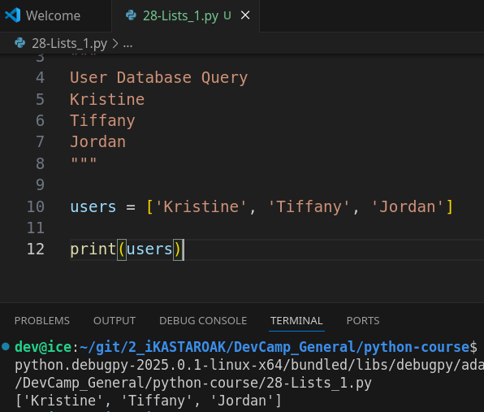
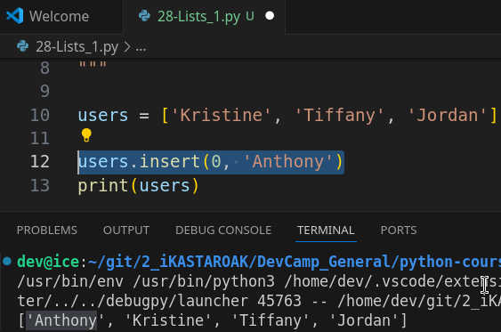
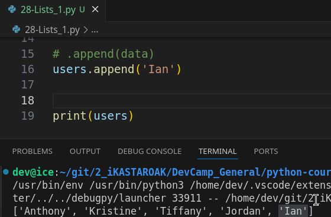
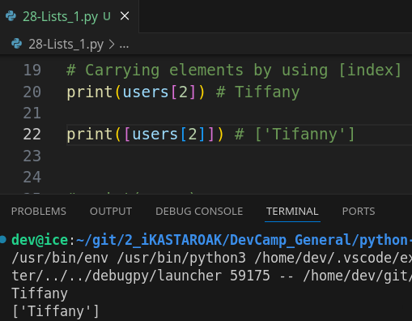
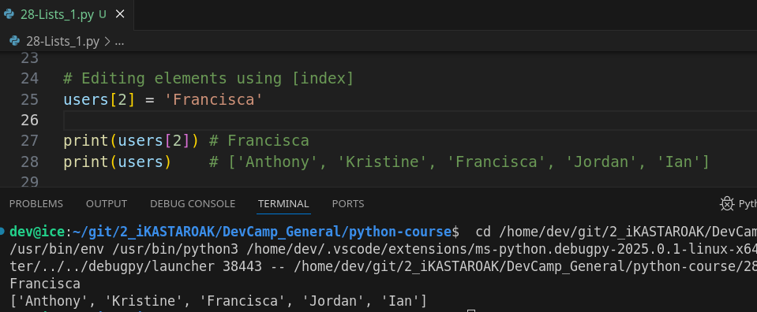

# MODULE 02 - 049: Python - Lists


****

## Video lesson speech

To start out the section on Python data structures we're going to start talking about Python lists.   

Now a list in Python if you're coming from other programming languages **is like an array**:

> **A collection of values and that collection can be added to. You can remove items. Youcan query elements inside of it.**

****

Over the next few guides, we're going to go through how to perform each one of those tasks.   

Now I wanted to give a very practical example for how you might work with a list in Python because if you're brand new to programming one of your very first thoughts might be.   

When in the world am I ever going to use this? 
Because most of the examples we're going to go through deal with hard-coded values such as typing people's names into a program, and in a real-world program you're not going to do that and so I wanted to show you a little bit of a preview on how you'd actually use this type of data structure in a real-life program.

So what I've added here is this multiline String and this is a sample user database query.

```python
"""
User Database Query
Kristine
Tiffany
Jordan
"""
```

So, imagine that you have some python application that's connected to some sort of sequel database.   

When you run a database query, you're going to get a list of names back and so Python doesn't create different kinds of objects.   

Every time that you want a new database query what it's going to do is it's going to look at its set of data structures and it's going to go and it's going to put them in that.

So that's really **one of the really critical reasons why it's important to understand** why to work with lists is because **any time they are going to be working on a real application such as one that connects to a database you need to know how to work with what gets returned from that database query** and in the case of a list you're going **to have to know how to loop through it** which will cover in our section on looping and iterating.   

But **you need to know how to add how to query inside of it**.   

All of those kinds of tasks and so that's what we're going to walk through.

But right now let's say that we have a database and we need to see how we can create a list.   

And **the easiest syntax for doing that is we're going to store it in a variable called `users`** , also **using brackets**.

Now, **inside of each one these brackets we're going to place a string**, so **each one of these is going to be in its own element inside** of this list.

```python
users = ['Kristine', 'Tiffany', 'Jordan']
```

Now, if you're coming from a language such as Ruby or javascript then this is going to look very similar to you. It's exactly the same syntax that you'd create an array in those languages. So that part of it's nice if you have some familiarity with other languages like this.

So, now that we have that I can say print users and, if I run it,  you're going to see that it's printing out each one of those users.



Now that doesn't seem like a very big deal because it almost kind of looks like it just printed out exactly what we typed in and it did.   

However, **this is now no longer just a set of strings what we have here is actually a true data structure we have a list of these string names** which would be like what we'd get if we queried a database with users.


## .insert(index, data)

Now, let's see **how we can add to this list.**   

So when it comes to lists, **lists in Python are NOT immutable**.   

If you remember back to when we work with strings, you saw that you weren't able to edit a string;  you could simply update it and then reassign it to a different variable.
But, in Python, **arrays or lists are not like that you can do anything that you want to one of these** collections and let's see how to do that right here.

I'm going to give us some other lines and say  `users.insert()`, so this is how you are going to place a new element into the list and then you're going to give it an index and then you're going to give it a value.   

if I want to add the string `Anthony` and I want to make this a new element at the list, **it goes at the very front** I pass in the index.   

This is the same kind of index process that we saw with strings and every other time we work with indexes in programming where we have a zero-based index so that means that if we look at users right here with what we initially created Kristine is located at the zero index, Tiffany's at the one index and Jordan is at the two index.   

So, if we want to add Anthony and we're going to add them at the zero index right here:



What that's going to do is it's going to make our list now be four elements and then Anthony is going to be placed in front of Kristine.

Just to test that out let's print users right below and we'll see them one on top of each other. So here you see the first list has Kristine Tiffany and Jordan.  

 The next one has four elements with Anthony now right in front of Kristine.

**This is a very helpful way** of being able to add elements because the way that python does it **it's very intuitive and it's actually more intuitive than many other programming languages** because usually if you want to slide an element inside of an array or a list then you actually usually have to go and move all of those elements and assign them to a different index in order to add a new one if you want it to replay.   

So, for example, if I want this to be let's say in the 1 possession this should be second now.   

And if I hear return you can see it says Kristine Anthony Tiffany and then Jordan in the majority of programming languages that I've have experience working with.  

 That would have been a pretty intensive process.   

I would have needed to go find all of the elements find their indexes and then reassign them and bump them all up in order to slide this element inside of the list.  

 But,** with the insert statement that we have available in Python, it makes it very straightforward to do that. **  

So that's how you can add an element to a list and how you can define its index.

## .append(data)

Now, there are also other ways of doing that, **if you don't really care about the index** you simply want to **add another element to the list by using `.append()`**.

 What we can do is I'm going to come down below just so you can see all of this in order.   

I'll say users and then append and then pass in whatever I want to append.   

So here if I say I want to add `Ian` to the list.

Then I can run this and you can see in this very last one.   

We still are keeping everybody else so we have `Kristine, Anthony, Tiffany, Jordan`, and then, at the very end we've added another element, so this element of the string name Ian **gets added to the end of the list**.



**This is one of the easier ways of adding any kind of element to a list**and especially when you don't really care about the order you simply want to add it to the end.  

 And you don't want to reassign the index or anything like that.   

This is a very easy way of doing it.  

 You're going to see both of these processes used quite a bit in Python programs.   

I **typically find myself using append the most because usually when I'm working with a list I usually am wanting to simply add an 
element to the very end of it**. So **that's a very common process**.


## Querying elements with [index]

Now the last thing that I'm going to talk about is **carrying elements inside of a list.**   

We have all of these and this is great but how can I actually get access to it.  

 And you're going to find that if you are familiar with working with strings in Python then this is going to be pretty straightforward.   

Let's see how we can do this. I'll give us some room down here at the bottom.

Now, I'm going to say and let's just give another print statement something say print users and I can just pass in any index value here I want.  

 So, if I say `print(users[2])` in square brackets and hit return you can see this last element is what gets returned.   

Now, this is a very key thing to understand here.   

**Each one of these other times we printed this out.**   

**Notice how it had the brackets around the entire collection of data**. 

What that means is that these are still lists.  

 So each one of these is a list object which means that as Python looks at it that you can only call the types of functions that are available to the list data type.

However, when you query a specific element inside of the list then it returns whatever object that is.   

So, in this case, **it's returning the string data and it's not returning it with brackets inside of it.**   

If you wanted to do that you could wrap it inside of brackets.   

And so this is going to return a list with a single element like so.   

And as you can see here now we have the string Tiffany inside of its own list.



That's a way that you can do that.

****

## Reasigning elements with [index]

Now that you have all of that information, **now that you can query elements, you can create them you can add to anywhere in the list**.   

And also just at the end the other thing that you may want **to be able to do is to reassign to edit one of the values** so say that we have and we want to change someone's name here.

So, say we want to change Ian's name to Brayden and what we can do is 
first we can find wherever Ian is in the list.   

So here we have 0 1 2 3 and 4.   

So,  if I do something like this like say users four and then equals and so I'm going to perform just a standard assignment so I can treat this query what I did right here where I said users bracket for this is going to go and find the element with the index of four and then just like we assign variables.  

 It's going to assign this value.   

So this is how it's going to replace it.   

And now if I say print users now it's going to show Ian replaced with Brayden.



If I run this you can see it didn't change in any of these first printouts but now at the very end.   

**This last element now has been changed so this string has been reassigned.   **

****

Now, **a very important thing to remember this is still a set of strings and because of that strings are completely immutable which means you cannot change them**.   

So, we are not changing the string Ian to Brayden and the same rules still apply as
 when we're working with strings just by themselves.

**All we're doing is we're reassigning the element with an index four 
to this string object and so that is an important thing to keep in mind.**


 I don't want you to think that you're going to work with strings one way when you're working with them by themselves in a different way when they're inside of a collection.   

That's part of the reason why it's so important to understand all of these foundational kinds of components because the nice thing is they're going to be worked on exactly the same way in isolation as when they're combined with other tools.   

So you're going to work with a string exactly the same way inside of one of these lists as you will if you were just working on the string and calling functions on it and that kind of thing a very good thing to keep in mind when you're doing this.

****

Interview this has been our introduction to lists in python and we saw how we can create a list, how we can add into that list, and how we can do it dynamically.  

 Meaning that we can say that we want to add an element at a specific index a specific place inside of the list, how we can add to the end of the list with append, how we can query list elements and how we can return them either as their own list or as a string or any other data type that they represent, how to replace and reassign elements inside of the list.   

And that will give you a pretty decent introduction to understanding how to work with these types of collections in Python.

## Code

```python
"""
User Database Query
Kristine
Tiffany
Jordan
"""

users = ['Kristine', 'Tiffany', 'Jordan']
print(users)
users.insert(1, 'Anthony')
print(users)
users.append('Ian')
print(users)
print([users[2]])
users[4] = 'Brayden'

print(users)
```
