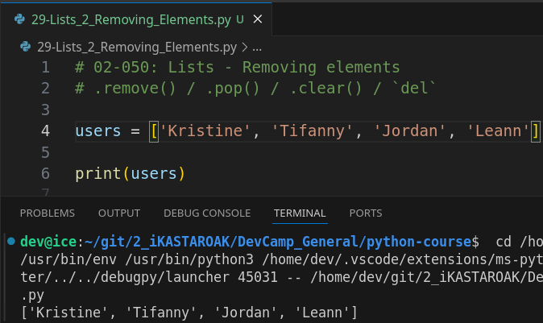
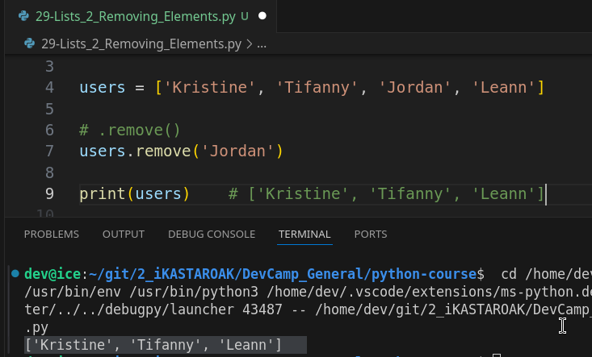
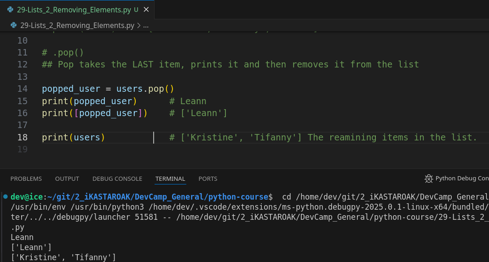
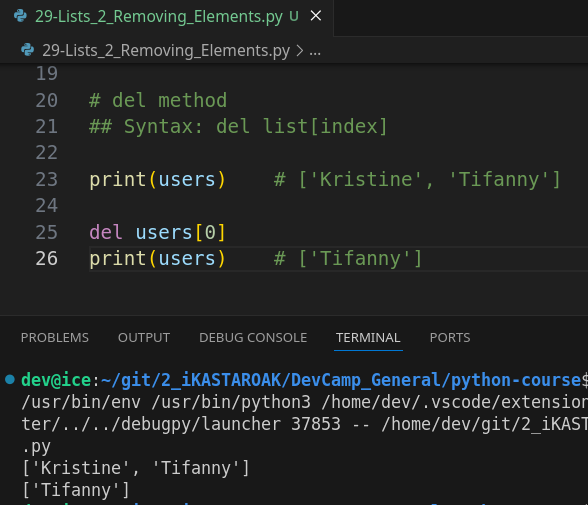
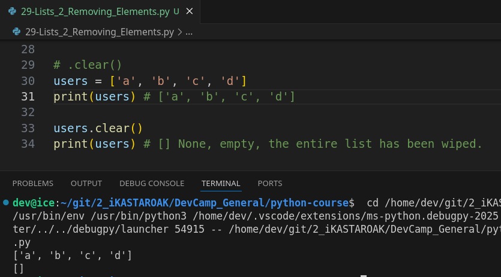

# **MODULE 02 - 050: Python - Removing Elements from Lists**

---

## **📌 Overview**

Python provides multiple ways to remove elements from a list. Each method serves a distinct purpose:

✔ `.remove(value)`: Removes the first occurrence of a specified value.
✔ `.pop()`: Removes and **returns** the last element (or at a given index).
✔ `del list[index]`: Deletes an element at a specific index.
✔ `.clear()`: Removes all elements, leaving an empty list.

---

## **🔹 Removing by Value: `.remove()`**

If you know the **value** you want to remove, `.remove()` is the best choice.

```python
users = ['Kristine', 'Tiffany', 'Jordan', 'Leann']
users.remove('Jordan')
print(users)  # ['Kristine', 'Tiffany', 'Leann']
```

✅ **Use Case:** When you need to remove a known element without worrying about indexes.

📌 **Python Documentation:** [list.remove()](https://docs.python.org/3/tutorial/datastructures.html#more-on-lists)

---

## **🔹 Removing & Using an Element: `.pop()`**

`.pop()` removes **and returns** an element. If no index is provided, it removes the last element.

```python
users = ['Kristine', 'Tiffany', 'Leann']
popped_user = users.pop()
print(popped_user)  # 'Leann' (the removed user)
print(users)  # ['Kristine', 'Tiffany']
```

✅ **Use Case:** When you need to remove an element **and use it later**.

📌 **Python Documentation:** [list.pop()](https://docs.python.org/3/tutorial/datastructures.html#more-on-lists)

---

## **🔹 Removing by Index: `del list[index]`**

If you know the **index** of the element to remove, use `del`.

```python
users = ['Kristine', 'Tiffany']
del users[0]  # Removes 'Kristine'
print(users)  # ['Tiffany']
```

✅ **Use Case:** When you have an **index-based** removal operation.

📌 **Python Documentation:** [del statement](https://docs.python.org/3/reference/simple_stmts.html#the-del-statement)

---

## **🔹 Removing All Elements: `.clear()`**

If you need to **wipe the entire list**, use `.clear()`.

```python
users = ['a', 'b', 'c', 'd']
users.clear()
print(users)  # [] (empty list)
```

✅ **Use Case:** When you want to **reset a list** without deleting the variable.

📌 **Python Documentation:** [list.clear()](https://docs.python.org/3/tutorial/datastructures.html#more-on-lists)

---

## **📊 Summary Table**

| Method        | Purpose                                     | Returns Removed Element? |
| ------------- | ------------------------------------------- | ------------------------ |
| `.remove(x)`  | Removes first occurrence of `x`             | ❌ No                     |
| `.pop(i)`     | Removes element at index `i` (default last) | ✅ Yes                    |
| `del list[i]` | Deletes element at index `i`                | ❌ No                     |
| `.clear()`    | Removes all elements                        | ❌ No                     |

---

## **🚀 Key Takeaways**

✔ Use `.remove()` when you **know the value** to delete.  
✔ Use `.pop()` when you **need the removed element**.  
✔ Use `del` when working with **index-based removal**.  
✔ Use `.clear()` to **reset a list completely**.

***

## Video lessons Speech

Now that you know the basics of managing the lists in Python let's discuss how we can remove elements from the list and we're actually going to see three different variations of how to remove items and I'm going to explain when it's important and when you'd want to use one versus the other.

****

I'm going to start with this list of users which if you remember back to our first guide on lists this is representing what you'd get back in some type of database query.   

I'm going to start off just so you can watch the way that the list develops.   

And so we're going to print out all of our users just like we have right here it looks like everything is working properly.



****

## .remove()

Now let's look at the first way that we can remove an item and thankfully it has a very nice easy to remember name.  

 We are going to say users and then we're going to call the function remove and remove takes an argument and it takes the value that we're trying to remove.   

So if I want to remove myself, I can say users which is the list dot remove.   

So we're calling this function on the list and we're passing in the element that we want to remove.   

So if I. And let me also print this out.  

 So you can see the difference.

Now I can run this and you can see the updated list does not have me in there.   

Just as Kristine Tiffany and Leanne, I used to be at the index of two and I have been removed.



Now, this is a very nice and handy way of being able to extract users or elements from an array like this because usually in many other languages you would have to run a query if you only had the value find the index and then remove that index manually.   

But **with the remove function available in Python we can do this all in a single step** so that is very helpful.   

So that's one way that you can remove elements from a list.  

****

## .pop()

 Now let's look at another one and this is a very common one I want you to become familiar with this and this is **the process of popping**.   

I'm going to create a new variable called popped_user and I'm going to show you why I'm doing this in a second.   

And in order to do this, I say `users.pop` and pop doesn't take any argument.   

So we're simply going to say users.pop and what this is going to do is it's going to look at our users list here.   

And this is the updated one so we have three elements three string elements inside of it and what pop is going to do is it's going to remove the very last element.   

So, in this case, that is going to be this string of Lee Ann but pop doesn't simply delete an item pop actually returns that item so that you can use it.

And **this is the reason why pop is used so much and it's not just in 
Python.**   

If you're learning other languages pretty much every language I've ever worked with has a form of pop and usually, it's actually called pop because it's a nice visual way of remembering it if you think of this list as a stack of items.   

You are popping the last item of the list off and when you do that you actually are grabbing it which means you have access to it.   

So the process is going to occur here is going to be we have this users list when we call the function pop on it.   

It's going to go find the last element and then it's going to return that.   

And because I'm saying `popped_user = users.pop()` it's actually going to store that user inside of this variable.   

So, it is removing the element but it's giving it to us in a way that we can use it.   

So let's see what this looks like so I'm going to say print and popped user just like 
this.   

And then let's also see what the users list looks like now. So if I
 run this you can see that we get our last element this string of Leann 
and if we look at what the users list looks like now it only has two 
elements so we started with four we removed one then we popped one but 
we were able to use that element and then now we're left with two.



#### Some popping use cases

Now if you want,  If this concept is still seemingly kind of pointless, let me give you an example **imagine a scenario** where you're wanting to go through this full database list and you're wanting to process it such as sending a payment notification or something like that to the users as you're going through that database query which you have a list as you go through each one.

You can go through and loop over pop the last one on the list off work with it such as sending a notification and then you don't have to worry about sending that user a duplicate because you're able to continually loop through the list will shrink as you're going through it.  

 And each time because you're popping it you're able to work with that one user.  

 And so that's one use case there are, as you're going to see in your python development journey, many different times and algorithms that pop comes in incredibly handy.   

So we've gone through two different ways to remove elements from a list.

****

# `del list[index]`

Now let's look at one other one and this is **just a pure delete**. And so with that we're going to call `del`.  

 So just DEL which is short for delete and this is where we can pass in an index value.  

**`del` is going to take one argument here** which is users which is the list and then you 
have to pass in whatever the index is.  

 And so if I copy this and run it,  if you notice the user at index 0 is Kristine.   

So this should delete Kristine from the user database.   

We should only have a single element in the list of Tiffany.  

 So if I run this you can see that's exactly what we have.



****

# .clear()

This is not included in the original guide but let's wipe the list:



****

And so let's kind of take a review on each one of these because **there's a reason why there are three ways to remove items from a list in Python**.   

They all have a very specific use case.

1. If you are working with a list where you know the value, then this remove function and passing in that value is typically the way to go.   
   
   This makes it possible to simply search through the entire collection 
   and then remove any element that matches this value.

2. Now moving down the next option pop this is what you're typically going to use when you want the very last element in the list and you want to use that you want to pop it off the stack and use it in your program.

3. Last on the list is this `del` command. 
   
   And this is what you would use when you know the list, and you know the index value for the list. That is one of the very common ways to do it.  
   
   Whenever the only element that you have is the index and you simply know that you want to remove an item at position 0 and that is going to be a very good option 
   to use whenever the index is what you're working with.

## Code

```python
# 02-050: Lists - Removing elements
# .remove() / .pop() / .clear() / `del`

users = ['Kristine', 'Tifanny', 'Jordan', 'Leann']

# .remove()
users.remove('Jordan')

print(users)    # ['Kristine', 'Tifanny', 'Leann']

# .pop()
## Pop takes the LAST item, prints it and then removes it from the list

popped_user = users.pop()
print(popped_user)      # Leann
print([popped_user])    # ['Leann']

print(users)            # ['Kristine', 'Tifanny'] The reamining items in the list.

# del method
## Syntax: del list[index]

print(users)    # ['Kristine', 'Tifanny']

del users[0]
print(users)    # ['Tifanny']


# .clear()
users = ['a', 'b', 'c', 'd']
print(users) # ['a', 'b', 'c', 'd']

users.clear()
print(users) # [] None, empty, the entire list has been wiped.
```
