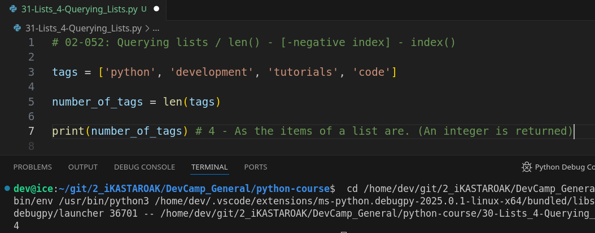
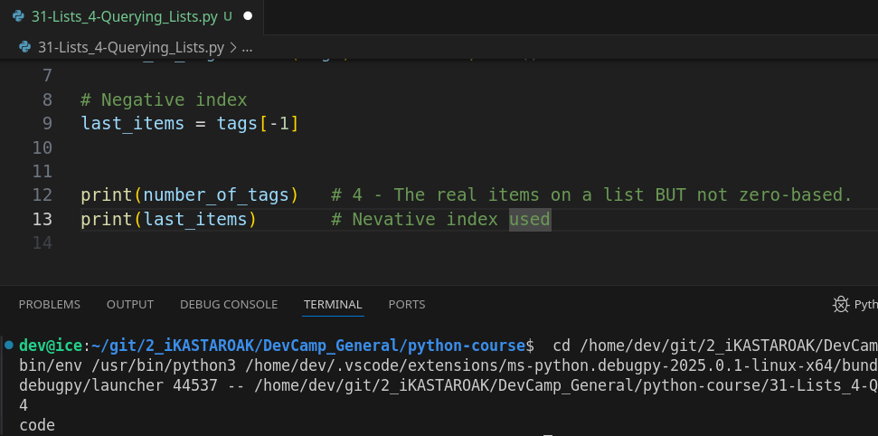
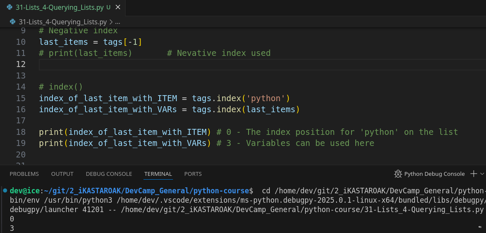

# MODULE 02 - 052: Python - List querying process / `len()` - `[-X negative indexes]` - `index()`

****

## Video lesson Speech

Now that we've covered some of the various processes for working with Python lists.   

Now we're going to see some of the popular functions you can use when you are building out programs that utilize these types of collections because there are some very common processes that you're going to use.   

It's helpful that Python already built these types of functions for you so you don't have to rebuild them yourself.

****

## len() - Length function

And one of the most common ones that you're going to be using is the length function and it's called the L E N which is short for length.

This is going to give you **the count for the full number of elements in a list** and you will discover **as you start building programs out that you are constantly checking to see how many elements are going to be in one of these**.

So, for example, I keep on pointing to the database query because I want to give you something where you feel like these examples are very practical because we can't jump in to actually connecting to a database and performing those kinds of tasks yet because there is quite a bit of overhead and other kinds of concepts you need to learn.   

So, these examples I want to get you as close as possible, so once you get to the point of working with full-blown applications there's going to be a direct connection between what we're doing now and then.  

And, so right here we have another example of a database query and so a very common thing that you're going to want to do is see how many elements were 
inside your query.

So, if you say we're building out a blog then every blog has a number of tags associated with it.   

**It is a common process to check and see how many tags are there**.   

So, when your database query comes back it gets returned to you in a list and you can simply run the len function and get back the number of tags so I can say `number_of_tags` and that's going to be equal to len.  

 Then, we're just going to pass in the list as an argument.  

 So if I run this and well technically nothing's going to print out because I need to print it.   

But we didn't get an error or anything like that so our syntax is all correct.  

So I'm going to now print out number_of_tags and you can see we have four elements inside of here.



****

#### Zero-based - "Off by one" errors

Now, one very important item I want you to keep a note of is there is a big difference between length and the index.   

So, if you think that you have a length of four which we have right here, and you go and you try to access the last element, remember the counter starts and the index starts at 0.   

Right here. So even though we have four elements inside the last index item here is actually going to be three.   It's not going to be four. And so that's what I want to continue this guide on because one of the most common bugs that I see creep up in new developers programs is off by one error.

And, what that means is you perform some type of task like looping over a list and you thought that you captured all of the values because you use something like len(), and then you run into an error because you told the Loop to go through the entire thing and then grab the element with an index of four. But that doesn't exist here and that is called **"an off by one error"**.  

> Remember, **len()** returned a NON-ZERO based index while the real index would be zero-based, so, be careful!

We need to be careful with those and so what happens if this gives us our total count. And that is very helpful.   

****

## Negatives Indexes - var[-X]

But how can you grab the index of this last item because there's going to be many times where these values not hardcoded.   

In fact, most of the lists that you work with are not going to have a hard-coded set of elements just like here.   

So, it's really easy in this example to see that the last element is going to have an index of 3 but how can I grab that without knowing the index. 

Well, there are few ways of doing it and the easiest way is we're going to cheat and we're simply going to go backwards.   

And, so I can say `last_item` and set it equal to tags and then inside of our tags bracket. 
So, instead of querying zero or ,  we want to make sure we're getting the very last element in the way that we can do that is bypassing in a negative index so I can say tag's -1 and instead of starting here -1 goes all the way to the back and it grabs this element.  



 If you remember back to the section. This is the same process that Python utilizes when you're trying to traverse through the characters of a string.

And so right here we are going back but we're not counting string characters instead we're counting back through the indexes of each of these lists elements.   

So, now we have our last item so let's come back here and if I want to print out what `last_item` is I can run this and you can see the last item is code.  

****

## index()

So, so far so good, but if you remember I wanted to show you how you can grab the index of that last element.   

So technically we can say yes it is -1 and that's how we can grab it.

But, I want to show you the other way that you can do it too.   

So, I can say `index_of_last_item` and obviously it's just a variable you can call it anything you want.   

But what I can do is call the list so I can say tags.index and then pass in the last_item and remember last item is just this string of code so we know our value here but now we're going to pass it to this index function and that is going to return us the index 
of code.  

 So, let me save that and print it. So now we're going to have `index_of_last_item` and now if I run this you can see that we have the number three that we're looking for right here.



So this is perfect.

****

So, what I wanted to do in summary is to show you how you can traverse through these elements in the very beginning.  

 Here on line, 3 we saw how we could get a count of all of the elements in the list.   

Then, I showed you how you could get the value from the last item even if you 
don't know what its index was by using a negative index.

Lastly, I showed how once you do have the value for one of your elements you 
can pass it to the index function right here and then it will go traverse through the entire list and return the index of that value.

## Code

```python
# 02-052: Querying lists / len() - [-negative index] - index()

tags = ['python', 'development', 'tutorials', 'code']

# len() function
number_of_tags = len(tags) # REMEMBER, len() is NOT zero-based.
print(number_of_tags)   # 4 - The real items on a list BUT not zero-based.

# Negative index
last_items = tags[-1]   # Negative index used
print(last_items)       # 


# index()
index_of_last_item_with_ITEM = tags.index('python')
index_of_last_item_with_VARs = tags.index(last_items)

print(index_of_last_item_with_ITEM) # 0 - The index position for 'python' on the list
print(index_of_last_item_with_VARs) # 3 - Variables can be used here
```
