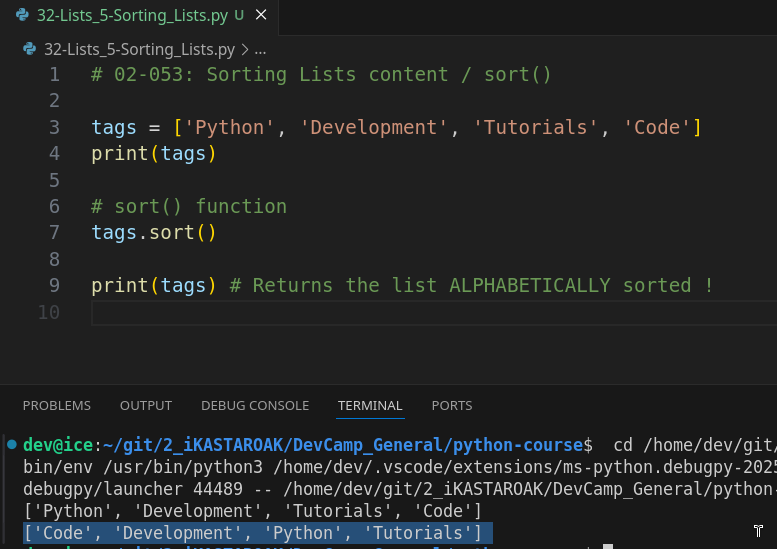
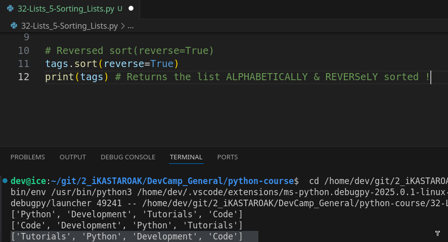
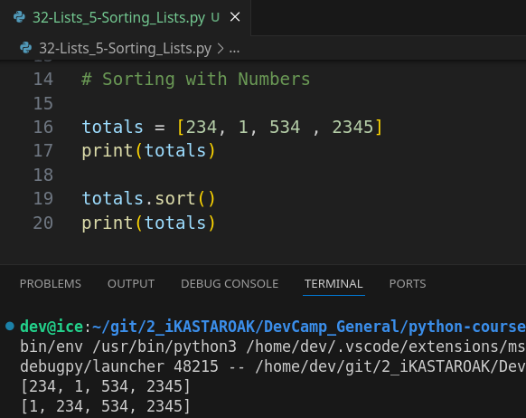
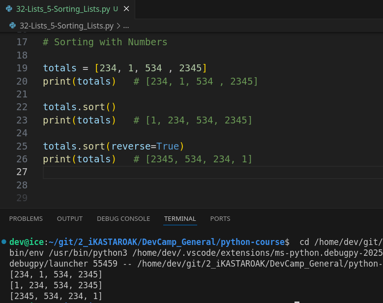

# MODULE 02 - 053: Python - Sorting Lists / `sort()`


****

## Video Lesson Speech

When working with list in python a common process you're going to have to implement is the ability to sort your elements.  

 And so right now by default the way Python works is it takes in your list in this case in 
our example we have a list of tags each one of these is a string and it is simply sorted by whatever order we added to the list because it's sorted by its index of values.

****

Python has an index here of zero development of one, and so on, and so forth.

If we print this out it's going to print them in the exact order of their index and that works perfectly fine for some circumstances.   

However, **there are also times where you may want to source elements by their alphabetical value**.  

So, here I'm just going to give us some new lines and we're going to walk through the first way that you can store elements so this is a basic way and remember that in Python lists are mutable which means you can change them.   

They're not like strings or those types of data types.   


So that means that if we make a change to our list that change is permanent so we don't have to reassign it to a value which means I can call `tags.sort()` and then I call it because it's a function and in this case, I'm going to call it with no arguments and note that here in our first example by default we got our list in exactly the same order that they are inside.  

Now, if I run yes you can see that it has swapped and now our sort function has all of the elements in alphabetical order.



We have `code`,  `development` , `python` and `tutorials`, alphabetically, so that works perfectly fine and that's something that is really nice.   

And <u>many older languages and more extensive languages like Java or one of those type they do not give you the ability to sort quite easily</u>.   

This is something that is very intuitive and after you've practiced it a few times you're simply going to remember that anytime that you want to sort a list you can simply call the sort function on it.

Now, this is great for the times where you want to sort these elements and you want it to be from a to z.   

## sort(reverse=True)

Now, what happens if you want it backward.  And that's a very common process.   

Imagine if you're building some type of news site and you want the top of the page to show the newest articles. If you called sort, it would show by default the oldest one first because that's the way sort works when it is when it comes to working with dates.  

 But if you want to reverse it you want the newest ones.   

Then what we can do is pass in an argument so I'm going to copy this and now inside of sort. What I can do is pass in an argument of reverse equals True and true has to be capitalized.

```python
tags.sort(reverse=True)
```

And now what I can do if I run this it's going to show that this has 
now been sorted and our tags are now in the opposite order. It has 
tutorials, Python, development, and then code.



So, this is taking the value of the alphabetical list and it simply flipping it back.   

So now it's going from Z to A.   

## Sorting with Numbers

Now, this is with alphanumeric characters like we have right here.   

If we have the integers the same process pretty much follows.   

So if I have said some totals such as in a shopping cart or something like that I can have a bunch of different values here and it doesn't really matter what they are but you can see how they are set up.   

If I want to print(totals) just to make sure that our integer list here works I can print it and you can see they got printed out exactly in the same order that I added them.

Now if I want to call sort so I can just call `totals.sort()` and now print this out. You can see that it sorts them by their value.



So, **this is how the sort function works and it works differently for strings than it does for integers by integers**.   

It is sorting by the value that the integer represents when it comes to strings.   

It's sorting them in alphabetical order and if you want you can obviously call 
`reverse=True` on this if I can spell it correctly. And now if I run it 
again you'll see that it goes from the greatest value all the way down.



And the sort function is pretty intuitive in being able to check to see which values are inside and which data type is contained inside of each one of these elements and then it adjusts how it performs its sorting process based off, on that.

****

## Code

```python
# 02-053: Sorting Lists content / sort()

tags = ['Python', 'Development', 'Tutorials', 'Code']
print(tags)


# sort() function
tags.sort()
print(tags) # Returns the list ALPHABETICALLY sorted !


# Reversed sort(reverse=True)
tags.sort(reverse=True)
print(tags) # Returns the list ALPHABETICALLY & REVERSeLY sorted !


# Sorting with Numbers (integers)
totals = [234, 1, 534 , 2345]
print(totals)   # [234, 1, 534 , 2345]

totals.sort()
print(totals)   # [1, 234, 534, 2345]

totals.sort(reverse=True)
print(totals)   # [2345, 534, 234, 1]


```
