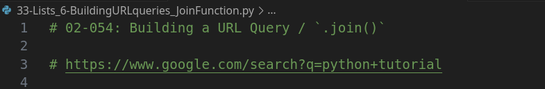
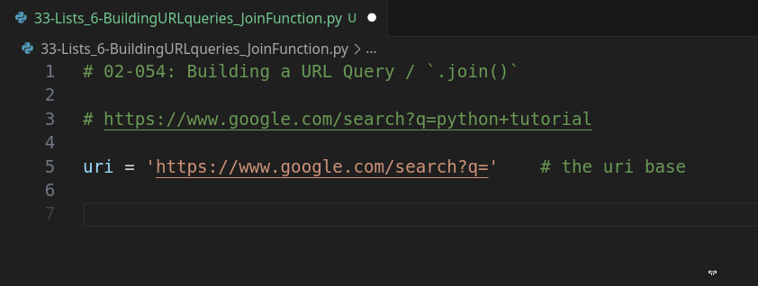
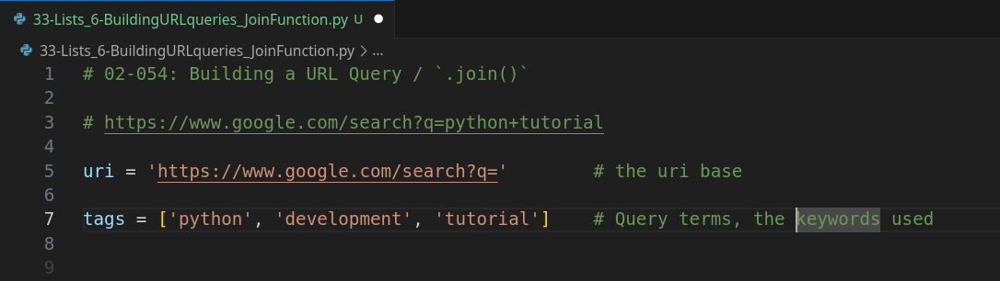
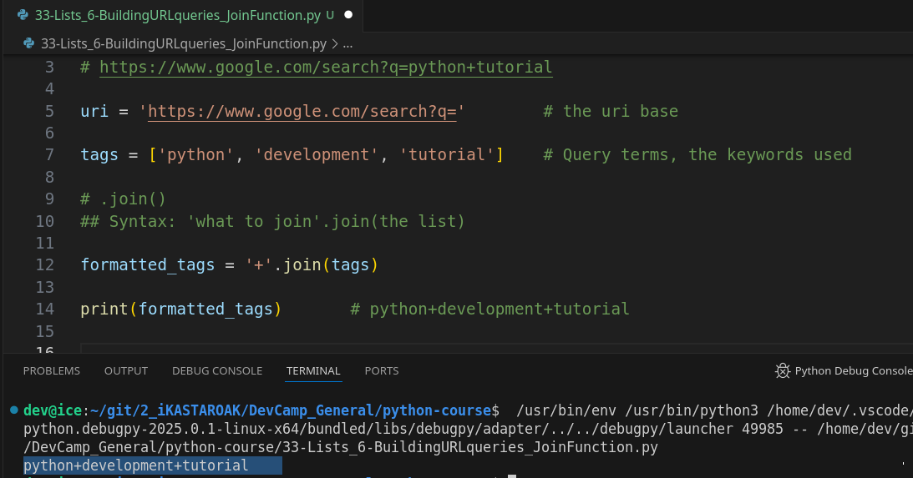
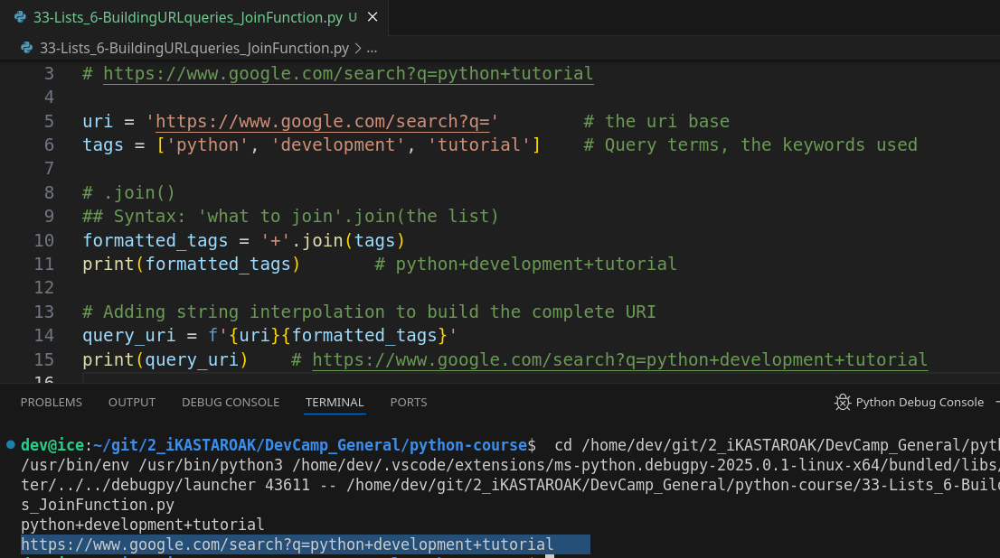
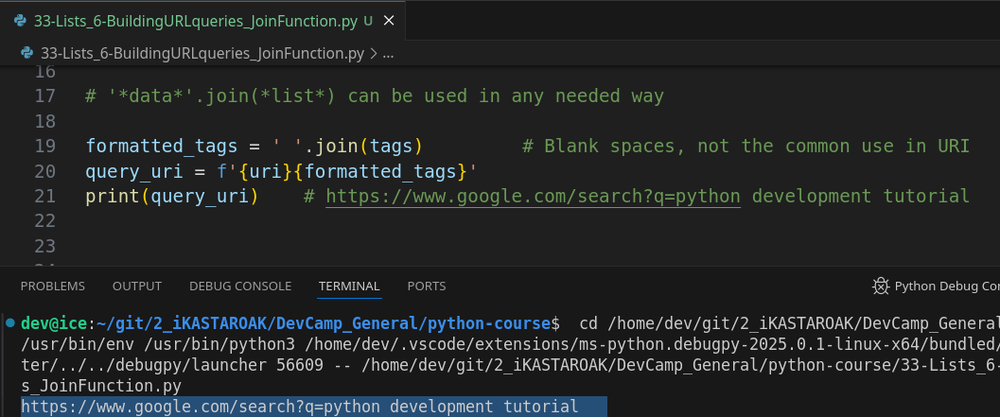
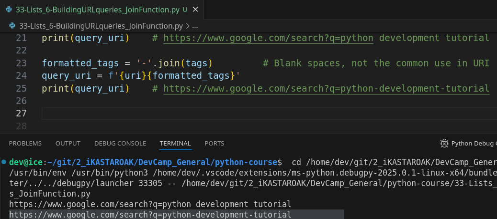
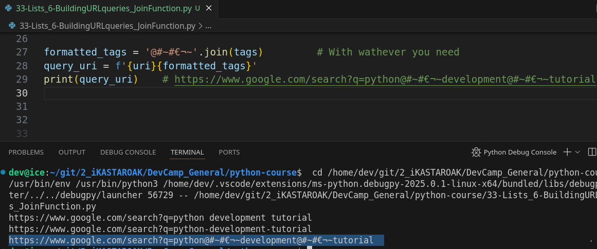

# MODULE 02 - 054: Python - Building a URL Query / `.join()`


****

## Video lesson Speech

This is going to be a really fun guide because in this guide we're going to go through how to build a practical feature that you could use in some type of application.   

And we're going to be able to learn about lists and also the join function.

****

To test this out the first thing we do is open up a new browser window.  

 And if you go to Google and you search for anything, for example a Python tutorial just like I have up here, you may notice that not only does it bring these results but if you go to the very top in the URL you'll see that it has this search string.  

 And this is actually how the browser is able to interpret what we're wanting.   

And this is the search string that gets sent to the Google servers so that they can return the result set.   

I'm going to cut this and bring it here and I'm going to add a comment. And this is going to be our string.  



Now, I'm going to get rid of some of this data because some of it's specific so it shows that Google is looking at the type of browser.

I'm on and the source ID, and the formatting encoding things like that.  

 I'm just gonna get rid of that because we don't really care about it right now.   

And I'm also going to get rid of this "oq" It's a secondary kind of search that they're doing but we don't need that.

Because I want to drill this down to the most basic type of setup here.   

So what we have is this url and so it's `Google.com/search?q=`.

Then, in place of a space because url can't have a space, they slide this
 plus in.  

 And so what we're going to be able to do is I want to replicate this process.   

That would be a pretty fun thing to build.   

So the first thing I'm going to do is I'm going to grab everything except for the search terms so I'm going to come down here and create a variable called `URI` and paste this in as a string.



Now, if you are not familiar with web development URI and URL can be used in many senses interchangeably especially for what we're discussing now.   

It's not till you get more advanced kinds of DNS and networking kind of configurations where the difference comes in.   

I just wanted to use this as a variable name just so you would be able to see that there 
really is such a thing called a URI.   

And it's very similar to your route which is just a web page.

So, now let's look at our search terms. So say that I want to do something like this.   

I can say tag's and this is where I'm going to put my terms and just so you can see how we can make this a little bit more complex.   

Let's add another one so we only have two words here.   

Let's see that we can also replicate this with three.   

So, if I want to do `Python plus development plus tutorial`, then, this is what we're going to build because this would be easy to do with just two word.

But it starts to get a little bit more complex when you say that there might be two words, there might be 10 words, and so on, and so forth.

So, we need to **be able to build this whole URI query string based off** of that and we aren't going to know how many elements are going to be there so we have to be dynamic with how we're building it.

Now, I'm going to create a list here and, in the list, it's going to be a set of strings which are going to be our query terms.   



So, Python, development and tutorial.   

That is our set of our search terms and we're going to keep them as a list of strings.  

****

## Building the query syntax with .join()

Now that we have that let's create a new variable. So this is going to be called our when we can call this anything we want say formatted tags and so what I'm going to do here is I am going to leverage the join function and the way join works is it is actually a string-based function.  

 So, what we want is this  plus sign here to be our separator.  

 What we're essentially trying to do is we're trying to join each of these elements together turn them into a string.  

 But we need to tell python what we want to put inside there so we need to tell it what we want to use as the delimiting character in this case we want a little plus sign.   

So, with that in mind, the very first thing we do is add a string that is the plus this is 
going to be our delimiter.


And then I call join and then we pass in an argument which is our list.  

So, I'm going to pass syntax.   

So, here what we're doing is I have a string of plus I'm saying I want you to join all of the tags together and I want the delimiter I want the thing that you put in between them to be this string.

Let's just take a look to see what we have right now. 

If I do print formatted tags and run it there we go `Python plus the development plus tutorial`.



That's exactly what we're looking for.

****

## Building the URI using String interpolation

Now, let's combine what we know about string literals and interpellation and to build out that entire URI.   

So, I'm going to create another variable called `query_uri` and I'm going to use our string literal syntax here where it's `f'  '` .

Then, inside of that, I can just use curly braces, so I'm going to combine the 
URI.   

Lastly, the formatted tags close it off.

And, now if I print this out, I should have a query URI we should have exactly what we have right up here.  

 So let's run it and look at that. We have our full string.



So, we have the URI combined with our tags which are then separated with the plus.

Part of the reason why I'm so excited about doing this specific lesson is because this is very similar to exactly what Google does so, when you're needing to build a query string in something exactly like what we have right up here which is what Google does. 

These are the steps to do it. So right here we're able to take in a list. 

We took in a list of search terms and then we were able to put those together combine them make them a URL friendly kind of format and then combine it with the URI.  

 Just like we did right there and as you can see this is literally exactly what we put up inside of the search bar whenever we were searching for something on Google.

### '*data*'.join(*list*) can be used in any needed way

Now, just as a point of clarification, you could use anything that you want right here.   

For example, if I just wanted spaces I could do an empty space in between the tags and notice that now are format strings is separated with an empty space.



Another popular one to do is a minus sign a little dash.   

Now you can see that we have dashes right there and so you can put anything that you
 want.



You could put asdfasdf and when this gets printed out you'll see that
 it slides whatever string we put right here. It slides in between each 
one of these elements and it returns a single string.



****

One of the biggest keys when it comes to understanding programming and computer science is :

>    I like to try to drill down any new concept into understanding what the inputs are and then what the output is.   

If you can drill down a development topic into that you can understand anything because right here you can see the inputs are some type of delimiter and then a list so you know that those are the two elements that you need to pass to join.

So, then, you know the output is going to be a single string and in this case, we're storing it inside of our formatted tags variable and then we can treat it like any other type of string.  

 We can combine it with others like we did there.   

We could search through it.   

We could do anything like that that we want. 

So, in review, that is how to use the join function in python.

****

## Code

```python
# 02-054: Building a URL Query / `.join()`

# https://www.google.com/search?q=python+tutorial

uri = 'https://www.google.com/search?q='        # the uri base
tags = ['python', 'development', 'tutorial']    # Query terms, the keywords used


# .join()
## Syntax: 'what to join'.join(the list)
formatted_tags = '+'.join(tags)
print(formatted_tags)       # python+development+tutorial


# Adding string interpolation to build the complete URI
query_uri = f'{uri}{formatted_tags}'
print(query_uri)    # https://www.google.com/search?q=python+development+tutorial


# '*data*'.join(*list*) can be used in any needed way

formatted_tags = ' '.join(tags)         # Blank spaces, not the common use in URI
query_uri = f'{uri}{formatted_tags}'
print(query_uri)    # https://www.google.com/search?q=python development tutorial

formatted_tags = '-'.join(tags)         # With the minus sign
query_uri = f'{uri}{formatted_tags}'
print(query_uri)    # https://www.google.com/search?q=python-development-tutorial

formatted_tags = '@#~#€¬~'.join(tags)         # With wathever you need
query_uri = f'{uri}{formatted_tags}'
print(query_uri)    # https://www.google.com/search?q=python@#~#€¬~development@#~#€¬~tutorial

```


