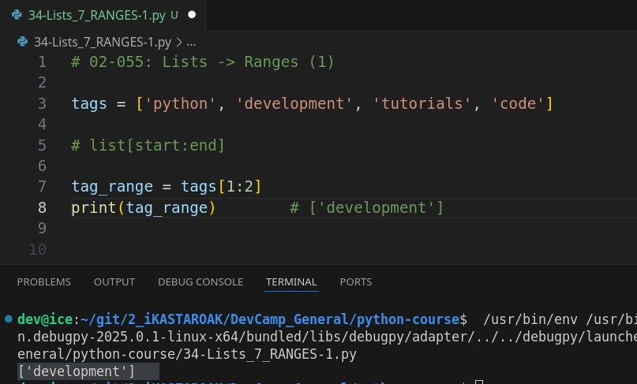
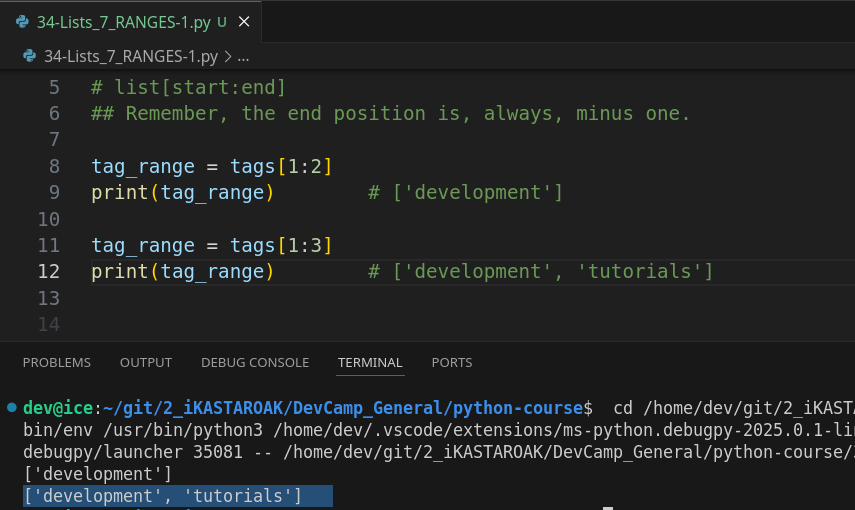
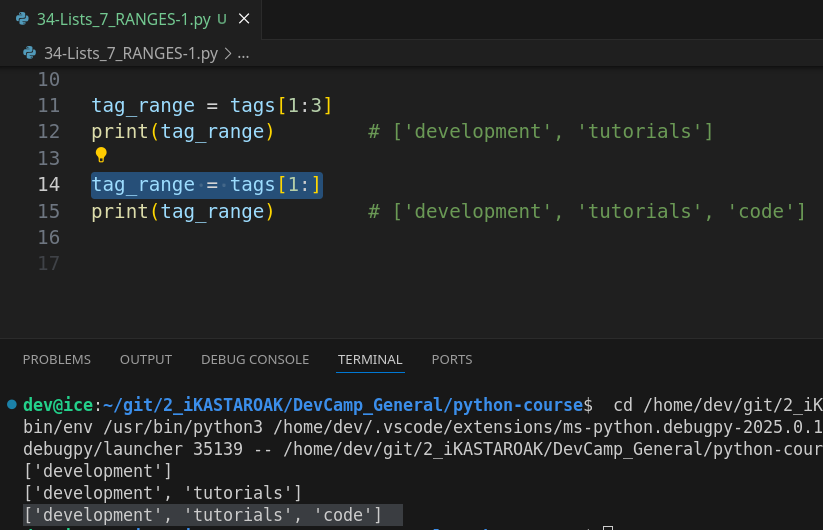
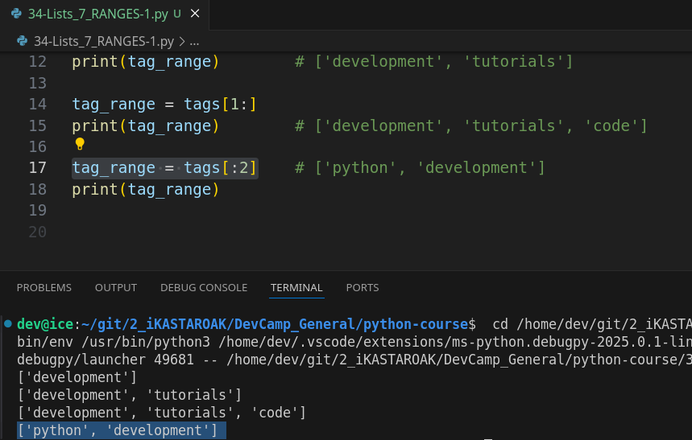
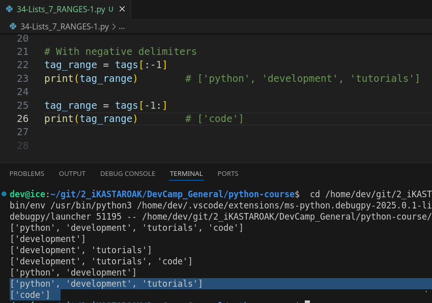
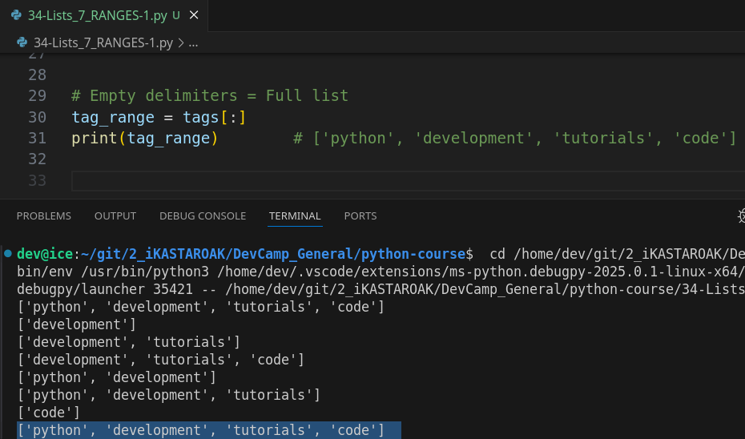

# MODULE 02 - 055: Python - Lists - Ranges (1)


****

## Video lesson Speech

In this lesson, we're going to walk through ranges inside of Python lists.

A range, if you remember back to when we started working with strings, and we saw how we could grab a few set of characters by using ranges and strings.   

We have this same ability inside of Python list.

****

So right here we have a list of tags

```python
tags = ['pyton', 'development', 'tutorials', 'code']
```

it's a list that has four elements inside of it and it's stored inside of a tag variable.   

If we want the ability to only grab a few of these items then a list range gives us the ability to do that.   

I'm going to start off by giving a pretty basic one.   

I'm going to create a new variable here called tag range and I'm going to grab this and the syntax for this is going to be exactly the same as when we used ranges with strings:

```python
tag_range = tags
```

If you're familiar with that then this should be pretty straightforward for yo.u.

 I'm going to start off by doing a pretty basic one where I simply go from `[1:2]` and so now let me print out I'm gonna say `print(tag_range)` and if I run this you're going to see it prints out development.



Now, as a reminder of this part kind of went past you when we wereworking on strings, the second argument here in the range is not included in the results. That comes back.   

So if we look at this list you can see that we have Python which has an index of zero development which is one and then tutorials which has an index of two.

So if we run a range here and we give an index of two tutorials is not going to be included.   

It's going to stop right here it's going to stop before it gets to 2.   

That's a way that ranges work inside a python.  


 If we truly do want the elements of index 1 and 2 then we have to go 
one-up the chain so we have to go to a tag with an index that is three. 


So now if I run this you'll see that it brings back development and 
tutorials.



Now, this syntax also allows us to grab ranges that go from end to end.   

For example, if I wanted to bring back all of the tags starting with the index one which is developing all the way to the end, I cpuld do tags with the brackets pass in the first value a colon and then not pass in anything as the second argument in the range.

```python
tag_range = tags[1: ]
```

So if I run this you can see it brings back development, tutorials, and code



and if I had a thousand other elements after this it would bring back the thousand other elements it's going to go all the way to the end of the list.  

This is also works exactly in the same way.   

So, say that I want to start at the beginning and go to the index of two:

```python
tag_range = [ :2]
```

If I run this you can see it brings back Python and development



But not `tutorials` because once again it stops, it doesn't bring us the second elementary.

 I should say the index to back instead it simply stops right before that.   

So that works on both sides of the chain.

Now, we already saw how we can grab each one of the elements with those specific ranges.   

What happens if I want to bring all of the elements back except the one at the very end.   

Well, thankfully there's a pretty easy way of doing that I can either start with zero here or I can also just start with it completely blank as on the first argument here if you ever want everything from the beginning you never have to pass in a zero.   

Now, you can.

And it's going to work exactly the same way but technically having this blank and having nothing there versus having a zero there is completely pointless both of them do exactly the same thing.  

 So, if I want all of the elements except the last one what I can do is just pass in a negative index because remember that negative one will go to the very back of the list and it will add this one as the delimiters so this is going to be the one where our range stops so now if I print this out you can see we get one two three and that's it stops  right there at code because this as an index of negative 1:



Lastly, I want to show you one that is pointless except for learning which is what we're here for and that is you do have **the ability to technically pass in all of the elements** so , if you put two blanks or you put nothing on either side of the colon and run it you will see that it brings back all of the elements here.



Now, I'm spending some time in showing you **the syntax and showing all the different variations for it because this is incredibly important** when it comes to Python development and especially if you want **to go into the machine learning** side of Python because as you will see when you start to get into these algorithm implementations and data manipulation that you're going to have to do to build out these data science programs this syntax with these ranges.   

**This is going to be in almost every single program that you build**.   

So, I highly recommend for you to be able to experiment with that for this to become second nature for understanding exactly the way ranges work because you are going to be doing this on a daily basis so definitely get this ingrained in your memory try out a number of other variations see exactly the way that these ranges work.   

And it's going to give you a very nice leg up when you get into more advanced topics.

****

## Code

```python
tags = ['python', 'development', 'tutorials', 'code']
tag_range = tags[2:]
tag_range = tags[0:2]
tag_range = tags[:2]
tag_range = tags[0:-1]
print(tag_range)
```


