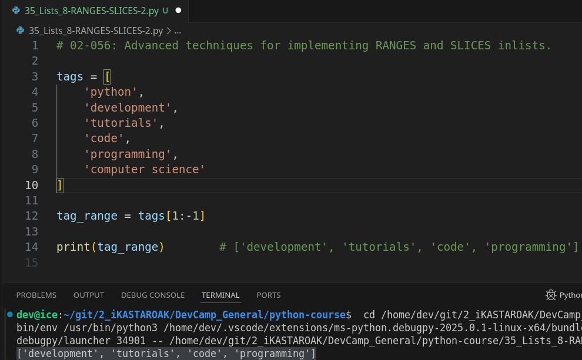
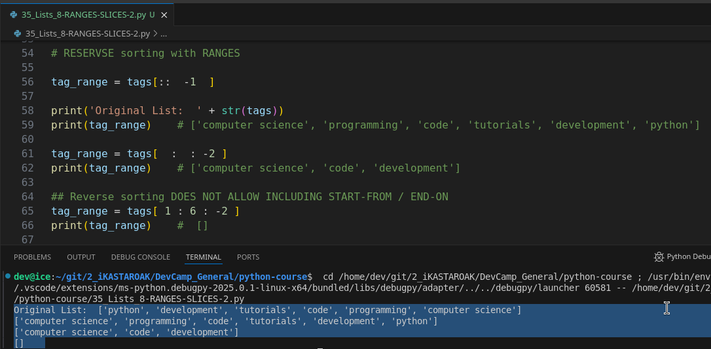
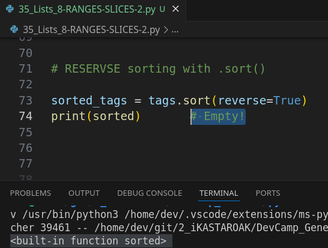
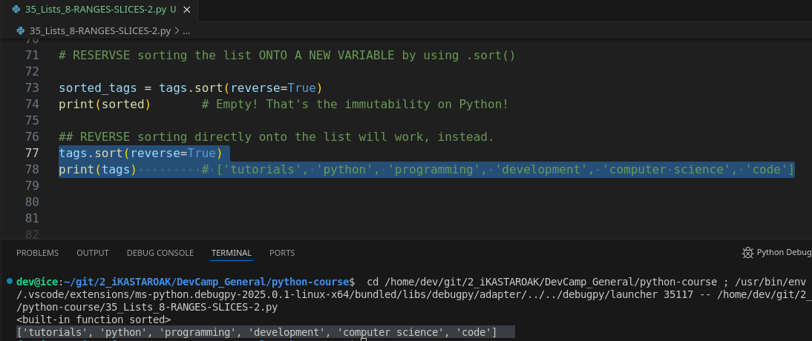

# MODULE 02 - 056: Python - Lists - Advanced techniques for Implementing RANGES and SLICES

****

## Video lesson Speech

In the last guide, we walked through ranges in Python lists.   

Now, important key to know is that **depending on what developer that you're 
speaking to ranges and the word slices are used many times interchangeably usually ranges are referred to in working with strings**. 

But I **have heard a number of developers also refer to them in the same context when working with lists, probably because the syntax is nearly identical.**

****

I want to give you a little bit of a heads up 
on that. And now we're going to extend that knowledge and we're going to
 talk about how we can use it advanced ranges and advanced slices inside
 of Python lists. I've extended out our list of tags here so I've added a
 number of elements such as programming and computer science so that we 
have a little bit more data to work with.

```python
tags = [
 'python',
 'development',
 'tutorials',
 'code',
 'programming',
 'computer science'
]
```

I'm going to come and create a range here.   

And so I'm going to set the sequel to tag's and inside of the brackets what I'm going to start with is going to look pretty similar.   

So, say that I start with a one followed by a colon followed by a negative one.   

What is it going to do is it's going to start with the second element with the index of one here.   

So it's got to start with development and then it's going to go and it's going to go all the way up to the very last element.   

It's not going to include it because remember with ranges and slices it is going to simply end right before this element.

So, it's going to go all the way and it's going to skip computer science that is so far what we've covered.   

So, if I print this out you can see that you will have a tag range that includes development all the way through programming.



So, it skips the first one and the last one and includes everything else inside of it.

## Slicing Lists with intervals [ inclusive : exclusive : interval ]

First of all, let's understand how this works:

Let's understand what each part means:

- `a`: The starting index of the slice (inclusive). If omitted, it defaults to 0 (the beginning of the list).
- `b`: The ending index of the slice (exclusive). The item at this index will *not* be included in the slice.
- `c`: The step or interval. It determines how many items to skip between each selected item.

Now,  when it comes to more advanced slices what we can do is actually pass in a third element here.   

So, adding another colon you can pass in an interval. So right here let's imagine a scenario where we want every other tag.   

So, what I can do is pass in two and let's actually start at the very beginning.   

So, I'm going to start with nothing here right in front of the colon and remember what that means is it's the same as putting a zero there.  

 It's going to include that very first element. It's going to go stop right before the last one and what it's going to do is take every other element.

So, let's see what this output looks like.  

 If I run this you can see out of our six items here.   

We have had three that were returned. We had Python tutorials and programming.   

So, as you can see it did exactly what it was supposed to do.   

It grabbed Python tutorials and programming.   

So, that works perfectly fine.  

 And this is going to be something that you will come across especially in the machine learning space that is going to be quite a bit of data manipulation that you have to do.   

And, one of those is going to be doing things such as grabbing every other element 
in a list and this makes this very easy and straightforward.

Now, the next thing I'm going to dois to Copy this.  

 And this was a little tip and trick that I was very excited about when I found out about it when I was learning Python because this one item is actually a little bit challenging to do in many other languages.   

So, imagine that we have a scenario where we have all of our tags here we have Python here with an index of 0 development with an index of 1 all the way to computer science as an index of 5.

What would you do if I said that I want you to reverse all of those index values?  

 So, in other words, it's kind of like turning the entire list on its head.  

 So, computer science would actually be where Python is programming would be where development is so on and so forth all the way down.   

How would you do that?

Well, by utilizing this slicing technique I'm gonna show you. It's actually very straightforward.   

if I come here and I remove the second parameter so we have simply a colon followed by another colon followed by a negative one, what we're going to get is exactly what we're looking for which is to flip the entire order of the list.   

So, if I hit return you can see that now. 

The first element is computer science. The second one is programming. The third one is code all the way up to Python being the very last element.


I can't tell you how much more straightforward this is than many other languages.   

This could take dozens of lines of code and looping through the entire structure and performing those kinds of tasks.  

 We're right here by utilizing the slicing functionality provided by Python. It
 makes it pretty straightforward.

****

## A better way to understand the slices [ : : ]

```python
# Slicing [ inclusive : exclusive : the range ]
"""
What slice ranges do:
- Inclusive: The starting index of the slice.
- Exclusive: The ending index of the slice.
- Interval: It determines how many items to skip between each selected item.
"""

tag_range = tags[:-1:2] # From 0 to the Second-Last, take EVERY TWO items
print(tag_range)        # ['python', 'tutorials', 'programming']

tag_range = tags[1:4:]  # Same as [1:4], take ALL the items
print(tag_range)        # ['development', 'tutorials', 'code']

tag_range = tags[1:5:2] # From First to Fifth, take EVERY TWO items
print(tag_range)        # ['development', 'code']

tag_range = tags[1:5:3] # From 1 to 5 - From 1st to 5th, take EVERY THREE items
print(tag_range)        # ['development', 'programming']

tag_range = tags[::2]   # From Start to End, take EVERY TWO items
print(tag_range)        # ['python', 'tutorials', 'programming']

## A better slicing understanding:

numbers = [1, 2, 3, 4, 5, 6, 7, 8, 9, 0]

ranges = numbers[::3]       # From the Beginning to the END, take every THREE items
print(ranges)               # 1, 4, 7, 0

ranges = numbers[::4]       # From the Beginning to the END, take every FOUR items
print(ranges)               # 1, 5, 9

ranges = numbers[2:-1:2]    # From 3rd to SecondLast, take every TWO items
print(ranges)               # 3, 5, 7, 9
```

****

Now, if your next question is why in the world would we need to do that when we already have a sorting function.   

Well, I want you to think about it.  

 And in fact, I want you to even pause the video right now and think about what that difference is going to be because in a sense we did just perform a resort.   

But there's a very key difference with how the sorting function works so I want you to think about it come up with your answer then I'm going to walk through the solution where you can see what key difference is.

If you went through with that exercise great job if not or if you couldn't figure out what the differences are. Let's walk through it right here.

So, as we can see we were able to flip the entire list on its head.   

And, essentially we resorted it but that's very different than the way that Python resorts items.   

So, if I were to come here and let me comment all of this out including the print statement I'm going to say `tags.sort` and then pass in reverse equals true.

## Reverse Sorting [ : : -1]

Now, I'm going to call print tags, now get a good look at what we have right here where computer sciences first followed by programming code tutorials all of those and in fact let me copy this and I'm going to make this a comment.   

Just so we can see and reference it.  

 So, now, let's see what this code gets us.   

If I hit return you can see we have a very different result set.  

 Let me put it right here so that we can look at them and see what the difference is.



So, when we were reverse sorting by the index value we were able to look at the very last element and then put it in the first place, then `programming` which was the second one. And we put it there.  

 All that our method here did was it just cared about the index value and swapping 
those out sort works very differently.

So, the way the sorting function works is it looks at the alphabetical value.  

 That's the reason why when we reverse this we got tutorials first because tutorials and the letter T is the very last element inside of that list from an alphabetical perspective then Python then programming. So on and so forth.   

So, I wanted to point that out because that is a very important key difference.  

 We are performing sorting in both of these options so we sorted our list just like we did here.  

 We also sorted the list right here. However, they were looking at different criteria to generate the new results set.  

****

## Reversing the list onto a new variable using  `.sort(reverse=True)` will return None!

One last item that I want to point out because you may or may not have run into this issue but the sorting function here is a little bit tricky if you're not used to working with Python or if you're used to working with other languages and I'm going to show you exactly how it's tricky here.   

So, let's say that I want to create a variable called `sorted_tags = tags.sort(reverse=True)`.  

if I want to print this out let's see what happens. So if I run this I get none.



**That's weird** because I kind of would have thought that I would have gotten exactly the values that I got here because that is exactly what I thought I was doing was I was sorting in reverse.

**But, this speaks directly to Python's view on immutability. ** 

I brought this up throughout this entire course in the string section, in the list section, and the reason is because **it is absolutely critical to understand how python views how you can change things, what you can change, what you can't change, and so on, and so forth ....**  **

****... because that speaks directly to how you can use python in the machine learning space**.  

And so with what we've done here is **Python is so careful about immutability** that sort doesn't actually return anything.   

So, that is what's happening here. So sort will go and it will change the order of the tags so it will go in and it will, in this case, reverse them it'll sort them alphabetically it'll perform its full set of tasks and it will change tags but it will not return that value.

And, this may if you've never seen this before don't worry.   

I understand this part is confusing and even if you've come from another programming language this topic is a little confusing but I wanted to introduce it to you now because the further we get into the course you're going to start to see this more and more.   

So, I wanted to kind of give you a little intro to it here.   

But the key is that **the sort function goes in and it changes tags but it doesn't store it as a standard operation inside of a variable.**

So **if you try to assign it, it's going to give you exactly what it gave you right here..... which is none**.   

This is very very unique to languages like Python that really embrace immutability what they're trying to do is they're trying to give you a warning that you've just changed an 
entire set of elements so you change this entire tag's list when you sort it out it doesn't want you to think that this tags list was unaffected.

And, so if we were to print out let's test this out because it's exactly what we just did.   

## However, reversing directly the list... will work!

But let's say that we sort this and we don't assign it to a variable and then we want to print out the tags.   

You can see they have been sorted even though we didn't store this in a variable.



So, it went and it changed all of the elements and the order and everything inside of the list.   

But if we tried to store it in a variable it wouldn't work.  

 And it's because Python is very picky about what kind of values get returned whenever you've changed all of the elements of a list I just wanted to point that out.

****

So, in review, we've covered a number of more advanced topics.   

When it comes to working with lists in Python we talked about some advanced ways that you can implement slicing and then we also compared that with the sorting functionality and even dived a little bit into the concept of what kind of values get returned with functions such as sort.

## ****

## Code

```python
tags = [
 'python',
 'development',
 'tutorials',
 'code',
 'programming',
 'computer science'
]
tag_range = tags[1:-1:2]
tag_range = tags[::-1]
print(tag_range)
tags.sort(reverse=True)
print(tags)
```
