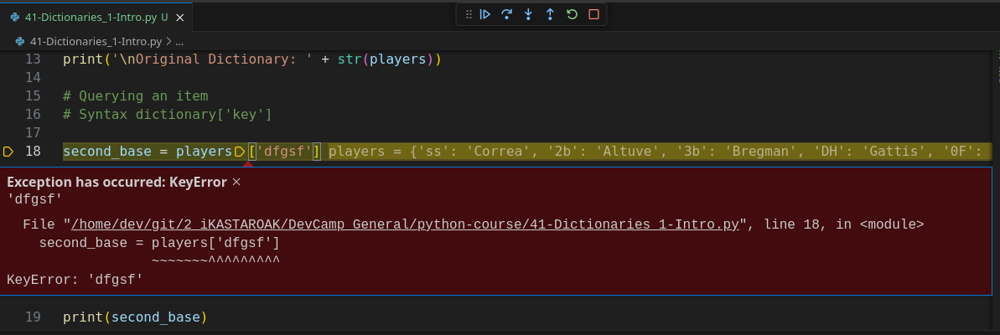

# 02-062\_Dictionaries\_intro

### MODULE 02 - 062: Python: Dictionaries

### Introduction to Dictionaries in Python

Dictionaries are one of Python's core data structures, providing a powerful way to store and manage key-value pairs.

Unlike lists, which use numerical indices, dictionaries allow you to reference values by meaningful keys, making data retrieval more intuitive and efficient.

📌 **Python Documentation:** [Dictionaries](https://docs.python.org/3/tutorial/datastructures.html#dictionaries)

***

### **🔹 Defining a Dictionary**

The syntax for creating a dictionary in Python uses curly braces `{}` with key-value pairs separated by colons `:`.

```python
# Defining a dictionary
players = {
    "ss": "Correa",
    "2b": "Altuve",
    "3b": "Bregman",
    "DH": "Gattis",
    "OF": "Springer"
}
```

✔ Each key in the dictionary is unique and maps to a corresponding value.

#### **Dictionary Example Output**

Printing the dictionary displays its contents:

```python
print(players)
```

**Output:**

```python
{'ss': 'Correa', '2b': 'Altuve', '3b': 'Bregman', 'DH': 'Gattis', 'OF': 'Springer'}
```

***

### **🔍 Querying a Dictionary**

To access a value, use the corresponding key inside square brackets `[]`:

```python
second_base = players["2b"]
print(second_base)  # Output: Altuve
```

If a key does not exist, Python raises a `KeyError`.

```python
print(players["xyz"])  # Raises KeyError
```

🔹 **To prevent errors, use the `.get()` method**, which returns `None` if the key is not found:

```python
print(players.get("xyz"))  # Output: None
```

📌 **Python Documentation:** [Dictionary Methods](https://docs.python.org/3/library/stdtypes.html#mapping-types-dict)

***

### **🔄 Adding & Updating Dictionary Entries**

You can add new key-value pairs or update existing ones:

```python
players["C"] = "Maldonado"  # Adding a new entry
players["OF"] = "Brantley"  # Updating an existing entry
print(players)
```

✔ **Dictionaries are mutable**, meaning they can be modified after creation.

***

### **❌ Removing Items from a Dictionary**

To remove an item, use the `del` statement or `.pop()` method:

```python
del players["DH"]  # Removes the key 'DH'
print(players)
```

```python
removed_player = players.pop("OF")  # Removes 'OF' and returns its value
print(removed_player)  # Output: Brantley
```

📌 **Python Documentation:** [Removing Elements](https://docs.python.org/3/tutorial/datastructures.html#dictionaries)

***

### **📜 Iterating Over a Dictionary**

You can iterate over keys, values, or both:

```python
# Iterating through keys
top_players = {"SS": "Correa", "2B": "Altuve", "3B": "Bregman"}
for key in top_players:
    print(key, "->", top_players[key])
```

✔ **Output:**

```python
SS -> Correa
2B -> Altuve
3B -> Bregman
```

```python
# Iterating through values
for value in top_players.values():
    print(value)
```

```python
# Iterating through key-value pairs
for key, value in top_players.items():
    print(f"{key}: {value}")
```

📌 **Python Documentation:** [Dictionary Iteration](https://docs.python.org/3/tutorial/datastructures.html#looping-techniques)

***

### **📌 Summary & Best Practices**

✔ Use meaningful keys to improve readability.\
✔ Avoid mutable objects (like lists) as dictionary keys.\
✔ Use `.get()` to avoid `KeyError` exceptions.\
✔ Iterate using `.items()` for better efficiency.

***

### Video lesson Speech

Now that you should have some familiarity with how to work with lists in\
Python it's time to move on to our next data structure which is the\
dictionary. In this guide, We're going to take a high-level overview of\
what dictionaries are, how to create them, and how to work with them in\
Python.

***

Now, a dictionary is what's called a key-value data store.

What that means is that we can store this in a variable we can create not just elements the way that we did with lists but we can create a key with a corresponding value.

And one of the easiest ways I think to understand it is by working through an example you know the syntax for creating a dictionary in python is to use curly braces and\
typically as long as you're working with a relatively large type of structure you're usually going to want to place on multiple lines.

The way I'm doing right here.

So, the syntax is to start with a string.

So, in this case, I'm going to give a list of baseball players so I'm going to say ss which stands for shortstop and then from there supply a colon and then a value.

What I've done here is I have created a key-value pair:


So we have created just in these three lines of code.

Our first dictionary we have a dictionary that is stored inside of the players\
variable and it has one element it has a key of ss and then it has a value of Correa.

So, if we were to print this out we're going to see our structure right here and we can see our syntax is all good because it printed out exactly like we would want it to.


Now let's add in a few other elements and the way you add more is by adding a comma and then you can simply go and add as many as you want.

I think I'm going to go with 5 right here and change these up so the next one's going to be 2b for second base.

Give this a value of Altuve than 3b for third base and that's going to be Bregman then DH for a designated hitter is going to be Gattis and the last one we're going to\
have here is OF for outfield and that's going to be Springer.

```python
players = {
 "ss": "Correa",
 "2b": "Altuve",
 "3b": "Bregman",
 "DH": "Gattis",
 "OF": "Springer",
}
```

So now if I run this is going to go and it's going to print out our full dictionary.


Now, this is a very different type of structure than a list.

They both have elements inside of them but now instead of working with an\
index the way we do with the list is how you can query an element by having an index value with a dictionary.

We use a key-value structure which means we pass in the key in order to access the value.

Now, I love the name that the python developers went with when they created the concept of dictionaries because it has a real-world example imagine that you have an old-style, meaning a printed version of a dictionary, I know most of us probably just go to Google or to dictionary.com but let's jump into our time machine and go back a few\
decades and let's take out a printed version of a dictionary if you wanted to find a word in that dictionary.

You would go through the set of keys.

So, in other words, you would flip through the pages and each one of the pages would have some type of representation of a letter and then from there, you'd be able to go and find the value that you want.

### Querying a value

When we're talking about dictionaries in Python it's the same concept where we have some way of referencing this so \*\*we actually are working with words instead of indices \*\*and so that is a very very important distinction between the two.

Now, how do we query these values?

Thankfully it has a very similar syntax to how we would query values in a list.

So, you're not going to have to learn a completely different syntax if I want to grab the second bass player here.

What I can do is call players and then pass in instead of an index just pass in the string value of that key and now I'm going to replace this instead of players I'm simply going to pass in second base which is our variable here and if I run this you can see it\
returns Altuve:


which if we go and we reference it we can see that that is accurate.

So that is working properly.

Now, let's say that we have a typo, or let's say we try to find a key that isn't there.

Let's see what happens now.

Now if I run this you can see that we get an error



and that may seem like a bad thing.

However, you will find in many different programs and many different applications that you build,\*\* this is actually very good behavior because other languages are much more\
forgiving than python and that can lead to silent bugs.\*\*

Imagine a scenario where you have some type of mistake happen and the wrong key is entered in with other languages.

It may not throw in error it might actually just go and say nil or it may say something like couldn't find that key. And so you may run into a bug that you don't realize is just data related.

Whereas with python it's a very good at is giving you an indicator of what the problem is.

So if we ever ran into a key error just like this and we saw this value we would know what the problem is and then we could go reference it and say oh there is no key\
in this structure with asdf and then we can go fix it.

Run it again and everything is working and you can grab as many of these as you want.

So just for the sake of practice.

Let's grab another one so if I say designated hitter I go access it and type in DH let's put that there.

Run it and you can see it brings back Gattis. Now, this is case\
sensitive so if I type DH right here and run it it's going to throw us\
the error.


So make sure that whatever string bass key that you're looking up is\
an identical match. And whenever you're building this into a program you\
are most likely going to be passing in these kinds of direct match kind\
of values. You are not going to be hard coding like we're doing here.

So this is a high-level overview of how to work with dictionaries in\
python. So we've seen the syntax we've seen how we can create them.\
We've seen how we can query them and also walk through the entire\
structure of a key value based data structure.

### Code

```python
# 02-062: Dictionaries, intro

# Syntax { 'key' : 'value', 'key2' : 'value2', ... }

players = {
    "ss" : "Correa",
    "2b" : "Altuve",
    "3b" : "Bregman",
    "DH" : "Gattis",
    "0F" : "Springer"
}

print('\nOriginal Dictionary: ' + str(players))

# Querying an item
# Syntax dictionary['key']

second_base = players['2b']
print(second_base)

"""
## Calling an unknown key will throw an error:

second_base = players['sdfsdfsdfsdf']
print(second_base)


## Also, syntax is lower-UPPER/case sensitive

second_base = players['2b']
designatted_hitter = players['dh']
print(designatted_hitter)
"""
```
