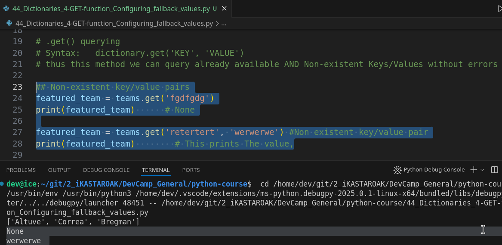

# MODULE 02-065: # MODULE 02-065: Python - get() - Configuring Fallback Lookup Values on Dictionaries

## Introduction

When working with dictionaries in Python, attempting to access a key that does not exist will raise a `KeyError`. This can disrupt program execution if not handled properly. To mitigate this, Python provides the `.get()` method, which allows querying dictionary keys while specifying a fallback value in case the key is missing.

Using `.get()` is considered a **best practice** in Python when dealing with dictionary lookups where keys may or may not exist.

📌 **Python Documentation:** [Dictionaries - get()](https://docs.python.org/3/library/stdtypes.html#dict.get)

***

## Basic Dictionary Lookup

```python
teams = {
    'astros': ['Altuve', 'Correa', 'Bregman'],
    'angels': ['Trout', 'Pujols'],
    'yankees': ['Judge', 'Stanton'],
    'red sox': ['Price', 'Betts']
}

featured_team = teams['astros']
print(featured_team)  # Output: ['Altuve', 'Correa', 'Bregman']
```

✔ This works fine **if the key exists** in the dictionary.

***

## Handling Missing Keys with `.get()`

If we attempt to access a non-existent key using the standard method (`teams['mets']`), Python will raise a `KeyError`. Instead, `.get()` allows querying safely:

```python
featured_team = teams.get('mets')
print(featured_team)  # Output: None
```

✔ When the key does not exist, `.get()` returns `None` instead of raising an error.

***

## Using a Fallback Value

A second argument can be passed to `.get()` to specify a **fallback value**:

```python
featured_team = teams.get('mets', 'No featured team')
print(featured_team)  # Output: "No featured team"
```

✔ This prevents program crashes and provides useful feedback when the key is missing.

***

## Example: Querying Both Existing and Non-Existing Keys

```python
# Non-existent key (returns None by default)
print(teams.get('dodgers'))  # Output: None

# Non-existent key with a fallback value
print(teams.get('dodgers', 'Team not found'))  # Output: "Team not found"

# Existing key (ignores the fallback value)
print(teams.get('yankees', 'Team not found'))  # Output: ['Judge', 'Stanton']
```

✔ If the key exists, `.get()` returns its value and **ignores** the fallback argument.

***

## When to Use `.get()` vs Direct Lookup

| Method             | Raises Error? | Returns `None`? | Allows Fallback Value? |
| ------------------ | ------------- | --------------- | ---------------------- |
| `teams['key']`     | ✅ Yes         | ❌ No            | ❌ No                   |
| `teams.get('key')` | ❌ No          | ✅ Yes           | ✅ Yes                  |

✔ Use `.get()` when looking up optional values to prevent `KeyError` and allow fallbacks.

📌 **Python Documentation:** [Dictionaries - get()](https://docs.python.org/3/library/stdtypes.html#dict.get)

***

## Conclusion

* `.get()` allows safe dictionary lookups without raising `KeyError`.
* A fallback value can be provided to handle missing keys gracefully.
* It is useful in scenarios where keys **may or may not exist**, preventing crashes.
* `.get()` is widely considered a **best practice** for optional dictionary lookups in Python.

***

## Video Speech Lesson:

The syntax for doing is by performing something like this where I say teams and then put in the name of the key and then that is going to perform the query.

```python
teams['astros']
```

So, in this case, let's imagine that we're building some type of sports Web application and we want to have a featured team so I can say featured team store this in a variable.

And, now, if I try to print out the featured team you'll see that it works and it prints out the players for the Astros:


because we looked up the Astro's and there is a key rate here and that all works perfectly.

Now, what happens if we try to look up a key that does not exist in the dictionary. If I try running this now you'll see that we get an error and this gives us a full traceback and it says a key error "NONEXISTENT" right here


which if you start as you're starting to learn what the error messages mean what this means is that there is no key named mets inside of this team's dictionary and this is fine sometimes there is going to be plenty of times where you are going to want to get this kind of an error because you do want an error to be thrown if the key doesn't\
exist.

But there are also times where you may want to set up some type of default value.

So, for an example like this, this is actually a perfect example of when you'd want that default value because you don't want an error coming up or the site breaking.

Instead what you would want is to just have a fallback and that's what we can do with the get function inside of Python dictionaries.

So, what I'm going to do in order to use get is I'm just going to get rid of this entirely and I'm going to call on the team's dictionary and pass it the function get.

Now, get takes two arguments.

The first is a key we're looking for.

So in the case of the Mets which does not exist inside of our team's dictionary and then also it takes whatever you want that backup to be.

So if I want it to be simply a string that says no featured team then let's see what happens here.

So if I run this we no longer get the error. Now it simply prints out no featured team.



**Now, this is considered a best practice in the Python community to make sure that you are catching any kind of scenarios that have a situation like this where we're looking up a key that may or may not exist and you want to have some type of fallback and so this is going to give you instant feedback to let you know that what you tried to look up doesn't actually exist inside of the team's dictionary.**

Now, if we were to type in one that works.

If I were to type in Yankees right here and run it you can see that it returns properly.


So, this gives us almost like a conditional approach so I have performed these kinds of checks and other programming languages where I check to see something like this where I say if teams.

And then you know whatever the name of the team is when that doesn't exist.

If Teams METS and then check to see does that throw an error or does that work or\
does it return with nothing.

If so then I want you to perform these tasks.

Else I want you to perform these tasks.

And what we're doing here is exactly that and that's one very nice thing about this get function is it gives us the ability to have multiple processes and multiple checks all happen automatically and so that's why the function has become a go-to selector whenever you're working with lookups inside of Python dictionaries.

## Code

```python
# 02-065: Using .get() to configure fallback values

teams = {
    'astros' : ['Altuve', 'Correa', 'Bregman'], 
    'angels' : ['Trout', 'Pujols'],
    'yankees': ['Judge', 'Stanton'], 
    'red sox': ['Price', 'Betts']
}


featured_team = teams['astros']

print(featured_team)


# featured_team = teams['NONEXISTENT']
# print(feature)

# .get() querying 
# Syntax:   dictionary.get('KEY', 'VALUE')
# thus this method we can query already available AND Non-existent Keys/Values without errors

## Non-existent key/value pairs
featured_team = teams.get('fgdfgdg')
print(featured_team)      # None

featured_team = teams.get('retertert', 'werwerwe') #Non existent key/value pair
print(featured_team)        # This prints The value

## An existan KEY without non-existant value
featured_team = teams.get('yankees', 'non-existant value')
print(featured_team)        # This returns the content from the existant key, ignoring non-existant values


## Already available key/value pairs
featured_team = teams.get('astros')
print(featured_team)        # ['Altuve', 'Correa', 'Bregman']
```
