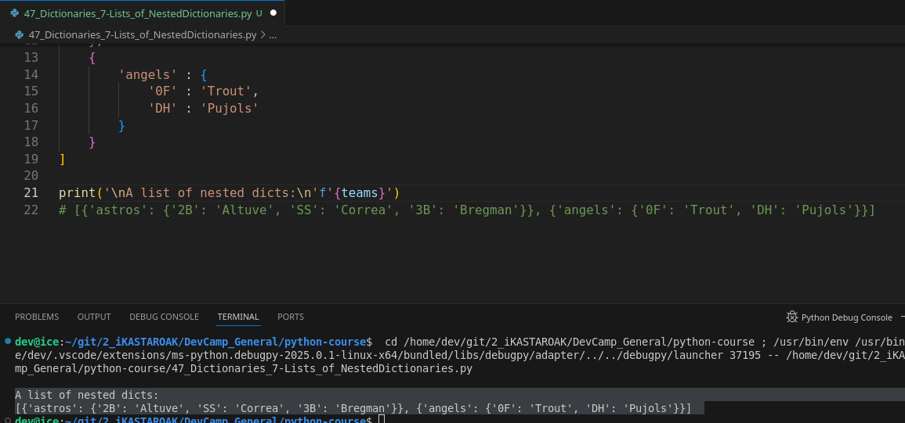

# # Module 02 - 068: Python - Lists of Nested Dictionaries

## **📌 Overview**

In this lesson, we will explore how to structure and traverse **lists containing nested dictionaries**. This is an essential skill when working with complex data structures, such as database query results or API responses.

📌 **Python Documentation References:**

* [Dictionaries](https://docs.python.org/3/tutorial/datastructures.html#dictionaries)
* [Lists](https://docs.python.org/3/tutorial/datastructures.html#more-on-lists)

***

## **🔹 Creating a List of Nested Dictionaries**

A list can contain multiple dictionaries, and each dictionary can store key-value pairs.

```python
teams = [
    {
        'astros': {
            '2B': 'Altuve',
            'SS': 'Correa',
            '3B': 'Bregman'
        }
    },
    {
        'angels': {
            'OF': 'Trout', 
            'DH': 'Pujols'
        }
    }
]
```

✔ **`teams` is a list that contains two dictionaries.**

✔ Each dictionary stores team names as keys and **nested dictionaries** as values.

***

## **🔍 Accessing Nested Data**

### **1️⃣ Using List Indices to Access Dictionaries**

To extract a specific dictionary from the list:

```python
print(teams[0])  # Output: {'astros': {'2B': 'Altuve', 'SS': 'Correa', '3B': 'Bregman'}}
```

✔ **`teams[0]` retrieves the first dictionary from the list.**

***

### **2️⃣ Using `.get()` to Retrieve Dictionary Values**

To safely retrieve a team’s dictionary:

```python
angels = teams[1].get('angels', 'Team not found')
print(angels)  # Output: {'OF': 'Trout', 'DH': 'Pujols'}
```

✔ **`get('angels', 'Team not found')` ensures that no errors occur if the key is missing.**

📌 **Python Documentation:** [`.get()` method](https://docs.python.org/3/library/stdtypes.html#dict.get)

***

### **3️⃣ Extracting Values from a Nested Dictionary**

Using `.values()` to retrieve player names:

```python
print(angels.values())  # Output: dict_values(['Trout', 'Pujols'])
```

✔ **Returns a dictionary view object containing only values.**

***

### **4️⃣ Converting Dictionary Values into a List**

Using `list()` to convert the dictionary values into a list:

```python
players_list = list(angels.values())
print(players_list)  # Output: ['Trout', 'Pujols']
```

✔ **Useful for list operations like sorting or indexing.**

***

### **5️⃣ Retrieving a Specific Value from the List**

To extract a specific value:

```python
print(players_list[1])  # Output: 'Pujols'
```

✔ **`players_list[1]` fetches the second item in the list.**

📌 **Python Documentation:** [`.values()` method](https://docs.python.org/3/library/stdtypes.html#dict.values)

***

## **📝 Summary**

| Concept                                 | Example                                    |
| --------------------------------------- | ------------------------------------------ |
| **Retrieve a dictionary from the list** | `teams[0]`                                 |
| **Use `.get()` to prevent errors**      | `teams[1].get('angels', 'Team not found')` |
| **Extract dictionary values**           | `angels.values()`                          |
| **Convert values into a list**          | `list(angels.values())`                    |
| **Retrieve a specific player**          | `players_list[1]`                          |

***

## Video lesson Speech

In this lesson, we're going to combine a number of the various techniques that we've worked through in both the list section and the dictionary section.

And so we're going to see how you can use both and how one collection can store another one.

***

Now we've talked about nested collections\
before but I felt like it was so important because this is going to be\
something that you're working with on a daily basis whether you're\
working and building out web and mobile applications or if you're\
working on the machine learning side you're going to have nested\
collections and being able to understand exactly what that structure\
looks like. And also very importantly how to traverse those nested\
collections you're going to see that that is going to be very helpful in\
your development career.

So let's build out our team's database here because this is going to\
be very similar to what you're going to get back when you run a database\
query. So I'm gonna say teams and this is going to be a list that\
contains various dictionaries so far we've talked about when we talked\
about nested collections we had lists inside of the value component of\
dictionaries but now we're going to change it up a little bit and we're\
going to create a list of teams and this is going to be a list where\
every element inside of this team's list is going to be a dictionary.

So I'm going to start off with first the list syntax and then we're\
going to create some keys. I'm going to create two because any more than\
that that there's going to be a lot of typing I don't think you want to\
watch me do that. And so here we have right now teams that has to list\
items no keys or values are inside of these items but now we can start\
building that out. I want the key for each one of these dictionaries to\
be the name of the team.

So inside the first one, I'm going to say Astro's and then I want the\
Astro's value to actually be another dictionary. And so in order to do\
that, I'm going to use this syntax right here


and in case whatever development environment you're working on\
doesn't have this kind of autocompletion we can just kind of review here\
there. Whenever you have an open curly bracket you always have to close\
it off. So we have one dictionary here(Teams) and then for Astro's, we\
have the colon. So Astro's is the key and then we have a second\
dictionary nested inside of it here and now let's set up some key-value\
pairs.

I'm going to say Second base is going to be Altuve then shortstop is\
going to be Correa and let's go with one more third base is going to be\
Bregman. So that is our nested dictionary. So once again we have teams\
which is a list. This list contains multiple dictionaries and each one\
of these dictionaries contains a single key-value pair where the key is\
the name and then inside of that contains all of these various elements.

Now we're not limited to only having this one value we could also do\
other elements so we could create another one in here that says\
something like ticket sales and then put a value in that we're not going\
to do that right now. I'm happy with just having one element here. And\
so let's copy this and paste it in over here and I'm also going to fix\
the indentation. So right now we need to actually put our curly brackets\
and close them off and now we have two elements that are identical so\
let's build this out of angels and I'm only going to put two in here so\
we're going to go with outfield and DH. And here we can go with Trout\
and Pujols and these are our teams and we have now multiple levels of\
nesting.


And if this looks weird to you or looks cumbersome I highly recommend for you to build multiple of these out.

Use different kinds of case studies and examine exactly how you can structure nested collections like this.

Because I can tell you this is going to be very similar to how you're going to work with API data with database queries anything like that you're going to have to become familiar with using and querying these types of nested collections.

So, now that we have that we can just make sure that our syntax is right and we don't have any errors so I'm just going to print out teams and if I do that you can see everything worked



we have **this list that contains multiple dictionaries inside** of it so everything there is working well now that we know we have a list.

We can treat it like a traditional list so if I want to grab just the Astros I can treat teams like a list and just grab that first element by using brackets and then passing in the index value.

Astro's is the first one listed.

So that means they have an index value of 0 and so if I run this you can see we have our Astro's team exactly like how we structured it here where it returned a dictionary and inside of that dictionary is a single key-value pair where the key is a string and then\
the value is this nested dictionary.


So, now let's extend this a little bit further.

Let's now grab the angels and you give us some more space and I'm going to create a\
variable called Angels and we're going to set this equal to teams 1 because we know that the Angel's because it's the second element, has an index value of 1 and then from there let's use our get functions.

I'm going to say get angels and let's set up a default because we're good developers that want to make sure we don't run into errors and say the default is "team not found" and now let's just print it out so I can print out angels and see if this works and it does


Right here we have the value which contains our outfielder and our D.H. and I'm also going to comment out `print(teams[0])` just so we don't get any of the output confused.

## Getting by `.values()`

So now that you see the structure that gets printed out. Let's see how we can go and we can\
grab these values.

So I can say something like values and this is going to return a\
dictionary view object of the name. So here we have Trout and Pujols


## Getting the values, but listed `list()`

and if you remember we want to just simply grab the elements and treat it like a list we can just say list and run it again. Now we're at\
Trout and Pujols


and if we just want Pujols' name we can treat it like a traditional\
list pass on an index value of 1. And here we go. We have a name.


So in review, we created a variable called teams that stores a list.\
The list has multiple nested dictionaries and inside of each one of\
those dictionaries is a key-value pair with more nested collections. In\
order to traverse that we have a number of different ways we can do it\
first, this is the easiest way I think there is to think about it is to\
simply take your data structures when you have nested collections like\
this simply take them one at a time because as you know you have to\
treat each type of data structure differently. You need to use different\
functions on a list then you do a dictionary and so it's important to\
understand that whenever you're trying to query them and that's exactly\
what we did we treated it first like a list where we grabbed that first\
element or you should say the element of the index with the index of\
one.

Then we knew that was a dictionary. So we called get on it and we\
said this is the key that we want and then from there we were able to\
grab all of those values. Turn it into a dictionary view object convert\
that into a list and then we were able to treat that as a plain old\
python list and grab any of the elements we want.

So we were able to if you want to count. We went through 1 level, 2\
levels, 3 levels, and then to get the value 4 different levels in order\
to get the name value that we were looking for. And this is going to be a\
very common practice that you're going to be implementing whenever\
you're working with API. This is very similar to the output you would\
get if for example your querying the Google Maps API. You're going to\
get data that looks very similar to this and you're going to need to\
have the ability to recognize when you're working with a list versus a\
key-value pair dictionary and then convert it, traverse it, and then\
pull out the data that you need.

***

## Code

```python
# 02-068: Lists of Nested Dictionaries

# list = [ { dictionary_1 : { 'key' : 'value }, {dict_2 : { 'key' : 'value' } } ]

teams = [
    {
        'astros' : {
            '2B' : 'Altuve',
            'SS' : 'Correa',
            '3B' : 'Bregman'
        }
    },
    {
        'angels' : {
            '0F' : 'Trout', 
            'DH' : 'Pujols'
        }
    }
]

print('\nA list of nested dicts:\n'f'{teams}') 
# [{'astros': {'2B': 'Altuve', 'SS': 'Correa', '3B': 'Bregman'}}, {'angels': {'0F': 'Trout', 'DH': 'Pujols'}}]


# Using Indices[]

print('\nNested dicts. using Indices:\n'f'{teams[0]}') 
# {'astros': {'2B': 'Altuve', 'SS': 'Correa', '3B': 'Bregman'}}


# .get(), Getting by using Indices[]

angels = teams[1].get('angels', 'Team not found')
print('\nGetting by using Indices:\n'f'{angels}')
# {'0F': 'Trout', 'DH': 'Pujols'}


# Getting by .values()
angels = teams[1].get('angels', 'Team not found')

print('\nGetting the Values:\n'f'{angels.values()}')
# dict_values(['Trout', 'Pujols'])


# Getting LISTED .list() dict .get('key', 'else') .values()

angels = list(teams[1].get('angels', 'Team not found').values())

print('\nGetting LISTED values: \n'f'{angels}')


# Getting A VALUE, not a list nor dictionary, using INDICES on .values()
# list() dict[index of which] .get('key', 'else') .values()[indices]

angels = list(teams[1].get('angels', 'Team not found').values())[1]

print('\nGetting ONE LISTED value: \n'f'{angels}')      
# Pujols
```
