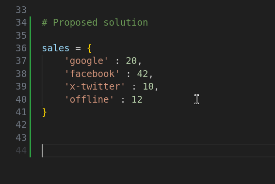
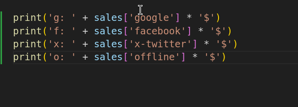

# 02-069\_Python\_Dictionaries\_Exercise

## **Module 02 - 069: Python: Dictionaries, Exercise**

### **Building a Histogram with No External Libraries**

***

### **📌 Introduction**

In this exercise, we will build a simple histogram using Python **without any external libraries**.

A **histogram** is a graphical representation of data distribution, commonly used in **statistics** and **machine learning** to identify patterns and trends.

We will create a dictionary-based histogram that represents sales data using symbols. The program will dynamically count occurrences and visually display them as repeated symbols.

***

### **🔹 Problem Statement**

Given a dataset of sales information, we need to:

✅ Store sales figures using a **dictionary** (key-value pairs).\
✅ Represent different platforms using a **single character** (e.g., 'g' for Google).\
✅ Multiply the count by a chosen symbol (e.g., `$`) to visually display the data.\
✅ Print the histogram in a structured format.

📌 **Example Output:**

```plaintext
 g: $$$$$$$$$$$$$$$$$$$$
 f: $$$$$$$$$$$$$$$$$$$$$$$$$$$$$$$$$$$$$$$$$$
 x: $$$$$$$$$$
 o: $$$$$$$$$$$$
```

***

### **🔸 String Multiplication Trick**

In Python, we can repeat strings using the multiplication operator (`*`).

```python
print(4 * 'w')  # Output: wwww
```

🚫 However, we **cannot** concatenate numbers and strings directly:

```python
print(4 + 'w')  # ❌ TypeError
```

This trick is the foundation of our histogram representation.

***

### **🎯 Attempt #1 (Incorrect Approach)**

```python
# Attempt 1: Incorrect approach (Does not use a dictionary correctly)

dict_1 = {'$' : '$' * 10}  # Incorrectly stores the symbol

g = 7
f = 8
x = 4
o = 5

print('g:' + f'{dict_1['$'] * g}\n')
print('f:' + f'{dict_1['$'] * f}\n')
print('x:' + f'{dict_1['$'] * x}\n')
print('o:' + f'{dict_1['$'] * o}\n')
```

🔴 **Issues in Attempt #1:**

* Stores only the symbol, not actual sales data.
* Uses standalone variables (`g`, `f`, `x`, `o`) instead of storing them in a dictionary.
* Does not dynamically iterate through the dictionary.

***

### **✅ Correct Solution: Using a Dictionary**

```python
# Correct Approach: Using a Dictionary

sales = {
    'google' : 20,
    'facebook' : 42,
    'x-twitter' : 10,
    'offline' : 12
}

# Generating the Histogram Output
print('g: ' + sales['google'] * '$')
print('f: ' + sales['facebook'] * '$')
print('x: ' + sales['x-twitter'] * '$')
print('o: ' + sales['offline'] * '$')
```

✅ **This approach ensures:**

* The dictionary correctly stores key-value pairs (`platform: sales count`).
* Uses dictionary lookups instead of standalone variables.
* Multiplication of string and integer dynamically generates the histogram.

📌 **Output:**

```plaintext
g: $$$$$$$$$$$$$$$$$$$$
f: $$$$$$$$$$$$$$$$$$$$$$$$$$$$$$$$$$$$$$$$$$
x: $$$$$$$$$$
o: $$$$$$$$$$$$
```

***

### Video lesson Speech

I want to end our section on Python dictionaries with a fun exercise.

And so what we're going to do is build a histogram.

If you're not familiar with what a histogram is it's **a type of chart used in statistics and machine learning that allows you to see patterns and basic types of trends with data**.

We're going to build a very basic type one.

And there are very large popular packages for doing this in python but we're going to do one just from scratch.

So, what I have here in this multiline String is a series of data points and this is what I want our histogram to actually look like.

So, we are going to have four different elements.

And so this is going to replicate for example sales data where `g` will be for Google, `f` for Facebook, `x` for X (Twitter) and `0` for offline.


And then each one of these elements is going to be these little dollar signs.

These are going to represent a sale count.

And so what I want you to do is to be able **to build out an entire dictionary with**\
**these types of data points.**

Now, the numbers don't have to be completely accurate.

The most important thing is being able to build out a dictionary that can build this type of system.

And before I take a break and allow you to work on this I want to show you one key element that we've not talked about in this course that will make this possible because I don't want to see a dictionary with values such as Google and then you had just a bunch of dollar signs.

That is not what I'm looking for that would be a very ugly looking dictionary I'm looking for something that actually has integer base counts and the way these can be generated is by performing a little trick and this is an interesting concept in Python.

If you've never seen it before.

If you remember back to when we were talking about numbers and strings you saw that we weren't able to do something like this so if I go into the python [repl](https://repl.it) here.

If I go four plus say a W and try to print that out you see that we get an error\
where it says unsupported operand plus for int and string.


Now that means that we can't combine a string and an integer or a number like we just did.

However, **there is something we can do it doesn't mean you can't perform any kinds of operations with strings and numbers.**

If I do 4 times w you're going to see that that brings us 4 W's it returns a string.


I want you to be able to **take this concept to combine it with dictionaries** and, also, I want you to have something that prints out this exact histogram right here.

As mentioned, the numbers don't have to be the same and the count so doesn't have to be. But I want this exact structure to be what gets printed out.

You now have all of the requisite knowledge in order to build out this type of chart.

And so I want you to pause the video and then come back and then we'll walk through what my solution was for it.

***

## Attempt #1:

```python
# Attempt 1

dict_1 = {
    '$' :   '$' * 10
}

g = 7
f = 8
x = 4
o = 5

print( 'g:' + f'{dict_1['$'] * g}\n')
print( 'f:' + f'{dict_1['$'] * f}\n')
print( 'x:' + f'{dict_1['$'] * x}\n')
print( 'o:' + f'{dict_1['$'] * o}\n')


"""
Return:

g:$$$$$$$$$$$$$$$$$$$$$$$$$$$$$$$$$$$$$$$$$$$$$$$$$$$$$$$$$$$$$$$$$$$$$$

f:$$$$$$$$$$$$$$$$$$$$$$$$$$$$$$$$$$$$$$$$$$$$$$$$$$$$$$$$$$$$$$$$$$$$$$$$$$$$$$$$

x:$$$$$$$$$$$$$$$$$$$$$$$$$$$$$$$$$$$$$$$$

o:$$$$$$$$$$$$$$$$$$$$$$$$$$$$$$$$$$$$$$$$$$$$$$$$$$

"""
```

***

Welcome back.

I hope that you were able to get through that exercise successfully.

Now let's come and let's build this and you'll see what my solution was when I was creating it.

So, I'm going to create a dictionary here and I'm gonna store it in a variable called sales and then I'm going to set up a number of key-value pairs so I'm gonna say Google and I'll say 20 then I'll say Facebook and we'll say Facebook had 42 sales than say Twitter had 10.

And then offline had 12. And so these are sales figures that are stored in a key-value based dictionary.



Now, in order to get this output we're going to have to perform some calculations and then also have some output.

Now, once we get into our section on looping and iteration then we could simply loop through all of these items and multiply these values by the strings and then print\
it all out.

And that would give us our histogram.

However, I didn't want to give you something that I haven't taught\
you yet.

So we're going to do it with the assumption that we are only going to use the knowledge we've gained in the course so far.

So I'm going to say print and then I want the first element to be just the abbreviation.

So I'm just going to say g right here and then a space and then I want to add on to this the other values.

Now I'm using the older form of string interpellation.

You also obviously could use the traditional bracket syntax as well if you'd like.

It's completely up to you. But I wanted to show the various operands and how they could be used to combine strings just so you can see that as an example.

So, I'm going to say a g plus sales and perform the lookup for Google right here.

And that is going to give me my count. So, if I simply wanted to see what that would be I can't do it yet because we're trying to combine.

If you notice a string with an integer. So we're going to have to perform our ultiplication so I'm going to say multiply this by the dollar sign so you just do a single dollar sign.

And, if you remember back to our order of operations because these are being multiplied this is going to occur first.

Remember whenever we perform multiplication between a string and an integer it returns a string.

So, after we've done that then we will be able to add that.

So I'm going to hit enter and you can see this work perfectly.


So now let's just replicate that for each one of the other elements.\
Here we have f for Facebook and next, we're going to go with t for\
Twitter and lastly we will go with o for offline.



Now let's run this and see if it gives us what we want. And there you go.


You notice we have an identical histogram right here where we're able\
to calculate each one of the values parse them grab the count value for\
sales. Combine it with a string and then append all of that onto the\
first string and print it out so that we have our chart.

Very nice job if you went through all of that you were able to\
utilize a number of different techniques that we've learned throughout\
this entire course starting from strings all the way up through\
dictionaries. So great job and I'll see you in the next section.

### Code

```python
# Module 02 - 069: Python: Dictionaries, Exercise:
## Building an Histogram with no external libraries

"""
Concepts:

g $$$$$$$$$$$$$$$$$$$$$$$$$$$$$$$$
f $$$$$$$$$$$$$$$$$$$$$$$$$$$$$$$$$$$$$$$$$$$$$$$$$$$
x $$$$$$$$$$$$$$$$$
o $$$$$$$$$$$$$$$$$$$$$$$$

print(4 + 'w')  # NOPE!
print(4 * 'w')  # YEP!
"""


# Attempt 1

dict_1 = {
    '$' :   '$' * 10
}

g = 7
f = 8
x = 4
o = 5

print( 'g:' + f'{dict_1['$'] * g}\n')
print( 'f:' + f'{dict_1['$'] * f}\n')
print( 'x:' + f'{dict_1['$'] * x}\n')
print( 'o:' + f'{dict_1['$'] * o}\n')
"""

"""


# Proposed solution
## The dictionary must include all the variables, not the printed symbol!

sales = {
    'google' : 20,
    'facebook' : 42,
    'x-twitter' : 10,
    'offline' : 12
}


print('g: ' + sales['google'] * '$')
print('f: ' + sales['facebook'] * '$')
print('x: ' + sales['x-twitter'] * '$')
print('o: ' + sales['offline'] * '$')

"""
g: $$$$$$$$$$$$$$$$$$$$
f: $$$$$$$$$$$$$$$$$$$$$$$$$$$$$$$$$$$$$$$$$$
x: $$$$$$$$$$
o: $$$$$$$$$$$$
"""
```
