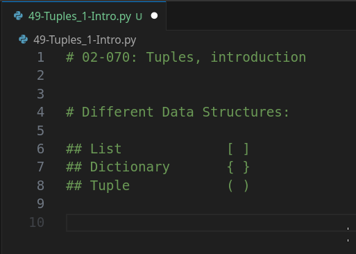
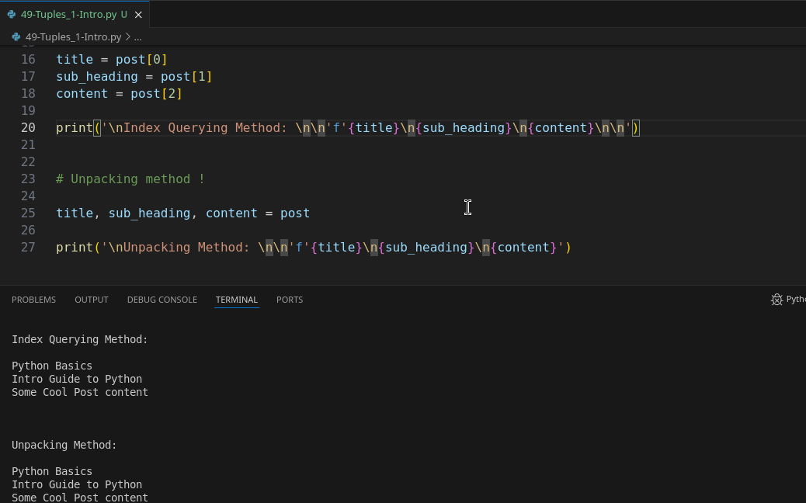

# Module 02 - 070: Python - Tuples. Introduction

***

## **📌 Introduction to Tuples in Python**

So far in this module on data structures in Python, we've covered lists and dictionaries. Now, we will explore **tuples**, which are similar to lists but have key differences that make them useful in specific scenarios.

📌 **Python Documentation:** [Tuples](https://docs.python.org/3/tutorial/datastructures.html#tuples-and-sequences)

***

## **🔹 What is a Tuple?**

A **tuple** is an **immutable** sequence type in Python, meaning its elements **cannot be modified after creation**.

### **📌 Syntax Comparison**

| Data Structure | Syntax                 |
| -------------- | ---------------------- |
| **List**       | `[]` (Square brackets) |
| **Dictionary** | `{}` (Curly braces)    |
| **Tuple**      | `()` (Parentheses)     |

### **Creating a Tuple**

```python
# Tuple creation
post = ('Python Basics', 'Intro guide to Python', 'Some cool Python content')
print(post)
```

✔ **Tuples store multiple values like lists but are immutable.**

***

## **🎯 Tuple Unpacking**

A powerful feature of tuples is **unpacking**, which allows variables to be assigned directly from tuple elements.

```python
# Tuple unpacking
post = ('Python Basics', 'Intro guide to Python', 'Some cool Python content')

# Unpacking
title, sub_heading, content = post

# Equivalent to manual indexing
# title = post[0]
# sub_heading = post[1]
# content = post[2]

print(title)       # Output: Python Basics
print(sub_heading) # Output: Intro guide to Python
print(content)     # Output: Some cool Python content
```

✔ **Tuple unpacking allows for concise and readable code.**

📌 **Python Documentation:** [Tuple Unpacking](https://docs.python.org/3/tutorial/datastructures.html#tuples-and-sequences)

***

## **🔄 Tuple vs List: Why Use a Tuple?**

| Feature          | Tuple         | List           |
| ---------------- | ------------- | -------------- |
| **Mutability**   | ❌ Immutable   | ✅ Mutable      |
| **Performance**  | ✅ Faster      | ❌ Slower       |
| **Memory Usage** | ✅ Less        | ❌ More         |
| **Sorting**      | ❌ Not allowed | ✅ Allowed      |
| **Usage**        | ✅ Fixed Data  | ✅ Dynamic Data |

✔ **Use tuples when data should remain unchanged.**

***

## **⚠️ Tuples Prevent Unexpected Changes**

If we use a **list** instead of a **tuple**, data can be modified accidentally.

```python
# Using a list instead of a tuple
post = ['Python Basics', 'Intro guide to Python', 'Some cool Python content']

# Unpacking
title, sub_heading, content = post

# Sorting modifies the list
post.sort()

# Titles are now incorrect
print(title)       # Unexpected result!
print(sub_heading) # Unexpected result!
print(content)     # Unexpected result!
```

✔ **Sorting changes the order of elements, causing errors in unpacking.**

### **Using a Tuple Prevents This Issue**

```python
# Using a tuple prevents accidental changes
post = ('Python Basics', 'Intro guide to Python', 'Some cool Python content')

# Attempting to sort a tuple raises an error
post.sort()  # ❌ AttributeError: 'tuple' object has no attribute 'sort'
```

✔ **Tuples ensure data remains in its original order.**

📌 **Python Documentation:** [Tuple Immutability](https://docs.python.org/3/tutorial/datastructures.html#tuples-and-sequences)

***

## **🛠️ Best Practices for Tuples**

✔ Use tuples when **data should not change**.\
✔ Use tuples for **performance optimization**.\
✔ Use tuple **unpacking for better readability**.\
✔ If data must change, use a **list** instead.

***

## **📌 Summary**

✔ **Tuples are immutable, making them safer for fixed data.**

✔ **Tuples use parentheses `()` instead of square brackets `[]`.**

✔ **Unpacking allows for better readability.**

✔ **Tuples prevent accidental modifications.**

✔ **Use tuples when working with unchangeable structured data.**

📌 **Python Documentation:** [More on Tuples](https://docs.python.org/3/tutorial/datastructures.html#tuples-and-sequences)

***

## Video lesson speech

So far in this module on data structures in Python, we've covered lists, and we've covered dictionaries.

In the next section, we are going to go through the tuple data structure.

***

Now if you're familiar with lists, then the tuples going to feel very very similar there will be some key differences and we're going to touch upon those in this guide and we're\
going to see what the syntax is and some of the basic benefits in using a tuple versus a list.

So, let's first walk through the syntax and create our first tuple.

I'm going to create a variable here called post and we could imagine that this could be a blog post a newspaper article anything like that and the syntax for creating a tuple is to use parentheses so in review a list uses brackets.

So, if I create a comment here a list is going to use brackets, a dictionary uses curly braces and a tuple is going to use parens.



So, that is the basic difference in terms of the syntax and we're going to get into the differences and why you'd want to use one versus the other.

So, the first thing that we're going to do is create a set of elements inside of this tuple so I'm going to say something like Python basics and if this is a blog post that would be like the title and then we'll create a summary or a subheading and say intro guide to python and then it's just something like some cool Python content here.

So we have three elements inside of this tuple

```python
post = ('Python Basics', 'Intro guide to python', 'Some cool python content' )
```

### Unpacking data with Tuples :-D

Now, one of the very cool things that you're going to see that people use tuples for is a term called unpacking.

And so if I do something like this where I say title subheading and then content and set this equal to post what Python is going to do is it's going to actually treat each one of these items as a query engine so it's going to be the same as doing something like this where I would say `title` is equal to `post[0]` ,and then will do the same things for each of these.

So, say subheading and that's going to be the same as post\[1]. And then content is going to be the same as post\[2].


You know based on our discussion on lists that if we did something like this and then went and printed each of these out that we'd be able to get access to that element.

And, **in this case, a tuple and a list are very similar**.

So notice I commented this out `title, sub_heading, content = post` out.

So, this isn't going to run.

We're simply going to go and use our basic query selector here by using an index and storing that inside of a variable.

Now if I run this you can see I've accessed each one of these elements the same as if we were using a basic python list.


But now what I'm going to do..... I'm going to **use this unpacking technique** where I'm placing all of these elements on one line and you're going to see that it works exactly the same way as if I queried the elements one at a time with their index manually.

So if I run this again, you can see everything works exactly the same way.

Now depending on your experience with Python prior to this and also how much you decided to play with Python list when we were going through them you may be asking why in the world we would want to use a tuple versus a list because one quick little aside if you change this tuple into a list this process will work exactly the same way.

So, I'm going to run this and you'll see that everything works exactly the same as when we were using a tuple.

So, using **unpacking can be implemented when you are building a list.**

However, there's a very very important reason why you typically would not do that and I'm going to walk through that next and that goes to the heart of why you'd want to use a tuple versus a list I'm going to add this as a comment up here just so you remember it.

So, I'm going to say tuple, and let me put one here for a list.

**For a tuple it is immutable and a list is mutable.**

So, what this means and I know we've talked about immutability and mutability quite a bit.

However, I'm going to keep on going through it because this comes to the heart on why people use Python for machine learning and why it's such a popular language is because you have much more control over your data structures in python than in many other languages.

So, whenever it comes to choosing between a tuple and a list the top question you should be asking yourself is this a data structure that I need to change or is it something that I want to keep the same in.

In other words, _**do I want it to be immutable using a tuple, or do I want it to be mutable like a list?**_

And depending on what your answer is that should tell you if you should use a tuple or if you should use a list.

So, let's walk through an example to show exactly how this can come and introduce bugs.

If you were to just ignore the tuple data structure entirely and always use lists.

So, I'm going to switch our post back into a list and remember how we had our unpacking here where we have the title that should always be mapped to Python basics subheading should be mapped to intro guide to Python content should be mapped right to some cool Python content.

So, so far, so good. Everything there should work.

What happens if at some point a sort method is called on the post data structure.

And remember this is a list. So what happens if that occurs?

Well, let's run it and see if we try that you can see that our title variable is no longer storing Python basics but it's now storing intro guide to Python as you can see right here.



The subheading is Python basics and then content still is mapped to the last one because that's simply how it worked out with sort so this is one of the top reasons why you would not want to use a list when you are working with this type of unpacking.

Because with a list if the order of the elements change then you're unpacking may give you **some unexpected behavior that may place certain elements in an order that you**\
**weren't expecting**.

Now, if we change this back into a tuple and we try to call sort on this we're simply going to get an error because a tuple cannot be sorted.


and that is for a very good reason because you can't do this.

You can always be confident if you're going to perform unpacking the way we are\
doing right here.

They are always going to have title mapped to the first element, subheadingto the second, content to the third, and so on, and so forth.

So, that is truly the key difference between a tuple and a list:

* You can work with them in a very similar manner as you can see
* You can carry them with their specific index you can pack them you can access them.
* However, you need and they allow you to store a set collection of data.

However, the difference is that **a tuple cannot be changed where a list can**, and in the next few guides were going to walk through how you can update tuples.

We're going to be working through it very similarly to how we work with strings in Python.

If you remember strings in Python are immutable as well so, you cannot change the actual data itself.

**What you can do** is you can perform **reassignment** and you can **create new values to store the changed elements inside**\* of those new variables and then you can have the content updated in that manner.

***

## Code

```python
# List: []
# Dictionary: {}
# Tuple: ()

# Tuple: immutable
# List: mutable

post = ('Python Basics', 'Intro guide to python', 'Some cool python content')

# Tuple unpacking

title, sub_heading, content = post

# Equivalent to Tuple unpacking

# title = post[0]
# sub_heading = post[1]
# content = post[2]

print(title)
print(sub_heading)
print(content)
```
