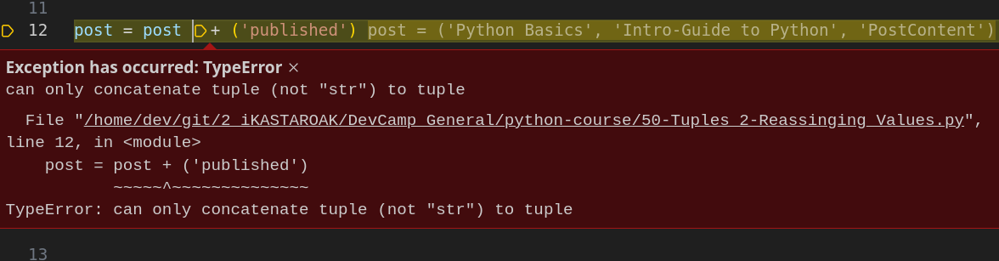
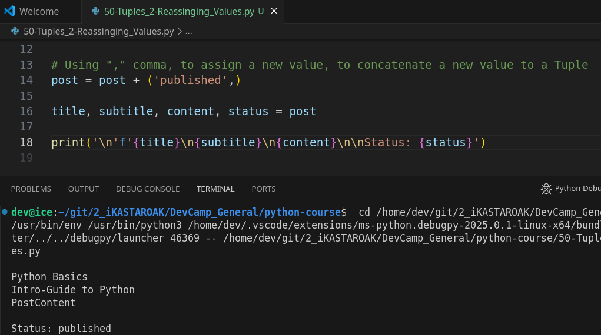

# Module 02 - 071: Python - Reassigning Elements to a Tuple

In the previous guide, we explored tuples and their differences from lists, emphasizing that tuples are **immutable** while lists are **mutable**. This means that tuples cannot be changed after they are created.

However, in some cases, you may need to update a tuple.

Since they are immutable, we cannot modify them directly.

Instead, we use **reassignment**, which involves creating a new tuple and updating its reference.

***

## **🔹 Understanding Tuple Reassignment**

To modify a tuple, we use the **reassignment technique**, where we create a new tuple that combines the old elements with the new ones.

Let's start with an example:

```python
# Define a tuple with blog post details
post = ('Python Basics', 'Intro guide to Python', 'Some cool Python content')

# Adding a new element by creating a new tuple
post = post + ('published',)

# Unpacking the updated tuple
title, sub_heading, content, status = post

# Display results
print(title)
print(sub_heading)
print(content)
print(status)  # New element added
```

✔ **Key takeaway:** We are not modifying the original tuple but creating a new one and reassigning it to `post`.

📌 **Important:** When adding a single element to a tuple, you **must** include a comma (`,`) to indicate it's a tuple. Otherwise, Python will treat it as a regular expression inside parentheses.

Incorrect:

```python
post = post + ('published')  # ❌ TypeError: can only concatenate tuple (not "str") to tuple
```

Correct:

```python
post = post + ('published',)  # ✅ Works correctly
```

***

## **🔄 Reassignment Operator (`+=`)**

Instead of explicitly writing `post = post + ('published',)`, we can use the **reassignment operator (`+=`)**, which is shorthand for adding elements to a tuple:

```python
post += ('published',)
```

✔ This is equivalent to `post = post + ('published',)` but is more concise and widely used in production code.

***

## **🔍 Verifying Immutability with `id()` Function**

Python provides the `id()` function, which returns the memory address of an object. Since tuples are immutable, when we "modify" a tuple, Python creates a **new tuple** in memory instead of altering the existing one.

Let's confirm this behavior:

```python
# Original Tuple
post = ('Python Basics', 'Intro-Guide to Python', 'PostContent')
print(id(post))  # Memory ID of the original tuple

# Reassigning with a new element
post += ('published',)
print(id(post))  # New memory ID, proving a new tuple was created
```

✔ The `id()` function shows that the memory reference changes, indicating that a **new tuple** is created rather than modifying the existing one.

📌 **Why is this important?**

* If tuples were mutable, their memory address would remain the same after modification.
* Since they are immutable, every modification results in the creation of a new object.

***

## **🔗 Summary**

✔ **Tuples are immutable**, meaning they cannot be changed after creation.\
✔ To update a tuple, we must **reassign it** by creating a **new tuple**.\
✔ When adding a **single element**, always include a **comma (`','`)**.\
✔ Using `+=` is a cleaner way to reassign tuples.\
✔ The `id()` function confirms that a **new tuple object** is created during reassignment.

***

## Video lesson Speech

In the last guide we walk through how to build a tuple and also to see the differences between working with tuples and working with Python lists and if you remember the key difference is that a tuple is immutable which means that you're not able to change it whereas a list is mutable which means that you can add elements take elements away and perform any of those kinds of tasks on the fly.

***

Now with that being said there are still times where you may need to alter a tuple and since they are immutable and you can't do that directly we're going to perform the same task as when we would update a string which is that we're going to leverage\
reassignment to be able to create a new tuple and make changes to that new element and so we're going to walk through exactly how that looks right here.

So, we have our post tuple. This has three elements inside such as a title a subheading and then the content.

Now, what happens if we say that we're using this data structure in a newspaper application and we want to add a new element here.

Right at the end that says published.

Now right now we have a hardcoded tuple and so it would be very easy to just type in published and voila we have changed our tuple but that is not the way development works in the real world.

In the real world, we are simply going to have access to this post tuple and we're not going to have access to any of these elements in this hard-coded fashion.

They're gonna be coming from database queries from API and from different elements like that.

So we can't simply rely on hard coding our elements.

Instead what we're going to have to do is we're going to dynamically alter this on the fly and leverage reassignment in order to do it.

So I'm going to come here and let's walk through reassignment so I'm gonna say post and say post = post which is our current tuple plus and now we're going to add our new tuple element.

Now, this is going to look a little bit odd if you've never seen this before but I'm going explain why we need to utilize this syntax whenever you're adding to a tuple what you need to do is to place in whatever value you have so here I'm going to say published.


However, based on how tuples work and how python works when it comes to evaluating expressions what would happen right here is these parens.

Whenever you have a single element, this is not going to be treated like a tuple.

Instead what that's **going to be treated like is like a mathematical parens expression**.

So if I have something like sum and then say the sum is equal to 2 times two plus five.

```python
sum = (2 *2) + 5   # This is not a tuple! A tuple always has , comma-separations
```

If we simply place a single element inside of parens Python thinks we're just trying to use that in order to set up our own order of operations which is not what we're trying to do.

So, the trick is **whenever we're working with the tuple is you always have to have a**\
**comma.**

So, in order for python to realize that this is a tuple we need to add a comma here so that it doesn't think that we're just trying to have an explicit order of operations and have to have this evaluated first.


So if I run this you can see we don't have any errors.

If I take this out then Python's really just going to look at this like it's a single\
string and you can't add a string to a tuple so if I run this you'll see that we get an error where it says it's a _**TypeError can only concatenate tuple to another tuple**_:



which means that i**n order to make publish something that we can add inside of this post tuple we need to add a comma and now they are both tuples and they can be added together**.

So, if I run this everything works and let's see what this looks like.

If we print it out so I'm going to say and we're going to use the expression where we're able to unpack this.

So, I can say title, sub\_heading, content, and now we have our new element which is our status.

So if I say status post and now I can print each one of these out so I can print title, sub\_heading, content.

And now our new one which is status so let's see if everything here worked and it did.



Now, you can see we have access to this new status element here called published which is not included in our initial post definition but we added to it.

Now we did not add to the first tuple.

Instead, we leveraged reassignment and we actually **created a brand new tuple and we simply overrode the variable name and that is a very very key piece of**\
**information here because tuples, like I've mentioned multiple times, are**\
**immutable.**

**We can not change this specific object but what we can do is create two objects add them together so we're concatenating them and then put them inside of this variable and it's simply going to override it.**

Now there are a couple of elements I want to add. One is that we can\
use the shorthand syntax right here. So instead of saying post equals\
post plus whatever value we have in the parens we can just add our\
expression right here where we can say += and that is completely\
equivalent to what we had with the `post = post + ('published')`.\
Any time that you are setting your value and you're adding something to\
it you can always go with our mass assignment operator here and say\
plus equals whatever this value is. If I run this again you can see we\
get the exact same result.


And **this is going to be the type of syntax you are going to see in production applications now because the topic of immutability is so key**.

***

## `id()` function

I want to show you one other key piece of information here.

Just in case you're wondering if I'm telling the truth about these elements\
actually being different.

I want to introduce you to the ID function in python.

I'm going to come here and comment out the title, sub-heading, content, status =\
post, and the print statements.

What Id does is ID gives us a reference and a unique ID for an object.

So, in other words, in memory in the computer right now or in this case, because I'm in a web-based environment in this server there is a very specific spot in memory where every object that I create is stored and the ID function gives us the ability to see what that is.

So, if I say print and then call the ID function and passed in post right here,\
then you're going to see a specific ID in memory for this post.


So, in other words what it means is **this tuple is in-memory with this long identifier.**

Now, if I run this again right afterward you will see it's the exact same number.

Now that means that this object right here post is identical.

Now watch what happens right after I have performed this assignment so when I've taken this tuple and I've said plus = and I have overridden this post variable with our new tuple where I've combined them.

Watch what happens here. Now you're going to see three IDs that are\
printed out and you're going to see the first two are identical because\
they're both referencing the same object. However, when we perform this\
override we are no longer using that same object because we can't\
because it's immutable and we can't make changes to it. But instead what\
python does under the hood is it overrides and creates a new post\
object and therefore it's going to give a new object in memory.

So if I run this now


You can see the first two elements here because it's referencing the exact same post tuple have an identical number.

This 14 ending in 256.

However, this third one is for our post after we've created a new tuple a new set of combined tuples. This now ends in 5336 and so this is proof that we are no longer working with this original tuple.

This one was created it was used here, here and then we took it added this new\
publish status to it and when we did that python went and it created a\
new object in memory and therefore a new reference point.

So that hopefully gives you a little bit of an idea of how immutability works especially when you perform an override.

You're not going to be working with the same object instead **we're leveraging reassignment to create a new object and that is how we can update the values** as we did.

***

## Code

```python
# 02-071: Reasigning elements to a Tuple

post = (
    'Python Basics', 
    'Intro-Guide to Python',
    'PostContent'
)

# Is this a Tuple?
sum = (2 * 2) + 5   # Nope! A tuple always has `,` commas!


# Reassigning values on Tuples
## By Joining TWO TUPLES into ONE, then, RENAMING the Tuple to the original!

post = post + ('published',)

title, subtitle, content, status = post

print('\n'f'{title}\n{subtitle}\n{content}\n\nStatus: {status}')


post = (
    'Python Basics', 
    'Intro-Guide to Python',
    'PostContent'
)

# Reassingment Operator and id() method

print('\n\nOriginal Tuple: 'f'{post}')
print(id(post)) # 140229832234624
print(id(post)) # Again, 140229832234624

post += ('published',)

print('\n\nReasigned Tuple: 'f'{post}')
print(id(post)) # 140004734724480
```
