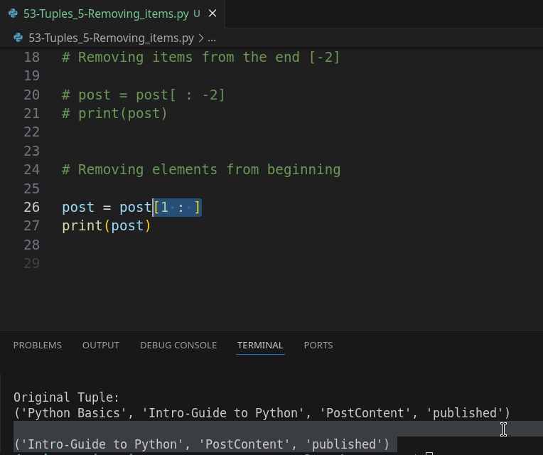
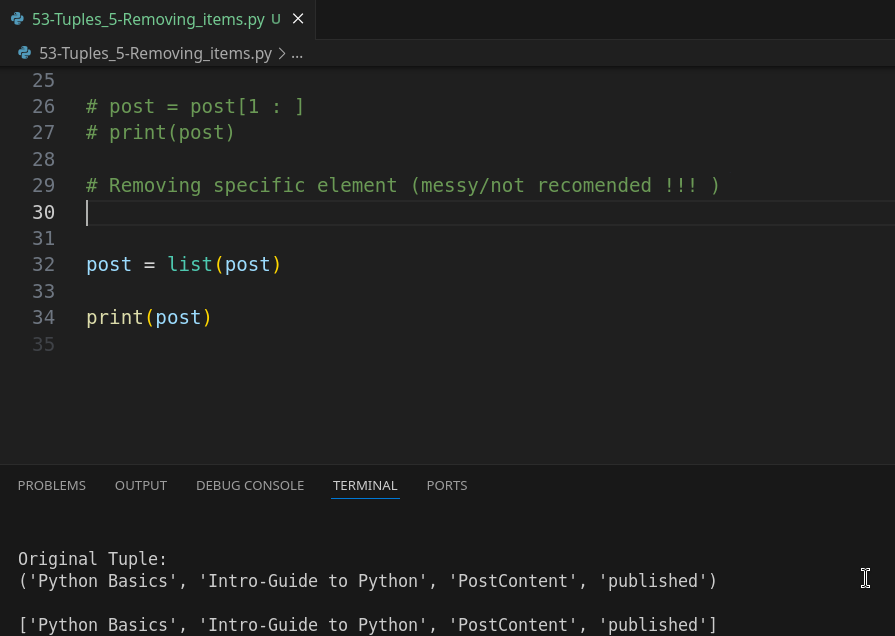

# 02-074\_Python\_Removing\_items\_from\_a\_Tuple

### Module 02-074: Python - Removing elements from a tuple

In this guide on Python tuples, we're going to explore how to remove elements from this type of data structure. Since **tuples are immutable**, we cannot directly remove elements from them. Instead, we will create new tuples with the desired elements while excluding the ones we want to remove.

We will cover three different methods for achieving this:

1. Removing elements from the end.
2. Removing elements from the beginning.
3. Removing a specific element (a workaround, but **not recommended**).

***

### **1️⃣ Removing Items from the End of a Tuple**

Since tuples do not support direct element removal, we use **slicing** to create a new tuple without the last element.

```python
post = (
    'Python Basics',
    'Intro-Guide to Python',
    'PostContent',
    'published'
)
print('\nOriginal Tuple:  \n'f'{post}\n')

# Removing the last item using slicing
post = post[:-1]
print(post)  # ('Python Basics', 'Intro-Guide to Python', 'PostContent')
```

📌 **Explanation:**

* The slice `post[:-1]` creates a new tuple excluding the last element.
* This technique is similar to how `.pop()` works for lists, but since tuples are immutable, we must reassign the variable.

🔹 **Removing more than one item from the end**

```python
post = post[:-2]
print(post)  # ('Python Basics', 'Intro-Guide to Python')
```

* `post[:-2]` removes the last two elements.

***

### **2️⃣ Removing Items from the Beginning of a Tuple**

To remove elements from the beginning of a tuple, we again use slicing:

```python
post = (
    'Python Basics',
    'Intro-Guide to Python',
    'PostContent',
    'published'
)

# Removing the first element
post = post[1:]
print(post)  # ('Intro-Guide to Python', 'PostContent', 'published')
```

📌 **Explanation:**

* `post[1:]` creates a new tuple starting from the second element (index 1), effectively removing the first one.

***

### **3️⃣ Removing a Specific Element (Workaround, Not Recommended)**

Since tuples are immutable, if we need to remove a specific element, we must:

1. Convert the tuple to a **list**.
2. Use `.remove()` on the list.
3. Convert the list back to a **tuple**.

```python
post = (
    'Python Basics',
    'Intro-Guide to Python',
    'PostContent',
    'published'
)

# Convert tuple to list
post = list(post)

# Remove the unwanted element
post.remove('published')

# Convert list back to tuple
post = tuple(post)

print(post)  # ('Python Basics', 'Intro-Guide to Python', 'PostContent')
```

📌 **Why is this NOT recommended?**

* Tuples are meant to be immutable, meaning their contents should not change.
* If you find yourself modifying tuples frequently, **consider using a list instead**.
* If you're working with an external library that returns a tuple and you need to modify it, this workaround can be used cautiously.

***

### **Summary**

We explored three ways to "remove" elements from a tuple:

| **Method**                      | **Technique**                              | **Best Practice?** |
| ------------------------------- | ------------------------------------------ | ------------------ |
| **Removing from the end**       | `post[:-1]`                                | ✅ Yes              |
| **Removing from the beginning** | `post[1:]`                                 | ✅ Yes              |
| **Removing a specific element** | Convert to list, `.remove()`, convert back | ❌ Not recommended  |

✅ **Key Takeaways:**

* Tuples **cannot** be modified directly.
* Use **slicing** (`[:]`) to exclude elements when creating new tuples.
* If frequent modifications are needed, **consider using lists instead**.

***

### Video lesson Speech

In this guide on Python tuples, we're going to see how we can remove elements from this type of data structure.

Now I'm going to add in a few caveats before we walk through the syntax for performing that task.

***

The first one is that a tuple by definition is not able to be changed it is immutable.

And so the different techniques that we're going to use to remove elements they're not going to actually be removing elements from the original tuple those created much\
in the same manner as when we added elements to the tuple.

That wasn't technically accurate.

We were creating new tuples with those added elements and in the same way, what we're going to be doing here is we're going to be creating new tuples with elements that have been removed.

Now, the first two ways of removing items both from the beginning and the end of the tuple are going to be pretty standard.

However, the third way that we're going to do this is definitely considered more of a hack and I'm not showing it to you because it's a bad practice this entire course is focused on best practices and making sure that we're following along with what the industry needs.

However, I would be doing a disservice if I didn't show you a way that you could remove elements from a tuple that weren't at the beginning, or the end.

When it comes to when you'd be doing this in a real-world application imagine a situation where you're not the one that created the tuple.

So, say you're working with some kind of outside library that returns a tuple structure, it returns a collection and you need to remove some element from the middle of it.

You can't control that a tuple is what you have to work with.

And so there may be a time where you are going to have to implement the third method.

However, I'm going to add the caveat that it is not recommended to do that if say, you are the one that created the tuple.

If you find yourself in a situation where you're using tuples and removing and adding items constantly to the collection then you may want to ask yourself if you really should just be using a list because that's what lists were created for there's a reason why they're mutable it so you could change them dynamically.

So, with all of that being said let's go into these three processes for removing tuple items.

The first way we're going to do is to remove items from the end of the tuple and I'm going to add comments here just so you can see when you look at the show notes exactly what the purpose of each one of these processes are.

So, you say removing elements from the end and we're going to leverage ranges in order to perform this task.

So, in order to do this, we're going to implement reassignment so I'm gonna say post and set this equal to a range and so this is a really nice clean way of being able to not\
remove elements directly from the tuple but create a new tuple and use a slice in order to only get the elements that we want inside of this new tuple.

But we're still going to be able to use our post variable.

We're simply going to reassign it with the new values.

So here I can say post and if I want all of the elements inside of this new tuple except for the very last one except for published I can create this slice.

I'm not going to pass anything in as the first argument and then I'm going to give the second argument as -1.

So, what this is going to do is it's going to come it's going to bring in the slice of elements 1 2 and 3 and then it's going to stop before it hits the last one.

So now if I say print and then post I can simply run this and you can see that published is no longer there.


Now you can also use this because this is a range I could say -2 if I do not want the last two items if I run this.

You can see it stops\
before it gets to Some cool Python content and published


but I'm just going to go with -1 because this is one of the most common ways I personally have implemented the ability to remove items it's very similar to say how the pop command works with a list in being able to remove items from the end of a collection.

Now it's different than pop because if you remember pop removes the last element and allows you to store it in a variable whereas a slice returns the elements you\
want to keep.

That's an important thing to keep in mind.

So that is how you can remove elements from the end.

Now, you probably can already guess how you can remove elements from the beginning but I'm still going to go through it.

Just so you can see the syntax and right here.

I'm going to remove that second argument and here I'm just going to say 1.

This assumes that you are wanting to only grab all of the elements after the first one so we're going to skip the first element here and then we're going to save all of the other tuple elements here inside of our new tuple.

So, if I run this you can see it starts with intro guide to python.

It skipped Python basics and it goes all the way through the end.



So that's how you can remove elements from the beginning of a tuple.

Now let's go on to the last one.

Now, this is going to be removing a specific element and then I'm going to add the caveat messy slash not recommended.

And, once again, the reason why I'm showing it to you is not that this is something I want you going out and doing constantly.

But it is important to understand if you ever do have a tuple that's returned to you such as from some third party code library and you do need to remove items in it for some reason or another.

This is one way that you could do this.

So, I'm going to start by performing reassignment and I'm going to now convert it into a list.

And even our little repl is going to give us a warning when I do this I'm gonna say list. And so I'm casting this post into a list.

And I just pass in post and you can see the warning says redefinition of post type from tuple the list.


And the reason why this would be a bad idea in some cases is that, say that at some point that you don't change it back to a tuple and then you call some functions that only are going to work with a tuple.

Then, you're going to run into some bugs because you were expecting one data type but actually got a different one and so that's what the warnings for and that's the reason why I added that caveat that this could be a little bit messy but we're still going to traverse on so that we can see how to implement this type of functionality.

***

### Removing specific element using list(), .remove, tuple() (messy/not recomended !!! )

Now, the next thing we're going to do now that we have a list and we can print this out to confirm that our list is now working so you can see this is no longer a tuple. We now have a list and you can tell by those square brackets there.



And now let's see what we can do because it's a list. We can treat it just like a list.

Now we can remove items and we can perform any other tasks just like when we are working with that type of data structure so I can say post.remove and let's remove that published item so I can say published.

And now if I run this you can see that we have effectively changed that post and so published is no longer included but it still is a list and so what we can do to finish this off is perform reassignment as a post equals and then we can cast this back into a tuple so I can create a new variable called post and so we're keeping the same name and then by using this tuple function which is just like our list function.

This is going to take a list and convert it back into a tuple and so if I run this you're going to be able to see here on the right-hand side.

The value that gets printed out is exactly our original tuple except it has published removed which is just what we were looking to do.


So that is one of the most common ways whenever you do have a situation where you have one data structure such as a tuple that you can't work with the way you need.

You can cast it to a different data type switch it back and then you are good to go.

***

So, in summary, we've walked through three different ways that you\
can remove elements from a tuple we can remove them from the beginning,\
or the end by leveraging slicing and then we also can cast that tuple to\
a list and remove any elements that we want from there and then turn it\
back into a tuple and then we've effectively updated exactly the data\
that we want.

### Code

```python
# 02-074: Removing items from a tuple

post = (
    'Python Basics', 
    'Intro-Guide to Python',
    'PostContent',
    'published'
)
print('\nOriginal Tuple:  \n'f'{post}\n')


# Removing items from the end [-1]

post = post[ : -1]
print(post)


# Removing items from the end [-2]
post = (
    'Python Basics', 
    'Intro-Guide to Python',
    'PostContent',
    'published'
)

post = post[ : -2]
print(post)


# Removing elements from beginning

post = (
    'Python Basics', 
    'Intro-Guide to Python',
    'PostContent',
    'published'
)

post = post[1 : ]
print(post)


# Removing specific element (messy/not recomended !!! )
# .remove() and list(), and tuple()

post = (
    'Python Basics', 
    'Intro-Guide to Python',
    'PostContent',
    'published'
)

post = list(post)

post.remove('published')
post = tuple(post)

print(post)
```
