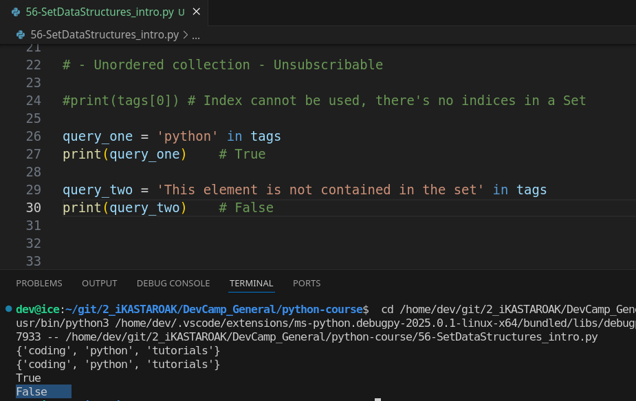

# MODULE 03 - 078: Python - Data Structures - SETs

***

## **Understanding Python Sets**

In this guide, we explore **sets** in Python, a fundamental data structure that differs from lists, dictionaries, and tuples.

While **sets** are not as commonly used as other data structures, they provide unique properties that are invaluable in specific scenarios, such as eliminating duplicate elements and performing set-based operations like unions and intersections.

Python sets share some characteristics with both **lists** and **dictionaries**, but their **distinctive features make them an excellent choice** when working with unique elements.

📌 **Python Documentation:** [Set Types](https://docs.python.org/3/library/stdtypes.html#set)

***

## **🔹 Creating a Set in Python**

Unlike lists, which use square brackets (`[]`), and dictionaries, which use curly brackets (`{}`) with key-value pairs, a **set** is created using curly brackets `{}` without key-value pairs.

```python
# Creating a set

empty_dict_tags = {}
empty_set_tags = set()

print(type(empty_dict_tags))    # <class 'dict'>
print(type(empty_set_tags))     # <class 'set'>


set_tags = {
    'python',
    'coding',
    'tutorials',
}

tags = set_tags
print(tags)     # {'python', 'coding', 'tutorials'}
```

✅ The output will display the set with unique elements, **unordered**.

⚠ **Important:** If you attempt to create an empty set using `{}`, Python will treat it as a dictionary. To create an empty set, use `set()`.

```python
print(type(empty_dict_tags))    # <class 'dict'>
print(type(empty_set_tags))     # <class 'set'>
```

***

## **🔹 Key Features of Sets**

### **1️⃣ Unique Elements Property**

A set **automatically removes duplicate values**.

```python
## 1 - Unique Elements property 
### Duplicates are ignored

tags.add('coding')
print(tags)     # {'python', 'coding', 'tutorials'}
```

✅ This feature is useful when working with **distinct values** in large datasets.

### **2️⃣ Unordered Elements (No Indexing)**

Unlike lists and tuples, **sets are unordered** and do **not support indexing**.

```python
print(tags[0])  # ❌ This will raise an error
```

✅ Instead, use the `in` keyword to check for membership:

```python
query_one = 'python' in tags
print(query_one)    # True

query_two = 'This element is not contained in the set' in tags
print(query_two)    # False
```

### **3️⃣ Mutable (But Elements Must Be Immutable)**

A **set is mutable**, meaning we can add or remove elements after its creation.

However, the elements themselves **must be immutable** (e.g., strings, numbers, tuples).

```python
# Valid set with immutable elements
valid_set = {1, 2, "python", (4, 5)}

# Invalid set with mutable elements (will raise an error)
invalid_set = {1, 2, [3, 4]}  # ❌ Lists are mutable
```

### **4️⃣ Hash-Based Storage (Optimized Membership Testing)**

Sets use **hash tables internally**, making membership tests (`x in set`) much faster than lists.

```python
## 4 - Hash-based storage

import time

big_list = list(range(1000000))
big_set = set(big_list)

start = time.time()
print(99999 in big_list)
print('List search time:  ', time.time() - start)

start = time.time()
print(99999 in big_set)
print('Set search time:  ', time.time() - start)
```

✅ **Sets provide significantly faster lookups than lists due to hash-based storage.**

***

## **🔹 Set Methods in Python**

### **Adding Elements (`.add()`)**

```python
## .add() - Items has to be added ONE BY ONE, only one argument

tags.add('Added tag')
tags.add('Another one')
tags.add('Also another one')
print(tags)
```

### **Removing Elements (`.remove()`, `.discard()`, `.pop()`)**

```python
# .remove() - Raises an error if 'coding' is not present

tags.remove('Added tag')
print(tags)


# .discard() - Removes a tag safely if it's not in the set

tags.discard('This tags does not exist')
tags.discard('Another one')
print(tags)


# .pop() - Arbitrary element will be popped!
## THIS DOES NOT WORK WITH INTEGERS, ONLY STRINGS !

lottery_participants = {'Juan', 'Pepe', 'John', 'Menganito'}
print('\n\nA lottery for ten participants :\n', lottery_participants)
print('\nWinner: ', lottery_participants.pop())
print('\nNot Winner: ', sorted(lottery_participants))### **Set Operations (`union()`, `intersection()`, `difference()`)**
```

### **Set Operations (**`union()`**,** `intersection()`**,** `difference()`)

```python
# Set Opertations

set_1 = {'Alpha', 'Beta', 'Gamma'}
set_2 = {'Red', 'Green', 'Blue'}
set_3 = {'Gamma', 'Delta', 'Epsilon'}


## union() - Merges sets, with no order
union_sets = set_1.union(set_2)
print(union_sets)

## intersection() - Finds repeated value, the sets' intersection
intersection_sets = set_1.intersection(set_3)
print(intersection_sets)


## difference() - Finds the unique values from one set over another set
difference_sets = set_1.difference(set_3)
difference_sets_2 = set_3.difference(set_1)
print(difference_sets)
print(difference_sets_2)
```

📌 **Python Documentation:** [Set Methods](https://docs.python.org/3/library/stdtypes.html#set)

***

## **🔹 `frozenset()`: Immutable Sets**

A **frozenset** is an immutable version of a set.

It **cannot be modified** after creation, making it useful for **keys in dictionaries** or other hashable operations.

```python
# - frozenset() . The immutability, but with conditions
## It always retuns an initial 'frozenset' wrapped into parenthesis as is a function.

immutable_tags = frozenset(tags)

immutable_tags.add('Nope!')    # ❌ AttributeError - Immutable means Immutable!
tags.add('Yep')

print(tags)
print(immutable_tags)   # frozenset({'python', 'coding', 'tutorials'})# Attempting to modify will raise an error
```

📌 **Python Documentation:** [frozenset](https://docs.python.org/3/library/functions.html#frozenset)

***

## **📌 Summary & Best Practices**

✔ **Use sets when you need unique elements** and don't require ordering.\
✔ **Use `in` for fast membership testing** (faster than lists).\
✔ **Use `.union()`, `.intersection()`, and `.difference()`** for set operations.\
✔ **Use `frozenset()` when immutability is required**.\
✔ **Avoid relying on ordering** as sets are unordered.

***

## Video lesson Speech

So far in this section of the course on Python, specificly the data structures, we've\
covered lists, we've covered dictionaries and we've covered tuples.

In this last section, we are going to cover one more data structure, the Set.

***

Now, I left this one for the last because you're not going to be using sets a ton when you're building out Python applications.

However, you will come across them every once in a while and I would be remiss if I did not show you what the syntax was and also the reason why you might want to use a set.

If you're familiar with the dictionary syntax and you're familiar with the list syntax, a set is kind of a merging of both of those and we'll talk about a few of the key characteristics that make up a set here as we build out our example.

Now, I'm going to set up a list of tags and **instead of using brackets like we use if we are building a list, we're actually going to look like we're creating a dictionary but we're not because we're not using key-value pairs**.

Instead, we're just using elements and **we're listing the elements out just like we would in a traditional list** so I can say python, and say coding, and let's say tutorials.

If I come down here and print out tags, everything here will work as normal so you can see we have tutorials python and coding and this has the set syntax where we have these curly brackets.


***

## No Duplicate elements property

Now, let's talk about probably **the most important reason** why you are going to ever want to use a set and that is that a set requires that **all of the elements inside of the set are unique**.

If you ever have a situation where you need a data structure that looks a lot like a list\
but you can not allow for duplicates, then, a set might be a good pick for you.

If I add a new duplicate item such as coding again notice how we have three elements here.

If I run this one more time notice how we still have 3 elements even though we have coding listed twice. It is not included in the output.


That is very important whenever we're using a set, our set is always going to be guaranteed to have unique elements and so that is one of the top reasons.

***

## Unordered elements condition (Unsubscribable)

Now, let's talk about how we can query our set so I'm going to come down here and if you try to work with your sets like you would a list then you're going to run into some issues because if I say print and then say tags and pass in 0 you may think this is going to give me Python because that's the exact way that a list would function.

```python
tags = {
 'python',
 'coding',
 'tutorials',
 'coding'
}
print(tags[0])
```

However, if I run this for one you can see we have an error right there


But let's try it anyway and I'm going to run it. You can see we have an error


where it says traceback file python line X, which is right here and set and so it knows this is a set object does not support indexing so this tells us exactly what our problem is.

Instead what we can do and I'm going to add a little nope right here, so do not do that.

```python
10 # Nope
11 #print(tags[0])
```

But how can you query a set? It's actually kind of a cool syntax and\
so let's see what that looks like. So if I say query and I'm going to\
create a couple of them if I say query\_one and I check to see is python\
in this set I can say `'python' in tags` and let's see what this gives us. So I'm going to try to print this out and it's going to tell me that it is true.


So, what our query is going to give us back is not the element because, obviously, we already know what the element is right here.

We are asking in this set of tags is python does it exist in there and if it does it's going to return True.

Now, if we duplicate this and create another query, I'm going to say query\_two, and we can just say is `'ruby' in tags` and try to print that out. We're going to get a false.



because ruby does not exist in this list of tags or in the set of tags and that's exactly what we get.

So, right here, it says that is False and so we have two key types of behavior that if you ever have a situation where you need to have a collection of items and you don't\
need the full functionality of a list you simply want to have a collection of different elements that need to be unique then a set may be a good choice.

Also, if you have a collection of elements where you want to check if one of those elements exist or if a element exists in that set then this gives a really nice syntax for doing that.

***

* #### Internally use Hashes (id)

### - Mutable

***

## frozenset()

**Frozen sets** **are immutable objects that only support methods and operators**\
**that produce a result without affecting the frozen set or sets to which**\
**they are applied**.

It can be done with [frozenset() method](https://www.geeksforgeeks.org/frozenset-in-python/) in Python.

While elements of a set can be modified at any time, elements of the frozen set remain the same after creation.&#x20;

If no parameters are passed, it returns an empty frozenset.

```python
immutable_tags = frozenset(tags)
immutable_tags.add('error')


immutable_new_set = frozenset('This', 'Set', 'is', 'immutable')


print(immutable)
print(tags)
```

As you can see, a frozen set cannot handle any manipulation:


***

## Code

```python
# 03-078 Python - Set Data Structures intro

# Syntax is near from other data structures syntax, as list or dictionaries.
# Syntax:   name = { 'item1', 'item2, ... }

## Creating a set

empty_dict_tags = {}    # This is not a set, a dict instead.
empty_set_tags = set()  # Always use set()

print(type(empty_dict_tags))    # <class 'dict'>
print(type(empty_set_tags))     # <class 'set'>


set_tags = {
    'python',
    'coding',
    'tutorials',
}

tags = set_tags
print(tags)     # {'python', 'coding', 'tutorials'}

# Set characteristiques:

## 1 - Unique Elements property 
### Duplicates are ignored

tags.add('coding')
print(tags)     # {'python', 'coding', 'tutorials'}


## 2 - Unorderded elements property  - Unsubscribable
""""
print(tags[0]) # Index cannot be used, there's no indices in a Set
"""
### Instead of trying to index a set, use IN:

query_one = 'python' in tags
print(query_one)    # True

query_two = 'This element is not contained in the set' in tags
print(query_two)    # False


## 3 - A set is MUTABLE - Its elements MUST be IMMUTABLE
# Valid set with immutable elements

valid_set = {1, 2, "python", (4, 5)}    # As it contains IMMUTABLE elements

# Invalid set with mutable elements (will raise an error)
"""
NOPE!
invalid_set = {1, 2, [3, 4]}  #  Lists are mutable
"""


## 4 - Hash-based storage

import time

big_list = list(range(1000000))
big_set = set(big_list)

start = time.time()
print(99999 in big_list)
print('List search time:  ', time.time() - start)

start = time.time()
print(99999 in big_set)
print('Set search time:  ', time.time() - start)


# Set methods

## .add() - Items has to be added ONE BY ONE, only one argument
tags.add('Added tag')
tags.add('Another one')
tags.add('Also another one')
print(tags)

# .remove() - Raises an error if 'coding' is not present
tags.remove('Added tag')
print(tags)

# .discard() - Removes a tag safely if it's not in the set
tags.discard('This tags does not exist')
tags.discard('Another one')
print(tags)

# .pop() - Arbitrary element will be popped!
## THIS DOES NOT WORK WITH INTEGERS, ONLY STRINGS !

lottery_participants = {'Juan', 'Pepe', 'John', 'Menganito'}
print('\n\nA lottery for ten participants :\n', lottery_participants)
print('\nWinner: ', lottery_participants.pop())
print('\nNot Winner: ', sorted(lottery_participants))


# Set Opertations

set_1 = {'Alpha', 'Beta', 'Gamma'}
set_2 = {'Red', 'Green', 'Blue'}
set_3 = {'Gamma', 'Delta', 'Epsilon'}


## union() - Merges sets, with no order
union_sets = set_1.union(set_2)
print(union_sets)

## intersection() - Finds repeated value, the sets' intersection
intersection_sets = set_1.intersection(set_3)
print(intersection_sets)


## difference() - Finds the unique values from one set over another set
difference_sets = set_1.difference(set_3)
difference_sets_2 = set_3.difference(set_1)
print(difference_sets)
print(difference_sets_2)


# - frozenset() . The immutability, but with conditions
## It always retuns an initial 'frozenset' wrapped into parenthesis as is a function.

immutable_tags = frozenset(tags)

#immutable_tags.add('Nope!')    # This will raise an error due to immutability
tags.add('Yep')

print(tags)
print(immutable_tags)   # frozenset({'python', 'coding', 'tutorials'})
```
