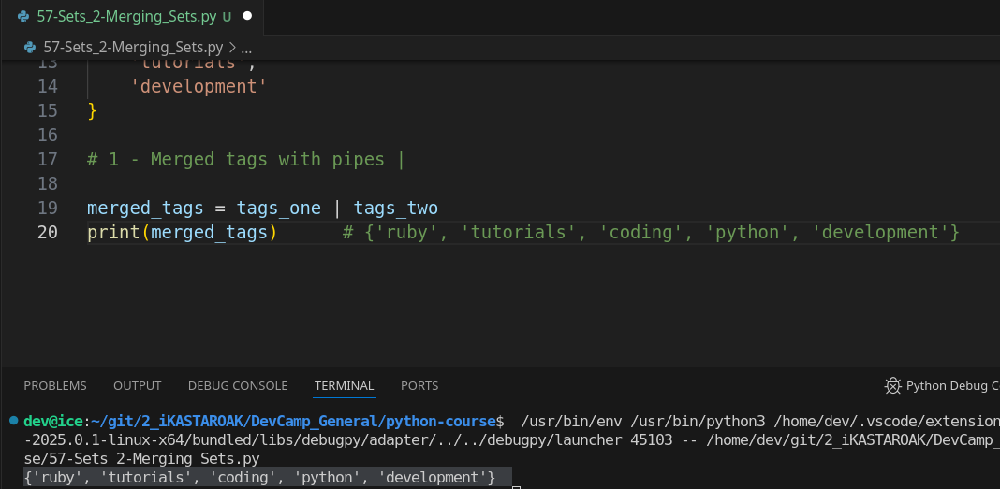
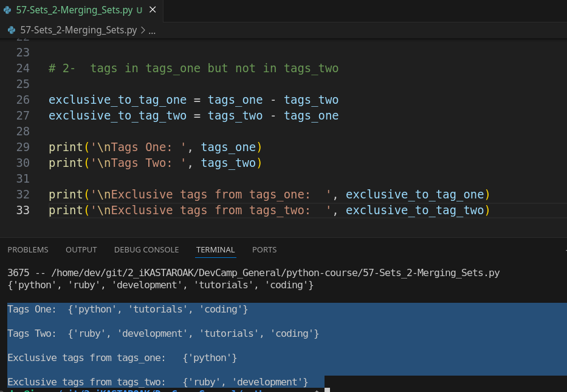

# 03-079\_Python\_Merging\_sets

### **Module 03 - 079: Python: Merging Sets, Venn Diagram Operations, using Operators**

Python's `set` data structure provides powerful built-in operations for handling unique collections of elements.

Unlike lists or dictionaries, sets do not allow duplicate values and offer efficient operations for merging, finding differences, and computing intersections.

These operations make sets particularly useful for problems that involve comparisons between collections, such as Venn diagrams.

#### **Python Documentation References**

* [Python Set Methods](https://docs.python.org/3/library/stdtypes.html#set)
* [Set Operations in Python](https://docs.python.org/3/tutorial/datastructures.html#sets)

***

### **Basic Set Operations: Merging, Differences, and Intersections, as Symbols**

As seen in the previous guide, let's explore deeper the three fundamental set operations, but as Symbols:

1. **Union (`|`)**: Merges two sets, removing duplicates.
2. **Difference (`-`)**: Finds elements present in one set but not in the other.
3. **Intersection (`&`)**: Retrieves elements common to both sets.

We'll illustrate these operations with an example involving programming-related tags.

```python
# Define two sets of tags

tags_one = {
    'python',
    'coding',
    'tutorials',
    'coding'  # Duplicates are ignored in sets
}

tags_two = {
    'ruby',
    'coding',
    'tutorials',
    'development'
}
```

#### **1️⃣ Merging Sets (`|` - Union Operator)**

Combining both sets while ensuring unique values:

```python
# 1 - Union operator "|" -  As union()

merged_tags = tags_one | tags_two
print(merged_tags)      # {'ruby', 'tutorials', 'coding', 'python', 'development'}
```

✔ **Explanation:** The `|` operator merges both sets, removing duplicate elements like `'coding'` and `'tutorials'`, as `union()` does.

***

#### **2️⃣ Finding Exclusive Elements (`-` - Difference Operator)**

To determine elements unique to each set:

```python
# 2- Difference Operator "-" - As difference() 

# Tags present in tags_one but not in tags_two
exclusive_to_tag_one = tags_one - tags_two
# Tags present in tags_two but not in tags_one
exclusive_to_tag_two = tags_two - tags_one

print('\nTags One: ', tags_one)
print('\nTags Two: ', tags_two)

print('\nExclusive tags from tags_one:  ', exclusive_to_tag_one)
print('\nExclusive tags from tags_two:  ', exclusive_to_tag_two)
```

🔹 **Output:**

```
Tags One:  {'tutorials', 'python', 'coding'}

Tags Two:  {'ruby', 'tutorials', 'development', 'coding'}

Exclusive tags from tags_one:   {'python'}

Exclusive tags from tags_two:   {'ruby', 'development'}
```

✔ **Explanation:** The `-` operator finds elements that belong to one set but not the other, as `difference()` does.

* `'python'` is exclusive to `tags_one`.
* `'ruby'` and `'development'` are exclusive to `tags_two`.

***

#### **3️⃣ Finding Common Elements (`&` - Intersection Operator)**

To retrieve elements that exist in both sets:

```python
# 3 Intersection operator - "&"" - Matches found in both sets

universal_tags = tags_one & tags_two
print('\nUniversal Tags:  ', universal_tags)
```

🔹 **Output:** `Universal Tags: {'coding', 'tutorials'}`

✔ **Explanation:** The `&` operator finds elements shared by both sets, as `intersection()` function does.

***

#### **🎯 Key Takeaways from Set Operations**

* **Union (`|`)**: Combines sets, ensuring uniqueness.
* **Difference (`-`)**: Finds elements exclusive to one set.
* **Intersection (`&`)**: Identifies shared elements.
* **Practical Applications**: Useful for Venn diagrams, filtering data, and handling unique collections efficiently.

***

### Video lesson Speech

In the last lesson, we walked through an introduction to the set data structure in python and we saw how we could create a set how we could query for elements inside of it.

And we saw one of the key characteristics of a set which is that all of the elements in a set are guaranteed to be unique.

***

Now in this guide, we're going to extend that knowledge and we're going to walk through some of the very common functions that you're going to see when working with sets.

Because a set is a little bit more low level from a functionality standpoint, these types of functions are not going to be your traditional functions.

they are not even going to be named functions but instead they're going to all focus around how one set can interact with another one.

Right here as a starter I already added a couple of different sets I have a set of tags and then I have a secondary set of tags.

```python
tags_one = {
 'python',
 'coding',
 'tutorials',
 'coding'
}
tags_two = {
 'ruby',
 'coding',
 'tutorials',
 'development'
}
```

As you may notice, there are a few duplicate elements, we have coding\
and tutorials in tags\_two along within tags\_one in fact tags\_one has\
coding twice, so, there are a number of elements and part of the reason why I included those is because I want you to see how you can always be guaranteed of a sets uniqueness, and that is going to be one of the main reasons that you will ever use it.

So, I want you to kind of have that reinforced in your memory.

Now, the very first thing that we're going to do and I'll add comments that you can reference in the show notes.

I'm going to see how we can merge tags and so the syntax for doing that is I'm going to\
create a new variable here called merged tags and I'm going to assign this to tags\_one and then I'm going to use this pipe character and then tags\_two.

```python
# Merged tags with |

merged_tags = tags_one | tags_two
```

Now, if you've never used that pipe character before it is most likely the key right above your return or enter a key on your keyboard and you have to hit shift and then that key in order to get it.

And so what this is going to do is any time that you see two sets and then you have\
this pipe character in between them.

It is going to merge the sets together and it's going to return one single set and one of the cool things is because it's returning a set it's still going to keep that uniqueness.

So, if we want to print this out, the merged tags, you'll see that the new set gets returned.

Has all of the elements from each one of these sets.



Except **it also removes the duplicate**, so we only have coding listedonce even though it's 3 times in the data, and then tutorials are only listed once and then it brings together all of those other elements so **that is how you can merge tags**.

I'm going to comment that out, come down a couple of lines, in fact, I'll come down a bunch of lines so that we can have plenty of room to see this.

Then, I'm going to add a comment here where it says tags in tags 1 but not in tags too.

```python
#tags in tags_one but not in tags_two
```

So what we're going to have the ability to do is to actually say that\
we want to have a master type of tag or a master type of set and then\
we simply want to subtract these other items and so the way we can do\
this is I can say exclusive and obviously you could name this however\
you want. I'm going to say `exclusive _to_tag_one` and the\
way you do this is a pretty intuitive kind of syntax where I can say\
tags\_one - tags\_two and now if I print this out so print out this\
exclusive \_to\_tag\_one then you are going to see an interesting type of\
result.



We only have python, so let's look at the data and see exactly what that means.

If we see in tags\_one we have Python listed here but it is not listed inside of tags\_two so what we're looking for are the tags that only belong in tags\_one.

Now, if you're wondering why you would ever want to do this because it does look a little bit weird.

**Use case: A Venn diagramm**

Imagine that you're building out a program that needs to function kind of like a Venn\
diagram.

So, Venn diagram is where you have multiple circles that overlap.

What a set allows you to do is from a data perspective create that kind of Venn Diagram, so we can say that I want you to bring the only the elements that are exclusive to tags\_one and we can go line by line here to analyze what's going on.

Coding is in tags\_one and two tutorials are in tags\_one and tags\_two and then obviously coding is in both of them as well.

And, then, it ignores all of the elements that are exclusive to tags\_two such as ruby\
and development.

So, for building out a Venn diagram then this would give us exactly the set of items that are included in tags\_one only.

Now, as you can imagine we can flip this and so I can say tags in tags two but not in tags one comment this out so that we don't have a weird print out and I'm guessing exclusive to tags\_two and then we just have to flip these so I can say tags\_two -tags\_one and then print out the correct variable.

And now if we run this you're going to see we have Ruby and development


Go back and see why we're getting that.

It's because ruby and development are the only two elements that are inside of tags\_two, butnot inside of tags\_one so, everything there is working properly and\
hopefully if you are familiar with Venn diagrams then this is making sense on why and when you might want to use a set because of this type of behavior.

Imagine that you're working with a list or even more challenging a dictionary or something like that.

You would have to do a lot of work to get the type of behavior that we're able to get in a single line of code.

So that is how you can do the other side of that exclusivity kind of query and we're going to work with one last one and I'll add a comment tags found in both tags 1 and tags 2.

Now, this is different then our merge tags remember merge tags are all of the elements and tags\_one and tags\_two and obviously removes the duplicates but it's all of the elements so if we go back to our Venn Diagram example it's bringing.

It's like if you had two overlapping circles you would have both of the elements and the items that are in between the shared items.

So, what we're looking for here are only the shared items and so what we can do I'm going to call this `universal_tags` and then say tags\_one and then use the ampersand symbol and then say tags\_two add and now if I print out universal tags and run this you can see that we're going to get coding and tutorials


So let's come up one last time and see exactly what we have here.

Coding and tutorials if you can see are the only two elements in the sets that are shared. And so those are the ones that should be printed out because they are the only ones that are universal to the sets and so that kind of completes the type of logic that we'd want to implement if we're building out a Venn diagram from a data perspective type of system.

***

### Code

```python
# 03-079: Merging sets, as Symbols

tags_one = {
    'python',
    'coding',
    'tutorials',
    'coding'
}

tags_two = {
    'ruby',
    'coding',
    'tutorials',
    'development'
}

# 1 - Union operator "|" -  As union()

merged_tags = tags_one | tags_two
print(merged_tags)      # {'ruby', 'tutorials', 'coding', 'python', 'development'}


# 2- Difference Operator "-" - As difference() 

# Tags present in tags_one but not in tags_two
exclusive_to_tag_one = tags_one - tags_two
# Tags present in tags_two but not in tags_one
exclusive_to_tag_two = tags_two - tags_one

print('\nTags One: ', tags_one)
print('\nTags Two: ', tags_two)

print('\nExclusive tags from tags_one:  ', exclusive_to_tag_one)
print('\nExclusive tags from tags_two:  ', exclusive_to_tag_two)


# 3 Intersection operator - "&"" - As intersection()

universal_tags = tags_one & tags_two
print('\nUniversal Tags:  ', universal_tags)
```
