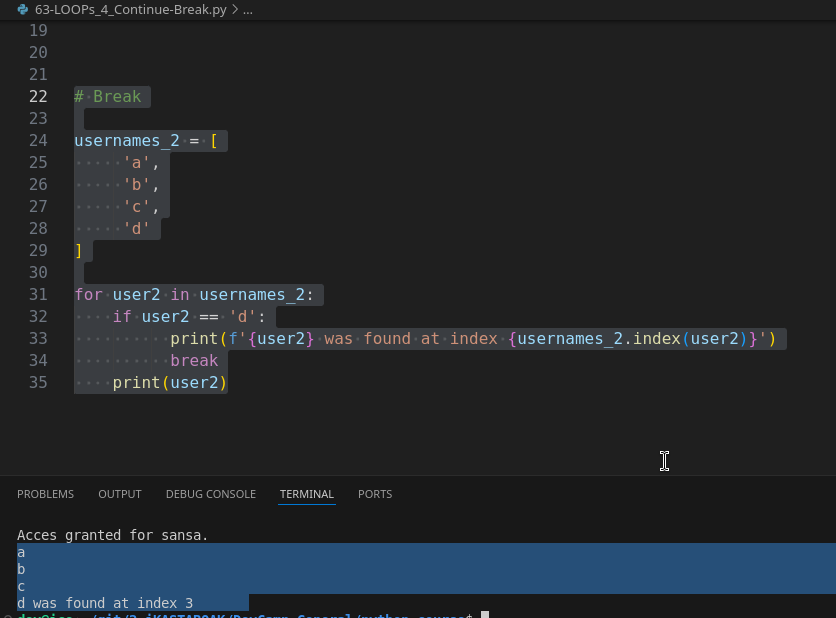

# 03-085\_Python\_Continue-Break

### Module 03 - 085: Continue/Break loops

### Understanding Continue and Break in Loops

In Python, loops generally iterate from the beginning of a collection to the end. However, there are situations where you may want to alter the flow of execution based on specific conditions. This is where the `continue` and `break` statements come into play.

These control flow statements modify the normal execution of loops:

* **`continue`**: Skips the current iteration and moves to the next one.
* **`break`**: Exits the loop entirely when a condition is met.

***

### `continue`: Skipping an Iteration

If a specific condition is met, `continue` ensures that the loop moves directly to the next iteration, skipping any remaining code in the current iteration.

#### Example: Skipping a Specific User

```python
usernames = ['jon', 'tyrion', 'theon', 'cersei', 'sansa']

for username in usernames:
    if username == 'cersei':
        print(f"Sorry, {username}, you are not allowed")
        continue  # Skip to the next iteration
    print(f"{username} is allowed")
```

#### Output:

```
jon is allowed
tyrion is allowed
theon is allowed
Sorry, cersei, you are not allowed
sansa is allowed
```

**Explanation:**

* The loop iterates over `usernames`.
* When it encounters `'cersei'`, it prints a warning message and skips the rest of the code for that iteration using `continue`.
* The loop then proceeds to the next username.

***

### `break`: Exiting a Loop Prematurely

If a specific condition is met, `break` stops the loop entirely, preventing further iterations.

#### Example: Finding a User and Stopping the Loop

```python
usernames = ['jon', 'tyrion', 'theon', 'cersei', 'sansa']

for username in usernames:
    if username == 'cersei':
        print(f"{username} was found at index {usernames.index(username)}")
        break  # Exit the loop immediately
    print(username)
```

#### Output:

```
jon
tyrion
theon
cersei was found at index 3
```

**Explanation:**

* The loop iterates over `usernames`.
* When `'cersei'` is found, the loop prints her index and then `break` stops further execution.
* The remaining usernames are not processed.

***

### Key Differences Between `continue` and `break`

| Feature   | `continue`                                             | `break`                                   |
| --------- | ------------------------------------------------------ | ----------------------------------------- |
| Behavior  | Skips the current iteration and moves to the next      | Exits the loop immediately                |
| Execution | Loop continues                                         | Loop stops completely                     |
| Use case  | When you want to skip a specific case but keep looping | When you want to stop processing entirely |

***

### Practical Use Cases

#### Example: Skipping a Specific Word in a List

```python
words = ["apple", "banana", "cherry", "date", "elderberry"]

for word in words:
    if word == "cherry":
        print("Skipping cherry!")
        continue
    print(word)
```

#### Output:

```
apple
banana
Skipping cherry!
date
elderberry
```

***

#### Example: Stopping the Loop When a Condition is Met

```python
numbers = [1, 2, 3, 4, 5, 6]

for num in numbers:
    if num == 4:
        print("Found 4! Stopping the loop.")
        break
    print(num)
```

#### Output:

```
1
2
3
Found 4! Stopping the loop.
```

***

***

### Video lesson Speech

So far in this section on Python loops each time that we've implemented a\
for-in loop the loop has gone from the beginning of the collection all\
the way to the end and in many cases that is exactly the behavior that\
you would want.

***

However, there are some times where you actually want to stop or alter the\
behavior somewhere in the middle of the loop based on a condition.

So, for example, I have right here a list of user names so we have these five usernames and they are each represented as strings in this user names variable.

```python
usernames = [
 'jon',
 'tyrion',
 'theon',
 'cersei',
 'sansa',
]
```

So, what happens if we want to build a loop that searches for a name and then if it finds the name it will actually alter its behavior?

Well, **we have two different types of control flow logic operators**.

* One is called `Continue`
* Rhe other is called `Break`.

And so these are the two different flow operators that we are going to work through in this guide.

#### Continue

For the first loop let's say for username in usernames. So far this is exactly what we talked about from the beginning of this section are simply implementing a basic for in loop but now it's going to get a little bit trickier because what I want to do is I want to search for this name Cersei here and if it finds Cersei I want there to be a\
different output than if it is anybody else.

And so imagine a scenario where you're building now some kind of web or mobile application and you have a list of blacklisted individuals and so these could be banned\
users.

Anything like that and you want to be able to know who they are, well this is how you can do it

So, down inside of the loop block, I can say if username so right here I am referencing each one of the values.

So the very first time it loops it's gonna look for jon then it's going to look for tyrion so on and so forth.

So I mean to say if username and then this is very important.

We're going to have an entire section on conditionals so I don't want you to get too hung up if this looks a little odd but we're going to give a double equal sign so I'm gonna say If username is equal to cersei and give another colon here at the end.

So this is going to be a secondary and nested code block inside of this if statement.

If the username is equal to cersei then I want to do a print statement and I'm going to format it as well and so I'm gonna say f and then sorry and I'm gonna use the curly braces.

So, you say whatever the username is you are not allowed and then end the quotation\
mark. And this is the key right here.

This next line we're going to say continue.

And if this looks a little bit weird don't worry after I run the code you're going to see\
exactly what this is doing.

And then you say else followed by a colon and then if it is the if it falls into this second condition I'm going to use the format once again and then start with the curly brace say username is allowed.

And that is all we need to do to get this working.

So we right here are learning what continue represents so if I run this code here you can see the first time it loops through it says jon as allowed. Then it says tyrion is allowed. Then it says theon is allowed.

But notice what happens when it gets

It says _Sorry, cersei you are not allowed_, and very importantly it follows and it continues hence the continue keyword and it says sansa is allowed.


***

#### Break

So, remember at the beginning I said we're going to talk about to control flow operators. One is to continue the other is break.

So what continue does when you place it inside of a loop like this is if it finds this kind of condition.

So, if this is true it finds a username that is equal to cersei it's going to change its behavior.

But what continue does is it tells the program to keep on going through the\
loop.

So it's going to continue to iterate and it is not going to stop once it finds what it's looking for.

Now that may sound like it's really not a big deal because technically this is the exact behavior that you would expect because it is looping through all of the usernames and the part of the reason why I wanted to show you this is because this is the exact opposite behavior compared with if we used break and so that is the second example.

I'll put all of this in the show notes so you can have access to all of it but in our second example, the behavior I want is more of a search and destroy kind of mission where I want to look through this list of usernames and if I find the one that I'm looking for I don't care about any of the other ones after I have found my condition.

So, in this case, I'm going to get rid of all of these.

Then inside of this block I'm just going to say because I want to show you some other access points I'm going to say print f quotation mark because we're formatting once again and then say username was found at index and I can call the usernames collection here and then call our index function.

If you remember that back from when we went through the list section and say index username. So I'm essentially just doing a search right here and then end the curly brace and the quotation mark and then the print statement.

```python
for username in usernames:
 if username == 'cersei':
 print(f'{username} was found at index {usernames.index (username)}')
```

We have our print statement here.

Then we have our single quotation mark and then we have two sets of curly brackets one here with username and the other one here that says usernames dot index and then we're searching for the username right here that is cersei then I'm going to\
on the same line as our print statement.

So notice how we are still nested inside of this if conditional.

Now I'm going to say break and then down below. And notice here when I\
type break, automatically I wa


Next, I'm just going to say

So, if I print this out you can see:



it starts off like normal prints out jon, tyrion, theon and then it prints out exactly what you'd expect here when it finds Searcy.

So it says cersei was found at index 3 which remember the whole point of this\
little program was to find and let us know exactly where we found our\
condition here cersei but the big key to notice here is that sansa is\
not included.

***

That's the key difference between break and continue, with continue the program simply keeps going even though it found what it was looking for.

It still goes through the entire collection which is many times exactly what you want it to do. However, there are also times where you don't want to go through an entire collection because it would be a waste of resources.

**You simply want to search and then once you have found what you're looking for then you want the program to stop**.

And that's exactly what break does.

B**reak not only breaks you out of this conditional it looks all the**\
**way up top so it traverses down this chain and it looks and it notices**\
**that it is in a for-in loop and it tells Python OK we found what we want**\
**and we now want to break out of the loop and python stops and that's a**\
**reason why any other elements after cersei right here will not get run.**

***

### Code

```python
# 03-085: Continue/Break loops

usernames = [
    'jon',
    'tyrion',
    'theon',
    'cersei',
    'sansa'
]

# Continue

for username in usernames:
    if username == 'cersei':
         print(f'Sorry, {username} is banned!') 
         continue
    else:
         print(f'Acces granted for {username}.')


# Break

usernames_2 = [
     'a',
     'b',
     'c',
     'd'
]

for user2 in usernames_2:
    if user2 == 'd':
          print(f'{user2} was found at index {usernames_2.index(user2)}')
          break
    print(user2)
```

***

### Coding Exercise

> &#x20; Write a loop that loops over the list of vegetables and prints each one out.\
> When it reaches 'apple' it should print 'apple is not a vegetable' and\
> then break.

```python
def loop_and_break():
    vegetables = ["onion", "broccoli", "apple", "spinach"]

    for veggie in vegetables:
        if veggie == 'apple':
            print(f'{veggie} is not a vegetable')
            break
        print(veggie)
```
