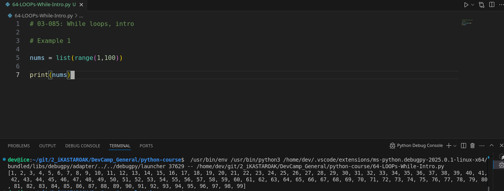
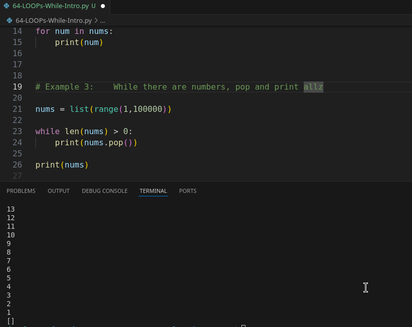

# Module 03 - 086: Python - While Loops

In this guide, we will explore `while` loops in Python, a powerful control structure used to execute code repeatedly until a condition is met. While `for` loops are more commonly used, `while` loops s

***

## Key Differences: `for` vs. `while`

* `for` loops iterate over a sequence (list, tuple, string, etc.) and stop automatically at the end.
* `while` loops execute as long as a **condition remains True** and must be explicitly told when to stop.

If a `while` loop is not properly controlled, it can create an **infinite loop**, which may crash your program.

> **💡 Important Concept:** The stopping condition for a `while` loop is called a **sentinel value**.

***

## 📌 Example 1: Basic While Loop

```python
nums = list(range(1, 100))  # List from 1 to 99

while len(nums) > 0:  # Continue until list is empty
    print(nums.pop())  # Remove and print last element
```

* The loop condition is `while len(nums) > 0`, meaning it will run **until** `nums` is empty.
* `.pop()` removes and returns the last element, reducing the list size.
* The loop **stops automatically** when `nums` has no elements left.

🔹 This prints numbers **in reverse order** (99 → 1) because `.pop()` removes from the end.

***

## Example 2: A Simple Guessing Game

```python
def guessing_game():
    while True:  # Infinite loop until the correct guess
        guess = input("What is your guess? ")
        if guess == "42":
            print("🎉 You correctly guessed it!")
            break  # Stops the loop when the condition is met
        else:
            print(f"❌ No, {guess} is not the answer. Try again!\n")

# Run the game
guessing_game()
```

* The loop **runs indefinitely** (`while True`) until the user enters `42`.
* `input()` gets user input.
* The correct guess **breaks** the loop, ending the game.
* Otherwise, the program prompts the user to try again.

> **🔴 Warning:** Avoid `while True` unless you have a clear exit condition (like `break`).

***

## 📚 Python Documentation Reference

* 🔗 [Python While Loops](https://docs.python.org/3/tutorial/controlflow.html#the-while-statement)
* 🔗 [Python break and continue](https://docs.python.org/3/tutorial/controlflow.html#break-and-continue)

***

## 🎯 Key Takeaways

✔ `while` loops **repeat** as long as a condition is `True`.\
✔ Always **define a stopping condition** to avoid infinite loops.\
✔ Use `break` to exit early.\
✔ Use an **iterator variable** when iterating through lists.

>

***

## Video lesson Speech

So far in this section on Python loops, we exclusively worked with the for-in loop type and that is probably one of the most popular options and you're most likely going to be using it for the majority of your own Python programs.

However, Python also has an alternative to the for-in loop and it is called the while loop and even though you may not use a while loop as often as you will use your for in loop it still can be helpful in certain circumstances and we're going to go through a couple of different examples.

Before we do that I want to talk about the key difference between using a for-in loop vs a while loop because that's also going to help clarify when you'd want to choose one over the other.

With a for-in loop you have a very clearly defined start and finish to your loop.

So, if you're looping over a list of strings when you're done iterating through the entire list the for-in loop just completely stops and that is the type of behavior that you want for it.

Now, a while loop is very different a while loop will not stop when it reaches the end of a list if that's what you're iterating over a while loop has to explicitly be told when to stop and it's part of the reason why you would not want to use a while loop on a regular basis because there are many times where you might forget to tell the while loop to stop at a certain point and then you reach what is called an infinite loop which is something that can crash your program because the while loop will not stop until it has been told to stop and so you have to be able to define what that point is and just if you're interested in the formal term it's called a sentinel value.

You have to set a **sentinel value** in order to tell your while loop when to stop.

We're going to create a couple of examples here.

The first one is going to be very basic so I'm going to create a list here and I'm gonna\
say `nums = list` and then I'm going to set of range of 1 to 100

```python
nums = list(range(1, 100))
```

which really means as you probably know by now that is going to be a range from 1 to 99 so if we want to see what this looks like you can say print nums run this and you'll see we have a list that goes from 1 to 99.



Now, if we want to iterate over this list if

```python
# Example 2:    For...in, print a range list

nums = list(range(1,11))
for num in nums:
    print(num)
```


We've walked through this example a few times now but with a while loop, it is not quite this easy.

So, if we're going to use a while loop we're going to use this type of syntax so I'm going to say while len.

So, this is the function for fin

Then I want you to print `nums.pop())`, so:

```python
# Example 3:    While there are numbers (>0), pop and print all

nums = list(range(1,100000))

while len(nums) > 0:
    print(nums.pop())

print(nums)
```

And what this is going to do is it's going to iterate over and list and it's going to pop an element off it's going to print out that value and, if you remember the behavior of the pop function, this will also remove the item from the names list.

So this is going to create our sentinel value it's going to continually decrease the length of the nums list until it reaches 0 once it reaches that value, this condition.

So, where it says while the length of nums is greater than zero, this is finally going to be false and when it's false the while loop is going to stop.

So, if I run this you're going to see that we get the behavior we're looking for



Notice here, also a slightly different behavior:

It starts at ninety-nine and then goes all the way down to 1 because technically**we're printing out the nums and we're doing it from the last value so that is something that is good to keep in mind this is a basic example of how to use the while loop** and this may also give you some clarification on **why the for-in loop is so popular because this is not anywhere near as intuitive as what we saw with the for-in loop**.

Now, I'm going to delete this but it will be in your show notes if you want to reference it.

And, now, we're going to do something fun.

We are going to build a little guessing game. So are guessing game is going to be something different than we've done before.

Because we going to build a function and do not worry if this looks weird because we are going to have an entire section dedicated to functions. I simply want to give\
you a little preview of it right here.

I'm going to say `def guessing_game():` so this is going to create a function and we're going to declare a code block inside of it and this code block is going to have a while loop and so I'm to say while and this might look a little bit weird. I'm going to say `while True:` So what in the world is going on here? Well, this is actually a very\
common use of the while loop which is where you do not have an idea of\
when you want the while loop to stop.

```python
# Example 4:

def guessing_name():
    while True:
        print('What\'s your guess?')
        guess = input()

        if guess == '37':
            print('You\'ve correctly guessed it!')
            return False
        else:
            print(f'No, the number {guess} isn\'t the answer, try again!')

guessing_name()
```

So with our first example, we didn't know that we wanted to simply iterate through the collection of numbers.

However, in a real-world python program, you wouldn't need to use a while loop for that because you have a for-in loop.

However **one of the most common uses for a while loop is when you don't know how many times you want your program to iterate**.

So, in this case, what we're going to do is we're going to create a guessing game where the user is going to be asked to guess the number and until they get the right number you want the program to continue running.

So, in this case, we can't use a for-in loop because we don't know when the right answer has been guessed until they've actually done it.

So, we need to have a while loop here that will just continue to loop through the program over and over again until the right number has been guessed and then It'll break out of it.

So, I'm going to say while True. And then I'm going to say if I can type correctly print what is your guess. And so this is going to print this out to the console. And then I'm going to store the guess in a variable and I'm going to call a function.

We haven't talked about before because I haven't really gone into how to get values from the console and it's mainly because when you get into real Python development such as building web and mobile applications and machine learning applications.

You rarely are going to be getting console input but in this case, for a little console guessing game, we'll need it.

And so what you can do is call input and it's a function.

So you're going to call it with parens just like this. So this is going to do is it's going to set up a prompt here in the terminal and it's going to store whatever we type into it in this guess variable so I'm gonna say guess equals input and then say if guess is equal to and we can just put any number here so I'm going to say if the user guesses the number 42 and I need to add a call in here then I'm going to say print "You correctly guessed it and then after that I am going to return false.

And the reason I'm going to do that is because this while loop is going to continue as long as true is true.

And that may sound very convoluted and doesn't make any sense but essentially true is always true unless we tell it that it is false.

And so when we say return false this is going to stop our while loop.

So, in this case, **this is our sentinel value**.

So if you remember back to when we went through our number example our sentinel value was when the length of our number list wasn't greater than 0 here are sentinel\
values going to be whenever the correct guess is presented by the user.

Then we return false which is going to stop this entire loop which is the behavior that we're looking for.

And then you say else and this needs to be indented just like this. So I'm gonna say else I want to print out and let's format this. So I'm gonna say`print(f'No, {guess} is not the answer, please try again/n')`.

And then I'm also going to give a `/n` what that is going to do is that is going to just give us a new line so that they're guessing on a new line and that is it.

The way we can call a function in python is just by saying guessing game which we have talked about that before but here every time we've used it before we've called another function inside of the language itself kind of like we're doing input.

This is in the core Python language here.

We're actually calling our own function so we hit clear and let's see if this works if it works it should ask us what our guess is. And then it should present a prompt and then it should keep on allowing us to guess until we have gone through and finally guess the\
number 42.

So, if I hit return her


And I'm gonna sa


So, notice the behavior here because we have a while loop.

I could go on for this for hours and I could guess a thousand different numbers and\
it's going to keep on going through because we have a while loop here.

It will keep the program running until it reaches that sentinel value\
until it returns false.

Now, if I type in the number 37, ut says you correctly guessed it and then notice the while loop ended:


So when I hit return False it is now breaking outside of the while\
loop and it returns false here. And so it ends the program and says that\
I correctly guessed it.

So that is one of the most common ways that you're going to be using a\
while loop in Python. It's when you don't really have a clear end of\
value. So with our for-in loops we know when we want them to start and\
we know when we want them to finish a while loop is going to be one of\
the best tools you can have for looping whenever you want a program to\
go on and on and only breaks out of it when it's given that sentinel\
value.

***

## Code

```python
# 03-087: While loops, intro

# Example 1:    print a range list

nums = list(range(1,100))
print(nums)


# Example 2:    For...in, print a range list

nums = list(range(1,11))
for num in nums:
    print(num)


# Example 3:    While there are numbers, pop and print allz

nums = list(range(1,100000))

while len(nums) > 0:
    print(nums.pop())

print(nums)


# Example 4: While, with sentinel value as an specific value

def guessing_name():
    while True:
        print('What\'s your guess?')
        guess = input()

        if guess == '37':
            print('You\'ve correctly guessed it!')
            return False
        else:
            print(f'No, the number {guess} isn\'t the answer, try again!')

guessing_name()
```

***

## Coding Exercise

```python
"""
Coding Exercise

In the below starter code, place 4 dog names (elements) of your choice in the dog_house list. Then write a while loop that iterates through the dog_house list and prints each dogs name. An iterator variable named "counter" must be set, and must have an initial value of 0.

Hint: An iterator value (also sometimes called a sentinel value) is a value that exists outside of your loop, and that you update or otherwise keep track of each time you loop, so that your while loop knows when to end.

Example:
iterator_value = 0
while iterator_value < 10:
    print("Keep looping...")
    iterator_value += 1

"""


# Option 1

def loop_using_while():
    dog_house = ['a', 'b', 'c', 'd']
    counter = 0
    while counter < 4:
        print(dog_house[counter])
        counter += 1

    return [dog_house, counter]

loop_using_while()

## Option 2
def loop_using_while():
    dog_house = ['a', 'b', 'c', 'd']
    counter = 0
    while counter < 4:
        print(dog_house.copy()[counter])
        counter += 1

    return [dog_house, counter]

loop_using_while()

## Option 3 .pop()
def loop_using_while():
    dog_house = ['a', 'b', 'c', 'd']
    counter = 0
    while counter < 4:
        print(dog_house.pop()[counter])
        counter += 1

    return [dog_house, counter]

loop_using_while()
```
