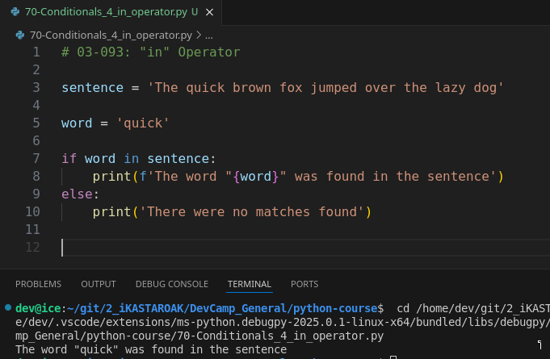

# MODULE 03 - 093: Python - Checking if a value is included in a String or List / in

Python provides a powerful and intuitive way to check for the presence of an element in a string or a collection using the **`in` operator**. One of the best things about this operator is that it reads just like natural language, making code more readable and easier to understand.

***

## 📌 Using `in` with Strings

The `in` operator checks if a **substring** is contained within a given string.

### 🔹 Case-Sensitive Search

If a word exists in a sentence exactly as provided, the condition evaluates to **True**.

However, the search is **case-sensitive**, meaning that **"dog"** is different from **"Dog"**.

### 🔹 Making a Case-Insensitive Search

To perform a case-insensitive search, we can convert both the string and the search term to **upper/lowercase, Title, etc** as needed, before comparison.

✅ **Key Benefits:**

* Simple and readable.
* No need to iterate manually through the string.

***

## 📌 Using `in` with Lists

The `in` operator is not limited to strings—it also works with **collections**, such as lists.

* It checks whether a given element is present in the list.
* Instead of looping through a list manually, Python handles the membership check internally.

### 🔹 Real-World Use Case

Imagine querying a database for usernames and checking whether a specific username is included in the results. Instead of writing a loop, you can use `in` to determine membership efficiently.

✅ **Key Benefits:**

* Works with **lists**, **tuples**, and **sets**.
* More efficient than manually iterating through elements.

***

## 📌 Summary

* The `in` operator checks for **membership** in both **strings** and **collections**.
* It is **case-sensitive** when used with strings.
* You can normalize text with `.lower()` to make it **case-insensitive**.
* `in` simplifies searching in **lists**, avoiding manual iteration.

***

## Video lesson Speech

However, we also have a little bit more flexibility when it comes to working with strings and collections.

So, in this guide that is what we're going to walk through and we're going to be using what is called **the `in` operator**.

And the thing I love about this is it reads just like spoken language.

When we read the condition it is going to check to see if one element is inside or contained in another element.

So, I'm going to start off with strings and so I'm going to say sentence equals the quick brown fox jumped over the lazy dog.

```python
sentence = 'The quick brown fox jumped over the lazy Dog'
```

And now if I create a new variable here called word and set this equal to quick what I can do is say. `if word in sentence:` then I can print it out so I can say `print('The word was found in the sentence')`. And so that will work. And let's add an `else:` clause here and `print('The word was not in the sentence')`. And so now if I run this you can see it says the word was found in the sentence.



Because quick is in the sentence and that's what we are looking for.

Now, this seems to work pretty well, but now let's look for another word.

I'm going to type in the word dog but notice even though we have a dog in this sentence our searching or our in operator is not case insensitive which means that if we look for dog spelled this way with the lowercase d. It is not going to find this Dog with an uppercase D.

So, we can test this out by running it just like this. And as you can see the word was not found.


So, there are a number of ways around this that you're going to find in Python.

One of the common ones is to simply call the lower function on each one of these elements so if you want to perform a case-insensitive search you can just call whatever the variable is that contains a string and say I want you to take all of the values and\
change them to lowercase and the same thing with this word.

And now if I run this you can see that it prints out that the word was found in the\
sentence so everything there is working properly.


Now I'm going to place all of this in the show notes.

Now let's see how the in operator works with collections of data.

So, if I come up here and create a list a list of nums so I can say something like `nums = [1, 2, 3, 4]`.

Now, what I can do is say `if 3 in nums:` then we can `print('The number was found')` and we're going to add our same `else:` block and say the number was not found.

And so now if we run this code you'll see that it says the number was found.


So this in operator is incredibly helpful because it checks not only\
for membership in strings so it not only tells you if one string is\
found inside of another string but it also can work with collections of\
data such as lists. So imagine that you perform a database query and you\
get back all these usernames and you want to check to see is one other\
person's username is it contained in that list of data?

You can run your code just like this, you do not have to go and\
create your own loop and check the entire list and see if it matches up.\
You can just ask python is this included and the proper way to say it\
is, is it a member of this collection and it works very nicely. And one\
of my favorite parts is because this does read just like you would say\
it where you check to see is this in nums and then it will return either\
true or false.

So that is how you can work with the in membership operator in Python.

***

## Code

```python
# 03-093: "in" Operator

sentence = 'The quick brown fox jumped over the lazy dog'

word = 'quick'

if word in sentence:
    print(f'The word "{word}" was found in the sentence')
else:
    print('There were no matches found')


# comparisions are case sensitive !

word = 'Dog'

if word in sentence:
    print(f'The word "{word}" was found in the sentence')
else:
    print(f'There were no matches found with "{word}"')


# We can combine with string methdos to perform some input data validation

word = "DOG"

if word.lower() in sentence:
    print(f'The word "{word.lower()}" was found in the sentence')
else:
    print(f'There were no matches found with "{word.lower()}"')


# Using another data type

evens = [ num for num in list(range(1,1000)) if num % 2 == 0 ]
my_list = evens[::17]

choice = input('Make your choice: ')

if choice in evens:
    print(f'The chosen number, {choice}, is listed!')

else:
    print(f'The chosen number, {choice}, is NOT listed')
```

***

## Coding Exercise

In the below code, fix the condition so that the program prints out "The word is in the sentence.

```python
def value_in_string():
    sentence = 'Python is the best!'

    if #YourConditionHere:
      print('The word is in the sentence')
    else:
      print('The word is not in the sentence')
```
